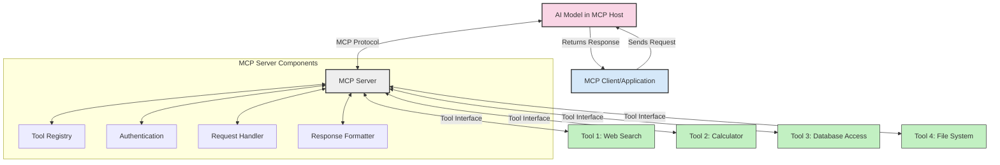
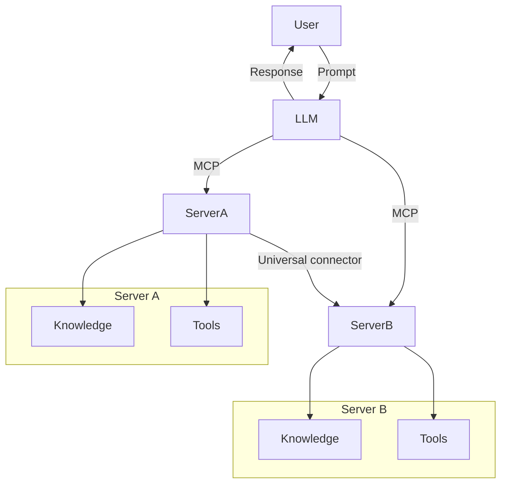
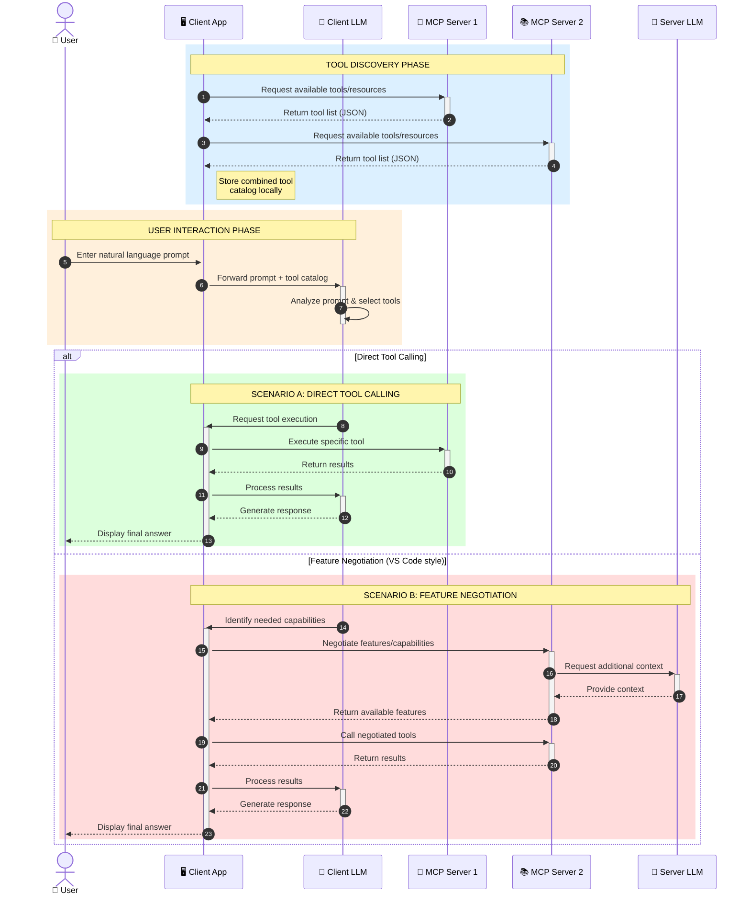

<!--
CO_OP_TRANSLATOR_METADATA:
{
  "original_hash": "25a94c681cf43612ff394d8cf78a74de",
  "translation_date": "2025-05-27T15:57:23+00:00",
  "source_file": "00-Introduction/README.md",
  "language_code": "hk"
}
-->
# Introduction to Model Context Protocol (MCP): 點解對可擴展嘅 AI 應用咁重要

生成式 AI 應用係一大進步，因為佢哋通常容許用戶用自然語言提示同應用互動。不過，隨住投放嘅時間同資源愈來愈多，你會想確保可以輕鬆整合功能同資源，做到易於擴展、應用可以支援多個模型同處理各種模型嘅細節。簡單嚟講，起初開發生成式 AI 應用好易，但隨住佢哋成長同變得複雜，你需要開始定義架構，亦可能需要依賴一個標準，確保應用係以一致嘅方式建立。呢個就係 MCP 發揮作用，幫你組織同提供標準。

---

## **🔍 乜嘢係 Model Context Protocol (MCP)?**

**Model Context Protocol (MCP)** 係一個**開放、標準化嘅介面**，容許大型語言模型 (LLMs) 無縫連接外部工具、API 同數據來源。佢提供一致嘅架構，令 AI 模型嘅功能超越訓練數據，打造更智能、可擴展同反應更快嘅 AI 系統。

---

## **🎯 點解 AI 標準化咁重要**

隨住生成式 AI 應用越嚟越複雜，採用標準化係確保**可擴展性、可延伸性**同**易維護性**嘅關鍵。MCP 就係針對呢啲需求，做到：

- 統一模型同工具嘅整合
- 減少脆弱同一次性嘅自訂方案
- 容許多個模型喺同一生態系統共存

---

## **📚 學習目標**

讀完呢篇文章，你可以：

- 解釋 **Model Context Protocol (MCP)** 同佢嘅應用場景
- 明白 MCP 點樣標準化模型同工具嘅溝通
- 識別 MCP 架構嘅核心組件
- 探索 MCP 喺企業同開發環境嘅實際應用

---

## **💡 點解 Model Context Protocol (MCP) 係一個革命性嘅改變**

### **🔗 MCP 解決 AI 互動嘅分散問題**

喺 MCP 出現之前，模型同工具整合需要：

- 每對工具同模型寫自訂代碼
- 每個供應商用唔同嘅非標準 API
- 更新時經常斷裂
- 加多工具就難以擴展

### **✅ MCP 標準化嘅好處**

| **好處**                 | **描述**                                                                 |
|--------------------------|--------------------------------------------------------------------------|
| 互通性                   | LLM 可以無縫配合唔同供應商嘅工具                                        |
| 一致性                   | 平台同工具行為保持統一                                                   |
| 可重用性                 | 工具只需開發一次，可以跨項目同系統使用                                  |
| 加快開發                 | 用標準化、即插即用嘅介面減少開發時間                                   |

---

## **🧱 MCP 高層架構概覽**

MCP 採用**客戶端-伺服器模式**，其中：

- **MCP Hosts** 運行 AI 模型
- **MCP Clients** 發出請求
- **MCP Servers** 提供上下文、工具同功能

### **主要組件：**

- **Resources** – 靜態或動態數據供模型使用  
- **Prompts** – 預設嘅工作流程引導生成  
- **Tools** – 可執行嘅功能，例如搜索、計算  
- **Sampling** – 透過遞歸互動實現代理行為

---

## MCP 伺服器點運作

MCP 伺服器嘅運作流程如下：

- **請求流程**：  
    1. MCP Client 向運行喺 MCP Host 嘅 AI 模型發出請求。  
    2. AI 模型判斷需要用外部工具或數據時。  
    3. 模型用標準協議同 MCP Server 溝通。

- **MCP Server 功能**：  
    - 工具登記處：維護可用工具同其功能目錄。  
    - 認證：驗證工具訪問權限。  
    - 請求處理器：處理模型傳入嘅工具請求。  
    - 回應格式化：將工具輸出整理成模型可理解嘅格式。

- **工具執行**：  
    - 伺服器將請求轉發到合適嘅外部工具。  
    - 工具執行專門功能（搜索、計算、資料庫查詢等）。  
    - 結果以一致格式返回模型。

- **回應完成**：  
    - AI 模型將工具輸入納入回應。  
    - 最終回應發送返客戶端應用。

## 👨‍💻 點樣建立 MCP 伺服器（附範例）

MCP 伺服器容許你透過提供數據同功能擴展 LLM 能力。

想試下？以下係用唔同語言建立簡單 MCP 伺服器嘅範例：

- **Python 範例**：https://github.com/modelcontextprotocol/python-sdk

- **TypeScript 範例**：https://github.com/modelcontextprotocol/typescript-sdk

- **Java 範例**：https://github.com/modelcontextprotocol/java-sdk

- **C#/.NET 範例**：https://github.com/modelcontextprotocol/csharp-sdk

## 🌍 MCP 喺真實世界嘅應用場景

MCP 透過擴展 AI 能力支持多種應用：

| **應用**                    | **描述**                                                                 |
|-----------------------------|--------------------------------------------------------------------------|
| 企業數據整合                | 將 LLM 連接到數據庫、CRM 或內部工具                                     |
| 代理式 AI 系統              | 令自主代理有工具訪問同決策工作流程                                     |
| 多模態應用                  | 喺單一統一嘅 AI 應用中結合文字、圖像同音頻工具                         |
| 實時數據整合                | 將即時數據引入 AI 互動，提升輸出準確性                                  |

### 🧠 MCP = AI 互動嘅通用標準

Model Context Protocol (MCP) 就好似 USB-C 標準化裝置嘅物理連接一樣，係 AI 互動嘅通用標準。喺 AI 世界，MCP 提供一致嘅介面，令模型（客戶端）可以無縫整合外部工具同數據提供者（伺服器）。咁就唔使每個 API 或數據來源用唔同嘅自訂協議。

符合 MCP 嘅工具（即 MCP 伺服器）遵循統一標準，能夠列出佢哋提供嘅工具或動作，並喺 AI 代理請求時執行。支持 MCP 嘅 AI 代理平台可以發現伺服器上可用嘅工具，並透過呢個標準協議調用。

### 💡 促進知識存取

除咗提供工具，MCP 仲促進知識存取。佢令應用可以透過連接多個數據來源，為大型語言模型 (LLMs) 提供上下文。例如，MCP 伺服器可以代表公司嘅文件庫，讓代理按需檢索相關資訊。另一個伺服器可能負責發送電郵或更新記錄等特定動作。對代理嚟講，呢啲都係佢可以用嘅工具——部分工具回傳數據（知識上下文），部分工具執行動作。MCP 有效管理兩者。

代理連接 MCP 伺服器時，會自動透過標準格式了解伺服器可用嘅功能同可訪問嘅數據。呢個標準化令工具可用性變得動態。例如，新增一個 MCP 伺服器到代理系統，佢嘅功能即刻可以用，唔使再改代理指令。

呢個簡化嘅整合流程同 mermaid 圖示嘅流程相符，伺服器同時提供工具同知識，確保系統間無縫協作。

### 👉 範例：可擴展代理方案

### 🔄 進階 MCP 場景：客戶端同時整合 LLM

除咗基本 MCP 架構，仲有進階場景，客戶端同伺服器都包含 LLM，令互動更複雜：

## 🔐 MCP 嘅實際好處

使用 MCP 嘅實際好處包括：

- **資訊更新**：模型可以訪問訓練數據以外嘅最新資訊
- **能力擴展**：模型可利用未經訓練嘅專門工具完成任務
- **減少幻想**：外部數據來源提供事實依據
- **私隱保障**：敏感數據可保留喺安全環境，唔需要嵌入提示中

## 📌 主要重點

使用 MCP 嘅主要重點：

- **MCP** 標準化 AI 模型同工具及數據嘅互動方式
- 促進**可擴展性、一致性同互通性**
- MCP 有助**縮短開發時間、提升可靠性同擴展模型能力**
- 客戶端-伺服器架構支持靈活、可擴展嘅 AI 應用

## 🧠 練習

諗下你有興趣開發嘅 AI 應用：

- 有邊啲**外部工具或數據**可以提升佢嘅能力？
- MCP 點樣令整合**更簡單同可靠**？

## 補充資源

- [MCP GitHub Repository](https://github.com/modelcontextprotocol)

## 下一步

下一章：[Chapter 1: Core Concepts](/01-CoreConcepts/README.md)

**免責聲明**：  
本文件係使用 AI 翻譯服務 [Co-op Translator](https://github.com/Azure/co-op-translator) 進行翻譯。雖然我哋致力於確保準確性，但請注意自動翻譯可能包含錯誤或不準確之處。原文以其母語版本為準，應視為權威來源。對於重要資料，建議採用專業人工翻譯。我哋對因使用此翻譯而引致嘅任何誤解或誤釋概不負責。