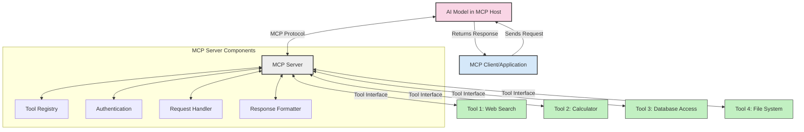
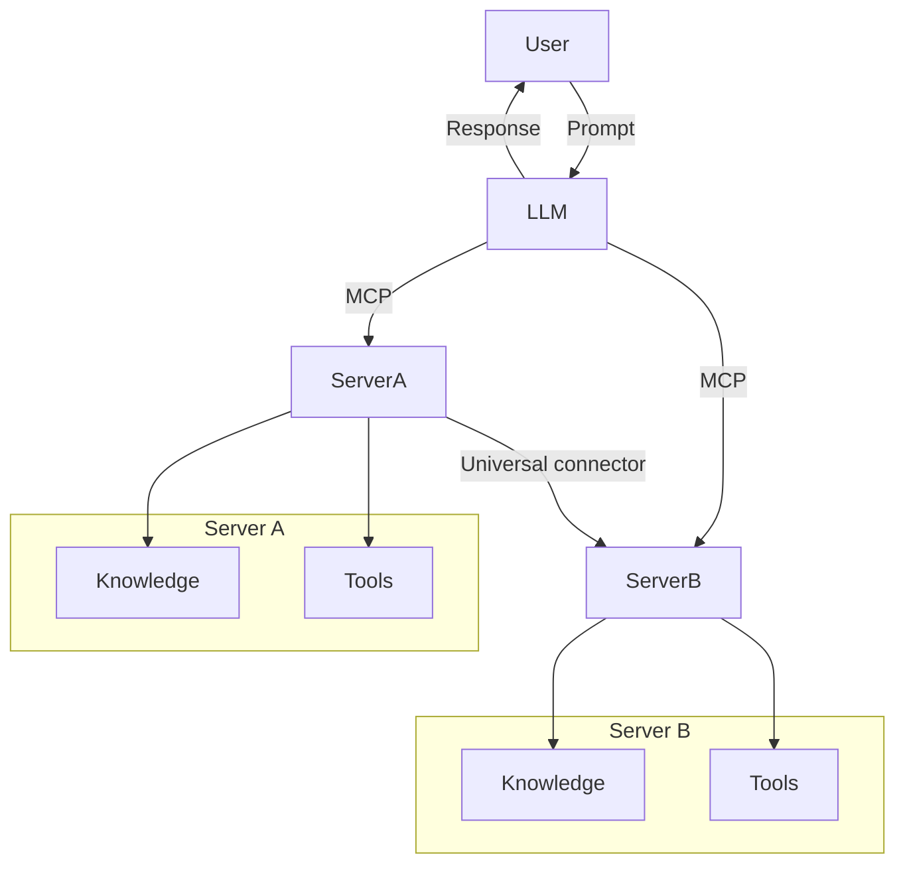

<!--
CO_OP_TRANSLATOR_METADATA:
{
  "original_hash": "1d88dee994dcbb3fa52c271d0c0817b5",
  "translation_date": "2025-05-20T20:38:43+00:00",
  "source_file": "00-Introduction/README.md",
  "language_code": "hk"
}
-->
# Model Context Protocol (MCP) 簡介：點解對可擴展嘅 AI 應用咁重要

生成式 AI 應用係一大進步，因為用戶可以用自然語言提示同應用互動。不過，隨住投入時間同資源越嚟越多，你要確保可以輕鬆整合功能同資源，令應用易於擴展，支援多個模型同處理各種模型細節。簡單嚟講，開始做 Gen AI 應用好容易，但隨住規模增長同複雜度提升，就要開始定義架構，並且好可能需要依賴標準，確保應用嘅建設方式一致。MCP 就係為咗組織同提供呢個標準。

---

## **🔍 乜嘢係 Model Context Protocol (MCP)?**

**Model Context Protocol (MCP)** 係一個**開放標準介面**，容許大型語言模型（LLMs）無縫連接外部工具、API 同數據來源。佢提供一個一致嘅架構，令 AI 模型嘅功能超越訓練數據，打造更智能、可擴展同反應更快嘅 AI 系統。

---

## **🎯 點解 AI 標準化咁重要**

隨住生成式 AI 應用越嚟越複雜，採用標準去確保**可擴展性、可延伸性**同**可維護性**變得好重要。MCP 解決咗呢啲需求，透過：

- 統一模型同工具嘅整合
- 減少脆弱嘅一次性自訂方案
- 容許多個模型喺同一生態系統共存

---

## **📚 學習目標**

讀完本文，你可以：

- 定義 **Model Context Protocol (MCP)** 同佢嘅使用場景
- 理解 MCP 點樣標準化模型同工具之間嘅通訊
- 識別 MCP 架構嘅核心組件
- 探索 MCP 喺企業同開發環境嘅實際應用

---

## **💡 點解 Model Context Protocol (MCP) 係遊戲規則改變者**

### **🔗 MCP 解決 AI 互動嘅碎片化問題**

MCP 出現之前，模型同工具整合需要：

- 為每對工具同模型寫自訂代碼
- 每個供應商都有唔同嘅非標準 API
- 更新經常導致系統中斷
- 工具越多，擴展性越差

### **✅ MCP 標準化嘅好處**

| **好處**                | **說明**                                                                     |
|-------------------------|------------------------------------------------------------------------------|
| 互操作性               | LLMs 可以無縫連接唔同供應商嘅工具                                           |
| 一致性                 | 平台同工具之間行為統一                                                      |
| 可重用性               | 工具寫一次可以喺多個項目同系統重用                                         |
| 加快開發               | 用標準化、即插即用介面減少開發時間                                         |

---

## **🧱 MCP 高階架構概覽**

MCP 採用**客戶端-伺服器模式**，當中：

- **MCP Hosts** 運行 AI 模型
- **MCP Clients** 發起請求
- **MCP Servers** 提供上下文、工具同功能

### **主要組件：**

- **Resources** – 靜態或動態數據供模型使用  
- **Prompts** – 預設工作流程引導生成  
- **Tools** – 可執行嘅功能，例如搜索、計算  
- **Sampling** – 透過遞迴互動實現代理行為

---

## MCP 伺服器點運作

MCP 伺服器嘅運作流程：

- **請求流程**：  
    1. MCP Client 向運行喺 MCP Host 嘅 AI 模型發送請求。  
    2. AI 模型識別到需要外部工具或數據。  
    3. 模型用標準協議同 MCP Server 溝通。

- **MCP Server 功能**：  
    - 工具登記冊：維護可用工具及其功能目錄。  
    - 認證：驗證工具訪問權限。  
    - 請求處理器：處理模型發來嘅工具請求。  
    - 回應格式化器：將工具輸出整理成模型可理解嘅格式。

- **工具執行**：  
    - 伺服器將請求路由到適當嘅外部工具。  
    - 工具執行專門功能（搜索、計算、資料庫查詢等）。  
    - 結果以一致格式返畀模型。

- **回應完成**：  
    - AI 模型將工具輸出整合入回應。  
    - 最終回應發送返畀客戶端應用。

## 👨‍💻 點樣建立 MCP 伺服器（附範例）

MCP 伺服器容許你擴展 LLM 功能，提供數據同功能。

想試下？呢度有用唔同語言建立簡單 MCP 伺服器嘅範例：

- **Python 範例**：https://github.com/modelcontextprotocol/python-sdk

- **TypeScript 範例**：https://github.com/modelcontextprotocol/typescript-sdk

- **Java 範例**：https://github.com/modelcontextprotocol/java-sdk

- **C#/.NET 範例**：https://github.com/modelcontextprotocol/csharp-sdk

## 🌍 MCP 嘅真實應用場景

MCP 擴展 AI 功能，令應用場景多元化：

| **應用**                   | **說明**                                                                     |
|----------------------------|------------------------------------------------------------------------------|
| 企業數據整合               | 連接 LLMs 到數據庫、CRM 或內部工具                                           |
| 代理 AI 系統               | 令自主代理能使用工具同執行決策工作流程                                       |
| 多模態應用                 | 喺同一 AI 應用中結合文字、圖像同音頻工具                                     |
| 實時數據整合               | 將即時數據引入 AI 互動，令輸出更準確及時                                     |

### 🧠 MCP = AI 互動嘅通用標準

Model Context Protocol (MCP) 好似 USB-C 標準化裝置嘅物理連接一樣，係 AI 互動嘅通用標準。喺 AI 世界，MCP 提供一個一致介面，令模型（客戶端）可以無縫整合外部工具同數據提供者（伺服器）。咁樣就唔使為每個 API 或數據來源設計唔同嘅自訂協議。

喺 MCP 標準下，兼容 MCP 嘅工具（稱為 MCP 伺服器）會遵守統一標準。呢啲伺服器可以列出佢哋提供嘅工具或操作，並喺 AI 代理要求時執行。支持 MCP 嘅 AI 代理平台能夠發現伺服器上可用嘅工具，並透過標準協議調用佢哋。

### 💡 促進知識存取

除咗提供工具，MCP 亦促進知識存取。佢令應用可以為大型語言模型（LLMs）提供上下文，將模型連接到唔同數據來源。例如，一個 MCP 伺服器可以代表公司嘅文件庫，令代理按需提取相關資訊。另一個伺服器可以處理發送電郵或更新記錄等特定操作。對代理嚟講，呢啲都係佢可以用嘅工具——有啲工具會返數據（知識上下文），有啲則執行操作。MCP 有效管理兩者。

代理連接 MCP 伺服器時，會自動通過標準格式了解伺服器可用嘅功能同可存取嘅數據。呢種標準化令工具可用性動態化。例如，新增一個 MCP 伺服器到代理系統，佢嘅功能即時可用，無需再度自訂代理指令。

呢種流暢整合同 mermaid 圖示嘅流程一致，伺服器同時提供工具同知識，確保系統間協作無縫。

### 👉 範例：可擴展代理方案

## 🔐 MCP 嘅實際好處

用 MCP 有以下實際好處：

- **資料新鮮度**：模型可以存取訓練數據以外嘅最新資訊
- **功能擴展**：模型可以利用專門工具完成未受訓練嘅任務
- **減少幻覺**：外部數據來源提供事實依據
- **私隱保障**：敏感資料可以留喺安全環境，而唔係直接嵌入提示

## 📌 主要重點

以下係使用 MCP 嘅主要重點：

- **MCP** 標準化 AI 模型同工具同數據嘅互動方式
- 促進 **可擴展性、一致性同互操作性**
- MCP 幫助 **減少開發時間、提升可靠性、擴展模型功能**
- 客戶端-伺服器架構令 AI 應用更靈活同可擴展

## 🧠 練習

諗下你想建立嘅 AI 應用。

- 有邊啲**外部工具或數據**可以提升佢嘅功能？
- MCP 點樣令整合變得**更簡單同可靠**？

## 其他資源

- [MCP GitHub Repository](https://github.com/modelcontextprotocol)

## 下一步

下一章：[Chapter 1: Core Concepts](/01-CoreConcepts/README.md)

**免責聲明**：  
本文件使用 AI 翻譯服務 [Co-op Translator](https://github.com/Azure/co-op-translator) 進行翻譯。雖然我們力求準確，但請注意自動翻譯可能包含錯誤或不準確之處。原文文件以其母語版本為權威來源。對於重要資訊，建議採用專業人工翻譯。我們對因使用本翻譯而引起的任何誤解或誤釋概不負責。