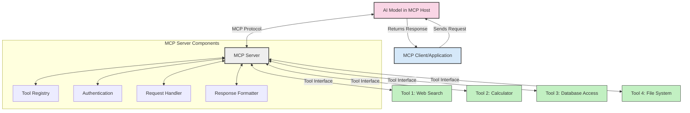
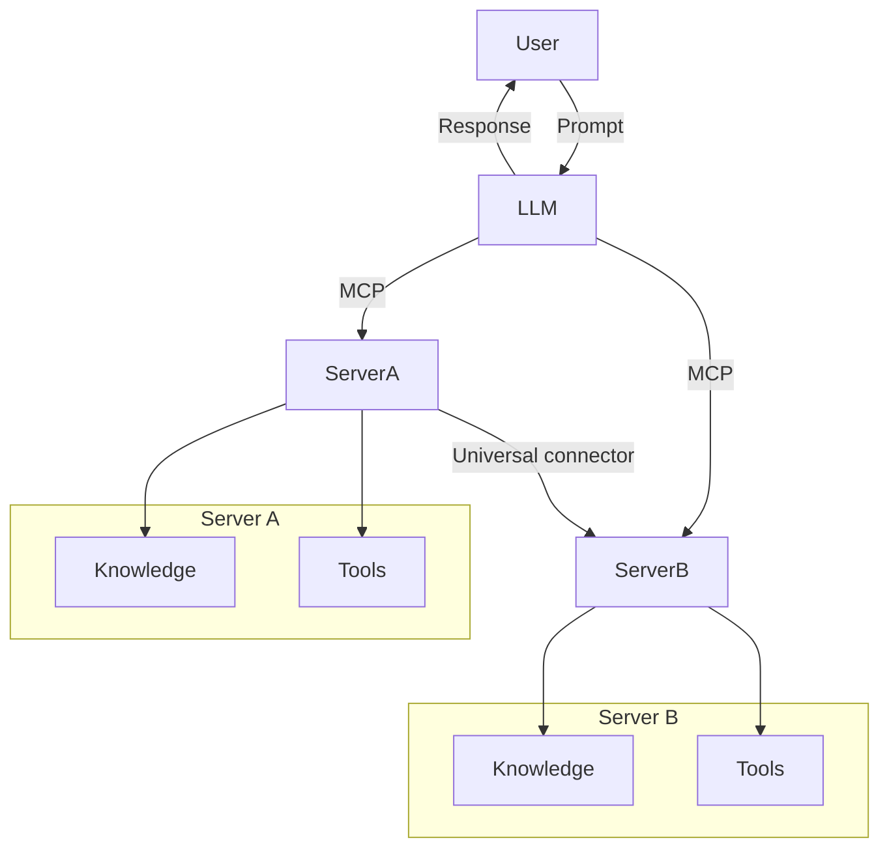

<!--
CO_OP_TRANSLATOR_METADATA:
{
  "original_hash": "cf84f987e1b771d2201408e110dfd2db",
  "translation_date": "2025-05-20T16:06:26+00:00",
  "source_file": "00-Introduction/README.md",
  "language_code": "hk"
}
-->
# Model Context Protocol (MCP) 簡介：點解對可擴展嘅 AI 應用咁重要

生成式 AI 應用係一大進步，因為佢哋通常容許用戶用自然語言提示同應用互動。不過，當投入嘅時間同資源越多，你會想確保功能同資源可以輕鬆整合，方便擴展，令應用可以同時支援多個模型同埋佢哋嘅複雜性。簡單嚟講，建立生成式 AI 應用起初容易，但隨住規模同複雜度增加，你需要開始定義架構，亦好大機會要依靠標準，確保應用建得一致。MCP 就係用嚟整理同提供呢個標準嘅。

---

## **🔍 乜嘢係 Model Context Protocol (MCP)?**

**Model Context Protocol (MCP)** 係一個**開放同標準化嘅介面**，令大型語言模型（LLMs）可以無縫連接外部工具、API 同數據來源。佢提供一致嘅架構，令 AI 模型功能超越訓練數據，打造更智能、可擴展同更靈活嘅 AI 系統。

---

## **🎯 點解 AI 要有標準化**

隨住生成式 AI 應用越嚟越複雜，採用標準確保**可擴展性、可延伸性**同**可維護性**就變得非常重要。MCP 解決咗以下需求：

- 統一模型同工具嘅整合
- 減少脆弱同一次性嘅自訂方案
- 令多個模型可以共存於同一生態系統

---

## **📚 學習目標**

讀完本文，你可以做到：

- 解釋 **Model Context Protocol (MCP)** 同佢嘅應用場景
- 了解 MCP 點樣標準化模型同工具嘅通訊
- 識別 MCP 架構嘅核心組件
- 探索 MCP 喺企業同開發環境嘅實際應用

---

## **💡 點解 Model Context Protocol (MCP) 係遊戲規則改變者**

### **🔗 MCP 解決 AI 互動嘅碎片化問題**

MCP 出現之前，要將模型同工具整合：

- 每對工具同模型都要寫自訂代碼
- 各供應商用非標準 API
- 更新頻繁，容易斷線
- 工具越多，擴展性越差

### **✅ MCP 標準化嘅好處**

| **好處**               | **說明**                                                                 |
|------------------------|--------------------------------------------------------------------------|
| 互操作性               | LLM 可以無縫同唔同供應商嘅工具合作                                      |
| 一致性                 | 平台同工具表現統一                                                        |
| 可重用性               | 工具建一次，可以喺多個項目同系統使用                                    |
| 加快開發               | 用標準化、即插即用嘅介面減少開發時間                                    |

---

## **🧱 MCP 架構概覽**

MCP 採用**客戶端-伺服器模式**，當中：

- **MCP Hosts** 運行 AI 模型
- **MCP Clients** 發起請求
- **MCP Servers** 提供上下文、工具同功能

### **主要組件：**

- **Resources** – 靜態或動態數據供模型使用  
- **Prompts** – 預設工作流程引導生成  
- **Tools** – 可執行功能，例如搜尋、計算  
- **Sampling** – 透過遞歸互動實現代理行為

---

## MCP 伺服器點運作

MCP 伺服器運作流程：

- **請求流程**：  
    1. MCP Client 向運行喺 MCP Host 嘅 AI 模型發送請求。  
    2. AI 模型判斷何時需要外部工具或數據。  
    3. 模型用標準化協議同 MCP Server 通訊。

- **MCP Server 功能**：  
    - 工具註冊表：維護可用工具同功能目錄。  
    - 認證：驗證工具存取權限。  
    - 請求處理器：處理模型發出嘅工具請求。  
    - 回應格式化器：將工具輸出整理成模型可理解格式。

- **工具執行**：  
    - 伺服器將請求轉發到相應嘅外部工具  
    - 工具執行專門功能（搜尋、計算、資料庫查詢等）  
    - 結果以一致格式返回模型

- **回應完成**：  
    - AI 模型將工具輸出整合入回應  
    - 最終回應發送返客戶端應用

## 👨‍💻 點樣建立 MCP 伺服器（示例）

MCP 伺服器幫你擴展 LLM 功能，提供數據同功能。

想試下？以下係用唔同語言建立簡單 MCP 伺服器嘅示例：

- **Python 示例**：https://github.com/modelcontextprotocol/python-sdk

- **TypeScript 示例**：https://github.com/modelcontextprotocol/typescript-sdk

- **Java 示例**：https://github.com/modelcontextprotocol/java-sdk

- **C#/.NET 示例**：https://github.com/modelcontextprotocol/csharp-sdk

## 🌍 MCP 喺實際應用嘅場景

MCP 令 AI 功能大大擴展，應用範圍廣泛：

| **應用**                   | **說明**                                                                  |
|----------------------------|---------------------------------------------------------------------------|
| 企業數據整合               | 連接 LLM 同資料庫、CRM 或內部工具                                         |
| 代理式 AI 系統             | 支援自主代理，具備工具存取同決策工作流程                                 |
| 多模態應用                 | 喺單一 AI 應用中結合文字、圖像同音頻工具                                 |
| 即時數據整合               | 將實時數據帶入 AI 互動，提供更準確、最新嘅結果                           |

### 🧠 MCP = AI 互動嘅通用標準

Model Context Protocol (MCP) 就好似 USB-C 標準化實體裝置連接咁，係 AI 互動嘅通用標準。喺 AI 世界入面，MCP 提供一致介面，令模型（客戶端）可以無縫整合外部工具同數據提供者（伺服器）。咁就唔使為每個 API 或數據來源搞一大堆唔同嘅自訂協議。

依 MCP，兼容嘅工具（即 MCP 伺服器）會遵守統一標準，列出佢哋提供嘅工具或動作，並喺 AI 代理要求時執行。支持 MCP 嘅 AI 代理平台可以發現伺服器提供嘅工具，並透過呢個標準協議調用佢哋。

### 💡 方便獲取知識

除咗提供工具，MCP 亦方便獲取知識。佢令應用可以透過連接唔同數據來源，為大型語言模型 (LLMs) 提供上下文。例如，一個 MCP 伺服器可能代表公司嘅文件庫，令代理隨時調取相關資訊。另一個伺服器可能負責特定動作，例如發送電郵或更新記錄。對代理嚟講，呢啲都係佢可以用嘅工具—部分工具回傳數據（知識上下文），其他則執行動作。MCP 高效管理兩者。

代理連接 MCP 伺服器時，會自動了解伺服器可用嘅功能同數據，全部用標準格式呈現。呢種標準化令工具可用性動態化，例如新增一個 MCP 伺服器，代理就即刻可以用到佢嘅功能，唔使再特別改代理指令。

呢種流暢整合同 mermaid 圖示嘅流程相符，伺服器同時提供工具同知識，確保系統間無縫協作。

### 👉 例子：可擴展嘅代理方案

## 🔐 MCP 嘅實際好處

使用 MCP 嘅實際好處包括：

- **資訊新鮮**：模型可以存取訓練數據之外嘅最新資訊
- **功能擴展**：模型可以利用未受訓練嘅專門工具完成任務
- **減少幻覺**：外部數據來源提供事實依據
- **私隱保障**：敏感數據可保留喺安全環境，唔需要放入提示詞

## 📌 主要重點

使用 MCP 嘅主要重點：

- **MCP** 標準化 AI 模型同工具及數據嘅互動方式
- 促進 **可擴展性、一致性同互操作性**
- MCP 有助 **減少開發時間、提升可靠性同擴展模型能力**
- 客戶端-伺服器架構令 AI 應用更靈活同易擴展

## 🧠 練習

諗下你有興趣建立嘅 AI 應用：

- 有咩**外部工具或數據**可以提升佢嘅功能？
- MCP 點樣令整合變得**更簡單同可靠**？

## 附加資源

- [MCP GitHub Repository](https://github.com/modelcontextprotocol)

## 下一步

下一章：[Chapter 1: Core Concepts](/01-CoreConcepts/README.md)

**免責聲明**：  
本文件乃使用 AI 翻譯服務 [Co-op Translator](https://github.com/Azure/co-op-translator) 翻譯而成。雖然我們致力於準確性，但請注意，自動翻譯可能包含錯誤或不準確之處。原始文件之母語版本應被視為權威來源。對於重要資訊，建議採用專業人工翻譯。我們不對因使用本翻譯而引起的任何誤解或誤釋負責。