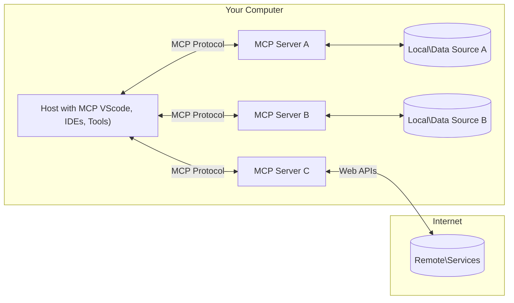

<!--
CO_OP_TRANSLATOR_METADATA:
{
  "original_hash": "b3b4a6ad10c3c0edbf7fa7cfa0ec496b",
  "translation_date": "2025-07-02T06:59:59+00:00",
  "source_file": "01-CoreConcepts/README.md",
  "language_code": "hk"
}
-->
# 📖 MCP 核心概念：掌握用於 AI 整合的 Model Context Protocol

[Model Context Protocol (MCP)](https://github.com/modelcontextprotocol) 是一個強大且標準化的框架，優化大型語言模型（LLMs）與外部工具、應用程式及資料來源之間的溝通。這份 SEO 優化的指南將帶你深入了解 MCP 的核心概念，確保你掌握其客戶端-伺服器架構、重要組件、通訊機制及實作最佳實踐。

## 概覽

本課程將探討構成 Model Context Protocol (MCP) 生態系統的基本架構與組件。你將學習 MCP 的客戶端-伺服器架構、主要組件，以及驅動 MCP 互動的通訊機制。

## 👩‍🎓 主要學習目標

完成本課程後，你將能夠：

- 了解 MCP 的客戶端-伺服器架構。
- 辨識 Hosts、Clients 和 Servers 的角色與職責。
- 分析使 MCP 成為靈活整合層的核心功能。
- 學習 MCP 生態系統中的資訊流動方式。
- 透過 .NET、Java、Python 及 JavaScript 的程式碼範例獲得實務見解。

## 🔎 MCP 架構：深入解析

MCP 生態系統建立在客戶端-伺服器模型上。這種模組化結構讓 AI 應用程式能有效地與工具、資料庫、API 及上下文資源互動。讓我們將此架構拆解為核心組件。

MCP 核心遵循客戶端-伺服器架構，主機應用程式可以連接多個伺服器：



- **MCP Hosts**：像是 VSCode、Claude Desktop、IDE 或想透過 MCP 存取資料的 AI 工具
- **MCP Clients**：與伺服器維持一對一連線的協定客戶端
- **MCP Servers**：輕量程式，透過標準化的 Model Context Protocol 提供特定功能
- **本地資料來源**：你的電腦檔案、資料庫與服務，MCP 伺服器可安全存取
- **遠端服務**：透過網路可存取的外部系統，MCP 伺服器可透過 API 連接

MCP 協定是一個持續演進的標準，最新規範可參考 [協定規範](https://modelcontextprotocol.io/specification/2025-06-18/)

### 1. Hosts

在 Model Context Protocol (MCP) 中，Hosts 扮演使用者與協定互動的主要介面。Hosts 是啟動與 MCP 伺服器連線以存取資料、工具及提示的應用程式或環境。常見的 Hosts 包括整合開發環境（IDE）如 Visual Studio Code、AI 工具如 Claude Desktop，或為特定任務打造的自訂代理。

**Hosts** 是啟動連線的 LLM 應用程式。他們會：

- 執行或與 AI 模型互動以產生回應。
- 啟動與 MCP 伺服器的連線。
- 管理對話流程與使用者介面。
- 控制權限與安全限制。
- 處理使用者對資料分享及工具執行的同意。

### 2. Clients

Clients 是促進 Hosts 與 MCP 伺服器互動的重要元件。Clients 作為中介，讓 Hosts 能存取並使用 MCP 伺服器所提供的功能。他們在確保 MCP 架構內通訊順暢與資料交換高效上扮演關鍵角色。

**Clients** 是主機應用程式內的連接器。他們會：

- 向伺服器發送帶有提示或指令的請求。
- 與伺服器協商功能。
- 管理模型的工具執行請求。
- 處理並顯示回應給使用者。

### 3. Servers

Servers 負責處理 MCP clients 的請求並提供適當回應。他們管理各種操作，例如資料檢索、工具執行及提示產生。Servers 確保客戶端與 Hosts 之間的通訊有效且可靠，維護互動過程的完整性。

**Servers** 是提供上下文與功能的服務。他們會：

- 註冊可用功能（資源、提示、工具）
- 接收並執行來自客戶端的工具呼叫
- 提供上下文資訊以強化模型回應
- 將輸出回傳給客戶端
- 必要時維持跨互動的狀態

任何人都可以開發 Servers，以專門功能擴充模型能力。

### 4. Server Features

Model Context Protocol (MCP) 中的 Servers 提供基礎建構模組，使客戶端、Hosts 與語言模型之間能進行豐富互動。這些功能設計用來透過結構化的上下文、工具與提示強化 MCP 的能力。

MCP 伺服器可以提供以下任一功能：

#### 📑 資源

Model Context Protocol (MCP) 中的資源涵蓋各種可被使用者或 AI 模型利用的上下文與資料，包括：

- **上下文資料**：使用者或 AI 模型可用來做決策與執行任務的資訊與背景。
- **知識庫與文件庫**：結構化或非結構化資料集合，如文章、手冊及研究論文，提供寶貴見解與資訊。
- **本地檔案與資料庫**：儲存在裝置或資料庫中的資料，可供處理與分析。
- **API 與網路服務**：提供額外資料與功能的外部介面與服務，讓系統能整合各種線上資源與工具。

資源範例可為資料庫結構或可透過以下方式存取的檔案：

```text
file://log.txt
database://schema
```

### 🤖 提示

Model Context Protocol (MCP) 中的提示包括各種預先定義的範本與互動模式，設計用以簡化使用者工作流程並強化溝通。這些包括：

- **範本訊息與工作流程**：預先結構化的訊息與流程，引導使用者完成特定任務與互動。
- **預設互動模式**：標準化的動作與回應序列，促進一致且高效的溝通。
- **專門化對話範本**：針對特定對話類型訂製的範本，確保互動相關且符合上下文。

提示範本範例如下：

```markdown
Generate a product slogan based on the following {{product}} with the following {{keywords}}
```

#### ⛏️ 工具

Model Context Protocol (MCP) 中的工具是 AI 模型可執行以完成特定任務的函式。這些工具設計用來增強 AI 模型的能力，提供結構化且可靠的操作。主要特點包括：

- **AI 模型可執行的函式**：工具是可被 AI 模型呼叫以執行各種任務的函式。
- **獨特名稱與描述**：每個工具都有獨特名稱及詳細描述，說明其目的與功能。
- **參數與輸出**：工具接受特定參數並回傳結構化輸出，確保結果一致且可預測。
- **獨立功能**：工具執行獨立功能，如網路搜尋、計算及資料庫查詢。

工具範例可參考以下：

```typescript
server.tool(
  "GetProducts",
  {
    pageSize: z.string().optional(),
    pageCount: z.string().optional()
  }, () => {
    // return results from API
  }
)
```

## Client 功能

在 Model Context Protocol (MCP) 中，Clients 為伺服器提供多項關鍵功能，增強協定內的整體功能與互動。其中一項重要功能是 Sampling。

### 👉 Sampling

- **伺服器啟動的代理行為**：Clients 使伺服器能自主啟動特定動作或行為，提升系統的動態能力。
- **遞迴 LLM 互動**：此功能允許與大型語言模型（LLMs）進行遞迴互動，使任務處理更複雜且可迭代。
- **請求額外模型補全**：伺服器可向模型請求額外補全，確保回應完整且符合上下文。

## MCP 中的資訊流

Model Context Protocol (MCP) 定義了 Hosts、Clients、Servers 與模型之間的結構化資訊流。理解此流程有助於釐清使用者請求如何被處理，以及外部工具與資料如何整合進模型回應。

- **Host 啟動連線**  
  Host 應用程式（如 IDE 或聊天介面）建立與 MCP 伺服器的連線，通常透過 STDIO、WebSocket 或其他支援的傳輸方式。

- **功能協商**  
  客戶端（內嵌於 Host）與伺服器交換彼此支援的功能、工具、資源及協定版本，確保雙方了解會話可用的能力。

- **使用者請求**  
  使用者與 Host 互動（例如輸入提示或指令）。Host 收集輸入並傳給客戶端處理。

- **資源或工具使用**  
  - 客戶端可能向伺服器請求額外上下文或資源（如檔案、資料庫條目或知識庫文章）以豐富模型理解。
  - 若模型判定需要工具（例如取得資料、執行計算或呼叫 API），客戶端會向伺服器發送工具呼叫請求，指定工具名稱與參數。

- **伺服器執行**  
  伺服器接收資源或工具請求，執行必要操作（如執行函式、查詢資料庫或檔案檢索），並以結構化格式回傳結果給客戶端。

- **回應產生**  
  客戶端將伺服器回應（資源資料、工具輸出等）整合進持續的模型互動中。模型利用這些資訊產生完整且符合上下文的回應。

- **結果呈現**  
  Host 從客戶端接收最終輸出並呈現給使用者，通常包含模型生成的文字及任何工具執行或資源查詢的結果。

此流程使 MCP 能支援先進、互動且具上下文感知的 AI 應用，無縫連結模型與外部工具及資料來源。

## 協定細節

MCP（Model Context Protocol）建立於 [JSON-RPC 2.0](https://www.jsonrpc.org/) 之上，提供標準化且語言無關的訊息格式，用於 Hosts、Clients 與 Servers 間的通訊。此基礎確保跨平台與多種程式語言間的可靠、結構化及可擴展互動。

### 主要協定功能

MCP 擴充 JSON-RPC 2.0，加入工具呼叫、資源存取及提示管理的額外約定。它支援多種傳輸層（STDIO、WebSocket、SSE），並促進組件間安全、可擴充且語言無關的通訊。

#### 🧢 基本協定

- **JSON-RPC 訊息格式**：所有請求與回應皆符合 JSON-RPC 2.0 規範，確保方法呼叫、參數、結果及錯誤處理的結構一致。
- **有狀態連線**：MCP 會話維持多個請求間的狀態，支援持續對話、上下文累積及資源管理。
- **功能協商**：連線建立時，客戶端與伺服器交換支援的功能、協定版本、可用工具與資源，確保雙方了解彼此能力並能調整。

#### ➕ 額外工具

以下為 MCP 提供的其他工具與協定擴充，提升開發者體驗並支持進階場景：

- **設定選項**：MCP 允許動態配置會話參數，如工具權限、資源存取及模型設定，依互動需求調整。
- **進度追蹤**：長時間執行操作可回報進度更新，提升使用者介面反應與體驗。
- **請求取消**：客戶端可取消進行中的請求，允許使用者中斷不再需要或耗時過久的操作。
- **錯誤回報**：標準化錯誤訊息與代碼，有助診斷問題、優雅處理失敗並提供使用者及開發者可行的反饋。
- **日誌記錄**：客戶端與伺服器皆可輸出結構化日誌，用於審計、除錯及監控協定互動。

利用這些協定功能，MCP 確保語言模型與外部工具或資料來源間的通訊穩健、安全且靈活。

### 🔐 安全考量

MCP 實作應遵守數項關鍵安全原則，以確保互動安全可信：

- **使用者同意與控制**：任何資料存取或操作執行前，必須取得使用者明確同意。使用者應清楚掌控分享資料與授權行動，並透過直覺介面審核及批准活動。
- **資料隱私**：使用者資料僅在明確同意下暴露，並須受適當存取控制保護。MCP 實作必須防止未授權資料傳輸，確保隱私在所有互動中獲得維護。
- **工具安全**：呼叫任何工具前，需取得明確使用者同意。使用者應清楚了解每項工具功能，且必須強制執行嚴格安全界限，避免工具誤用或不安全執行。

遵循這些原則，MCP 在所有協定互動中維護使用者信任、隱私與安全。

## 程式碼範例：主要組件

以下為數種熱門程式語言的範例程式碼，示範如何實作 MCP 伺服器主要組件與工具。

### .NET 範例：建立簡單的 MCP 伺服器與工具

這是一個實用的 .NET 範例，展示如何實作簡單 MCP 伺服器及自訂工具。範例示範工具定義與註冊、請求處理，以及如何使用 Model Context Protocol 連接伺服器。

```csharp
using System;
using System.Threading.Tasks;
using ModelContextProtocol.Server;
using ModelContextProtocol.Server.Transport;
using ModelContextProtocol.Server.Tools;

public class WeatherServer
{
    public static async Task Main(string[] args)
    {
        // Create an MCP server
        var server = new McpServer(
            name: "Weather MCP Server",
            version: "1.0.0"
        );
        
        // Register our custom weather tool
        server.AddTool<string, WeatherData>("weatherTool", 
            description: "Gets current weather for a location",
            execute: async (location) => {
                // Call weather API (simplified)
                var weatherData = await GetWeatherDataAsync(location);
                return weatherData;
            });
        
        // Connect the server using stdio transport
        var transport = new StdioServerTransport();
        await server.ConnectAsync(transport);
        
        Console.WriteLine("Weather MCP Server started");
        
        // Keep the server running until process is terminated
        await Task.Delay(-1);
    }
    
    private static async Task<WeatherData> GetWeatherDataAsync(string location)
    {
        // This would normally call a weather API
        // Simplified for demonstration
        await Task.Delay(100); // Simulate API call
        return new WeatherData { 
            Temperature = 72.5,
            Conditions = "Sunny",
            Location = location
        };
    }
}

public class WeatherData
{
    public double Temperature { get; set; }
    public string Conditions { get; set; }
    public string Location { get; set; }
}
```

### Java 範例：MCP 伺服器組件

此範例示範與上述 .NET 範例相同的 MCP 伺服器與工具註冊，但以 Java 實作。

```java
import io.modelcontextprotocol.server.McpServer;
import io.modelcontextprotocol.server.McpToolDefinition;
import io.modelcontextprotocol.server.transport.StdioServerTransport;
import io.modelcontextprotocol.server.tool.ToolExecutionContext;
import io.modelcontextprotocol.server.tool.ToolResponse;

public class WeatherMcpServer {
    public static void main(String[] args) throws Exception {
        // Create an MCP server
        McpServer server = McpServer.builder()
            .name("Weather MCP Server")
            .version("1.0.0")
            .build();
            
        // Register a weather tool
        server.registerTool(McpToolDefinition.builder("weatherTool")
            .description("Gets current weather for a location")
            .parameter("location", String.class)
            .execute((ToolExecutionContext ctx) -> {
                String location = ctx.getParameter("location", String.class);
                
                // Get weather data (simplified)
                WeatherData data = getWeatherData(location);
                
                // Return formatted response
                return ToolResponse.content(
                    String.format("Temperature: %.1f°F, Conditions: %s, Location: %s", 
                    data.getTemperature(), 
                    data.getConditions(), 
                    data.getLocation())
                );
            })
            .build());
        
        // Connect the server using stdio transport
        try (StdioServerTransport transport = new StdioServerTransport()) {
            server.connect(transport);
            System.out.println("Weather MCP Server started");
            // Keep server running until process is terminated
            Thread.currentThread().join();
        }
    }
    
    private static WeatherData getWeatherData(String location) {
        // Implementation would call a weather API
        // Simplified for example purposes
        return new WeatherData(72.5, "Sunny", location);
    }
}

class WeatherData {
    private double temperature;
    private String conditions;
    private String location;
    
    public WeatherData(double temperature, String conditions, String location) {
        this.temperature = temperature;
        this.conditions = conditions;
        this.location = location;
    }
    
    public double getTemperature() {
        return temperature;
    }
    
    public String getConditions() {
        return conditions;
    }
    
    public String getLocation() {
        return location;
    }
}
```

### Python 範例：建立 MCP 伺服器

本範例示範如何用 Python 建立 MCP 伺服器，並展示兩種不同方式來創建工具。

```python
#!/usr/bin/env python3
import asyncio
from mcp.server.fastmcp import FastMCP
from mcp.server.transports.stdio import serve_stdio

# Create a FastMCP server
mcp = FastMCP(
    name="Weather MCP Server",
    version="1.0.0"
)

@mcp.tool()
def get_weather(location: str) -> dict:
    """Gets current weather for a location."""
    # This would normally call a weather API
    # Simplified for demonstration
    return {
        "temperature": 72.5,
        "conditions": "Sunny",
        "location": location
    }

# Alternative approach using a class
class WeatherTools:
    @mcp.tool()
    def forecast(self, location: str, days: int = 1) -> dict:
        """Gets weather forecast for a location for the specified number of days."""
        # This would normally call a weather API forecast endpoint
        # Simplified for demonstration
        return {
            "location": location,
            "forecast": [
                {"day": i+1, "temperature": 70 + i, "conditions": "Partly Cloudy"}
                for i in range(days)
            ]
        }

# Instantiate the class to register its tools
weather_tools = WeatherTools()

# Start the server using stdio transport
if __name__ == "__main__":
    asyncio.run(serve_stdio(mcp))
```

### JavaScript 範例：建立 MCP 伺服器

此範例示範如何用 JavaScript 建立 MCP 伺服器，並註冊兩個與天氣相關的工具。

```javascript
// Using the official Model Context Protocol SDK
import { McpServer } from "@modelcontextprotocol/sdk/server/mcp.js";
import { StdioServerTransport } from "@modelcontextprotocol/sdk/server/stdio.js";
import { z } from "zod"; // For parameter validation

// Create an MCP server
const server = new McpServer({
  name: "Weather MCP Server",
  version: "1.0.0"
});

// Define a weather tool
server.tool(
  "weatherTool",
  {
    location: z.string().describe("The location to get weather for")
  },
  async ({ location }) => {
    // This would normally call a weather API
    // Simplified for demonstration
    const weatherData = await getWeatherData(location);
    
    return {
      content: [
        { 
          type: "text", 
          text: `Temperature: ${weatherData.temperature}°F, Conditions: ${weatherData.conditions}, Location: ${weatherData.location}` 
        }
      ]
    };
  }
);

// Define a forecast tool
server.tool(
  "forecastTool",
  {
    location: z.string(),
    days: z.number().default(3).describe("Number of days for forecast")
  },
  async ({ location, days }) => {
    // This would normally call a weather API
    // Simplified for demonstration
    const forecast = await getForecastData(location, days);
    
    return {
      content: [
        { 
          type: "text", 
          text: `${days}-day forecast for ${location}: ${JSON.stringify(forecast)}` 
        }
      ]
    };
  }
);

// Helper functions
async function getWeatherData(location) {
  // Simulate API call
  return {
    temperature: 72.5,
    conditions: "Sunny",
    location: location
  };
}

async function getForecastData(location, days) {
  // Simulate API call
  return Array.from({ length: days }, (_, i) => ({
    day: i + 1,
    temperature: 70 + Math.floor(Math.random() * 10),
    conditions: i % 2 === 0 ? "Sunny" : "Partly Cloudy"
  }));
}

// Connect the server using stdio transport
const transport = new StdioServerTransport();
server.connect(transport).catch(console.error);

console.log("Weather MCP Server started");
```

此 JavaScript 範例展示如何建立 MCP 客戶端，連接伺服器、發送提示，並處理回應及任何工具呼叫。

## 安全與授權

MCP 包含多項內建概念與機制，用於管理協定中的安全與授權：

1. **工具權限控制**  
  客戶端可指定模型在會話中可使用哪些工具。此舉確保僅能存取明確授權的工具，降低非預期或不安全操作風險。權限可依使用者偏好、組織政策或互動上下文動態配置。

2. **身份驗證**  
  伺服器可要求身份驗證後才授權工具、資源或敏感操作存取。可能採用 API 金鑰、OAuth 令牌或其他驗證機制。妥善身份驗證確保只有受信任的客戶端與使用者能呼叫伺服器端功能。

3. **驗證**  
  所有工具呼叫均強制參數驗證。每個工具定義預期的參數類型、格式與限制，伺服器依此驗證進來的請求。此舉防止格式錯誤或惡意輸入影響工具實作，維護操作完整性。

4. **速率限制**  
  為防止濫用並確保伺服器資源公平使用，MCP 伺服器可對工具呼叫與資源存取實施速率限制。限制可依使用者、會話或全域範圍設定，有助防範拒絕服務攻擊或過度資源消耗。

結合這些機制，MCP 為語言模型與外部工具及資料來源整合提供安全基礎，同時賦予使用者與開

**免責聲明**：  
本文件由 AI 翻譯服務 [Co-op Translator](https://github.com/Azure/co-op-translator) 進行翻譯。雖然我們致力於確保準確性，但請注意，自動翻譯可能包含錯誤或不準確之處。原始文件的母語版本應被視為權威來源。對於重要資訊，建議採用專業人工翻譯。我們不對因使用本翻譯而引起的任何誤解或誤釋負責。