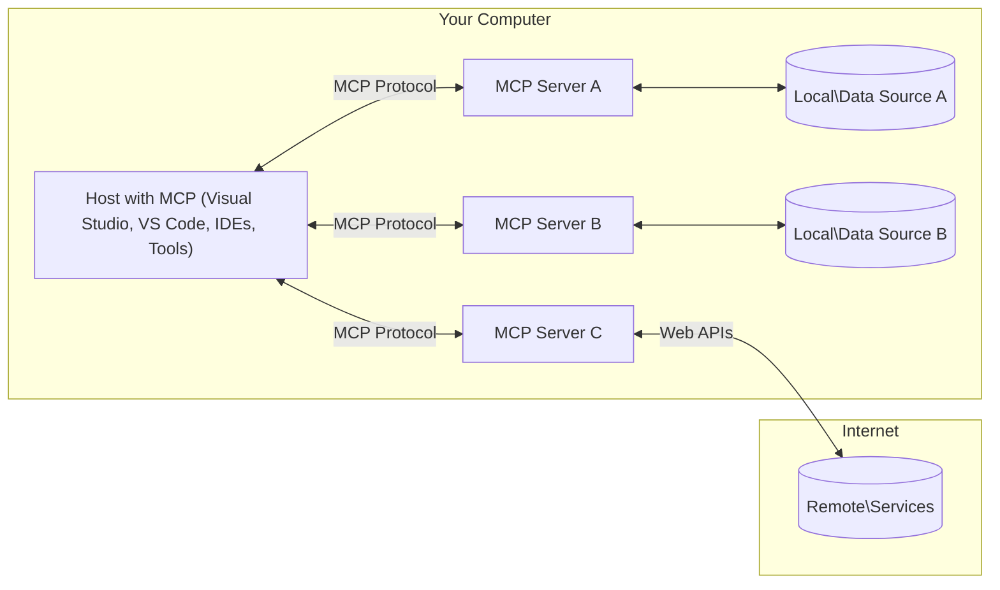

<!--
CO_OP_TRANSLATOR_METADATA:
{
  "original_hash": "0a6a7bcb289c024a91289e0444cb370b",
  "translation_date": "2025-08-18T10:42:52+00:00",
  "source_file": "01-CoreConcepts/README.md",
  "language_code": "hk"
}
-->
# MCP 核心概念：掌握 AI 整合的模型上下文協議

[](https://youtu.be/earDzWGtE84)

_(點擊上方圖片觀看本課程影片)_

[Model Context Protocol (MCP)](https://gi- **明確用戶同意**：所有數據訪問和操作都需要用戶明確批准後才能執行。用戶必須清楚了解將訪問哪些數據以及將執行哪些操作，並能細緻地控制權限和授權。

- **數據隱私保護**：用戶數據僅在獲得明確同意後才可暴露，並且在整個交互生命周期中必須受到強大的訪問控制保護。實現方式需防止未授權的數據傳輸並保持嚴格的隱私界限。

- **工具執行安全性**：每次工具調用都需要用戶明確同意，並清楚了解工具的功能、參數及可能的影響。需設置強大的安全邊界以防止意外、不安全或惡意的工具執行。

- **傳輸層安全性**：所有通信渠道應使用適當的加密和身份驗證機制。遠程連接應實施安全的傳輸協議並妥善管理憑證。

#### 實施指南：

- **權限管理**：實施細緻的權限系統，讓用戶能控制哪些伺服器、工具和資源可被訪問
- **身份驗證與授權**：使用安全的身份驗證方法（如 OAuth、API 密鑰），並妥善管理令牌及其過期時間  
- **輸入驗證**：根據定義的結構驗證所有參數和數據輸入，以防止注入攻擊
- **審計日誌**：維護全面的操作日誌以進行安全監控和合規性檢查com/modelcontextprotocol) 是一個強大的標準化框架，旨在優化大型語言模型（LLMs）與外部工具、應用程序和數據源之間的通信。本指南將帶您了解 MCP 的核心概念，確保您掌握其客戶端-伺服器架構、基本組件、通信機制及最佳實踐。

## 概述

本課程探討構成模型上下文協議（MCP）生態系統的基本架構和組件。您將學習 MCP 的客戶端-伺服器架構、關鍵組件以及驅動 MCP 交互的通信機制。

## 核心學習目標

完成本課程後，您將能夠：

- 理解 MCP 的客戶端-伺服器架構。
- 確定 Hosts、Clients 和 Servers 的角色及責任。
- 分析 MCP 作為靈活整合層的核心特性。
- 學習 MCP 生態系統中的信息流動方式。
- 通過 .NET、Java、Python 和 JavaScript 的代碼示例獲得實用見解。

## MCP 架構：深入探討

MCP 生態系統基於客戶端-伺服器模型構建。這種模塊化結構使 AI 應用程序能高效地與工具、數據庫、API 和上下文資源交互。讓我們將此架構分解為核心組件。

MCP 的核心遵循客戶端-伺服器架構，其中主機應用程序可以連接到多個伺服器：



- **MCP Hosts**：如 VSCode、Claude Desktop、IDE 或希望通過 MCP 訪問數據的 AI 工具
- **MCP Clients**：維持與伺服器一對一連接的協議客戶端
- **MCP Servers**：輕量級程序，通過標準化的模型上下文協議暴露特定功能
- **本地數據源**：MCP 伺服器可安全訪問您電腦上的文件、數據庫和服務
- **遠程服務**：MCP 伺服器可通過 API 連接到互聯網上的外部系統

MCP 協議是一個使用基於日期的版本控制（YYYY-MM-DD 格式）的不斷演進的標準。目前的協議版本是 **2025-06-18**。您可以查看 [協議規範的最新更新](https://modelcontextprotocol.io/specification/2025-06-18/)

### 1. Hosts

在模型上下文協議（MCP）中，**Hosts** 是作為用戶與協議交互的主要界面的 AI 應用程序。Hosts 通過為每個伺服器連接創建專用的 MCP 客戶端來協調和管理與多個 MCP 伺服器的連接。Hosts 的示例包括：

- **AI 應用程序**：Claude Desktop、Visual Studio Code、Claude Code
- **開發環境**：具有 MCP 整合功能的 IDE 和代碼編輯器  
- **自定義應用程序**：專門構建的 AI 代理和工具

**Hosts** 是協調 AI 模型交互的應用程序。它們：

- **協調 AI 模型**：執行或與 LLMs 交互以生成響應並協調 AI 工作流
- **管理客戶端連接**：為每個 MCP 伺服器連接創建並維護一個 MCP 客戶端
- **控制用戶界面**：處理對話流程、用戶交互和響應呈現  
- **強化安全性**：控制權限、安全約束和身份驗證
- **處理用戶同意**：管理用戶對數據共享和工具執行的批准

### 2. Clients

**Clients** 是維持 Hosts 與 MCP 伺服器之間專用一對一連接的基本組件。每個 MCP 客戶端由 Host 實例化以連接到特定的 MCP 伺服器，確保有序且安全的通信渠道。多個客戶端使 Hosts 能夠同時連接到多個伺服器。

**Clients** 是主機應用程序中的連接器組件。它們：

- **協議通信**：使用 JSON-RPC 2.0 向伺服器發送請求，包括提示和指令
- **功能協商**：在初始化期間與伺服器協商支持的功能和協議版本
- **工具執行**：管理模型的工具執行請求並處理響應
- **實時更新**：處理伺服器的通知和實時更新
- **響應處理**：處理並格式化伺服器響應以供用戶顯示

### 3. Servers

**Servers** 是提供上下文、工具和功能給 MCP 客戶端的程序。它們可以在本地（與 Host 位於同一台機器）或遠程（在外部平台上）執行，負責處理客戶端請求並提供結構化響應。伺服器通過標準化的模型上下文協議暴露特定功能。

**Servers** 是提供上下文和功能的服務。它們：

- **功能註冊**：註冊並向客戶端暴露可用的原語（資源、提示、工具）
- **請求處理**：接收並執行工具調用、資源請求和提示請求
- **上下文提供**：提供上下文信息和數據以增強模型響應
- **狀態管理**：維護會話狀態並在需要時處理有狀態的交互
- **實時通知**：向連接的客戶端發送功能變更和更新通知

伺服器可以由任何人開發，以通過專業功能擴展模型能力，並支持本地和遠程部署場景。

### 4. Server Primitives

模型上下文協議（MCP）中的伺服器提供三個核心 **原語**，定義了客戶端、主機和語言模型之間豐富交互的基本構建塊。這些原語指定了協議中可用的上下文信息和操作類型。

MCP 伺服器可以暴露以下三個核心原語的任意組合：

#### 資源 

**資源** 是為 AI 應用程序提供上下文信息的數據源。它們代表靜態或動態內容，可增強模型的理解和決策能力：

- **上下文數據**：為 AI 模型消耗的結構化信息和上下文
- **知識庫**：文檔存儲庫、文章、手冊和研究論文
- **本地數據源**：文件、數據庫和本地系統信息  
- **外部數據**：API 響應、網絡服務和遠程系統數據
- **動態內容**：根據外部條件更新的實時數據

資源通過 URI 識別，並支持通過 `resources/list` 方法進行發現以及通過 `resources/read` 方法進行檢索：

```text
file://documents/project-spec.md
database://production/users/schema
api://weather/current
```

#### 提示

**提示** 是幫助結構化與語言模型交互的可重用模板。它們提供標準化的交互模式和模板化工作流：

- **基於模板的交互**：預結構化的消息和對話開端
- **工作流模板**：常見任務和交互的標準化序列
- **少樣本示例**：基於示例的模型指令模板
- **系統提示**：定義模型行為和上下文的基礎提示
- **動態模板**：根據特定上下文調整的參數化提示

提示支持變量替換，並可通過 `prompts/list` 方法進行發現以及通過 `prompts/get` 方法進行檢索：

```markdown
Generate a {{task_type}} for {{product}} targeting {{audience}} with the following requirements: {{requirements}}
```

#### 工具

**工具** 是 AI 模型可調用以執行特定操作的可執行功能。它們代表 MCP 生態系統的“動詞”，使模型能與外部系統交互：

- **可執行功能**：模型可用特定參數調用的離散操作
- **外部系統整合**：API 調用、數據庫查詢、文件操作、計算
- **唯一身份**：每個工具都有獨特的名稱、描述和參數結構
- **結構化輸入/輸出**：工具接受經過驗證的參數並返回結構化、類型化的響應
- **操作能力**：使模型能執行現實世界的操作並檢索實時數據

工具使用 JSON Schema 定義參數驗證，並可通過 `tools/list` 方法進行發現以及通過 `tools/call` 方法進行執行：

```typescript
server.tool(
  "search_products", 
  {
    query: z.string().describe("Search query for products"),
    category: z.string().optional().describe("Product category filter"),
    max_results: z.number().default(10).describe("Maximum results to return")
  }, 
  async (params) => {
    // Execute search and return structured results
    return await productService.search(params);
  }
);
```

## 客戶端原語

在模型上下文協議（MCP）中，**客戶端**可以暴露原語，使伺服器能向主機應用程序請求額外的功能。這些客戶端原語允許更豐富、更具交互性的伺服器實現，能訪問 AI 模型功能和用戶交互。

### 取樣

**取樣** 使伺服器能向客戶端的 AI 應用程序請求語言模型的完成。此原語使伺服器能在不嵌入自己的模型依賴的情況下訪問 LLM 功能：

- **模型無關的訪問**：伺服器可請求完成，而無需包含 LLM SDK 或管理模型訪問
- **伺服器主動 AI**：使伺服器能自主生成內容，使用客戶端的 AI 模型
- **遞歸 LLM 交互**：支持伺服器需要 AI 協助進行處理的複雜場景
- **動態內容生成**：允許伺服器使用主機的模型創建上下文響應

取樣通過 `sampling/complete` 方法啟動，伺服器向客戶端發送完成請求。

### 引導  

**引導** 使伺服器能通過客戶端界面向用戶請求額外信息或確認：

- **用戶輸入請求**：伺服器可在工具執行需要時向用戶請求額外信息
- **確認對話框**：請求用戶批准敏感或有影響的操作
- **交互式工作流**：使伺服器能創建逐步的用戶交互
- **動態參數收集**：在工具執行期間收集缺失或可選參數

引導請求通過 `elicitation/request` 方法進行，通過客戶端界面收集用戶輸入。

### 日誌

**日誌** 使伺服器能向客戶端發送結構化的日誌消息，用於調試、監控和操作可見性：

- **調試支持**：使伺服器能提供詳細的執行日誌以進行故障排除
- **操作監控**：向客戶端發送狀態更新和性能指標
- **錯誤報告**：提供詳細的錯誤上下文和診斷信息
- **審計追蹤**：創建伺服器操作和決策的全面日誌

日誌消息發送到客戶端，以提供伺服器操作的透明性並促進調試。

## MCP 中的信息流

模型上下文協議（MCP）定義了主機、客戶端、伺服器和模型之間的信息流結構。理解此流動有助於澄清用戶請求的處理方式以及外部工具和數據如何整合到模型響應中。

- **主機啟動連接**  
  主機應用程序（如 IDE 或聊天界面）與 MCP 伺服器建立連接，通常通過 STDIO、WebSocket 或其他支持的傳輸方式。

- **功能協商**  
  嵌入在主機中的客戶端與伺服器交換有關其支持的功能、工具、資源和協議版本的信息。這確保雙方了解會話中可用的功能。

- **用戶請求**  
  用戶與主機交互（例如輸入提示或命令）。主機收集此輸入並將其傳遞給客戶端進行處理。

- **資源或工具使用**  
  - 客戶端可能向伺服器請求額外的上下文或資源（如文件、數據庫條目或知識庫文章），以豐富模型的理解。
  - 如果模型判斷需要工具（例如獲取數據、執行計算或調用 API），客戶端向伺服器發送工具調用請求，指定工具名稱和參數。

- **伺服器執行**  
  伺服器接收資源或工具請求，執行必要的操作（如運行功能、查詢數據庫或檢索文件），並以結構化格式將結果返回給客戶端。

- **響應生成**  
  客戶端將伺服器的響應（資源數據、工具輸出等）整合到正在進行的模型交互中。模型使用此信息生成全面且上下文相關的響應。

- **結果呈現**  
  主機接收客戶端的最終輸出並呈現給用戶，通常包括模型生成的文本以及工具執行或資源查找的結果。

此流程使 MCP 能支持高級、交互式和上下文感知的 AI 應用程序，通過無縫連接模型與外部工具和數據源。

## 協議架構與層次

MCP 包含兩個獨特的架構層，協同工作以提供完整的通信框架：

### 數據層

**數據層** 使用 **JSON-RPC 2.0** 作為基礎實現核心 MCP 協議。此層定義消息結構、語義和交互模式：

#### 核心組件：

- **JSON-RPC 2.0 協議**：所有通信使用標準化的 JSON-RPC 2.0 消息格式進行方法調用、響應和通知
- **生命週期管理**：處理客戶端與伺服器之間的連線初始化、功能協商及會話終止  
- **伺服器基礎功能**：讓伺服器透過工具、資源及提示提供核心功能  
- **客戶端基礎功能**：讓伺服器能向大型語言模型（LLM）請求取樣、引導用戶輸入及發送日誌訊息  
- **即時通知**：支援非同步通知，實現動態更新而無需輪詢  

#### 主要功能：

- **協議版本協商**：使用基於日期的版本控制（YYYY-MM-DD）以確保相容性  
- **功能發現**：客戶端與伺服器在初始化期間交換支援的功能資訊  
- **有狀態會話**：在多次互動中維持連線狀態以確保上下文連貫性  

### 傳輸層

**傳輸層**負責管理MCP參與者之間的通訊管道、訊息框架及身份驗證：

#### 支援的傳輸機制：

1. **STDIO 傳輸**：  
   - 使用標準輸入/輸出流進行直接的進程通訊  
   - 適合於同一台機器上的本地進程，無網絡負擔  
   - 常用於本地MCP伺服器實現  

2. **可流式HTTP傳輸**：  
   - 使用HTTP POST進行客戶端到伺服器的訊息傳遞  
   - 可選擇使用伺服器發送事件（SSE）進行伺服器到客戶端的流式傳輸  
   - 支援跨網絡的遠端伺服器通訊  
   - 支援標準HTTP身份驗證（如Bearer Tokens、API金鑰、自定義標頭）  
   - MCP建議使用OAuth進行安全的基於令牌的身份驗證  

#### 傳輸抽象化：

傳輸層將通訊細節從數據層中抽象出來，確保所有傳輸機制均使用相同的JSON-RPC 2.0訊息格式。這種抽象化允許應用程式在本地與遠端伺服器之間無縫切換。

### 安全性考量

MCP的實現必須遵循多項關鍵安全原則，以確保所有協議操作的安全性、可信性及可靠性：

- **用戶同意與控制**：在訪問任何數據或執行操作之前，必須獲得用戶的明確同意。用戶應能清楚地控制共享的數據及授權的操作，並透過直觀的用戶介面審查及批准活動。  

- **數據隱私**：僅在獲得明確同意的情況下暴露用戶數據，並需採取適當的訪問控制措施。MCP實現必須防止未經授權的數據傳輸，並確保在所有互動中維護隱私。  

- **工具安全性**：在調用任何工具之前，需獲得用戶的明確同意。用戶應清楚了解每個工具的功能，並需強制執行嚴格的安全邊界以防止意外或不安全的工具執行。  

透過遵循這些安全原則，MCP確保在提供強大AI整合功能的同時，維護用戶的信任、隱私及安全。

## 程式碼範例：關鍵組件

以下是幾個流行程式語言的程式碼範例，展示如何實現MCP伺服器的關鍵組件及工具。

### .NET 範例：建立簡單的MCP伺服器及工具

以下是一個實用的.NET程式碼範例，展示如何實現一個簡單的MCP伺服器，並定義及註冊工具、處理請求及透過Model Context Protocol連接伺服器。

```csharp
using System;
using System.Threading.Tasks;
using ModelContextProtocol.Server;
using ModelContextProtocol.Server.Transport;
using ModelContextProtocol.Server.Tools;

public class WeatherServer
{
    public static async Task Main(string[] args)
    {
        // Create an MCP server
        var server = new McpServer(
            name: "Weather MCP Server",
            version: "1.0.0"
        );
        
        // Register our custom weather tool
        server.AddTool<string, WeatherData>("weatherTool", 
            description: "Gets current weather for a location",
            execute: async (location) => {
                // Call weather API (simplified)
                var weatherData = await GetWeatherDataAsync(location);
                return weatherData;
            });
        
        // Connect the server using stdio transport
        var transport = new StdioServerTransport();
        await server.ConnectAsync(transport);
        
        Console.WriteLine("Weather MCP Server started");
        
        // Keep the server running until process is terminated
        await Task.Delay(-1);
    }
    
    private static async Task<WeatherData> GetWeatherDataAsync(string location)
    {
        // This would normally call a weather API
        // Simplified for demonstration
        await Task.Delay(100); // Simulate API call
        return new WeatherData { 
            Temperature = 72.5,
            Conditions = "Sunny",
            Location = location
        };
    }
}

public class WeatherData
{
    public double Temperature { get; set; }
    public string Conditions { get; set; }
    public string Location { get; set; }
}
```

### Java 範例：MCP伺服器組件

此範例展示了與上述.NET範例相同的MCP伺服器及工具註冊，但使用Java實現。

```java
import io.modelcontextprotocol.server.McpServer;
import io.modelcontextprotocol.server.McpToolDefinition;
import io.modelcontextprotocol.server.transport.StdioServerTransport;
import io.modelcontextprotocol.server.tool.ToolExecutionContext;
import io.modelcontextprotocol.server.tool.ToolResponse;

public class WeatherMcpServer {
    public static void main(String[] args) throws Exception {
        // Create an MCP server
        McpServer server = McpServer.builder()
            .name("Weather MCP Server")
            .version("1.0.0")
            .build();
            
        // Register a weather tool
        server.registerTool(McpToolDefinition.builder("weatherTool")
            .description("Gets current weather for a location")
            .parameter("location", String.class)
            .execute((ToolExecutionContext ctx) -> {
                String location = ctx.getParameter("location", String.class);
                
                // Get weather data (simplified)
                WeatherData data = getWeatherData(location);
                
                // Return formatted response
                return ToolResponse.content(
                    String.format("Temperature: %.1f°F, Conditions: %s, Location: %s", 
                    data.getTemperature(), 
                    data.getConditions(), 
                    data.getLocation())
                );
            })
            .build());
        
        // Connect the server using stdio transport
        try (StdioServerTransport transport = new StdioServerTransport()) {
            server.connect(transport);
            System.out.println("Weather MCP Server started");
            // Keep server running until process is terminated
            Thread.currentThread().join();
        }
    }
    
    private static WeatherData getWeatherData(String location) {
        // Implementation would call a weather API
        // Simplified for example purposes
        return new WeatherData(72.5, "Sunny", location);
    }
}

class WeatherData {
    private double temperature;
    private String conditions;
    private String location;
    
    public WeatherData(double temperature, String conditions, String location) {
        this.temperature = temperature;
        this.conditions = conditions;
        this.location = location;
    }
    
    public double getTemperature() {
        return temperature;
    }
    
    public String getConditions() {
        return conditions;
    }
    
    public String getLocation() {
        return location;
    }
}
```

### Python 範例：構建MCP伺服器

此範例展示如何使用Python構建MCP伺服器，並展示兩種不同方式來創建工具。

```python
#!/usr/bin/env python3
import asyncio
from mcp.server.fastmcp import FastMCP
from mcp.server.transports.stdio import serve_stdio

# Create a FastMCP server
mcp = FastMCP(
    name="Weather MCP Server",
    version="1.0.0"
)

@mcp.tool()
def get_weather(location: str) -> dict:
    """Gets current weather for a location."""
    # This would normally call a weather API
    # Simplified for demonstration
    return {
        "temperature": 72.5,
        "conditions": "Sunny",
        "location": location
    }

# Alternative approach using a class
class WeatherTools:
    @mcp.tool()
    def forecast(self, location: str, days: int = 1) -> dict:
        """Gets weather forecast for a location for the specified number of days."""
        # This would normally call a weather API forecast endpoint
        # Simplified for demonstration
        return {
            "location": location,
            "forecast": [
                {"day": i+1, "temperature": 70 + i, "conditions": "Partly Cloudy"}
                for i in range(days)
            ]
        }

# Instantiate the class to register its tools
weather_tools = WeatherTools()

# Start the server using stdio transport
if __name__ == "__main__":
    asyncio.run(serve_stdio(mcp))
```

### JavaScript 範例：建立MCP伺服器

此範例展示如何使用JavaScript建立MCP伺服器，並註冊兩個與天氣相關的工具。

```javascript
// Using the official Model Context Protocol SDK
import { McpServer } from "@modelcontextprotocol/sdk/server/mcp.js";
import { StdioServerTransport } from "@modelcontextprotocol/sdk/server/stdio.js";
import { z } from "zod"; // For parameter validation

// Create an MCP server
const server = new McpServer({
  name: "Weather MCP Server",
  version: "1.0.0"
});

// Define a weather tool
server.tool(
  "weatherTool",
  {
    location: z.string().describe("The location to get weather for")
  },
  async ({ location }) => {
    // This would normally call a weather API
    // Simplified for demonstration
    const weatherData = await getWeatherData(location);
    
    return {
      content: [
        { 
          type: "text", 
          text: `Temperature: ${weatherData.temperature}°F, Conditions: ${weatherData.conditions}, Location: ${weatherData.location}` 
        }
      ]
    };
  }
);

// Define a forecast tool
server.tool(
  "forecastTool",
  {
    location: z.string(),
    days: z.number().default(3).describe("Number of days for forecast")
  },
  async ({ location, days }) => {
    // This would normally call a weather API
    // Simplified for demonstration
    const forecast = await getForecastData(location, days);
    
    return {
      content: [
        { 
          type: "text", 
          text: `${days}-day forecast for ${location}: ${JSON.stringify(forecast)}` 
        }
      ]
    };
  }
);

// Helper functions
async function getWeatherData(location) {
  // Simulate API call
  return {
    temperature: 72.5,
    conditions: "Sunny",
    location: location
  };
}

async function getForecastData(location, days) {
  // Simulate API call
  return Array.from({ length: days }, (_, i) => ({
    day: i + 1,
    temperature: 70 + Math.floor(Math.random() * 10),
    conditions: i % 2 === 0 ? "Sunny" : "Partly Cloudy"
  }));
}

// Connect the server using stdio transport
const transport = new StdioServerTransport();
server.connect(transport).catch(console.error);

console.log("Weather MCP Server started");
```

此JavaScript範例展示如何建立一個MCP客戶端，連接伺服器、發送提示，並處理包括工具調用在內的回應。

## 安全性與授權

MCP包含多種內建概念及機制，用於管理協議中的安全性與授權：

1. **工具權限控制**：  
   客戶端可指定模型在會話期間允許使用的工具。這確保僅能訪問明確授權的工具，降低意外或不安全操作的風險。權限可根據用戶偏好、組織政策或互動上下文動態配置。  

2. **身份驗證**：  
   伺服器可要求在授予工具、資源或敏感操作的訪問權限之前進行身份驗證。這可能涉及API金鑰、OAuth令牌或其他身份驗證方案。適當的身份驗證確保僅可信的客戶端及用戶能調用伺服器端功能。  

3. **驗證**：  
   所有工具調用均需執行參數驗證。每個工具需定義其參數的預期類型、格式及約束，伺服器需據此驗證傳入請求。這可防止格式錯誤或惡意輸入影響工具實現，並有助於維護操作的完整性。  

4. **速率限制**：  
   為防止濫用及確保伺服器資源的公平使用，MCP伺服器可對工具調用及資源訪問實施速率限制。速率限制可按用戶、會話或全域應用，並有助於防範拒絕服務攻擊或過度資源消耗。  

透過結合這些機制，MCP為將語言模型與外部工具及數據源整合提供了安全的基礎，同時賦予用戶及開發者對訪問及使用的細緻控制。

## 協議訊息與通訊流程

MCP通訊使用結構化的**JSON-RPC 2.0**訊息，促進主機、客戶端及伺服器之間清晰且可靠的互動。協議為不同類型的操作定義了特定的訊息模式：

### 核心訊息類型：

#### **初始化訊息**
- **`initialize` 請求**：建立連線並協商協議版本及功能  
- **`initialize` 回應**：確認支援的功能及伺服器資訊  
- **`notifications/initialized`**：表示初始化完成，會話已準備就緒  

#### **發現訊息**
- **`tools/list` 請求**：發現伺服器可用的工具  
- **`resources/list` 請求**：列出可用的資源（數據來源）  
- **`prompts/list` 請求**：檢索可用的提示模板  

#### **執行訊息**  
- **`tools/call` 請求**：執行特定工具並提供參數  
- **`resources/read` 請求**：從特定資源檢索內容  
- **`prompts/get` 請求**：獲取帶有可選參數的提示模板  

#### **客戶端訊息**
- **`sampling/complete` 請求**：伺服器請求客戶端完成LLM取樣  
- **`elicitation/request`**：伺服器請求客戶端介面引導用戶輸入  
- **日誌訊息**：伺服器向客戶端發送結構化日誌訊息  

#### **通知訊息**
- **`notifications/tools/list_changed`**：伺服器通知客戶端工具變更  
- **`notifications/resources/list_changed`**：伺服器通知客戶端資源變更  
- **`notifications/prompts/list_changed`**：伺服器通知客戶端提示變更  

### 訊息結構：

所有MCP訊息均遵循JSON-RPC 2.0格式，包括：  
- **請求訊息**：包含`id`、`method`及可選的`params`  
- **回應訊息**：包含`id`及`result`或`error`  
- **通知訊息**：包含`method`及可選的`params`（無`id`且不期望回應）  

這種結構化通訊確保了可靠、可追蹤及可擴展的互動，支援即時更新、工具鏈接及穩健的錯誤處理。

## 關鍵要點

- **架構**：MCP採用客戶端-伺服器架構，主機管理多個客戶端與伺服器的連線  
- **參與者**：生態系統包括主機（AI應用程式）、客戶端（協議連接器）及伺服器（功能提供者）  
- **傳輸機制**：通訊支援STDIO（本地）及可流式HTTP（遠端，含可選SSE）  
- **核心基礎功能**：伺服器暴露工具（可執行函數）、資源（數據來源）及提示（模板）  
- **客戶端基礎功能**：伺服器可請求取樣（LLM完成）、引導（用戶輸入）及日誌記錄  
- **協議基礎**：基於JSON-RPC 2.0，使用日期版本控制（當前版本：2025-06-18）  
- **即時功能**：支援通知以實現動態更新及即時同步  
- **安全為先**：明確的用戶同意、數據隱私保護及安全傳輸為核心要求  

## 練習

設計一個在您的領域中有用的簡單MCP工具，定義：  
1. 工具的名稱  
2. 接受的參數  
3. 返回的輸出  
4. 模型如何使用該工具解決用戶問題  

---

## 下一步

下一章：[第2章：安全性](../02-Security/README.md)  

**免責聲明**：  
此文件已使用人工智能翻譯服務 [Co-op Translator](https://github.com/Azure/co-op-translator) 翻譯。我們致力於提供準確的翻譯，但請注意，自動翻譯可能包含錯誤或不準確之處。應以原始語言的文件作為權威來源。對於關鍵資訊，建議尋求專業人工翻譯。我們對因使用此翻譯而引起的任何誤解或錯誤解讀概不負責。