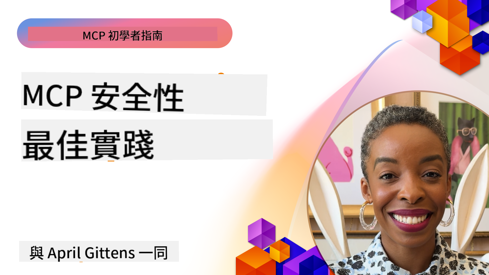

<!--
CO_OP_TRANSLATOR_METADATA:
{
  "original_hash": "14830e7df8352430ce7654b70ad969e1",
  "translation_date": "2025-07-28T23:48:09+00:00",
  "source_file": "02-Security/README.md",
  "language_code": "hk"
}
-->
# 安全最佳實踐

_（點擊上方圖片觀看本課程的影片）_

採用模型上下文協議（MCP）為人工智能驅動的應用程式帶來了強大的新功能，但同時也引入了超越傳統軟件風險的獨特安全挑戰。除了已知的安全編碼、最小權限和供應鏈安全等問題外，MCP 和 AI 工作負載還面臨新的威脅，例如提示注入、工具中毒、動態工具修改、會話劫持、混淆代理攻擊以及令牌傳遞漏洞。如果未妥善管理，這些風險可能導致數據外洩、隱私洩露以及系統行為的意外變化。

本課程將探討與 MCP 相關的最重要的安全風險，包括身份驗證、授權、過多權限、間接提示注入、會話安全、混淆代理問題、令牌傳遞漏洞以及供應鏈漏洞，並提供可行的控制措施和最佳實踐來減輕這些風險。您還將學習如何利用 Microsoft 解決方案，例如 Prompt Shields、Azure Content Safety 和 GitHub Advanced Security 來加強您的 MCP 實施。通過理解和應用這些控制措施，您可以顯著降低安全漏洞的可能性，確保您的 AI 系統保持穩健和可信。

# 學習目標

完成本課程後，您將能夠：

- 識別並解釋模型上下文協議（MCP）引入的獨特安全風險，包括提示注入、工具中毒、過多權限、會話劫持、混淆代理問題、令牌傳遞漏洞以及供應鏈漏洞。
- 描述並應用有效的 MCP 安全風險緩解控制措施，例如強大的身份驗證、最小權限、安全令牌管理、會話安全控制以及供應鏈驗證。
- 理解並利用 Microsoft 解決方案，例如 Prompt Shields、Azure Content Safety 和 GitHub Advanced Security，來保護 MCP 和 AI 工作負載。
- 認識到驗證工具元數據、監控動態變更、防禦間接提示注入攻擊以及防止會話劫持的重要性。
- 將已建立的安全最佳實踐（例如安全編碼、伺服器加固和零信任架構）整合到您的 MCP 實施中，以降低安全漏洞的可能性和影響。

# MCP 安全控制

任何能夠訪問重要資源的系統都隱含著安全挑戰。這些安全挑戰通常可以通過正確應用基本的安全控制和概念來解決。由於 MCP 是新定義的協議，其規範正在快速變化，並隨著協議的演進而發展。最終，協議內的安全控制將會成熟，從而更好地與企業和已建立的安全架構及最佳實踐進行整合。

根據 [Microsoft Digital Defense Report](https://aka.ms/mddr) 發表的研究，98% 的已報告漏洞可以通過強大的安全衛生措施來防止。對於任何類型的漏洞，最好的保護措施是確保您的基線安全衛生、安全編碼最佳實踐和供應鏈安全到位——這些已被驗證的實踐仍然是降低安全風險的最有效方法。

讓我們來看看採用 MCP 時可以用來解決安全風險的一些方法。

> **注意：** 以下信息截至 **2025 年 5 月 29 日** 是正確的。MCP 協議正在不斷演進，未來的實施可能會引入新的身份驗證模式和控制措施。欲了解最新的更新和指導，請始終參考 [MCP 規範](https://spec.modelcontextprotocol.io/)、官方 [MCP GitHub 存儲庫](https://github.com/modelcontextprotocol) 和 [安全最佳實踐頁面](https://modelcontextprotocol.io/specification/draft/basic/security_best_practices)。

### 問題陳述
最初的 MCP 規範假設開發人員會自行編寫身份驗證伺服器。這需要對 OAuth 和相關安全約束的了解。MCP 伺服器充當 OAuth 2.0 授權伺服器，直接管理所需的用戶身份驗證，而不是將其委派給外部服務（例如 Microsoft Entra ID）。自 **2025 年 4 月 26 日** 起，MCP 規範的一次更新允許 MCP 伺服器將用戶身份驗證委派給外部服務。

### 風險
- MCP 伺服器中配置錯誤的授權邏輯可能導致敏感數據暴露和錯誤應用的訪問控制。
- 本地 MCP 伺服器上的 OAuth 令牌被盜。如果被盜，該令牌可以用來冒充 MCP 伺服器並訪問該令牌所對應的服務和數據。

#### 令牌傳遞
令牌傳遞在授權規範中被明確禁止，因為它引入了多種安全風險，包括：

#### 安全控制繞過
MCP 伺服器或下游 API 可能實施了依賴於令牌受眾或其他憑據約束的重要安全控制，例如速率限制、請求驗證或流量監控。如果客戶端可以直接獲取並使用令牌與下游 API 交互，而 MCP 伺服器未正確驗證它們或確保令牌是為正確的服務發行的，這些控制措施將被繞過。

#### 責任和審計問題
當客戶端使用上游發行的訪問令牌（可能對 MCP 伺服器來說是不可見的）進行調用時，MCP 伺服器將無法識別或區分 MCP 客戶端。
下游資源伺服器的日誌可能顯示來自不同來源的請求，而非實際轉發令牌的 MCP 伺服器。
這兩個因素都使得事件調查、控制和審計更加困難。
如果 MCP 伺服器在未驗證令牌聲明（例如角色、權限或受眾）或其他元數據的情況下傳遞令牌，持有被盜令牌的惡意行為者可以利用伺服器作為代理進行數據外洩。

#### 信任邊界問題
下游資源伺服器對特定實體授予信任。這種信任可能包括對來源或客戶端行為模式的假設。打破這種信任邊界可能導致意外問題。
如果令牌在未經適當驗證的情況下被多個服務接受，攻擊者可以通過攻破一個服務來使用該令牌訪問其他連接的服務。

#### 未來兼容性風險
即使 MCP 伺服器目前作為“純代理”運行，未來可能需要添加安全控制。從一開始就實施正確的令牌受眾分離可以更容易地演進安全模型。

### 緩解控制措施

**MCP 伺服器不得接受任何未明確為 MCP 伺服器發行的令牌**

- **審查並加強授權邏輯：** 仔細審核您的 MCP 伺服器的授權實現，確保只有預期的用戶和客戶端可以訪問敏感資源。實用指導請參考 [Azure API Management Your Auth Gateway For MCP Servers | Microsoft Community Hub](https://techcommunity.microsoft.com/blog/integrationsonazureblog/azure-api-management-your-auth-gateway-for-mcp-servers/4402690) 和 [Using Microsoft Entra ID To Authenticate With MCP Servers Via Sessions - Den Delimarsky](https://den.dev/blog/mcp-server-auth-entra-id-session/)。
- **強制執行安全令牌實踐：** 遵循 [Microsoft 的令牌驗證和生命周期最佳實踐](https://learn.microsoft.com/en-us/entra/identity-platform/access-tokens)，以防止訪問令牌的濫用並降低令牌重放或被盜的風險。
- **保護令牌存儲：** 始終安全地存儲令牌，並使用加密來保護其在靜態和傳輸中的安全。實施提示請參考 [使用安全令牌存儲並加密令牌](https://youtu.be/uRdX37EcCwg?si=6fSChs1G4glwXRy2)。

# MCP 伺服器的過多權限

### 問題陳述
MCP 伺服器可能被授予了對其訪問的服務/資源的過多權限。例如，作為 AI 銷售應用程式一部分的 MCP 伺服器連接到企業數據存儲時，應將其訪問範圍限制在銷售數據，而不應允許訪問存儲中的所有文件。回到最小權限原則（最古老的安全原則之一），任何資源的權限都不應超出其執行預期任務所需的範圍。AI 在這方面帶來了更大的挑戰，因為為了使其具有靈活性，可能很難準確定義所需的權限。

### 風險
- 授予過多權限可能允許 MCP 伺服器外洩或修改其不應能訪問的數據。如果數據是個人身份信息（PII），這也可能成為隱私問題。

### 緩解控制措施
- **應用最小權限原則：** 僅授予 MCP 伺服器執行其所需任務的最低權限。定期審查並更新這些權限，確保它們不超出所需範圍。詳細指導請參考 [安全的最小權限訪問](https://learn.microsoft.com/entra/identity-platform/secure-least-privileged-access)。
- **使用基於角色的訪問控制（RBAC）：** 為 MCP 伺服器分配嚴格範圍的角色，僅限於特定資源和操作，避免廣泛或不必要的權限。
- **監控和審核權限：** 持續監控權限使用情況，並審核訪問日誌，及時檢測和修正過多或未使用的權限。

# 間接提示注入攻擊

### 問題陳述

惡意或被攻擊的 MCP 伺服器可能通過暴露客戶數據或啟用非預期操作引入重大風險。這些風險在基於 AI 和 MCP 的工作負載中特別相關，例如：

- **提示注入攻擊：** 攻擊者將惡意指令嵌入提示或外部內容中，導致 AI 系統執行非預期操作或洩露敏感數據。了解更多：[提示注入](https://simonwillison.net/2025/Apr/9/mcp-prompt-injection/)
- **工具中毒：** 攻擊者操縱工具元數據（例如描述或參數），影響 AI 的行為，可能繞過安全控制或外洩數據。詳情：[工具中毒](https://invariantlabs.ai/blog/mcp-security-notification-tool-poisoning-attacks)
- **跨域提示注入：** 惡意指令嵌入在文檔、網頁或電子郵件中，然後被 AI 處理，導致數據洩露或操縱。
- **動態工具修改（Rug Pulls）：** 工具定義在用戶批准後可以被更改，引入新的惡意行為而用戶無法察覺。

這些漏洞突顯了在將 MCP 伺服器和工具整合到您的環境中時，進行強大驗證、監控和安全控制的必要性。欲深入了解，請參考上述鏈接。

**間接提示注入**（也稱為跨域提示注入或 XPIA）是生成式 AI 系統（包括使用模型上下文協議（MCP）的系統）中的一個關鍵漏洞。在此攻擊中，惡意指令隱藏在外部內容中，例如文檔、網頁或電子郵件。當 AI 系統處理這些內容時，可能將嵌入的指令解釋為合法的用戶命令，導致非預期操作，例如數據洩露、生成有害內容或操縱用戶交互。欲了解詳細解釋和實際案例，請參考 [提示注入](https://simonwillison.net/2025/Apr/9/mcp-prompt-injection/)。

一種特別危險的攻擊形式是 **工具中毒**。在這種情況下，攻擊者將惡意指令注入 MCP 工具的元數據中（例如工具描述或參數）。由於大型語言模型（LLM）依賴這些元數據來決定調用哪些工具，受損的描述可以欺騙模型執行未經授權的工具調用或繞過安全控制。這些操縱通常對最終用戶是不可見的，但可以被 AI 系統解釋並執行。在託管的 MCP 伺服器環境中，這種風險更高，因為工具定義可以在用戶批准後更新——這種情況有時被稱為“[rug pull](https://www.wiz.io/blog/mcp-security-research-briefing#remote-servers-22)”。在這種情況下，之前安全的工具可能後來被修改為執行惡意操作，例如數據外洩或更改系統行為，而用戶毫不知情。欲了解更多此攻擊向量，請參考 [工具中毒](https://invariantlabs.ai/blog/mcp-security-notification-tool-poisoning-attacks)。

## 風險
非預期的 AI 行為帶來多種安全風險，包括數據外洩和隱私洩露。

### 緩解控制措施
### 使用 Prompt Shields 防禦間接提示注入攻擊
-----------------------------------------------------------------------------

**AI Prompt Shields** 是 Microsoft 開發的一種解決方案，用於防禦直接和間接提示注入攻擊。其功能包括：

1.  **檢測和過濾：** Prompt Shields 使用先進的機器學習算法和自然語言處理技術，檢測並過濾嵌入在外部內容（如文檔、網頁或電子郵件）中的惡意指令。
    
2.  **聚焦技術（Spotlighting）：** 該技術幫助 AI 系統區分有效的系統指令和可能不可信的外部輸入。通過轉換輸入文本，使其對模型更具相關性，聚焦技術確保 AI 能更好地識別並忽略惡意指令。
    
3.  **分隔符和數據標記（Datamarking）：** 在系統消息中包含分隔符，明確指出輸入文本的位置，幫助 AI 系統識別並分離用戶輸入與可能有害的外部內容。數據標記進一步擴展了這一概念，使用特殊標記來突出顯示可信和不可信數據的邊界。
    
4.  **持續監控和更新：** Microsoft 持續監控並更新 Prompt Shields，以應對新出現和不斷演變的威脅。這種主動方法確保防禦措施對最新的攻擊技術仍然有效。
    
5. **與 Azure Content Safety 的整合：** Prompt Shields 是更廣泛的 Azure AI Content Safety 套件的一部分，該套件提供其他工具，用於檢測越獄嘗試、有害內容以及 AI 應用中的其他安全風險。

您可以在 [Prompt Shields 文檔](https://learn.microsoft.com/azure/ai-services/content-safety/concepts/jailbreak-detection) 中閱讀更多有關 AI Prompt Shields 的信息。

# 混淆代理問題

### 問題描述

混淆代理問題是一種安全漏洞，當 MCP 伺服器作為 MCP 客戶端與第三方 API 之間的代理時可能發生。當 MCP 伺服器使用靜態客戶端 ID 與不支持動態客戶端註冊的第三方授權伺服器進行身份驗證時，這種漏洞可能被利用。

### 風險

- **基於 Cookie 的同意繞過**：如果用戶之前已通過 MCP 代理伺服器進行身份驗證，第三方授權伺服器可能會在用戶的瀏覽器中設置同意 Cookie。攻擊者可以通過發送包含惡意重定向 URI 的授權請求鏈接來利用這一點。
- **授權碼竊取**：當用戶點擊惡意鏈接時，第三方授權伺服器可能因現有的 Cookie 而跳過同意屏幕，授權碼可能被重定向到攻擊者的伺服器。
- **未經授權的 API 訪問**：攻擊者可以使用被竊取的授權碼交換訪問令牌，冒充用戶訪問第三方 API，而無需明確批准。

### 緩解措施

- **明確的同意要求**：使用靜態客戶端 ID 的 MCP 代理伺服器在轉發到第三方授權伺服器之前，**必須**為每個動態註冊的客戶端獲得用戶同意。
- **正確的 OAuth 實施**：遵循 OAuth 2.1 的安全最佳實踐，包括在授權請求中使用代碼挑戰（PKCE）以防止攔截攻擊。
- **客戶端驗證**：實施嚴格的重定向 URI 和客戶端標識符驗證，以防止惡意行為者的利用。

# 令牌透傳漏洞

### 問題描述

“令牌透傳”是一種反模式，當 MCP 伺服器接受來自 MCP 客戶端的令牌而不驗證這些令牌是否正確地發行給 MCP 伺服器本身，然後將它們“透傳”到下游 API 時，會引入嚴重的安全風險，並明顯違反 MCP 授權規範。

### 風險

- **繞過安全控制**：如果客戶端可以直接使用令牌與下游 API 交互而無需適當驗證，則可能繞過重要的安全控制，例如速率限制、請求驗證或流量監控。
- **責任與審計問題**：當客戶端使用上游發行的訪問令牌時，MCP 伺服器將無法識別或區分 MCP 客戶端，從而使事件調查和審計更加困難。
- **數據外洩**：如果令牌在未經適當聲明驗證的情況下被透傳，擁有被竊取令牌的惡意行為者可能利用伺服器作為代理進行數據外洩。
- **信任邊界違反**：下游資源伺服器可能基於來源或行為模式對特定實體授予信任。破壞這種信任邊界可能導致意想不到的安全問題。
- **多服務令牌濫用**：如果多個服務在未經適當驗證的情況下接受令牌，攻擊者在攻陷一個服務後可能利用該令牌訪問其他連接的服務。

### 緩解措施

- **令牌驗證**：MCP 伺服器**不得**接受任何未明確發行給 MCP 伺服器本身的令牌。
- **受眾驗證**：始終驗證令牌是否具有與 MCP 伺服器身份匹配的正確受眾聲明。
- **正確的令牌生命周期管理**：實施短期訪問令牌和適當的令牌輪換實踐，以減少令牌被竊取和濫用的風險。

# 會話劫持

### 問題描述

會話劫持是一種攻擊向量，當伺服器向客戶端提供會話 ID，而未經授權的一方獲取並使用相同的會話 ID 冒充原始客戶端執行未經授權的操作時，會發生這種情況。這在處理 MCP 請求的有狀態 HTTP 伺服器中特別令人擔憂。

### 風險

- **會話劫持提示注入**：獲取會話 ID 的攻擊者可能向與客戶端連接的伺服器共享會話狀態的伺服器發送惡意事件，可能觸發有害操作或訪問敏感數據。
- **會話劫持冒充**：擁有被竊取會話 ID 的攻擊者可以直接向 MCP 伺服器發出請求，繞過身份驗證並被視為合法用戶。
- **受損的可恢復流**：當伺服器支持重新傳遞/可恢復流時，攻擊者可能提前終止請求，導致原始客戶端稍後恢復請求時可能包含惡意內容。

### 緩解措施

- **授權驗證**：實施授權的 MCP 伺服器**必須**驗證所有入站請求，並且**不得**使用會話進行身份驗證。
- **安全的會話 ID**：MCP 伺服器**必須**使用安全的、非確定性的會話 ID，並通過安全隨機數生成器生成。避免使用可預測或順序的標識符。
- **用戶特定的會話綁定**：MCP 伺服器**應**將會話 ID 綁定到用戶特定的信息，通過結合會話 ID 和授權用戶的唯一信息（例如內部用戶 ID）來生成格式如 `<user_id>:<session_id>` 的會話標識。
- **會話過期**：實施適當的會話過期和輪換，以限制會話 ID 被劫持後的漏洞窗口。
- **傳輸安全**：始終使用 HTTPS 進行所有通信，以防止會話 ID 被攔截。

# 供應鏈安全

在 AI 時代，供應鏈安全仍然至關重要，但供應鏈的範圍已經擴展。除了傳統的代碼包，您現在還必須嚴格驗證和監控所有與 AI 相關的組件，包括基礎模型、嵌入服務、上下文提供者和第三方 API。如果管理不當，每一個都可能引入漏洞或風險。

**AI 和 MCP 的關鍵供應鏈安全實踐：**
- **在集成之前驗證所有組件**：這不僅包括開源庫，還包括 AI 模型、數據來源和外部 API。始終檢查來源、許可證和已知漏洞。
- **維護安全的部署管道**：使用集成安全掃描的自動化 CI/CD 管道，及早發現問題。確保只有受信任的工件被部署到生產環境。
- **持續監控和審計**：對所有依賴項（包括模型和數據服務）實施持續監控，以檢測新的漏洞或供應鏈攻擊。
- **應用最小權限和訪問控制**：限制對模型、數據和服務的訪問，僅限於 MCP 伺服器運行所需的內容。
- **快速應對威脅**：制定應對計劃，以便在發現漏洞時修補或替換受影響的組件，並輪換密鑰或憑據。

[GitHub Advanced Security](https://github.com/security/advanced-security) 提供了如密鑰掃描、依賴性掃描和 CodeQL 分析等功能。這些工具與 [Azure DevOps](https://azure.microsoft.com/en-us/products/devops) 和 [Azure Repos](https://azure.microsoft.com/en-us/products/devops/repos/) 集成，幫助團隊識別並減輕代碼和 AI 供應鏈組件中的漏洞。

Microsoft 也在所有產品中實施了廣泛的供應鏈安全實踐。了解更多：[The Journey to Secure the Software Supply Chain at Microsoft](https://devblogs.microsoft.com/engineering-at-microsoft/the-journey-to-secure-the-software-supply-chain-at-microsoft/)。

# 提升 MCP 實施安全性的既定安全最佳實踐

任何 MCP 實施都繼承了其所構建的組織環境的現有安全狀態，因此在考慮 MCP 作為整體 AI 系統的一部分時，建議提升整體現有的安全狀態。以下既定的安全控制尤其重要：

- 在 AI 應用中實施安全編碼最佳實踐——防範 [OWASP Top 10](https://owasp.org/www-project-top-ten/)、[OWASP Top 10 for LLMs](https://genai.owasp.org/download/43299/?tmstv=1731900559)，使用安全保管庫存儲密鑰和令牌，實現應用組件之間的端到端安全通信等。
- 伺服器加固——使用多因素身份驗證（MFA），保持補丁更新，將伺服器與第三方身份提供者集成以進行訪問控制等。
- 保持設備、基礎設施和應用的補丁更新。
- 安全監控——實施 AI 應用（包括 MCP 客戶端/伺服器）的日誌記錄和監控，並將這些日誌發送到中央 SIEM 以檢測異常活動。
- 零信任架構——通過網絡和身份控制以邏輯方式隔離組件，從而在 AI 應用被攻擊時最小化橫向移動。

# 關鍵要點

- 安全基礎仍然至關重要：安全編碼、最小權限、供應鏈驗證和持續監控對 MCP 和 AI 工作負載至關重要。
- MCP 引入了新的風險——例如提示注入、工具中毒、會話劫持、混淆代理問題、令牌透傳漏洞和過度權限——需要傳統和 AI 特定的控制措施。
- 使用強大的身份驗證、授權和令牌管理實踐，盡可能利用外部身份提供者（如 Microsoft Entra ID）。
- 防範間接提示注入和工具中毒，通過驗證工具元數據、監控動態更改以及使用 Microsoft Prompt Shields 等解決方案。
- 通過使用非確定性會話 ID、將會話綁定到用戶身份以及避免使用會話進行身份驗證來實現安全的會話管理。
- 通過要求每個動態註冊的客戶端獲得明確的用戶同意並實施正確的 OAuth 安全實踐來防止混淆代理攻擊。
- 通過確保 MCP 伺服器僅接受明確為其發行的令牌並適當驗證令牌聲明來避免令牌透傳漏洞。
- 對 AI 供應鏈中的所有組件（包括模型、嵌入和上下文提供者）採取與代碼依賴項相同的嚴格標準。
- 緊跟 MCP 規範的發展，並為社區做出貢獻，以幫助制定安全標準。

# 附加資源

## 外部資源
- [Microsoft Digital Defense Report](https://aka.ms/mddr)
- [MCP Specification](https://spec.modelcontextprotocol.io/)
- [MCP Security Best Practices](https://modelcontextprotocol.io/specification/draft/basic/security_best_practices)
- [MCP Authorization Specification](https://modelcontextprotocol.io/specification/draft/basic/authorization)
- [OAuth 2.0 Security Best Practices (RFC 9700)](https://datatracker.ietf.org/doc/html/rfc9700)
- [Prompt Injection in MCP (Simon Willison)](https://simonwillison.net/2025/Apr/9/mcp-prompt-injection/)
- [Tool Poisoning Attacks (Invariant Labs)](https://invariantlabs.ai/blog/mcp-security-notification-tool-poisoning-attacks)
- [Rug Pulls in MCP (Wiz Security)](https://www.wiz.io/blog/mcp-security-research-briefing#remote-servers-22)
- [Prompt Shields Documentation (Microsoft)](https://learn.microsoft.com/azure/ai-services/content-safety/concepts/jailbreak-detection)
- [OWASP Top 10](https://owasp.org/www-project-top-ten/)
- [OWASP Top 10 for LLMs](https://genai.owasp.org/download/43299/?tmstv=1731900559)
- [GitHub Advanced Security](https://github.com/security/advanced-security)
- [Azure DevOps](https://azure.microsoft.com/products/devops)
- [Azure Repos](https://azure.microsoft.com/products/devops/repos/)
- [The Journey to Secure the Software Supply Chain at Microsoft](https://devblogs.microsoft.com/engineering-at-microsoft/the-journey-to-secure-the-software-supply-chain-at-microsoft/)
- [Secure Least-Privileged Access (Microsoft)](https://learn.microsoft.com/entra/identity-platform/secure-least-privileged-access)
- [Best Practices for Token Validation and Lifetime](https://learn.microsoft.com/entra/identity-platform/access-tokens)
- [Use Secure Token Storage and Encrypt Tokens (YouTube)](https://youtu.be/uRdX37EcCwg?si=6fSChs1G4glwXRy2)
- [Azure API Management as Auth Gateway for MCP](https://techcommunity.microsoft.com/blog/integrationsonazureblog/azure-api-management-your-auth-gateway-for-mcp-servers/4402690)
- [Using Microsoft Entra ID to Authenticate with MCP Servers](https://den.dev/blog/mcp-server-auth-entra-id-session/)

## 附加安全文檔

如需更詳細的安全指導，請參考以下文檔：

- [MCP Security Best Practices 2025](./mcp-security-best-practices-2025.md) - MCP 實施的全面安全最佳實踐清單
- [Azure Content Safety Implementation](./azure-content-safety-implementation.md) - 將 Azure Content Safety 與 MCP 伺服器集成的實施示例
- [MCP Security Controls 2025](./mcp-security-controls-2025.md) - 最新的 MCP 部署安全控制和技術
- [MCP Best Practices](./mcp-best-practices.md) - MCP 安全的快速參考指南

### 下一步

下一步：[第 3 章：入門](../03-GettingStarted/README.md)

**免責聲明**：  
本文件已使用人工智能翻譯服務 [Co-op Translator](https://github.com/Azure/co-op-translator) 進行翻譯。儘管我們致力於提供準確的翻譯，但請注意，自動翻譯可能包含錯誤或不準確之處。原始語言的文件應被視為權威來源。對於重要資訊，建議尋求專業人工翻譯。我們對因使用此翻譯而引起的任何誤解或錯誤解釋概不負責。