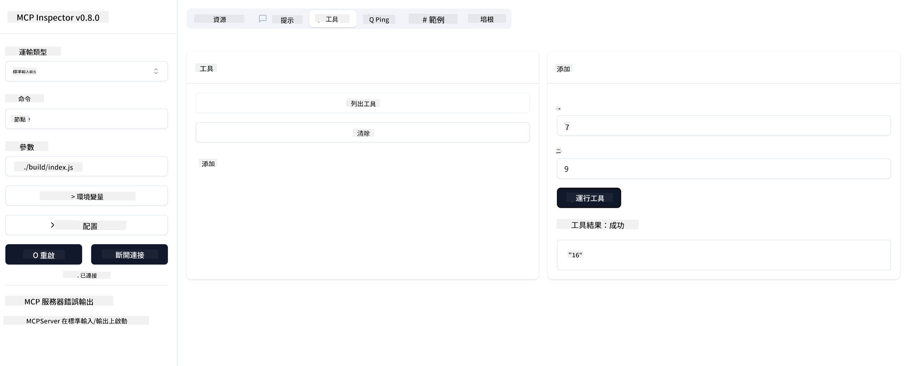

<!--
CO_OP_TRANSLATOR_METADATA:
{
  "original_hash": "5331ffd328a54b90f76706c52b673e27",
  "translation_date": "2025-05-17T08:24:02+00:00",
  "source_file": "03-GettingStarted/01-first-server/README.md",
  "language_code": "hk"
}
-->
# 開始使用 MCP

歡迎踏出使用 Model Context Protocol (MCP) 的第一步！無論你是 MCP 的新手，還是想深入了解的用戶，這份指南會帶領你完成基本的設置和開發過程。你將發現 MCP 如何讓 AI 模型和應用程式之間的整合變得無縫，並學習如何快速準備你的環境以構建和測試由 MCP 驅動的解決方案。

> 簡而言之；如果你構建 AI 應用程式，你知道你可以為你的 LLM（大型語言模型）添加工具和其他資源，以使 LLM 更加博學。然而，如果你將這些工具和資源放在伺服器上，任何客戶端都可以使用應用程式和伺服器功能，不論是否有 LLM。

## 概述

這節課提供了設置 MCP 環境和構建你的第一個 MCP 應用程式的實用指導。你將學習如何設置必要的工具和框架，構建基本的 MCP 伺服器，創建主機應用程式，並測試你的實施。

Model Context Protocol (MCP) 是一種開放協議，標準化了應用程式如何為 LLM 提供上下文。把 MCP 想像成 AI 應用程式的 USB-C 端口——它提供了一種標準化的方法來將 AI 模型連接到不同的數據源和工具。

## 學習目標

到這節課結束時，你將能夠：

- 設置 C#、Java、Python、TypeScript 和 JavaScript 的 MCP 開發環境
- 構建和部署具有自定義功能（資源、提示和工具）的基本 MCP 伺服器
- 創建連接到 MCP 伺服器的主機應用程式
- 測試和調試 MCP 實施

## 設置你的 MCP 環境

在開始使用 MCP 之前，準備好你的開發環境並理解基本工作流程是很重要的。本節將引導你完成初步設置步驟，以確保順利開始使用 MCP。

### 先決條件

在深入 MCP 開發之前，確保你已經：

- **開發環境**：選擇你的語言（C#、Java、Python、TypeScript 或 JavaScript）
- **IDE/編輯器**：Visual Studio、Visual Studio Code、IntelliJ、Eclipse、PyCharm 或任何現代代碼編輯器
- **包管理器**：NuGet、Maven/Gradle、pip 或 npm/yarn
- **API 密鑰**：用於你計劃在主機應用程式中使用的任何 AI 服務

## 基本 MCP 伺服器結構

一個 MCP 伺服器通常包括：

- **伺服器配置**：設置端口、身份驗證和其他設置
- **資源**：提供給 LLM 的數據和上下文
- **工具**：模型可以調用的功能
- **提示**：生成或結構化文本的模板

以下是一個簡化的 TypeScript 示例：

```typescript
import { Server, Tool, Resource } from "@modelcontextprotocol/typescript-server-sdk";

// Create a new MCP server
const server = new Server({
  port: 3000,
  name: "Example MCP Server",
  version: "1.0.0"
});

// Register a tool
server.registerTool({
  name: "calculator",
  description: "Performs basic calculations",
  parameters: {
    expression: {
      type: "string",
      description: "The math expression to evaluate"
    }
  },
  handler: async (params) => {
    const result = eval(params.expression);
    return { result };
  }
});

// Start the server
server.start();
```

在上述代碼中，我們：

- 從 MCP TypeScript SDK 中導入必要的類。
- 創建並配置一個新的 MCP 伺服器實例。
- 註冊一個具有處理函數的自定義工具（`calculator`）。
- 啟動伺服器以接收來自 MCP 的請求。

## 測試和調試

在開始測試你的 MCP 伺服器之前，了解可用工具和調試的最佳做法是很重要的。有效的測試可以確保你的伺服器按預期運行，並幫助你快速識別和解決問題。以下部分概述了驗證你的 MCP 實施的建議方法。

MCP 提供工具來幫助你測試和調試你的伺服器：

- **檢查工具**，這個圖形界面允許你連接到你的伺服器並測試你的工具、提示和資源。
- **curl**，你也可以使用像 curl 這樣的命令行工具或其他可以創建和運行 HTTP 命令的客戶端來連接到你的伺服器。

### 使用 MCP 檢查器

[MCP 檢查器](https://github.com/modelcontextprotocol/inspector) 是一個視覺化的測試工具，可以幫助你：

1. **發現伺服器功能**：自動檢測可用的資源、工具和提示
2. **測試工具執行**：嘗試不同的參數並即時查看響應
3. **查看伺服器元數據**：檢查伺服器信息、模式和配置

```bash
# ex TypeScript, installing and running MCP Inspector
npx @modelcontextprotocol/inspector node build/index.js
```

當你運行上述命令時，MCP 檢查器將在你的瀏覽器中啟動一個本地網頁介面。你可以預期看到一個儀表板，顯示你註冊的 MCP 伺服器、它們可用的工具、資源和提示。這個介面允許你互動式地測試工具執行、檢查伺服器元數據和查看即時響應，這使得驗證和調試你的 MCP 伺服器實施變得更容易。

以下是一個可能的界面截圖：


## 常見設置問題及解決方案

| 問題 | 可能的解決方案 |
|-------|-------------------|
| 連接被拒絕 | 檢查伺服器是否運行以及端口是否正確 |
| 工具執行錯誤 | 查看參數驗證和錯誤處理 |
| 身份驗證失敗 | 驗證 API 密鑰和權限 |
| 模式驗證錯誤 | 確保參數符合定義的模式 |
| 伺服器未啟動 | 檢查端口衝突或缺少依賴項 |
| CORS 錯誤 | 為跨域請求配置適當的 CORS 標頭 |
| 身份驗證問題 | 驗證令牌的有效性和權限 |

## 本地開發

對於本地開發和測試，你可以直接在你的機器上運行 MCP 伺服器：

1. **啟動伺服器進程**：運行你的 MCP 伺服器應用程式
2. **配置網絡**：確保伺服器在預期的端口上可訪問
3. **連接客戶端**：使用本地連接 URL，如 `http://localhost:3000`

```bash
# Example: Running a TypeScript MCP server locally
npm run start
# Server running at http://localhost:3000
```

## 構建你的第一個 MCP 伺服器

我們在之前的課程中已經覆蓋了[核心概念](/01-CoreConcepts/README.md)，現在是時候將這些知識付諸實踐。

### 伺服器可以做什麼

在我們開始編寫代碼之前，讓我們提醒自己伺服器可以做什麼：

一個 MCP 伺服器可以，例如：

- 訪問本地文件和數據庫
- 連接到遠程 API
- 執行計算
- 與其他工具和服務集成
- 提供用戶界面進行交互

很好，既然我們知道它能做什麼，讓我們開始編碼吧。

## 練習：創建伺服器

要創建伺服器，你需要遵循以下步驟：

- 安裝 MCP SDK。
- 創建一個項目並設置項目結構。
- 編寫伺服器代碼。
- 測試伺服器。

### -1- 安裝 SDK

這根據你選擇的運行時有所不同，所以選擇以下運行時之一：

生成式 AI 可以生成文本、圖像，甚至代碼。你的訓練數據截至到 2023 年 10 月。

### -2- 創建項目

現在你已經安裝了 SDK，讓我們接下來創建一個項目：

### -3- 創建項目文件

### -4- 創建伺服器代碼

### -5- 添加工具和資源

通過添加以下代碼來添加工具和資源：

### -6- 最終代碼

讓我們添加伺服器啟動所需的最後代碼：

### -7- 測試伺服器

使用以下命令啟動伺服器：

### -8- 使用檢查器運行

檢查器是一個很棒的工具，可以啟動你的伺服器並讓你與它交互，以便你測試它是否有效。讓我們啟動它：

> [!NOTE]
> 它在“命令”字段中可能看起來不同，因為它包含運行伺服器的命令，具體取決於你的運行時。

你應該看到以下用戶界面：


1. 通過選擇連接按鈕連接到伺服器
  一旦你連接到伺服器，你應該會看到以下內容：

  

1. 選擇“工具”和“listTools”，你應該看到“Add”出現，選擇“Add”並填寫參數值。

  你應該會看到以下響應，即來自“add”工具的結果：

  

恭喜，你成功創建並運行了你的第一個伺服器！

### 官方 SDK

MCP 為多種語言提供官方 SDK：
- [C# SDK](https://github.com/modelcontextprotocol/csharp-sdk) - 與 Microsoft 合作維護
- [Java SDK](https://github.com/modelcontextprotocol/java-sdk) - 與 Spring AI 合作維護
- [TypeScript SDK](https://github.com/modelcontextprotocol/typescript-sdk) - 官方 TypeScript 實現
- [Python SDK](https://github.com/modelcontextprotocol/python-sdk) - 官方 Python 實現
- [Kotlin SDK](https://github.com/modelcontextprotocol/kotlin-sdk) - 官方 Kotlin 實現
- [Swift SDK](https://github.com/modelcontextprotocol/swift-sdk) - 與 Loopwork AI 合作維護
- [Rust SDK](https://github.com/modelcontextprotocol/rust-sdk) - 官方 Rust 實現

## 關鍵要點

- 使用特定語言的 SDK 設置 MCP 開發環境是簡單的
- 構建 MCP 伺服器涉及創建和註冊具有明確模式的工具
- 測試和調試對於可靠的 MCP 實施至關重要

## 示例

- [Java 計算器](../samples/java/calculator/README.md)
- [.Net 計算器](../../../../03-GettingStarted/samples/csharp)
- [JavaScript 計算器](../samples/javascript/README.md)
- [TypeScript 計算器](../samples/typescript/README.md)
- [Python 計算器](../../../../03-GettingStarted/samples/python)

## 作業

創建一個具有你選擇工具的簡單 MCP 伺服器：
1. 在你首選的語言中實現該工具（.NET、Java、Python 或 JavaScript）。
2. 定義輸入參數和返回值。
3. 運行檢查器工具以確保伺服器正常運行。
4. 使用各種輸入測試實施。

## 解決方案

[解決方案](./solution/README.md)

## 其他資源

- [MCP GitHub 存儲庫](https://github.com/microsoft/mcp-for-beginners)

## 接下來

接下來：[開始使用 MCP 客戶端](/03-GettingStarted/02-client/README.md)

**免責聲明**：
本文件已使用AI翻譯服務[Co-op Translator](https://github.com/Azure/co-op-translator)進行翻譯。我們力求準確，但請注意，自動翻譯可能包含錯誤或不準確之處。原始文件的母語版本應被視為權威來源。對於關鍵信息，建議使用專業人工翻譯。我們對使用此翻譯引起的任何誤解或誤釋不承擔責任。