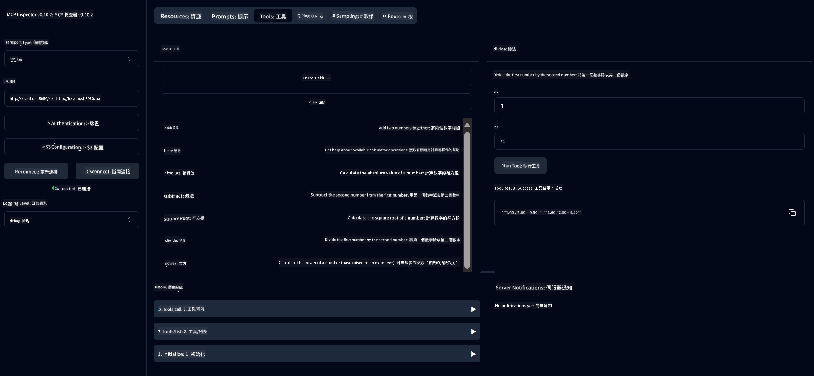

<!--
CO_OP_TRANSLATOR_METADATA:
{
  "original_hash": "ed9cab32cc67c12d8969b407aa47100a",
  "translation_date": "2025-07-13T17:52:38+00:00",
  "source_file": "03-GettingStarted/01-first-server/solution/java/README.md",
  "language_code": "hk"
}
-->
# Basic Calculator MCP Service

此服務透過 Model Context Protocol (MCP) 及 Spring Boot 的 WebFlux 傳輸，提供基本計算機運算功能。它是為初學者設計的簡單範例，方便了解 MCP 的實作方式。

更多資訊請參考 [MCP Server Boot Starter](https://docs.spring.io/spring-ai/reference/api/mcp/mcp-server-boot-starter-docs.html) 參考文件。

## 使用服務

此服務透過 MCP 協議公開以下 API 端點：

- `add(a, b)`：將兩個數字相加
- `subtract(a, b)`：從第一個數字中減去第二個數字
- `multiply(a, b)`：將兩個數字相乘
- `divide(a, b)`：將第一個數字除以第二個數字（含零值檢查）
- `power(base, exponent)`：計算次方
- `squareRoot(number)`：計算平方根（含負數檢查）
- `modulus(a, b)`：計算除法餘數
- `absolute(number)`：計算絕對值

## 依賴項目

此專案需要以下主要依賴：

```xml
<dependency>
    <groupId>org.springframework.ai</groupId>
    <artifactId>spring-ai-starter-mcp-server-webflux</artifactId>
</dependency>
```

## 建置專案

使用 Maven 建置專案：
```bash
./mvnw clean install -DskipTests
```

## 啟動伺服器

### 使用 Java

```bash
java -jar target/calculator-server-0.0.1-SNAPSHOT.jar
```

### 使用 MCP Inspector

MCP Inspector 是一個方便與 MCP 服務互動的工具。使用此計算機服務時，請依照以下步驟：

1. **安裝並啟動 MCP Inspector**，在新終端機視窗執行：
   ```bash
   npx @modelcontextprotocol/inspector
   ```

2. **透過應用程式顯示的網址（通常是 http://localhost:6274）存取網頁介面**

3. **設定連線**：
   - 將傳輸類型設為「SSE」
   - 將 URL 設為您正在執行的伺服器 SSE 端點：`http://localhost:8080/sse`
   - 點擊「Connect」

4. **使用工具**：
   - 點擊「List Tools」查看可用的計算機操作
   - 選擇工具後點擊「Run Tool」執行操作



**免責聲明**：  
本文件乃使用 AI 翻譯服務 [Co-op Translator](https://github.com/Azure/co-op-translator) 進行翻譯。雖然我們致力於確保準確性，但請注意，自動翻譯可能包含錯誤或不準確之處。原始文件的母語版本應被視為權威來源。對於重要資訊，建議採用專業人工翻譯。我們不對因使用本翻譯而引起的任何誤解或誤釋承擔責任。