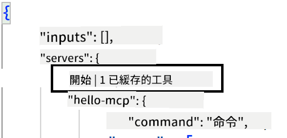
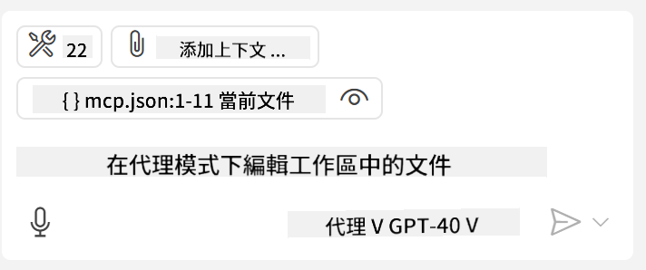
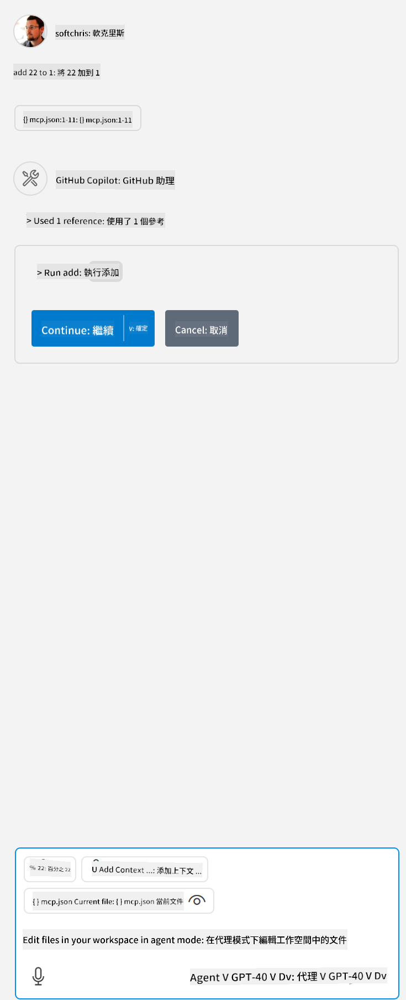

<!--
CO_OP_TRANSLATOR_METADATA:
{
  "original_hash": "c37fabfbc0dcbc9a4afb6d17e7d3be9f",
  "translation_date": "2025-05-17T11:02:44+00:00",
  "source_file": "03-GettingStarted/04-vscode/README.md",
  "language_code": "hk"
}
-->
讓我們在接下來的部分詳細討論如何使用視覺介面。

## 方法

以下是我們需要在高層次上採取的方法：

- 配置一個文件來找到我們的 MCP 伺服器。
- 啟動/連接到所述伺服器以列出其功能。
- 通過 GitHub Copilot 的聊天介面使用所述功能。

很好，現在我們了解了流程，讓我們通過一個練習來嘗試使用 MCP 伺服器通過 Visual Studio Code。

## 練習：使用伺服器

在這個練習中，我們將配置 Visual Studio Code 以找到您的 MCP 伺服器，使其可以通過 GitHub Copilot 的聊天介面使用。

### -0- 預備步驟，啟用 MCP 伺服器發現

您可能需要啟用 MCP 伺服器的發現。

1. 在 settings.json 文件中，前往 `File -> Preferences -> Settings` in Visual Studio Code.

1. Search for "MCP" and enable `chat.mcp.discovery.enabled`。

### -1- 創建配置文件

首先在您的項目根目錄中創建一個配置文件，您需要一個名為 MCP.json 的文件，並將其放置在名為 .vscode 的文件夾中。應如下所示：

```text
.vscode
|-- mcp.json
```

接下來，讓我們看看如何添加伺服器條目。

### -2- 配置伺服器

將以下內容添加到 *mcp.json*：

```json
{
    "inputs": [],
    "servers": {
       "hello-mcp": {
           "command": "cmd",
           "args": [
               "/c", "node", "<absolute path>\\build\\index.js"
           ]
       }
    }
}
```

上面是一個簡單的示例，如何啟動一個用 Node.js 編寫的伺服器，對於其他運行時，指出使用 `command` and `args` 啟動伺服器的正確命令。

### -3- 啟動伺服器

現在您已經添加了一個條目，讓我們啟動伺服器：

1. 在 *mcp.json* 中找到您的條目，並確保找到 "播放" 圖標：

    

1. 點擊 "播放" 圖標，您應該會看到 GitHub Copilot 聊天中的工具圖標增加可用工具的數量。如果您點擊所述工具圖標，您將看到已註冊工具的列表。您可以根據是否希望 GitHub Copilot 使用它們作為上下文來檢查/取消檢查每個工具：

  

1. 要運行工具，輸入一個您知道會匹配您工具描述的提示，例如 "add 22 to 1"：

  

  您應該會看到一個回應說 23。

## 作業

嘗試向您的 *mcp.json* 文件添加一個伺服器條目，並確保您可以啟動/停止伺服器。確保您還可以通過 GitHub Copilot 的聊天介面與伺服器上的工具通信。

## 解決方案

[解決方案](./solution/README.md)

## 主要收穫

本章的收穫如下：

- Visual Studio Code 是一個很棒的客戶端，讓您可以使用多個 MCP 伺服器及其工具。
- GitHub Copilot 的聊天介面是您與伺服器互動的方式。
- 您可以提示用戶輸入，例如 API 密鑰，可以在配置伺服器條目時傳遞給 MCP 伺服器。

## 範例

- [Java 計算器](../samples/java/calculator/README.md)
- [.Net 計算器](../../../../03-GettingStarted/samples/csharp)
- [JavaScript 計算器](../samples/javascript/README.md)
- [TypeScript 計算器](../samples/typescript/README.md)
- [Python 計算器](../../../../03-GettingStarted/samples/python) 

## 附加資源

- [Visual Studio 文檔](https://code.visualstudio.com/docs/copilot/chat/mcp-servers)

## 下一步

- 下一步：[創建 SSE 伺服器](/03-GettingStarted/05-sse-server/README.md)

**免責聲明**：
本文件已使用AI翻譯服務[Co-op Translator](https://github.com/Azure/co-op-translator)進行翻譯。儘管我們努力確保準確性，請注意自動翻譯可能包含錯誤或不準確之處。原始文件的本地語言版本應被視為權威來源。對於關鍵信息，建議使用專業人工翻譯。我們對於使用此翻譯而產生的任何誤解或誤釋不承擔責任。