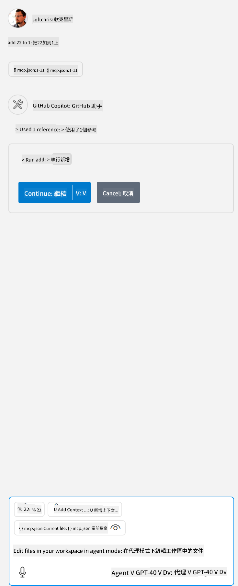

<!--
CO_OP_TRANSLATOR_METADATA:
{
  "original_hash": "5ef8f5821c1a04f7b1fc4f15098ecab8",
  "translation_date": "2025-07-13T19:39:56+00:00",
  "source_file": "03-GettingStarted/04-vscode/solution/README.md",
  "language_code": "hk"
}
-->
這相當於執行以下命令：`node build/index.js`。

- 根據你的伺服器檔案位置或所選的執行環境與伺服器位置，修改此 server 項目以符合啟動伺服器所需的完整命令。

## 在伺服器中使用功能

- 將 *mcp.json* 加入到 *./vscode* 資料夾後，點擊 `play` 圖示，

    你會看到工具圖示變化，表示可用工具數量增加。工具圖示位於 GitHub Copilot 聊天欄正上方。

## 執行工具

- 在聊天視窗輸入符合工具描述的提示。例如，要觸發 `add` 工具，可以輸入「add 3 to 20」。

    你應該會看到工具顯示在聊天文字框上方，提示你選擇執行該工具，如下圖所示：

    

    選擇該工具後，如果你的提示如前所述，應該會得到數字結果「23」。

**免責聲明**：  
本文件由 AI 翻譯服務 [Co-op Translator](https://github.com/Azure/co-op-translator) 進行翻譯。雖然我們致力於確保準確性，但請注意自動翻譯可能包含錯誤或不準確之處。原始文件的母語版本應被視為權威來源。對於重要資訊，建議採用專業人工翻譯。我們不對因使用本翻譯而引起的任何誤解或誤釋承擔責任。