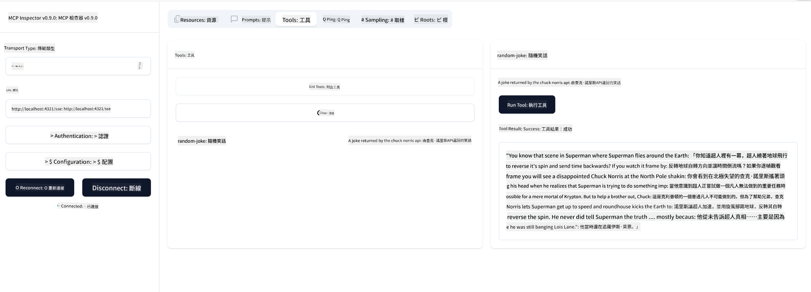

<!--
CO_OP_TRANSLATOR_METADATA:
{
  "original_hash": "3dd2f1e39277c31b0e57e29d165354d6",
  "translation_date": "2025-06-12T21:28:14+00:00",
  "source_file": "03-GettingStarted/05-sse-server/README.md",
  "language_code": "hk"
}
-->
而家我哋對 SSE 有多啲了解，下一步就嚟建立一個 SSE 伺服器。

## 練習：建立 SSE 伺服器

建立伺服器時，我哋需要記住兩樣嘢：

- 需要用一個網頁伺服器去開放連線同訊息嘅端點。
- 建伺服器嘅方式同之前用 stdio 時用嘅工具、資源同提示差唔多。

### -1- 建立伺服器實例

建立伺服器時，我哋會用同 stdio 一樣嘅類型，但傳輸方式要揀 SSE。

下一步我哋加路由。

### -2- 加路由

加啲路由嚟處理連線同入嚟嘅訊息：

下一步加伺服器功能。

### -3- 加入伺服器功能

而家我哋已經定好所有 SSE 相關嘅嘢，下一步加啲伺服器功能，好似工具、提示同資源。

你嘅完整程式碼應該係咁：

太好啦，我哋有一個用 SSE 嘅伺服器，下一步試下運行佢。

## 練習：用 Inspector 偵錯 SSE 伺服器

Inspector 係一個好用嘅工具，我哋之前喺[建立你嘅第一個伺服器](/03-GettingStarted/01-first-server/README.md)課堂見過。依家試下用 Inspector 係呢度：

### -1- 運行 Inspector

要運行 Inspector，首先要有個 SSE 伺服器運行緊，咁我哋而家就做：

1. 運行伺服器

1. 運行 Inspector

    > ![NOTE]
    > 呢個要喺同伺服器唔同嘅終端機視窗運行。仲要注意，要調整下面嘅指令去配合你伺服器運行嘅 URL。

    ```sh
    npx @modelcontextprotocol/inspector --cli http://localhost:8000/sse --method tools/list
    ```

運行 Inspector 喺所有執行環境都係一樣嘅。注意我哋唔係傳入伺服器嘅路徑同啟動指令，而係傳入伺服器運行嘅 URL，仲指定咗 `/sse` 呢個路由。

### -2- 試用呢個工具

喺下拉選單揀 SSE，然後填入伺服器運行嘅 URL，例如 http:localhost:4321/sse。跟住撳「Connect」按鈕。之後同之前一樣，揀列出工具、揀一個工具，再提供輸入值。你應該會見到如下結果：



太好啦，你而家可以用 Inspector，下一步睇下點用 Visual Studio Code。

## 作業

試下用更多功能去擴展你嘅伺服器。可以參考[呢個網站](https://api.chucknorris.io/)加入一個呼叫 API 嘅工具，伺服器點樣做由你決定。玩得開心啲 :)

## 解答

[解答](./solution/README.md) 呢度有個可行嘅解答同運作中嘅程式碼。

## 主要重點

本章嘅重點係：

- SSE 係繼 stdio 之後第二個支援嘅傳輸方式。
- 支援 SSE 時，你要用網頁框架管理入嚟嘅連線同訊息。
- 你可以用 Inspector 同 Visual Studio Code 來使用 SSE 伺服器，好似用 stdio 伺服器咁。但 SSE 同 stdio 有啲唔同：SSE 要你先獨立啟動伺服器，再運行 Inspector 工具。用 Inspector 時，你要指定 URL。

## 範例

- [Java 計算機](../samples/java/calculator/README.md)
- [.Net 計算機](../../../../03-GettingStarted/samples/csharp)
- [JavaScript 計算機](../samples/javascript/README.md)
- [TypeScript 計算機](../samples/typescript/README.md)
- [Python 計算機](../../../../03-GettingStarted/samples/python)

## 額外資源

- [SSE](https://developer.mozilla.org/en-US/docs/Web/API/Server-sent_events)

## 下一步

- 下一課：[用 MCP HTTP 串流 (Streamable HTTP)](/03-GettingStarted/06-http-streaming/README.md)

**免責聲明**：  
本文件係用 AI 翻譯服務 [Co-op Translator](https://github.com/Azure/co-op-translator) 翻譯而成。雖然我哋致力確保準確性，但請注意自動翻譯可能包含錯誤或不準確之處。原文以其母語版本為準。對於重要資訊，建議採用專業人工翻譯。因使用本翻譯而引起嘅任何誤解或誤釋，我哋概不負責。