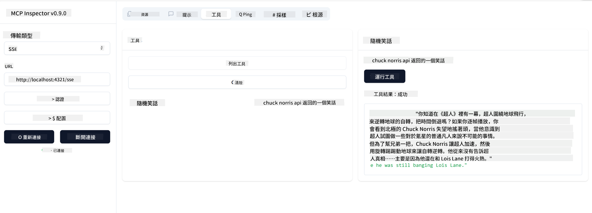

<!--
CO_OP_TRANSLATOR_METADATA:
{
  "original_hash": "0a8086dc4bf89448f83e7936db972c42",
  "translation_date": "2025-05-17T11:28:36+00:00",
  "source_file": "03-GettingStarted/05-sse-server/README.md",
  "language_code": "hk"
}
-->
# SSE 伺服器

SSE (Server Sent Events) 是一種伺服器到客戶端的串流標準，允許伺服器通過 HTTP 推送即時更新到客戶端。這對於需要即時更新的應用程式特別有用，例如聊天應用程式、通知或即時數據流。此外，您的伺服器可以同時被多個客戶端使用，因為它可以在雲端等地方運行。

## 概覽

這一課涵蓋如何構建和使用 SSE 伺服器。

## 學習目標

在本課結束時，您將能夠：

- 構建一個 SSE 伺服器。
- 使用 Inspector 調試 SSE 伺服器。
- 使用 Visual Studio Code 使用 SSE 伺服器。

## SSE 如何運作

SSE 是兩種支持的傳輸類型之一。您已經在之前的課程中看到過第一種 stdio 的使用。區別如下：

- SSE 需要您處理兩件事情：連接和消息。
- 由於這是一個可以在任何地方運行的伺服器，您需要在使用 Inspector 和 Visual Studio 這樣的工具時反映出來。這意味著，與其指出如何啟動伺服器，不如指出它可以建立連接的端點。請參見下面的示例代碼：

既然我們對 SSE 有了一些了解，接下來讓我們構建一個 SSE 伺服器。

## 練習：創建 SSE 伺服器

為了創建我們的伺服器，我們需要記住兩件事：

- 我們需要使用網絡伺服器來公開連接和消息的端點。
- 像我們使用 stdio 時一樣，使用工具、資源和提示來構建我們的伺服器。

### -1- 創建伺服器實例

為了創建我們的伺服器，我們使用與 stdio 相同的類型。然而，對於傳輸，我們需要選擇 SSE。

讓我們接下來添加所需的路由。

### -2- 添加路由

讓我們接下來添加處理連接和傳入消息的路由：

讓我們接下來為伺服器添加功能。

### -3- 添加伺服器功能

現在我們已經定義了所有 SSE 特定的內容，讓我們添加伺服器功能，例如工具、提示和資源。

您的完整代碼應如下所示：

太好了，我們有一個使用 SSE 的伺服器，接下來讓我們來試試。

## 練習：使用 Inspector 調試 SSE 伺服器

Inspector 是一個很棒的工具，我們在之前的課程 [創建您的第一個伺服器](/03-GettingStarted/01-first-server/README.md) 中見過。讓我們看看我們是否可以在這裡使用 Inspector：

### -1- 運行 Inspector

要運行 Inspector，您首先必須有一個運行中的 SSE 伺服器，所以讓我們接下來這樣做：

1. 運行伺服器

1. 運行 Inspector

    > ![NOTE]
    > 在伺服器運行的不同終端窗口中運行此操作。還請注意，您需要調整以下命令以適應您的伺服器運行的 URL。

    ```sh
    npx @modelcontextprotocol/inspector --cli http://localhost:8000/sse --method tools/list
    ```

    在所有運行時中運行 Inspector 看起來都是一樣的。請注意，我們不是傳遞伺服器的路徑和啟動伺服器的命令，而是傳遞伺服器運行的 URL，我們還指定了 `/sse` 路由。

### -2- 嘗試使用工具

通過在下拉列表中選擇 SSE 並填寫伺服器運行的 URL 字段來連接伺服器，例如 http:localhost:4321/sse。現在點擊“Connect”按鈕。和以前一樣，選擇列出工具，選擇一個工具並提供輸入值。您應該會看到如下結果：



太好了，您能夠使用 Inspector，接下來讓我們看看如何使用 Visual Studio Code。

## 作業

嘗試為您的伺服器添加更多功能。參見[這個頁面](https://api.chucknorris.io/) 例如添加一個調用 API 的工具，您可以決定伺服器應該是什麼樣子。祝您玩得開心 :)

## 解決方案

[解決方案](./solution/README.md) 這裡是一個可能的解決方案，帶有可運行的代碼。

## 關鍵要點

本章的要點如下：

- SSE 是繼 stdio 之後的第二種支持的傳輸。
- 要支持 SSE，您需要使用網絡框架管理傳入的連接和消息。
- 您可以使用 Inspector 和 Visual Studio Code 使用 SSE 伺服器，就像使用 stdio 伺服器一樣。注意它在 stdio 和 SSE 之間的細微差別。對於 SSE，您需要單獨啟動伺服器，然後運行您的 Inspector 工具。對於 Inspector 工具，還有一些不同之處，您需要指定 URL。

## 範例

- [Java 計算器](../samples/java/calculator/README.md)
- [.Net 計算器](../../../../03-GettingStarted/samples/csharp)
- [JavaScript 計算器](../samples/javascript/README.md)
- [TypeScript 計算器](../samples/typescript/README.md)
- [Python 計算器](../../../../03-GettingStarted/samples/python)

## 其他資源

- [SSE](https://developer.mozilla.org/en-US/docs/Web/API/Server-sent_events)

## 接下來是什麼

- 下一步：[開始使用 VSCode 的 AI 工具包](/03-GettingStarted/06-aitk/README.md)

**免責聲明**：
此文件已使用AI翻譯服務[Co-op Translator](https://github.com/Azure/co-op-translator)進行翻譯。雖然我們努力確保準確性，但請注意，自動翻譯可能包含錯誤或不準確之處。應以原始語言的文件為權威來源。對於關鍵信息，建議使用專業人工翻譯。對於因使用此翻譯而產生的任何誤解或誤釋，我們概不負責。