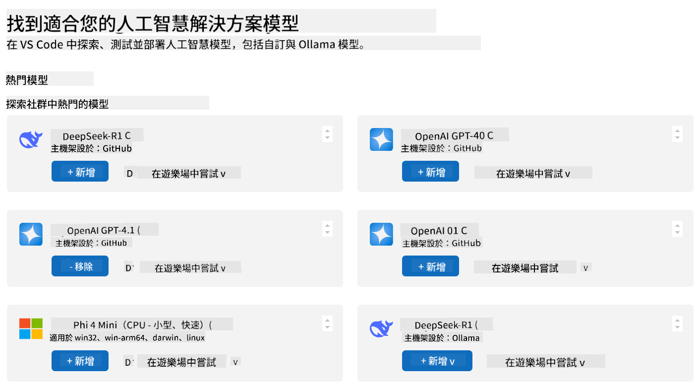
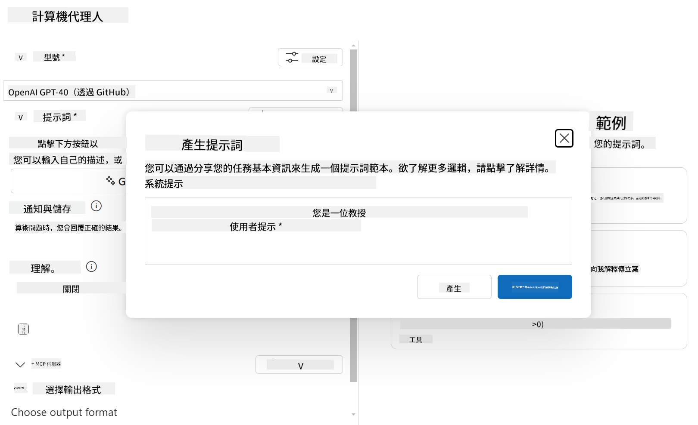

<!--
CO_OP_TRANSLATOR_METADATA:
{
  "original_hash": "af6cee6052e751674c1d9022a4b204e6",
  "translation_date": "2025-06-03T14:27:41+00:00",
  "source_file": "03-GettingStarted/06-aitk/README.md",
  "language_code": "hk"
}
-->
# 從 Visual Studio Code 嘅 AI Toolkit 擴充功能使用伺服器

當你建立 AI 代理時，唔只係要產生智能回應，仲要令代理有能力執行行動。Model Context Protocol (MCP) 就係用嚟做呢件事嘅。MCP 令代理可以用統一嘅方式去存取外部工具同服務。可以想像成將代理插入一個佢真係可以用嘅工具箱。

例如你連接代理去你嘅計算機 MCP 伺服器，咁代理就可以直接透過收到「47 乘 89 幾多？」呢啲提示嚟做數學運算，唔使自己寫死邏輯或者整自訂 API。

## 概覽

本課程會教你點樣用 Visual Studio Code 嘅 [AI Toolkit](https://aka.ms/AIToolkit) 擴充功能，將計算機 MCP 伺服器連接到代理，令代理可以用自然語言執行加、減、乘、除等數學運算。

AI Toolkit 係一個強大嘅 Visual Studio Code 擴充功能，簡化咗代理開發。AI 工程師可以輕鬆喺本地或雲端開發同測試生成式 AI 模型。呢個擴充功能支援市面上大部分主流生成模型。

*備註*：AI Toolkit 目前支援 Python 同 TypeScript。

## 學習目標

完成本課程後，你將可以：

- 用 AI Toolkit 消費 MCP 伺服器。
- 配置代理設定，令佢可以發現同使用 MCP 伺服器提供嘅工具。
- 透過自然語言使用 MCP 工具。

## 方法

我哋嘅大致做法係：

- 建立代理並定義系統提示。
- 建立帶有計算工具嘅 MCP 伺服器。
- 將 Agent Builder 連接到 MCP 伺服器。
- 用自然語言測試代理調用工具。

好啦，明白咗流程後，開始配置 AI 代理，透過 MCP 使用外部工具，提升佢嘅能力！

## 先決條件

- [Visual Studio Code](https://code.visualstudio.com/)
- [AI Toolkit for Visual Studio Code](https://aka.ms/AIToolkit)

## 練習：使用伺服器

呢個練習會教你喺 Visual Studio Code 用 AI Toolkit 建立、執行同增強一個帶有 MCP 伺服器工具嘅 AI 代理。

### -0- 預備步驟，將 OpenAI GPT-4o 模型加到 My Models

練習用嘅係 **GPT-4o** 模型。你要先將模型加到 **My Models**，先可以建立代理。



1. 喺 **Activity Bar** 開啟 **AI Toolkit** 擴充功能。
1. 喺 **Catalog** 區域揀 **Models**，會喺新嘅編輯器分頁打開 **Model Catalog**。
1. 喺 **Model Catalog** 嘅搜尋欄輸入 **OpenAI GPT-4o**。
1. 按 **+ Add** 將模型加到你嘅 **My Models** 清單。記住揀 GitHub 托管嘅模型。
1. 喺 **Activity Bar** 確認清單有顯示 **OpenAI GPT-4o**。

### -1- 建立代理

**Agent (Prompt) Builder** 令你可以建立同自訂你嘅 AI 代理。呢部分會建立新代理，並指定一個模型做對話引擎。


1. 喺 **Activity Bar** 開啟 **AI Toolkit** 擴充功能。
1. 喺 **Tools** 區域揀 **Agent (Prompt) Builder**，會喺新分頁開啟。
1. 按 **+ New Agent** 按鈕。擴充功能會喺 **Command Palette** 開啟設定精靈。
1. 輸入名稱 **Calculator Agent**，按 **Enter**。
1. 喺 **Agent (Prompt) Builder** 嘅 **Model** 欄揀 **OpenAI GPT-4o (via GitHub)**。

### -2- 為代理建立系統提示

代理架構好之後，要定義佢嘅個性同目標。呢部分用 **Generate system prompt** 功能，描述代理行為（今次係計算機代理），由模型幫你寫系統提示。



1. 喺 **Prompts** 部分，按 **Generate system prompt** 按鈕。會打開提示建構器，利用 AI 幫你產生系統提示。
1. 喺 **Generate a prompt** 視窗入面，輸入以下：`You are a helpful and efficient math assistant. When given a problem involving basic arithmetic, you respond with the correct result.`
1. 按 **Generate**。畫面右下會有通知話系統提示緊生成。生成完成後，系統提示會出現喺 **Agent (Prompt) Builder** 嘅 **System prompt** 欄。
1. 檢查系統提示，必要時修改。

### -3- 建立 MCP 伺服器

定義咗代理嘅系統提示（指引佢嘅行為同回應）之後，就可以畀代理實際嘅功能。呢部分會建立一個計算機 MCP 伺服器，帶有加、減、乘、除工具，令代理可以即時用自然語言做數學運算。


AI Toolkit 內建模板，方便你建立 MCP 伺服器。今次用 Python 模板建立計算機 MCP 伺服器。

*備註*：AI Toolkit 目前支援 Python 同 TypeScript。

1. 喺 **Agent (Prompt) Builder** 嘅 **Tools** 區，按 **+ MCP Server**。擴充功能會喺 **Command Palette** 開啟設定精靈。
1. 揀 **+ Add Server**。
1. 揀 **Create a New MCP Server**。
1. 揀 **python-weather** 模板。
1. 揀 **Default folder** 儲存 MCP 伺服器模板。
1. 輸入伺服器名稱：**Calculator**
1. 會開新嘅 Visual Studio Code 視窗。揀 **Yes, I trust the authors**。
1. 用終端機（**Terminal** > **New Terminal**）建立虛擬環境：`python -m venv .venv`
1. 用終端機啟動虛擬環境：
    1. Windows - `.venv\Scripts\activate`
    1. macOS/Linux - `source venv/bin/activate`
1. 用終端機安裝依賴：`pip install -e .[dev]`
1. 喺 **Activity Bar** 嘅 **Explorer** 視圖展開 **src** 目錄，揀開 **server.py**。
1. 將 **server.py** 嘅程式碼換成以下內容，並儲存：

    ```python
    """
    Sample MCP Calculator Server implementation in Python.

    
    This module demonstrates how to create a simple MCP server with calculator tools
    that can perform basic arithmetic operations (add, subtract, multiply, divide).
    """
    
    from mcp.server.fastmcp import FastMCP
    
    server = FastMCP("calculator")
    
    @server.tool()
    def add(a: float, b: float) -> float:
        """Add two numbers together and return the result."""
        return a + b
    
    @server.tool()
    def subtract(a: float, b: float) -> float:
        """Subtract b from a and return the result."""
        return a - b
    
    @server.tool()
    def multiply(a: float, b: float) -> float:
        """Multiply two numbers together and return the result."""
        return a * b
    
    @server.tool()
    def divide(a: float, b: float) -> float:
        """
        Divide a by b and return the result.
        
        Raises:
            ValueError: If b is zero
        """
        if b == 0:
            raise ValueError("Cannot divide by zero")
        return a / b
    ```

### -4- 用計算機 MCP 伺服器執行代理

代理有咗工具，就可以用佢哋啦！呢部分會提交提示測試代理，驗證佢係咪會用計算機 MCP 伺服器嘅合適工具。


你會喺本地開發機用 **Agent Builder** 作為 MCP 客戶端，執行計算機 MCP 伺服器。

1. 按 `F5` to start debugging the MCP server. The **Agent (Prompt) Builder** will open in a new editor tab. The status of the server is visible in the terminal.
1. In the **User prompt** field of the **Agent (Prompt) Builder**, enter the following prompt: `我買咗 3 件貨，每件 $25，然後用咗 $20 折扣。我實際付咗幾多錢？`
1. Click the **Run** button to generate the agent's response.
1. Review the agent output. The model should conclude that you paid **$55**.
1. Here's a breakdown of what should occur:
    - The agent selects the **multiply** and **substract** tools to aid in the calculation.
    - The respective `a` and `b` values are assigned for the **multiply** tool.
    - The respective `a` and `b`，呢啲係分配畀 **subtract** 工具嘅值。
    - 每個工具嘅回應會顯示喺相應嘅 **Tool Response**。
    - 模型嘅最終輸出會顯示喺最終嘅 **Model Response**。
1. 你可以提交更多提示嚟進一步測試代理。可以喺 **User prompt** 欄點入，再改寫現有提示。
1. 測試完成後，可以喺 **terminal** 入 **CTRL/CMD+C** 停止伺服器。

## 作業

試喺你嘅 **server.py** 文件加入額外嘅工具（例如：返回數字嘅平方根）。提交需要代理用到你新增工具（或現有工具）嘅提示。記得重啟伺服器，先會載入新增工具。

## 解答

[Solution](./solution/README.md)

## 重要重點

本章嘅重點係：

- AI Toolkit 擴充功能係一個好用嘅客戶端，令你可以使用 MCP 伺服器同佢嘅工具。
- 你可以新增工具到 MCP 伺服器，擴充代理功能，滿足不斷變化嘅需求。
- AI Toolkit 包含模板（例如 Python MCP 伺服器模板），簡化自訂工具嘅建立。

## 額外資源

- [AI Toolkit 文件](https://aka.ms/AIToolkit/doc)

## 下一步

下一課：[Lesson 4 Practical Implementation](/04-PracticalImplementation/README.md)

**免責聲明**：  
本文件係使用 AI 翻譯服務 [Co-op Translator](https://github.com/Azure/co-op-translator) 進行翻譯。雖然我哋努力確保準確性，但請注意，自動翻譯可能包含錯誤或不準確之處。原始文件嘅母語版本應被視為權威來源。對於重要資料，建議使用專業人工翻譯。我哋對因使用本翻譯而引致嘅任何誤解或誤釋概不負責。