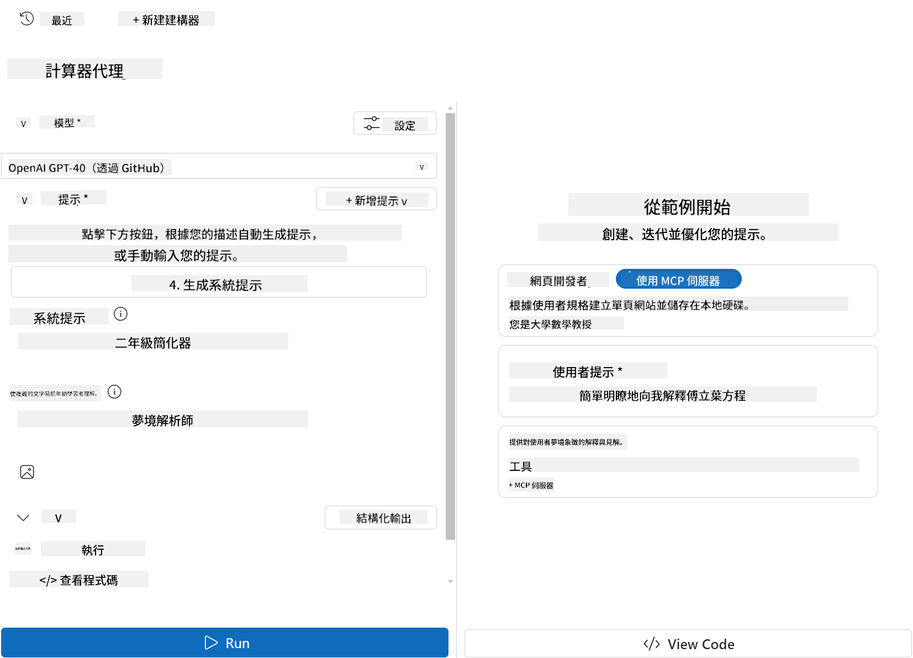

<!--
CO_OP_TRANSLATOR_METADATA:
{
  "original_hash": "d1980763f2a545ca6648363bf5757b5a",
  "translation_date": "2025-06-12T22:26:02+00:00",
  "source_file": "03-GettingStarted/07-aitk/README.md",
  "language_code": "hk"
}
-->
# 喺 Visual Studio Code 嘅 AI Toolkit 擴充功能入面使用伺服器

當你建立 AI 代理嘅時候，唔單止係產生智能回應；仲要畀代理有能力去執行行動。呢個就係 Model Context Protocol (MCP) 嘅用處。MCP 令代理可以用統一嘅方式去存取外部工具同服務。可以想像成將代理插入一個佢真係用得到嘅工具箱。

譬如你將代理連接到你嘅計算機 MCP 伺服器，咁代理就可以直接透過接收「47 乘 89 係幾多？」呢啲提示嚟做數學運算，唔使寫死邏輯或者自訂 API。

## 概覽

今課會講點樣喺 Visual Studio Code 裡用 [AI Toolkit](https://aka.ms/AIToolkit) 擴充功能，連接計算機 MCP 伺服器到代理，令代理可以用自然語言執行加、減、乘、除嘅數學運算。

AI Toolkit 係一個強大嘅 Visual Studio Code 擴充功能，簡化咗代理開發嘅流程。AI 工程師可以輕鬆喺本地或雲端開發同測試生成式 AI 模型。呢個擴充功能支援大部分主流嘅生成式模型。

*備註*：AI Toolkit 而家支援 Python 同 TypeScript。

## 學習目標

完成今課後，你可以做到：

- 用 AI Toolkit 消費 MCP 伺服器。
- 配置代理設定，令代理可以發現同使用 MCP 伺服器提供嘅工具。
- 透過自然語言使用 MCP 工具。

## 方法

我哋嘅高層次做法係：

- 建立代理同定義佢嘅系統提示。
- 建立一個有計算工具嘅 MCP 伺服器。
- 將 Agent Builder 連接到 MCP 伺服器。
- 用自然語言測試代理嘅工具調用。

好啦，了解流程後，開始配置 AI 代理利用 MCP 外部工具，提升佢嘅功能！

## 前置條件

- [Visual Studio Code](https://code.visualstudio.com/)
- [AI Toolkit for Visual Studio Code](https://aka.ms/AIToolkit)

## 練習：使用伺服器

今次練習你會喺 Visual Studio Code 裡用 AI Toolkit 建立、運行同增強一個有 MCP 伺服器工具嘅 AI 代理。

### -0- 預備步驟，將 OpenAI GPT-4o 模型加入 My Models

今次練習用到 **GPT-4o** 模型。喺建立代理之前，要先將模型加入 **My Models**。


1. 喺 **Activity Bar** 開啟 **AI Toolkit** 擴充功能。
1. 喺 **Catalog** 區域揀 **Models**，打開 **Model Catalog**。揀 Models 會喺新編輯器分頁打開 Model Catalog。
1. 喺 Model Catalog 嘅搜尋欄輸入 **OpenAI GPT-4o**。
1. 按 **+ Add** 將模型加入你嘅 **My Models** 清單。確保你揀咗係 **Hosted by GitHub** 嘅模型。
1. 喺 Activity Bar 確認 **OpenAI GPT-4o** 模型已經出現喺清單入面。

### -1- 建立代理

**Agent (Prompt) Builder** 令你可以建立同自訂自己嘅 AI 代理。呢部分會建立一個新代理，並指派模型作為對話引擎。



1. 喺 **Activity Bar** 開啟 **AI Toolkit** 擴充功能。
1. 喺 **Tools** 區域揀 **Agent (Prompt) Builder**。揀咗之後會喺新編輯器分頁打開 Agent (Prompt) Builder。
1. 按 **+ New Agent** 按鈕。擴充功能會喺 **Command Palette** 開啟設定嚮導。
1. 輸入名為 **Calculator Agent**，然後按 **Enter**。
1. 喺 Agent (Prompt) Builder 裡，喺 **Model** 欄揀 **OpenAI GPT-4o (via GitHub)** 模型。

### -2- 為代理建立系統提示

代理已搭好骨架，依家要定義佢嘅性格同目的。今部分會用 **Generate system prompt** 功能，描述代理嘅行為，呢個例子係計算機代理，然後由模型幫你寫系統提示。


1. 喺 **Prompts** 部分，按 **Generate system prompt** 按鈕。呢個會打開提示建立器，利用 AI 幫你產生系統提示。
1. 喺 **Generate a prompt** 視窗入面，輸入以下：`You are a helpful and efficient math assistant. When given a problem involving basic arithmetic, you respond with the correct result.`
1. 按 **Generate**。右下角會彈通知話系統提示緊生成中。生成完成後，提示會自動填入 Agent (Prompt) Builder 嘅 **System prompt** 欄。
1. 檢查系統提示，有需要可以修改。

### -3- 建立 MCP 伺服器

定義好代理嘅系統提示，指導佢嘅行為同回應後，依家要畀代理實用功能。呢部分會建立一個計算機 MCP 伺服器，包含加、減、乘、除嘅工具。呢個伺服器令代理可以即時回應自然語言嘅數學運算。


AI Toolkit 有方便嘅模板，令你容易建立自己嘅 MCP 伺服器。今次用 Python 模板建立計算機 MCP 伺服器。

*備註*：AI Toolkit 而家支援 Python 同 TypeScript。

1. 喺 Agent (Prompt) Builder 嘅 **Tools** 部分，按 **+ MCP Server** 按鈕。擴充功能會喺 **Command Palette** 開啟設定嚮導。
1. 選擇 **+ Add Server**。
1. 選擇 **Create a New MCP Server**。
1. 選擇 **python-weather** 模板。
1. 選擇 **Default folder** 儲存 MCP 伺服器模板。
1. 輸入伺服器名稱：**Calculator**
1. 會開新嘅 Visual Studio Code 視窗，選擇 **Yes, I trust the authors**。
1. 喺終端機（Terminal > New Terminal）建立虛擬環境：`python -m venv .venv`
1. 喺終端機啟動虛擬環境：
    1. Windows - `.venv\Scripts\activate`
    1. macOS/Linux - `source venv/bin/activate`
1. 喺終端機安裝依賴：`pip install -e .[dev]`
1. 喺 Activity Bar 嘅 Explorer 視圖，展開 **src** 目錄，揀 **server.py** 打開編輯。
1. 用以下代碼覆蓋 **server.py**，然後儲存：

    ```python
    """
    Sample MCP Calculator Server implementation in Python.

    
    This module demonstrates how to create a simple MCP server with calculator tools
    that can perform basic arithmetic operations (add, subtract, multiply, divide).
    """
    
    from mcp.server.fastmcp import FastMCP
    
    server = FastMCP("calculator")
    
    @server.tool()
    def add(a: float, b: float) -> float:
        """Add two numbers together and return the result."""
        return a + b
    
    @server.tool()
    def subtract(a: float, b: float) -> float:
        """Subtract b from a and return the result."""
        return a - b
    
    @server.tool()
    def multiply(a: float, b: float) -> float:
        """Multiply two numbers together and return the result."""
        return a * b
    
    @server.tool()
    def divide(a: float, b: float) -> float:
        """
        Divide a by b and return the result.
        
        Raises:
            ValueError: If b is zero
        """
        if b == 0:
            raise ValueError("Cannot divide by zero")
        return a / b
    ```

### -4- 用計算機 MCP 伺服器運行代理

代理有工具後，依家就可以用佢哋！今部分會向代理提交提示，測試同驗證代理係咪用咗計算機 MCP 伺服器嘅合適工具。


你會喺本地開發機用 **Agent Builder** 做 MCP 客戶端，運行計算機 MCP 伺服器。

1. 按 `F5` to start debugging the MCP server. The **Agent (Prompt) Builder** will open in a new editor tab. The status of the server is visible in the terminal.
1. In the **User prompt** field of the **Agent (Prompt) Builder**, enter the following prompt: `我買咗 3 件每件 $25 嘅物品，然後用咗 $20 折扣。最終我付咗幾多？`
1. Click the **Run** button to generate the agent's response.
1. Review the agent output. The model should conclude that you paid **$55**.
1. Here's a breakdown of what should occur:
    - The agent selects the **multiply** and **substract** tools to aid in the calculation.
    - The respective `a` and `b` values are assigned for the **multiply** tool.
    - The respective `a` and `b` 呢啲值係畀 **subtract** 工具用。
    - 每個工具嘅回應會顯示喺對應嘅 **Tool Response**。
    - 模型嘅最終輸出會喺最後嘅 **Model Response** 顯示。
1. 你可以提交更多提示去進一步測試代理。可以喺 **User prompt** 欄修改現有提示，換成新嘅內容。
1. 測試完成後，可以喺終端機按 **CTRL/CMD+C** 停止伺服器。

## 作業

試喺你嘅 **server.py** 新增一個工具（例如：計算平方根）。提交需要代理使用你新工具（或者現有工具）嘅提示。記住重啟伺服器，先可以載入新加嘅工具。

## 解答

[Solution](./solution/README.md)

## 主要重點

本章嘅重點係：

- AI Toolkit 擴充功能係一個好用嘅客戶端，令你可以消費 MCP 伺服器同佢嘅工具。
- 你可以新增工具到 MCP 伺服器，擴展代理功能，應付不斷變化嘅需求。
- AI Toolkit 包含模板（例如 Python MCP 伺服器模板），簡化自訂工具嘅建立。

## 其他資源

- [AI Toolkit 文件](https://aka.ms/AIToolkit/doc)

## 下一步
- 下一步：[測試同除錯](/03-GettingStarted/08-testing/README.md)

**免責聲明**：  
本文件係用AI翻譯服務 [Co-op Translator](https://github.com/Azure/co-op-translator) 進行翻譯。雖然我哋盡力確保準確性，但請注意自動翻譯可能包含錯誤或不準確嘅地方。原文文件嘅母語版本應視為權威來源。對於重要資料，建議使用專業人工翻譯。我哋對因使用此翻譯而引致嘅任何誤解或誤釋概不負責。