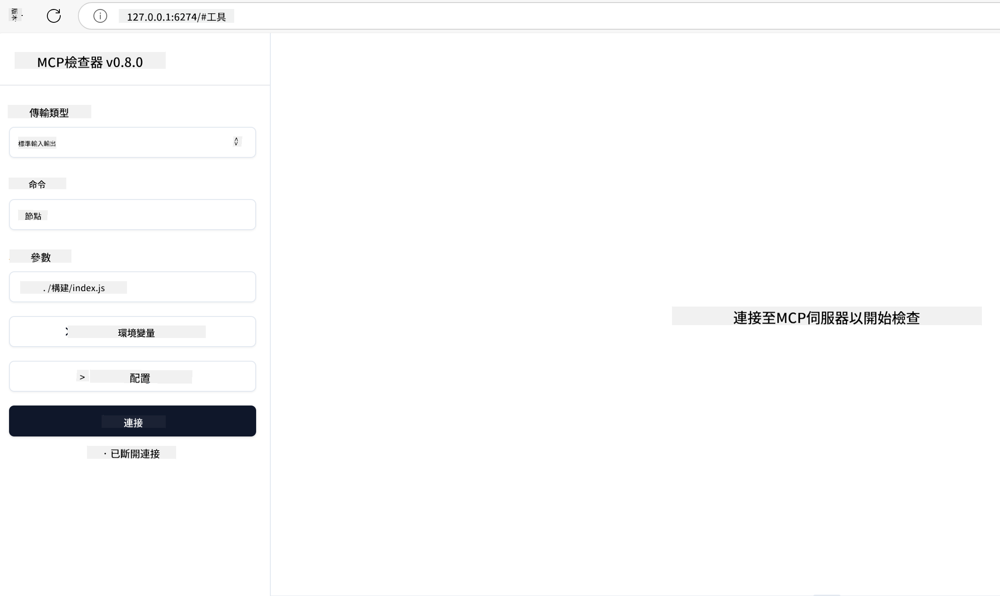

<!--
CO_OP_TRANSLATOR_METADATA:
{
  "original_hash": "717f34718a773f6cf52d8445e40a96bf",
  "translation_date": "2025-05-17T12:40:32+00:00",
  "source_file": "03-GettingStarted/07-testing/README.md",
  "language_code": "hk"
}
-->
## 測試和調試

在開始測試你的 MCP 伺服器之前，了解可用的工具和最佳調試實踐是非常重要的。有效的測試能確保你的伺服器如預期般運行，並幫助你快速識別和解決問題。以下部分概述了驗證你的 MCP 實施的推薦方法。

## 概述

這一課涵蓋如何選擇合適的測試方法和最有效的測試工具。

## 學習目標

完成這一課後，你將能夠：

- 描述各種測試方法。
- 使用不同的工具有效地測試你的代碼。

## 測試 MCP 伺服器

MCP 提供工具來幫助你測試和調試你的伺服器：

- **MCP Inspector**：一個命令行工具，可以作為 CLI 工具和可視化工具運行。
- **手動測試**：你可以使用像 curl 這樣的工具來運行網絡請求，但任何能運行 HTTP 的工具都可以。
- **單元測試**：可以使用你喜歡的測試框架來測試伺服器和客戶端的功能。

### 使用 MCP Inspector

我們在之前的課程中描述了這個工具的使用，但讓我們在高層次上談論一下。這是一個用 Node.js 構建的工具，你可以通過調用 `npx` 可執行文件來使用它，該文件會臨時下載和安裝工具本身，並在完成運行你的請求後自行清理。

[MCP Inspector](https://github.com/modelcontextprotocol/inspector) 幫助你：

- **發現伺服器功能**：自動檢測可用資源、工具和提示
- **測試工具執行**：嘗試不同的參數並實時查看響應
- **查看伺服器元數據**：檢查伺服器信息、模式和配置

工具的一次典型運行如下所示：

```bash
npx @modelcontextprotocol/inspector node build/index.js
```

上述命令啟動了 MCP 及其可視化界面，並在你的瀏覽器中啟動了一個本地網絡界面。你可以期待看到一個儀表板，顯示你註冊的 MCP 伺服器、它們的可用工具、資源和提示。界面允許你交互式測試工具執行、檢查伺服器元數據並查看實時響應，使得驗證和調試你的 MCP 伺服器實施更容易。

它可能看起來像這樣：

你也可以在 CLI 模式下運行這個工具，在這種情況下，你需要添加 `--cli` 屬性。以下是以 "CLI" 模式運行工具的示例，它列出了伺服器上的所有工具：

```sh
npx @modelcontextprotocol/inspector --cli node build/index.js --method tools/list
```

### 手動測試

除了運行檢查工具來測試伺服器功能外，另一種類似的方法是運行一個能使用 HTTP 的客戶端，例如 curl。

使用 curl，你可以直接通過 HTTP 請求測試 MCP 伺服器：

```bash
# Example: Test server metadata
curl http://localhost:3000/v1/metadata

# Example: Execute a tool
curl -X POST http://localhost:3000/v1/tools/execute \
  -H "Content-Type: application/json" \
  -d '{"name": "calculator", "parameters": {"expression": "2+2"}}'
```

如上所示，使用 curl 進行的 POST 請求可用來調用工具，使用包含工具名稱和其參數的有效負載。使用最適合你的方法。一般來說，CLI 工具使用起來更快，並且可以被腳本化，這在 CI/CD 環境中可能非常有用。

### 單元測試

為你的工具和資源創建單元測試以確保它們如預期般工作。以下是一些示例測試代碼。

```python
import pytest

from mcp.server.fastmcp import FastMCP
from mcp.shared.memory import (
    create_connected_server_and_client_session as create_session,
)

# Mark the whole module for async tests
pytestmark = pytest.mark.anyio


async def test_list_tools_cursor_parameter():
    """Test that the cursor parameter is accepted for list_tools.

    Note: FastMCP doesn't currently implement pagination, so this test
    only verifies that the cursor parameter is accepted by the client.
    """

 server = FastMCP("test")

    # Create a couple of test tools
    @server.tool(name="test_tool_1")
    async def test_tool_1() -> str:
        """First test tool"""
        return "Result 1"

    @server.tool(name="test_tool_2")
    async def test_tool_2() -> str:
        """Second test tool"""
        return "Result 2"

    async with create_session(server._mcp_server) as client_session:
        # Test without cursor parameter (omitted)
        result1 = await client_session.list_tools()
        assert len(result1.tools) == 2

        # Test with cursor=None
        result2 = await client_session.list_tools(cursor=None)
        assert len(result2.tools) == 2

        # Test with cursor as string
        result3 = await client_session.list_tools(cursor="some_cursor_value")
        assert len(result3.tools) == 2

        # Test with empty string cursor
        result4 = await client_session.list_tools(cursor="")
        assert len(result4.tools) == 2
    
```

前面的代碼執行以下操作：

- 利用 pytest 框架，讓你可以創建測試作為函數並使用 assert 語句。
- 創建一個 MCP 伺服器，具有兩個不同的工具。
- 使用 `assert` 語句來檢查某些條件是否滿足。

查看[完整文件](https://github.com/modelcontextprotocol/python-sdk/blob/main/tests/client/test_list_methods_cursor.py)

根據上述文件，你可以測試自己的伺服器以確保功能按預期創建。

所有主要的 SDK 都有類似的測試部分，因此你可以根據選擇的運行時進行調整。

## 示例

- [Java 計算器](../samples/java/calculator/README.md)
- [.Net 計算器](../../../../03-GettingStarted/samples/csharp)
- [JavaScript 計算器](../samples/javascript/README.md)
- [TypeScript 計算器](../samples/typescript/README.md)
- [Python 計算器](../../../../03-GettingStarted/samples/python)

## 附加資源

- [Python SDK](https://github.com/modelcontextprotocol/python-sdk)

## 下一步

- 下一步：[部署](/03-GettingStarted/08-deployment/README.md)

**免責聲明**：
本文件已使用AI翻譯服務[Co-op Translator](https://github.com/Azure/co-op-translator)進行翻譯。雖然我們努力確保準確性，但請注意，自動翻譯可能包含錯誤或不準確之處。原始文件的母語版本應被視為權威來源。對於關鍵信息，建議尋求專業人工翻譯。我們對於使用此翻譯可能引起的任何誤解或誤讀不承擔責任。