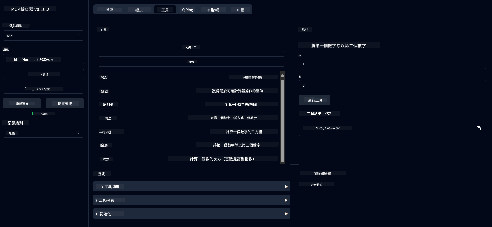

<!--
CO_OP_TRANSLATOR_METADATA:
{
  "original_hash": "13231e9951b68efd9df8c56bd5cdb27e",
  "translation_date": "2025-05-17T13:06:48+00:00",
  "source_file": "03-GettingStarted/samples/java/calculator/README.md",
  "language_code": "hk"
}
-->
# 基本計算機 MCP 服務

這個服務通過 Model Context Protocol (MCP) 使用 Spring Boot 和 WebFlux 傳輸提供基本的計算機操作。這是為初學者學習 MCP 實現而設計的簡單示例。

欲了解更多信息，請參閱 [MCP 服務器啟動器](https://docs.spring.io/spring-ai/reference/api/mcp/mcp-server-boot-starter-docs.html) 參考文檔。

## 概述

該服務展示了：
- 支持 SSE (Server-Sent Events)
- 使用 Spring AI 的 `@Tool` 註釋自動註冊工具
- 基本計算機功能：
  - 加法、減法、乘法、除法
  - 次方計算和平方根
  - 模數（餘數）和絕對值
  - 操作說明的幫助功能

## 功能

這個計算機服務提供以下功能：

1. **基本算術運算**：
   - 兩個數字的加法
   - 從一個數字中減去另一個數字
   - 兩個數字的乘法
   - 一個數字除以另一個數字（帶零除檢查）

2. **高級運算**：
   - 次方計算（將基數提高到指數）
   - 平方根計算（帶負數檢查）
   - 模數（餘數）計算
   - 絕對值計算

3. **幫助系統**：
   - 內置幫助功能，解釋所有可用的操作

## 使用服務

該服務通過 MCP 協議公開以下 API 端點：

- `add(a, b)`：將兩個數字相加
- `subtract(a, b)`：從第一個數字中減去第二個數字
- `multiply(a, b)`：將兩個數字相乘
- `divide(a, b)`：將第一個數字除以第二個數字（帶零檢查）
- `power(base, exponent)`：計算一個數字的次方
- `squareRoot(number)`：計算平方根（帶負數檢查）
- `modulus(a, b)`：計算除法時的餘數
- `absolute(number)`：計算絕對值
- `help()`：獲取可用操作的信息

## 測試客戶端

`com.microsoft.mcp.sample.client` 包中包含了一個簡單的測試客戶端。`SampleCalculatorClient` 類展示了計算機服務的可用操作。

## 使用 LangChain4j 客戶端

該項目在 `com.microsoft.mcp.sample.client.LangChain4jClient` 中包含了一個 LangChain4j 示例客戶端，展示如何將計算機服務與 LangChain4j 和 GitHub 模型集成：

### 先決條件

1. **GitHub Token 設置**：
   
   要使用 GitHub 的 AI 模型（如 phi-4），您需要一個 GitHub 個人訪問令牌：

   a. 轉到您的 GitHub 帳戶設置：https://github.com/settings/tokens
   
   b. 點擊“生成新令牌” → “生成新令牌（經典）”
   
   c. 給您的令牌一個描述性的名稱
   
   d. 選擇以下範圍：
      - `repo`（對私有庫的完全控制）
      - `read:org`（讀取組織和團隊成員資格，讀取組織項目）
      - `gist`（創建 gists）
      - `user:email`（訪問用戶電子郵件地址（只讀））
   
   e. 點擊“生成令牌”並複製您的新令牌
   
   f. 將其設置為環境變量：
      
      在 Windows 上：
      ```
      set GITHUB_TOKEN=your-github-token
      ```
      
      在 macOS/Linux 上：
      ```bash
      export GITHUB_TOKEN=your-github-token
      ```

   g. 為持久設置，通過系統設置將其添加到您的環境變量中

2. 將 LangChain4j GitHub 依賴添加到您的項目中（已包含在 pom.xml 中）：
   ```xml
   <dependency>
       <groupId>dev.langchain4j</groupId>
       <artifactId>langchain4j-github</artifactId>
       <version>${langchain4j.version}</version>
   </dependency>
   ```

3. 確保計算機服務器在 `localhost:8080` 上運行

### 運行 LangChain4j 客戶端

此示例演示：
- 通過 SSE 傳輸連接到計算機 MCP 服務器
- 使用 LangChain4j 創建一個利用計算機操作的聊天機器人
- 與 GitHub AI 模型集成（現在使用 phi-4 模型）

客戶端發送以下示例查詢以演示功能：
1. 計算兩個數字的和
2. 查找一個數字的平方根
3. 獲取可用計算機操作的幫助信息

運行示例並檢查控制台輸出以查看 AI 模型如何使用計算機工具響應查詢。

### GitHub 模型配置

LangChain4j 客戶端配置為使用 GitHub 的 phi-4 模型，設置如下：

```java
ChatLanguageModel model = GitHubChatModel.builder()
    .apiKey(System.getenv("GITHUB_TOKEN"))
    .timeout(Duration.ofSeconds(60))
    .modelName("phi-4")
    .logRequests(true)
    .logResponses(true)
    .build();
```

要使用不同的 GitHub 模型，只需將 `modelName` 參數更改為其他支持的模型（例如 "claude-3-haiku-20240307", "llama-3-70b-8192" 等）。

## 依賴項

該項目需要以下關鍵依賴項：

```xml
<!-- For MCP Server -->
<dependency>
    <groupId>org.springframework.ai</groupId>
    <artifactId>spring-ai-starter-mcp-server-webflux</artifactId>
</dependency>

<!-- For LangChain4j integration -->
<dependency>
    <groupId>dev.langchain4j</groupId>
    <artifactId>langchain4j-mcp</artifactId>
    <version>${langchain4j.version}</version>
</dependency>

<!-- For GitHub models support -->
<dependency>
    <groupId>dev.langchain4j</groupId>
    <artifactId>langchain4j-github</artifactId>
    <version>${langchain4j.version}</version>
</dependency>
```

## 構建項目

使用 Maven 構建項目：
```bash
./mvnw clean install -DskipTests
```

## 運行服務器

### 使用 Java

```bash
java -jar target/calculator-server-0.0.1-SNAPSHOT.jar
```

### 使用 MCP Inspector

MCP Inspector 是一個與 MCP 服務交互的有用工具。要與此計算機服務一起使用它：

1. **安裝並運行 MCP Inspector** 在新終端窗口中：
   ```bash
   npx @modelcontextprotocol/inspector
   ```

2. **訪問 web UI** 通過點擊應用程序顯示的 URL（通常是 http://localhost:6274）

3. **配置連接**：
   - 設置傳輸類型為“SSE”
   - 將 URL 設置為您運行的服務器的 SSE 端點：`http://localhost:8080/sse`
   - 點擊“連接”

4. **使用工具**：
   - 點擊“列出工具”查看可用的計算機操作
   - 選擇一個工具並點擊“運行工具”執行操作



### 使用 Docker

該項目包括一個用於容器化部署的 Dockerfile：

1. **構建 Docker 映像**：
   ```bash
   docker build -t calculator-mcp-service .
   ```

2. **運行 Docker 容器**：
   ```bash
   docker run -p 8080:8080 calculator-mcp-service
   ```

這將：
- 使用 Maven 3.9.9 和 Eclipse Temurin 24 JDK 構建多階段 Docker 映像
- 創建一個優化的容器映像
- 在端口 8080 上公開服務
- 在容器內啟動 MCP 計算機服務

一旦容器運行，您可以在 `http://localhost:8080` 訪問該服務。

## 疑難解答

### GitHub Token 的常見問題

1. **令牌權限問題**：如果收到 403 Forbidden 錯誤，請檢查您的令牌是否具有先決條件中列出的正確權限。

2. **找不到令牌**：如果收到“找不到 API 密鑰”錯誤，請確保 GITHUB_TOKEN 環境變量已正確設置。

3. **速率限制**：GitHub API 有速率限制。如果遇到速率限制錯誤（狀態碼 429），請稍等幾分鐘後再試。

4. **令牌過期**：GitHub 令牌可能會過期。如果在一段時間後收到身份驗證錯誤，請生成新令牌並更新您的環境變量。

如果需要進一步的幫助，請查看 [LangChain4j 文檔](https://github.com/langchain4j/langchain4j) 或 [GitHub API 文檔](https://docs.github.com/en/rest)。

**免責聲明**：
本文件已使用AI翻譯服務[Co-op Translator](https://github.com/Azure/co-op-translator)進行翻譯。儘管我們努力確保翻譯準確，但請注意自動翻譯可能包含錯誤或不準確之處。原文件的母語版本應被視為權威來源。對於重要信息，建議使用專業人工翻譯。我們對於因使用此翻譯而產生的任何誤解或誤釋不承擔責任。