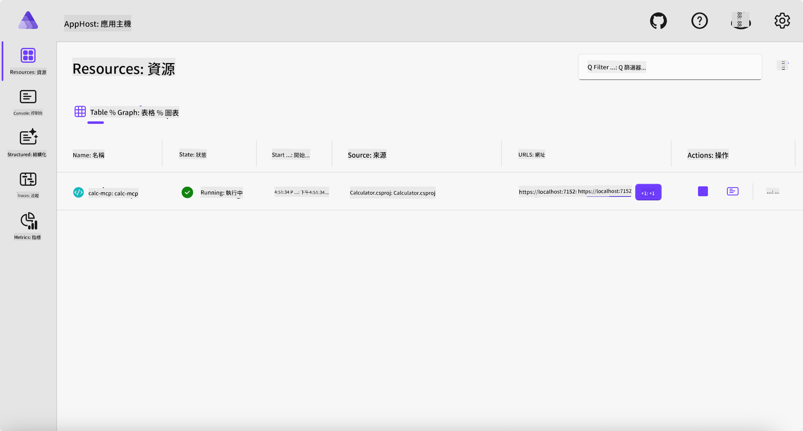
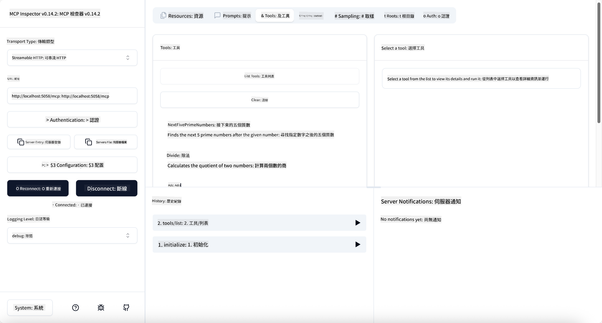
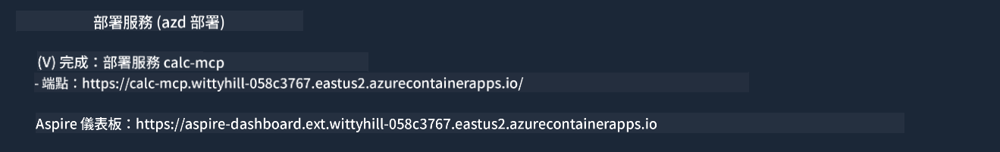

<!--
CO_OP_TRANSLATOR_METADATA:
{
  "original_hash": "0bc7bd48f55f1565f1d95ccb2c16f728",
  "translation_date": "2025-07-13T23:04:34+00:00",
  "source_file": "04-PracticalImplementation/samples/csharp/README.md",
  "language_code": "hk"
}
-->
# 範例

前一個範例展示了如何使用本地的 .NET 專案搭配 `stdio` 類型，以及如何在容器中本地執行伺服器。這在很多情況下都是不錯的解決方案。不過，有時候讓伺服器遠端運行會更有用，例如在雲端環境中。這時候就會用到 `http` 類型。

看看 `04-PracticalImplementation` 資料夾裡的解決方案，可能看起來比之前複雜許多，但實際上並非如此。如果仔細看 `src/Calculator` 專案，你會發現它大部分程式碼和之前的範例差不多。唯一的差別是我們使用了另一個函式庫 `ModelContextProtocol.AspNetCore` 來處理 HTTP 請求，並且把 `IsPrime` 方法改成 private，這是為了示範程式碼中也可以有 private 方法。其他程式碼都和之前一樣。

其他專案來自 [.NET Aspire](https://learn.microsoft.com/dotnet/aspire/get-started/aspire-overview)。在解決方案中加入 .NET Aspire 可以提升開發和測試的體驗，並且有助於可觀察性。雖然不是執行伺服器的必要條件，但在解決方案中加入它是個好習慣。

## 本地啟動伺服器

1. 在 VS Code（安裝了 C# DevKit 擴充功能）中，切換到 `04-PracticalImplementation/samples/csharp` 目錄。
1. 執行以下指令啟動伺服器：

   ```bash
    dotnet watch run --project ./src/AppHost
   ```

1. 當瀏覽器開啟 .NET Aspire 儀表板時，記下 `http` 的 URL，通常會是類似 `http://localhost:5058/`。

   

## 使用 MCP Inspector 測試 Streamable HTTP

如果你有安裝 Node.js 22.7.5 或以上版本，可以用 MCP Inspector 來測試你的伺服器。

啟動伺服器後，在終端機執行以下指令：

```bash
npx @modelcontextprotocol/inspector http://localhost:5058
```



- 選擇 `Streamable HTTP` 作為傳輸類型。
- 在 Url 欄位輸入剛才記下的伺服器 URL，並在後面加上 `/mcp`，應該是 `http`（非 `https`），像是 `http://localhost:5058/mcp`。
- 按下 Connect 按鈕。

Inspector 的好處是能清楚看到正在發生的事情。

- 試著列出可用的工具
- 試用其中幾個，應該和之前一樣能正常運作。

## 在 VS Code 使用 GitHub Copilot Chat 測試 MCP Server

要在 GitHub Copilot Chat 中使用 Streamable HTTP 傳輸，請將先前建立的 `calc-mcp` 伺服器設定改成如下：

```jsonc
// .vscode/mcp.json
{
  "servers": {
    "calc-mcp": {
      "type": "http",
      "url": "http://localhost:5058/mcp"
    }
  }
}
```

做些測試：

- 詢問「3 個大於 6780 的質數」，注意 Copilot 會使用新的工具 `NextFivePrimeNumbers`，並只回傳前三個質數。
- 詢問「7 個大於 111 的質數」，看看結果如何。
- 詢問「John 有 24 顆棒棒糖，要分給他的 3 個小孩，每個小孩有幾顆？」，看看結果如何。

## 部署伺服器到 Azure

讓我們把伺服器部署到 Azure，讓更多人可以使用。

在終端機中切換到 `04-PracticalImplementation/samples/csharp` 資料夾，執行以下指令：

```bash
azd up
```

部署完成後，你應該會看到類似以下的訊息：



複製 URL，並在 MCP Inspector 以及 GitHub Copilot Chat 中使用。

```jsonc
// .vscode/mcp.json
{
  "servers": {
    "calc-mcp": {
      "type": "http",
      "url": "https://calc-mcp.gentleriver-3977fbcf.australiaeast.azurecontainerapps.io/mcp"
    }
  }
}
```

## 接下來呢？

我們嘗試了不同的傳輸類型和測試工具，也將 MCP 伺服器部署到 Azure。但如果伺服器需要存取私有資源呢？例如資料庫或私有 API？下一章我們會探討如何提升伺服器的安全性。

**免責聲明**：  
本文件由 AI 翻譯服務 [Co-op Translator](https://github.com/Azure/co-op-translator) 進行翻譯。雖然我們致力於確保準確性，但請注意自動翻譯可能包含錯誤或不準確之處。原始文件的母語版本應被視為權威來源。對於重要資訊，建議採用專業人工翻譯。我們不對因使用本翻譯而引起的任何誤解或誤釋承擔責任。