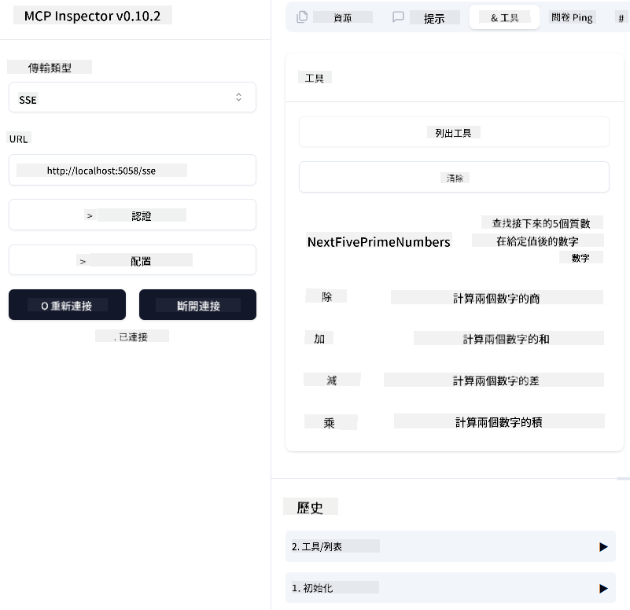
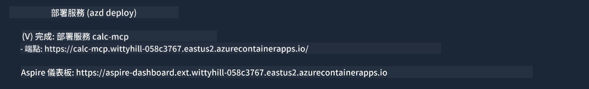

<!--
CO_OP_TRANSLATOR_METADATA:
{
  "original_hash": "5020a3e1a1c7f30c00f9e37f1fa208e3",
  "translation_date": "2025-05-17T14:06:03+00:00",
  "source_file": "04-PracticalImplementation/samples/csharp/README.md",
  "language_code": "hk"
}
-->
# 範例

前面的例子展示了如何使用本地 .NET 專案和 `sdio` 類型，並如何在容器中本地運行伺服器。這在許多情況下是一個不錯的解決方案。然而，有時候讓伺服器在雲端環境中遠程運行可能會更有用。這就是 `http` 類型的作用。

查看 `04-PracticalImplementation` 資料夾中的解決方案，它可能看起來比之前的例子更複雜。但事實上並不是。如果仔細查看專案 `src/mcpserver/mcpserver.csproj`，你會發現它大部分代碼與之前的例子相同。唯一的區別是我們使用了不同的庫 `ModelContextProtocol.AspNetCore` 來處理 HTTP 請求。我們還更改了方法 `IsPrime` 使其成為私有，只是為了展示你可以在代碼中擁有私有方法。其餘代碼與之前相同。

其他專案來自 [.NET Aspire](https://learn.microsoft.com/dotnet/aspire/get-started/aspire-overview)。在解決方案中包含 .NET Aspire 將改善開發者在開發和測試時的體驗，並有助於提高可觀察性。它不是運行伺服器的必要條件，但在解決方案中包含它是一個好習慣。

## 本地啟動伺服器

1. 從 VS Code（使用 C# DevKit 擴展），打開解決方案 `04-PracticalImplementation\samples\csharp\src\Calculator-chap4.sln`。
2. 按下 `F5` 啟動伺服器。應該會啟動一個網頁瀏覽器，顯示 .NET Aspire 儀表板。

或者

1. 從終端導航到資料夾 `04-PracticalImplementation\samples\csharp\src`
2. 執行以下命令以啟動伺服器：
   ```bash
    dotnet run --project .\AppHost
   ```

3. 從儀表板，注意 `http` URL。應該是類似 `http://localhost:5058/`.

## Test `SSE` 並使用 ModelContext Protocol Inspector

如果你有 Node.js 22.7.5 或更高版本，可以使用 ModelContext Protocol Inspector 測試伺服器。

啟動伺服器並在終端中運行以下命令：

```bash
npx @modelcontextprotocol/inspector@latest
```



- 選擇 `SSE` as the Transport type. SSE stand for Server-Sent Events. 
- In the Url field, enter the URL of the server noted earlier,and append `/sse`。應該是 `http` （而不是 `https`) something like `http://localhost:5058/sse`.
- select the Connect button.

A nice thing about the Inspector is that it provide a nice visibility on what is happening.

- Try listing the availables tools
- Try some of them, it should works just like before.


## Test `SSE` with Github Copilot Chat in VS Code

To use the `SSE` transport with Github Copilot Chat, change the configuration of the `mcp-calc` 伺服器先前創建的樣子：

```json
"mcp-calc": {
    "type": "sse",
    "url": "http://localhost:5058/sse"
}
```

做一些測試：
- 請求 6780 之後的 3 個質數。注意 Copilot 將使用新工具 `NextFivePrimeNumbers` 並僅返回前 3 個質數。
- 請求 111 之後的 7 個質數，看看會發生什麼。

# 部署伺服器到 Azure

我們來將伺服器部署到 Azure，以便更多人可以使用它。

從終端導航到資料夾 `04-PracticalImplementation\samples\csharp\src` 並運行以下命令：

```bash
azd init
```

這將在本地創建一些文件以保存 Azure 資源的配置和你的基礎設施即代碼（IaC）。

然後，運行以下命令將伺服器部署到 Azure：

```bash
azd up
```

部署完成後，你應該會看到類似這樣的消息：



導航到 Aspire 儀表板並注意 `HTTP` URL，以便在 MCP Inspector 和 Github Copilot Chat 中使用。

## 接下來是什麼？

我們嘗試了不同的傳輸類型和測試工具，並且還將 MCP 伺服器部署到 Azure。但如果我們的伺服器需要訪問私有資源怎麼辦？例如，資料庫或私有 API？在下一章中，我們將看到如何提高伺服器的安全性。

**免責聲明**：  
此文件使用AI翻譯服務[Co-op Translator](https://github.com/Azure/co-op-translator)進行翻譯。雖然我們努力確保準確性，但請注意，自動翻譯可能包含錯誤或不準確之處。原始文件的母語版本應被視為權威來源。對於關鍵信息，建議使用專業人工翻譯。對於因使用此翻譯而產生的任何誤解或誤釋，我們不承擔責任。