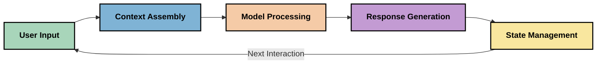
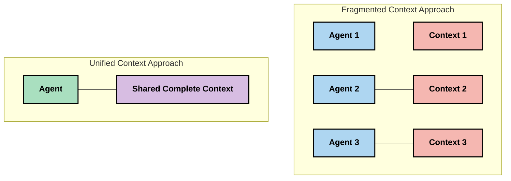
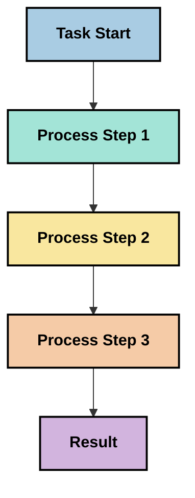
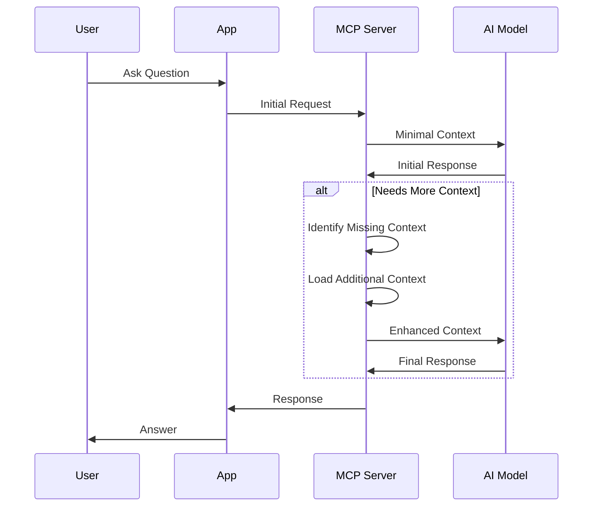
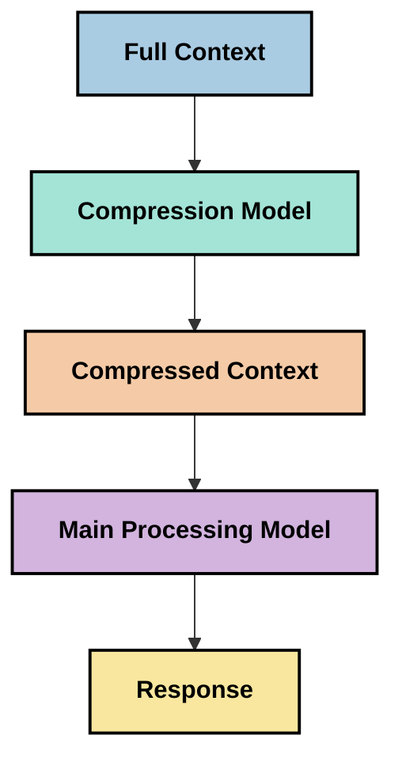
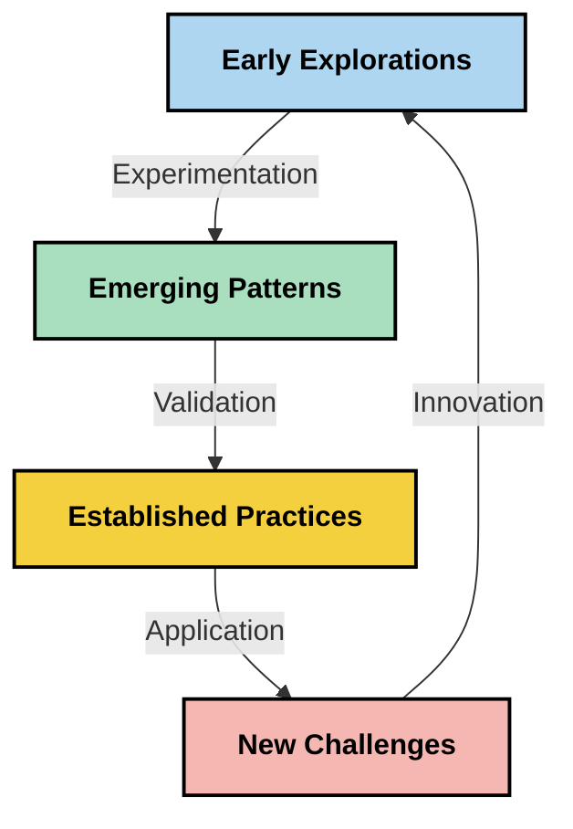

<!--
CO_OP_TRANSLATOR_METADATA:
{
  "original_hash": "fd169ca3071b81b5ee282e194bc823df",
  "translation_date": "2025-09-15T19:54:51+00:00",
  "source_file": "05-AdvancedTopics/mcp-contextengineering/README.md",
  "language_code": "hk"
}
-->
# 上下文工程：MCP生態系統中的新興概念

## 概述

上下文工程是人工智能領域的一個新興概念，探討在客戶與人工智能服務之間的交互過程中，信息如何被結構化、傳遞和維護。隨著模型上下文協議（MCP）生態系統的發展，有效管理上下文的重要性日益凸顯。本模組介紹上下文工程的概念，並探討其在MCP實現中的潛在應用。

## 學習目標

完成本模組後，您將能夠：

- 理解上下文工程的新興概念及其在MCP應用中的潛在角色
- 識別MCP協議設計所解決的上下文管理關鍵挑戰
- 探索通過更好的上下文處理來提升模型性能的技術
- 考慮衡量和評估上下文有效性的方式
- 將這些新興概念應用於MCP框架中，以改善人工智能體驗

## 上下文工程簡介

上下文工程是一個新興概念，專注於用戶、應用程序和人工智能模型之間信息流的有意設計和管理。與已建立的領域（如提示工程）不同，上下文工程仍在被實踐者定義，他們致力於解決為人工智能模型在正確的時間提供正確信息的獨特挑戰。

隨著大型語言模型（LLMs）的發展，上下文的重要性越來越明顯。我們提供的上下文的質量、相關性和結構直接影響模型輸出。上下文工程探討這種關係，並致力於制定有效上下文管理的原則。

> 「到2025年，現有的模型將非常智能。但即使是最聰明的人，如果沒有被要求完成任務的上下文，也無法有效地完成工作……‘上下文工程’是提示工程的下一個層次。它是關於在動態系統中自動完成這一過程。」— Walden Yan, Cognition AI

上下文工程可能包括：

1. **上下文選擇**：確定哪些信息與特定任務相關
2. **上下文結構化**：組織信息以最大化模型理解
3. **上下文傳遞**：優化信息傳遞的方式和時間
4. **上下文維護**：管理上下文的狀態和隨時間的演變
5. **上下文評估**：衡量和改進上下文的有效性

這些重點領域與MCP生態系統特別相關，該生態系統為應用程序向LLMs提供上下文提供了標準化方式。

## 上下文旅程的視角

一種可視化上下文工程的方法是追踪信息在MCP系統中的旅程：



### 上下文旅程中的關鍵階段：

1. **用戶輸入**：來自用戶的原始信息（文本、圖像、文檔）
2. **上下文組裝**：將用戶輸入與系統上下文、對話歷史及其他檢索信息結合
3. **模型處理**：人工智能模型處理組裝的上下文
4. **響應生成**：模型基於提供的上下文生成輸出
5. **狀態管理**：系統根據交互更新其內部狀態

這種視角突出了人工智能系統中上下文的動態特性，並提出了如何在每個階段最佳管理信息的重要問題。

## 上下文工程的新興原則

隨著上下文工程領域的形成，一些早期原則正在從實踐者中浮現。這些原則可能有助於指導MCP實現的選擇：

### 原則1：完整共享上下文

上下文應在系統的所有組件之間完全共享，而不是分散在多個代理或過程中。當上下文被分散時，系統某部分做出的決策可能與其他部分的決策相衝突。



在MCP應用中，這意味著設計上下文能夠無縫流經整個管道的系統，而不是被分隔。

### 原則2：認識到行動包含隱含決策

模型採取的每個行動都包含如何解釋上下文的隱含決策。當多個組件基於不同上下文採取行動時，這些隱含決策可能衝突，導致結果不一致。

這一原則對MCP應用有重要影響：
- 優先線性處理複雜任務，而非基於分散上下文的並行執行
- 確保所有決策點都能訪問相同的上下文信息
- 設計系統，使後續步驟能看到早期決策的完整上下文

### 原則3：平衡上下文深度與窗口限制

隨著對話和過程的延續，上下文窗口最終會溢出。有效的上下文工程探索在全面上下文與技術限制之間管理這種張力的方法。

正在探索的潛在方法包括：
- 上下文壓縮，保留關鍵信息同時減少令牌使用
- 根據當前需求逐步加載上下文
- 對先前交互進行摘要，同時保留關鍵決策和事實

## 上下文挑戰與MCP協議設計

模型上下文協議（MCP）的設計考慮到了上下文管理的獨特挑戰。理解這些挑戰有助於解釋MCP協議設計的關鍵方面：

### 挑戰1：上下文窗口限制
大多數人工智能模型具有固定的上下文窗口大小，限制了它們一次能處理的信息量。

**MCP設計響應：**
- 協議支持結構化的基於資源的上下文，可高效引用
- 資源可分頁並逐步加載

### 挑戰2：相關性判定
判定哪些信息最相關以納入上下文是一項困難的任務。

**MCP設計響應：**
- 靈活的工具允許根據需求動態檢索信息
- 結構化提示使上下文組織一致

### 挑戰3：上下文持久性
跨交互管理狀態需要仔細跟踪上下文。

**MCP設計響應：**
- 標準化的會話管理
- 明確定義的交互模式以促進上下文演變

### 挑戰4：多模態上下文
不同類型的數據（文本、圖像、結構化數據）需要不同的處理方式。

**MCP設計響應：**
- 協議設計適應各種內容類型
- 多模態信息的標準化表示

### 挑戰5：安全性與隱私
上下文通常包含需要保護的敏感信息。

**MCP設計響應：**
- 明確劃分客戶端與服務器的責任
- 本地處理選項以最小化數據暴露

理解這些挑戰以及MCP如何應對它們，為探索更高級的上下文工程技術奠定了基礎。

## 新興上下文工程方法

隨著上下文工程領域的發展，幾種有前景的方法正在浮現。這些代表了當前的思考，而非已確立的最佳實踐，並可能隨著我們對MCP實現的經驗積累而演變。

### 1. 單線性處理

與分散上下文的多代理架構相比，一些實踐者發現單線性處理能產生更一致的結果。這與保持統一上下文的原則一致。



雖然這種方法看起來比並行處理效率低，但它通常能產生更連貫和可靠的結果，因為每一步都基於對先前決策的完整理解。

### 2. 上下文分塊與優先排序

將大型上下文分解為可管理的部分，並優先處理最重要的部分。

```python
# Conceptual Example: Context Chunking and Prioritization
def process_with_chunked_context(documents, query):
    # 1. Break documents into smaller chunks
    chunks = chunk_documents(documents)
    
    # 2. Calculate relevance scores for each chunk
    scored_chunks = [(chunk, calculate_relevance(chunk, query)) for chunk in chunks]
    
    # 3. Sort chunks by relevance score
    sorted_chunks = sorted(scored_chunks, key=lambda x: x[1], reverse=True)
    
    # 4. Use the most relevant chunks as context
    context = create_context_from_chunks([chunk for chunk, score in sorted_chunks[:5]])
    
    # 5. Process with the prioritized context
    return generate_response(context, query)
```

上述概念展示了如何將大型文檔分解為可管理的部分，並僅選擇最相關的部分作為上下文。這種方法有助於在上下文窗口限制內工作，同時利用大型知識庫。

### 3. 漸進式上下文加載

根據需要逐步加載上下文，而非一次性加載。



漸進式上下文加載從最小上下文開始，僅在必要時擴展。這可以顯著減少簡單查詢的令牌使用，同時保持處理複雜問題的能力。

### 4. 上下文壓縮與摘要

在保留關鍵信息的同時減少上下文大小。



上下文壓縮的重點包括：
- 刪除冗余信息
- 對冗長內容進行摘要
- 提取關鍵事實和細節
- 保留重要的上下文元素
- 優化令牌效率

這種方法對於在上下文窗口內維持長對話或高效處理大型文檔特別有價值。一些實踐者正在使用專門的模型，專門用於上下文壓縮和對話歷史的摘要。

## 探索性上下文工程考量

在探索上下文工程新興領域時，以下考量值得在MCP實現中注意。這些不是規範性的最佳實踐，而是可能在您的特定用例中帶來改進的探索領域。

### 考慮您的上下文目標

在實施複雜的上下文管理解決方案之前，明確表述您的目標：
- 模型需要哪些具體信息才能成功？
- 哪些信息是必需的，哪些是輔助的？
- 您的性能約束是什麼（延遲、令牌限制、成本）？

### 探索分層上下文方法

一些實踐者發現分層概念的上下文安排取得了成功：
- **核心層**：模型始終需要的基本信息
- **情境層**：當前交互特定的上下文
- **支持層**：可能有幫助的附加信息
- **回退層**：僅在需要時訪問的信息

### 調查檢索策略

上下文的有效性通常取決於您如何檢索信息：
- 使用語義搜索和嵌入來查找概念相關的信息
- 使用基於關鍵詞的搜索來查找具體事實細節
- 結合多種檢索方法的混合方法
- 使用元數據過濾根據類別、日期或來源縮小範圍

### 實驗上下文連貫性

上下文的結構和流動可能影響模型的理解：
- 將相關信息分組
- 使用一致的格式和組織方式
- 在適當情況下保持邏輯或時間順序
- 避免矛盾信息

### 權衡多代理架構的利弊

雖然多代理架構在許多人工智能框架中很受歡迎，但它們在上下文管理方面存在重大挑戰：
- 上下文分散可能導致代理之間的決策不一致
- 並行處理可能引入難以調和的衝突
- 代理之間的通信開銷可能抵消性能增益
- 複雜的狀態管理需要保持一致性

在許多情況下，單代理方法與全面的上下文管理相比，可能比多個專門代理與分散上下文產生更可靠的結果。

### 開發評估方法

為了隨時間改進上下文工程，考慮如何衡量成功：
- 對不同上下文結構進行A/B測試
- 監控令牌使用和響應時間
- 跟踪用戶滿意度和任務完成率
- 分析上下文策略失敗的原因和原因

這些考量代表了上下文工程領域的活躍探索。隨著該領域的成熟，可能會出現更明確的模式和實踐。

## 衡量上下文有效性：一個演變中的框架

隨著上下文工程作為一個概念的出現，實踐者開始探索如何衡量其有效性。目前尚無既定框架，但一些可能的指標正在被考慮，這些指標可能有助於指導未來的工作。

### 潛在的衡量維度

#### 1. 輸入效率考量

- **上下文與響應比率**：需要多少上下文才能相對於響應大小？
- **令牌利用率**：提供的上下文令牌中有多少影響了響應？
- **上下文縮減**：我們能多有效地壓縮原始信息？

#### 2. 性能考量

- **延遲影響**：上下文管理如何影響響應時間？
- **令牌經濟性**：我們是否有效地優化了令牌使用？
- **檢索精度**：檢索的信息有多相關？
- **資源利用率**：需要哪些計算資源？

#### 3. 質量考量

- **響應相關性**：響應是否很好地回答了查詢？
- **事實準確性**：上下文管理是否改善了事實正確性？
- **一致性**：響應在相似查詢中是否一致？
- **幻覺率**：更好的上下文是否減少了模型幻覺？

#### 4. 用戶體驗考量

- **後續率**：用戶需要澄清的頻率是多少？
- **任務完成**：用戶是否成功完成了目標？
- **滿意度指標**：用戶如何評價他們的體驗？

### 探索性衡量方法

在MCP實現中試驗上下文工程時，考慮以下探索性方法：

1. **基線比較**：在測試更複雜的方法之前，使用簡單上下文方法建立基線

2. **漸進式變化**：一次改變上下文管理的一個方面，以隔離其影響

3. **以用戶為中心的評估**：結合定量指標與定性用戶反饋

4. **失敗分析**：檢查上下文策略失敗的案例以了解潛在改進

5. **多維度評估**：在效率、質量和用戶體驗之間權衡

這種實驗性、多方面的衡量方法與上下文工程的新興特性相一致。

## 結語

上下文工程是一個新興的探索領域，可能對MCP應用的有效性至關重要。通過仔細考慮信息如何流經您的系統，您可以創造更高效、準確且對用戶更有價值的人工智能體驗。

本模組中概述的技術和方法代表了該領域的早期思考，而非已確立的實踐。隨著人工智能能力的發展和我們理解的加深，上下文工程可能會發展成為一個更明確的學科。目前，結合實驗與仔細衡量似乎是最具生產力的方法。

## 潛在的未來方向

上下文工程領域仍處於早期階段，但幾個有前景的方向正在浮現：

- 上下文工程原則可能對模型性能、效率、用戶體驗和可靠性產生重大影響
- 單線性方法與全面上下文管理可能在許多用例中優於多代理架構
- 專門的上下文壓縮模型可能成為人工智能管道中的標準組件
- 上下文完整性與令牌限制之間的張力可能推動上下文處理的創新
- 隨著模型在高效人類式通信方面變得更有能力，真正的多代理協作可能變得更可行
- MCP實現可能演變為標準化上下文管理模式，這些模式源於當前的試驗



## 資源

### 官方MCP資源
- [Model Context Protocol 網站](https://modelcontextprotocol.io/)
- [Model Context Protocol 規範](https://github.com/modelcontextprotocol/modelcontextprotocol)
- [MCP 文件](https://modelcontextprotocol.io/docs)
- [MCP C# SDK](https://github.com/modelcontextprotocol/csharp-sdk)
- [MCP Python SDK](https://github.com/modelcontextprotocol/python-sdk)
- [MCP TypeScript SDK](https://github.com/modelcontextprotocol/typescript-sdk)
- [MCP Inspector](https://github.com/modelcontextprotocol/inspector) - MCP 伺服器的視覺化測試工具

### Context Engineering 文章
- [不要建立多代理：Context Engineering 原則](https://cognition.ai/blog/dont-build-multi-agents) - Walden Yan 關於 Context Engineering 原則的見解
- [建立代理的實用指南](https://cdn.openai.com/business-guides-and-resources/a-practical-guide-to-building-agents.pdf) - OpenAI 關於有效代理設計的指南
- [建立有效代理](https://www.anthropic.com/engineering/building-effective-agents) - Anthropic 的代理開發方法

### 相關研究
- [大型語言模型的動態檢索增強](https://arxiv.org/abs/2310.01487) - 關於動態檢索方法的研究
- [迷失在中間：語言模型如何使用長上下文](https://arxiv.org/abs/2307.03172) - 關於上下文處理模式的重要研究
- [使用 CLIP Latents 的分層文本條件圖像生成](https://arxiv.org/abs/2204.06125) - DALL-E 2 論文，提供上下文結構化的見解
- [探索上下文在大型語言模型架構中的角色](https://aclanthology.org/2023.findings-emnlp.124/) - 最近關於上下文處理的研究
- [多代理協作：調查](https://arxiv.org/abs/2304.03442) - 關於多代理系統及其挑戰的研究

### 額外資源
- [上下文窗口優化技術](https://learn.microsoft.com/en-us/azure/ai-services/openai/concepts/context-window)
- [進階 RAG 技術](https://www.microsoft.com/en-us/research/blog/retrieval-augmented-generation-rag-and-frontier-models/)
- [Semantic Kernel 文件](https://github.com/microsoft/semantic-kernel)
- [上下文管理的 AI 工具包](https://github.com/microsoft/aitoolkit)

## 下一步

- [5.15 MCP 自訂傳輸](../mcp-transport/README.md)

---

**免責聲明**：  
本文件已使用人工智能翻譯服務 [Co-op Translator](https://github.com/Azure/co-op-translator) 進行翻譯。儘管我們致力於提供準確的翻譯，但請注意，自動翻譯可能包含錯誤或不準確之處。原始語言的文件應被視為權威來源。對於重要資訊，建議使用專業人工翻譯。我們對因使用此翻譯而引起的任何誤解或錯誤解釋概不負責。