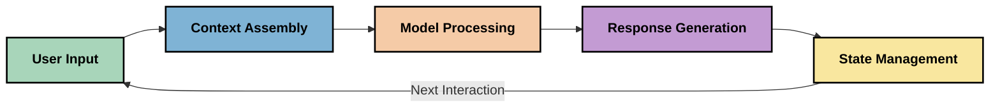
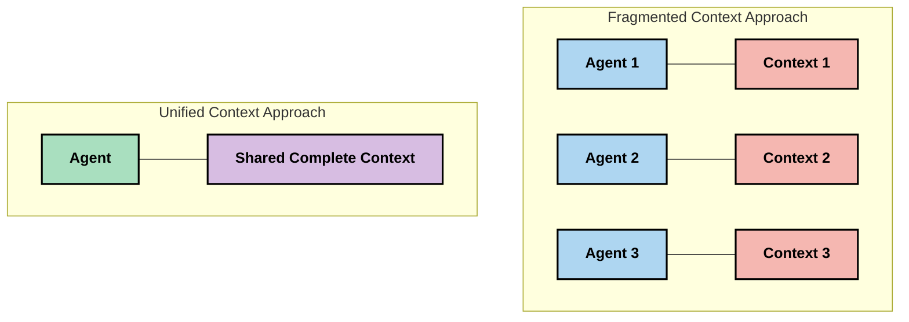
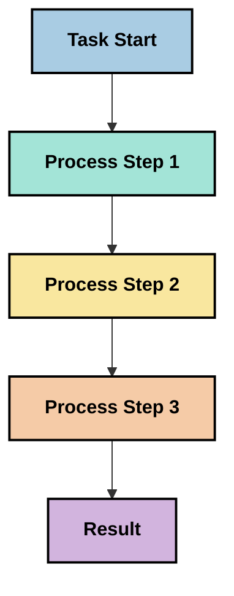
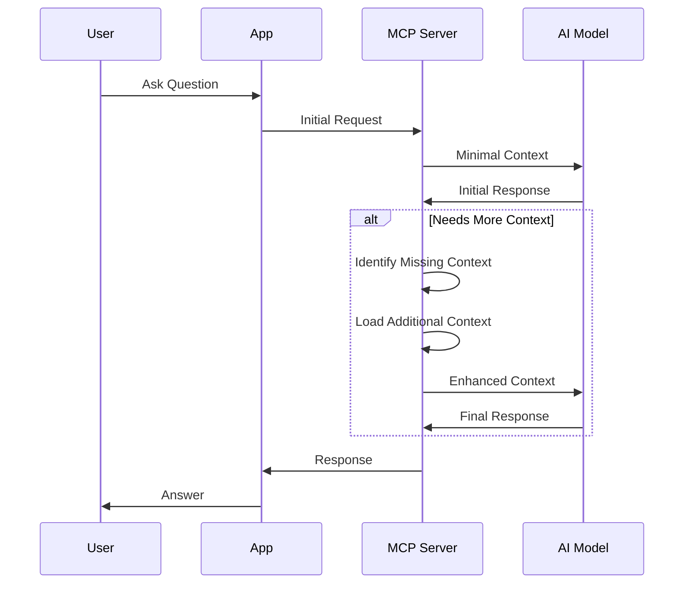
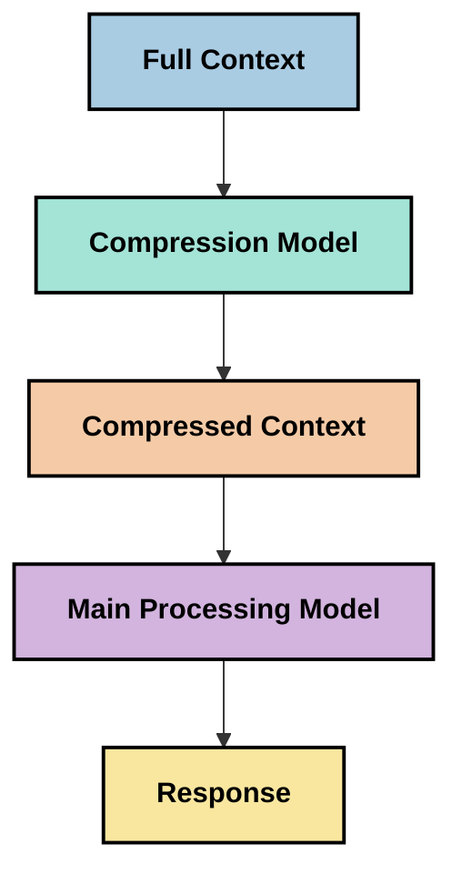
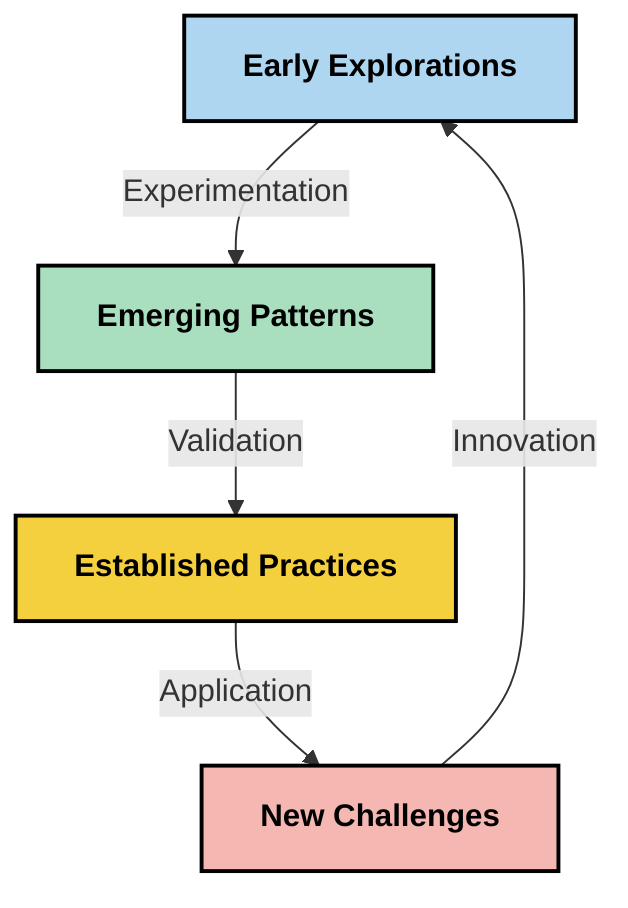

<!--
CO_OP_TRANSLATOR_METADATA:
{
  "original_hash": "5762e8e74dd99d8b7dbb31e69a82561e",
  "translation_date": "2025-07-16T22:56:57+00:00",
  "source_file": "05-AdvancedTopics/mcp-contextengineering/README.md",
  "language_code": "hk"
}
-->
# Context Engineering: MCP 生態系統中新興的概念

## 概覽

Context engineering 是 AI 領域中新興的概念，探討在客戶端與 AI 服務之間互動時，資訊如何被結構化、傳遞及維護。隨著 Model Context Protocol (MCP) 生態系統的發展，如何有效管理上下文變得越來越重要。本模組介紹了 context engineering 的概念，並探討其在 MCP 實作中的潛在應用。

## 學習目標

完成本模組後，你將能夠：

- 理解 context engineering 這一新興概念及其在 MCP 應用中的潛在角色
- 辨識 MCP 協議設計所解決的上下文管理關鍵挑戰
- 探索透過更佳上下文處理提升模型效能的技術
- 考慮衡量與評估上下文有效性的方法
- 將這些新興概念應用於透過 MCP 框架改善 AI 體驗

## Context Engineering 簡介

Context engineering 是一個聚焦於用戶、應用程式與 AI 模型之間資訊流的刻意設計與管理的新興概念。與已建立的領域如 prompt engineering 不同，context engineering 仍由實務者在解決如何在正確時間提供 AI 模型正確資訊的獨特挑戰中逐步定義。

隨著大型語言模型（LLMs）的演進，上下文的重要性日益明顯。我們提供的上下文品質、相關性與結構，直接影響模型輸出。context engineering 探索這種關係，並尋求制定有效上下文管理的原則。

> 「到了 2025 年，模型已經非常聰明。但即使是最聰明的人，若沒有被要求執行任務的上下文，也無法有效完成工作……‘Context engineering’ 是 prompt engineering 的下一階段。它是在動態系統中自動完成這件事。」 — Walden Yan, Cognition AI

Context engineering 可能涵蓋：

1. **Context Selection**：判斷哪些資訊對特定任務有用
2. **Context Structuring**：組織資訊以最大化模型理解
3. **Context Delivery**：優化資訊傳遞的方式與時機
4. **Context Maintenance**：管理上下文的狀態與演變
5. **Context Evaluation**：衡量並提升上下文的有效性

這些焦點領域與 MCP 生態系統特別相關，因為 MCP 提供了應用程式向 LLMs 提供上下文的標準化方式。

## 上下文旅程視角

一種理解 context engineering 的方法是追蹤資訊在 MCP 系統中的流動過程：



### 上下文旅程的關鍵階段：

1. **User Input**：用戶提供的原始資訊（文字、圖片、文件）
2. **Context Assembly**：將用戶輸入與系統上下文、對話歷史及其他檢索資訊結合
3. **Model Processing**：AI 模型處理組合後的上下文
4. **Response Generation**：模型根據提供的上下文產生回應
5. **State Management**：系統根據互動更新內部狀態

此視角凸顯了 AI 系統中上下文的動態特性，並提出如何在每個階段最佳管理資訊的重要問題。

## Context Engineering 的新興原則

隨著 context engineering 領域逐漸成形，實務者開始提出一些初步原則，這些原則有助於指導 MCP 的實作選擇：

### 原則一：完整共享上下文

上下文應在系統所有組件間完整共享，而非分散於多個代理或流程。當上下文被分散時，系統某部分做出的決策可能與其他部分衝突。



在 MCP 應用中，這意味著設計系統時應讓上下文在整個流程中無縫流動，而非被劃分隔離。

### 原則二：認識行動蘊含隱含決策

模型的每個行動都包含對上下文解讀的隱含決策。當多個組件基於不同上下文行動時，這些隱含決策可能衝突，導致結果不一致。

此原則對 MCP 應用有重要啟示：
- 較偏好線性處理複雜任務，而非並行執行且上下文分散
- 確保所有決策點都能存取相同的上下文資訊
- 設計系統讓後續步驟能看到先前決策的完整上下文

### 原則三：平衡上下文深度與視窗限制

隨著對話與流程變長，上下文視窗最終會溢出。有效的 context engineering 探索如何在全面上下文與技術限制間取得平衡。

目前探索的可能方法包括：
- 上下文壓縮，保留關鍵資訊同時減少 token 使用
- 根據當前需求逐步載入上下文
- 對先前互動進行摘要，同時保留關鍵決策與事實

## 上下文挑戰與 MCP 協議設計

Model Context Protocol (MCP) 的設計充分考慮了上下文管理的獨特挑戰。理解這些挑戰有助於說明 MCP 協議設計的關鍵面向：

### 挑戰一：上下文視窗限制
大多數 AI 模型有固定的上下文視窗大小，限制一次能處理的資訊量。

**MCP 設計回應：**  
- 協議支持結構化、基於資源的上下文，可高效引用  
- 資源可分頁並逐步載入

### 挑戰二：相關性判斷
判斷哪些資訊最相關以納入上下文非常困難。

**MCP 設計回應：**  
- 靈活工具支持根據需求動態檢索資訊  
- 結構化提示促進一致的上下文組織

### 挑戰三：上下文持續性
跨互動管理狀態需要細緻追蹤上下文。

**MCP 設計回應：**  
- 標準化的會話管理  
- 明確定義的互動模式以支持上下文演變

### 挑戰四：多模態上下文
不同類型的資料（文字、圖片、結構化資料）需不同處理方式。

**MCP 設計回應：**  
- 協議設計支持多種內容類型  
- 多模態資訊的標準化表示

### 挑戰五：安全與隱私
上下文常包含敏感資訊，必須加以保護。

**MCP 設計回應：**  
- 明確界定客戶端與伺服器責任  
- 提供本地處理選項以降低資料暴露風險

理解這些挑戰及 MCP 如何應對，為探索更先進的 context engineering 技術奠定基礎。

## 新興的 Context Engineering 方法

隨著 context engineering 領域發展，出現了幾種有前景的方法。這些代表當前思考方向，尚非既定最佳實踐，未來隨著 MCP 實作經驗累積將持續演進。

### 1. 單線程線性處理

與分散上下文的多代理架構相反，有實務者發現單線程線性處理能產生更一致的結果。這符合維持統一上下文的原則。



雖然此方法看似效率不及並行處理，但因每一步都建立在對先前決策完整理解上，通常能產生更連貫且可靠的結果。

### 2. 上下文切塊與優先排序

將大型上下文拆分成可管理的片段，並優先選擇最重要的部分。

```python
# Conceptual Example: Context Chunking and Prioritization
def process_with_chunked_context(documents, query):
    # 1. Break documents into smaller chunks
    chunks = chunk_documents(documents)
    
    # 2. Calculate relevance scores for each chunk
    scored_chunks = [(chunk, calculate_relevance(chunk, query)) for chunk in chunks]
    
    # 3. Sort chunks by relevance score
    sorted_chunks = sorted(scored_chunks, key=lambda x: x[1], reverse=True)
    
    # 4. Use the most relevant chunks as context
    context = create_context_from_chunks([chunk for chunk, score in sorted_chunks[:5]])
    
    # 5. Process with the prioritized context
    return generate_response(context, query)
```

上述概念示範如何將大型文件拆成片段，並只選取最相關部分作為上下文。此方法有助於在上下文視窗限制內，仍能利用龐大知識庫。

### 3. 逐步載入上下文

根據需要逐步載入上下文，而非一次載入全部。



逐步載入上下文從最小上下文開始，僅在必要時擴充。這能大幅減少簡單查詢的 token 使用，同時保有處理複雜問題的能力。

### 4. 上下文壓縮與摘要

在保留關鍵資訊的同時，縮減上下文大小。



上下文壓縮聚焦於：  
- 移除冗餘資訊  
- 摘要冗長內容  
- 擷取關鍵事實與細節  
- 保留重要上下文元素  
- 優化 token 使用效率

此方法對於維持長對話在上下文視窗內或高效處理大型文件特別有價值。有實務者使用專門模型來壓縮與摘要對話歷史。

## 探索性 Context Engineering 考量

在探索 context engineering 領域時，針對 MCP 實作有幾點值得注意。這些非規範性最佳實踐，而是可能帶來改進的探索方向。

### 明確你的上下文目標

在實作複雜上下文管理方案前，清楚說明你的目標：  
- 模型成功所需的具體資訊是什麼？  
- 哪些資訊是必須的，哪些是輔助的？  
- 你的效能限制（延遲、token 限制、成本）為何？

### 探索分層上下文方法

部分實務者在概念層次上安排上下文取得成功：  
- **核心層**：模型始終需要的關鍵資訊  
- **情境層**：當前互動特定的上下文  
- **支援層**：可能有幫助的額外資訊  
- **備援層**：僅在需要時存取的資訊

### 研究檢索策略

上下文的有效性往往取決於資訊檢索方式：  
- 使用語義搜尋與嵌入向量尋找概念相關資訊  
- 以關鍵字搜尋特定事實細節  
- 混合多種檢索方法  
- 利用元資料過濾，根據類別、日期或來源縮小範圍

### 試驗上下文連貫性

上下文的結構與流暢度可能影響模型理解：  
- 將相關資訊分組  
- 使用一致的格式與組織方式  
- 適當維持邏輯或時間順序  
- 避免矛盾資訊

### 權衡多代理架構的利弊

雖然多代理架構在許多 AI 框架中受歡迎，但對上下文管理帶來重大挑戰：  
- 上下文分散導致代理間決策不一致  
- 並行處理可能引入難以調和的衝突  
- 代理間通訊開銷可能抵銷效能提升  
- 需複雜狀態管理以維持一致性

在許多情況下，單代理搭配全面上下文管理，可能比多個專門代理分散上下文更可靠。

### 發展評估方法

為持續改進 context engineering，考慮如何衡量成效：  
- A/B 測試不同上下文結構  
- 監控 token 使用與回應時間  
- 追蹤用戶滿意度與任務完成率  
- 分析上下文策略失敗的原因與時機

這些考量是 context engineering 領域積極探索的方向。隨著領域成熟，將出現更明確的模式與實踐。

## 衡量上下文有效性：持續演進的框架

隨著 context engineering 概念興起，實務者開始探索如何衡量其有效性。尚無既定框架，但已有多種指標被考慮，未來可作為指導。

### 潛在衡量維度

#### 1. 輸入效率考量

- **Context-to-Response Ratio**：上下文與回應大小的比例  
- **Token Utilization**：提供的上下文 token 中，有多少實際影響回應  
- **Context Reduction**：壓縮原始資訊的效果

#### 2. 效能考量

- **Latency Impact**：上下文管理對回應時間的影響  
- **Token Economy**：token 使用是否有效率  
- **Retrieval Precision**：檢索資訊的相關性  
- **Resource Utilization**：所需計算資源

#### 3. 品質考量

- **Response Relevance**：回應對查詢的貼切度  
- **Factual Accuracy**：上下文管理是否提升事實正確性  
- **Consistency**：相似查詢回應的一致性  
- **Hallucination Rate**：更好上下文是否降低模型幻覺

#### 4. 用戶體驗考量

- **Follow-up Rate**：用戶需要澄清的頻率  
- **Task Completion**：用戶是否成功完成目標  
- **Satisfaction Indicators**：用戶對體驗的評價

### 探索性衡量方法

在 MCP 實作中試驗 context engineering 時，可考慮以下方法：

1. **基線比較**：先用簡單上下文方法建立基線，再測試更複雜方案  
2. **漸進變更**：一次只改變一個上下文管理面向，以隔離效果  
3. **以用戶為中心的評估**：結合量化指標與質性用戶反饋  
4. **失敗分析**：檢視上下文策略失敗案例，尋找改進空間  
5. **多維度評估**：考量效率、品質與用戶體驗間的權衡

這種實驗性、多面向的衡量方法，符合 context engineering 的新興特性。

## 結語

Context engineering 是一個新興探索領域，可能成為有效 MCP 應用的核心。透過深思熟慮地管理資訊在系統中的流動，你有機會打造更高效、準確且對用戶更有價值的 AI 體驗。

本模組所述技術與方法代表此領域的早期思考，尚非既定實踐。隨著 AI 能力提升與理解深化，context engineering 有望發展成更明確的學科。目前，結合實驗與謹慎衡量似乎是最有效的路徑。

## 未來可能方向

Context engineering 領域仍處於起步階段，但已有幾個有前景的方向：

- Context engineering 原則可能顯著影響模型效能、效率、用戶體驗與可靠性  
- 單線程搭配全面上下文管理，對多數用例可能優於多代理架構  
- 專門的上下文壓縮模型或成為 AI 流程的標準組件  
- 上下文完整性與 token 限制間的張力將推動上下文處理創新  
- 隨著模型更擅長高效且類人溝通，真正的多代理協作或將更可行  
- MCP 實作可能演進，標準化從現有實驗中浮現的上下文管理模式



## 資源

### Official MCP Resources
- [Model Context Protocol 網站](https://modelcontextprotocol.io/)
- [Model Context Protocol 規範](https://github.com/modelcontextprotocol/modelcontextprotocol)
- [MCP 文件](https://modelcontextprotocol.io/docs)
- [MCP C# SDK](https://github.com/modelcontextprotocol/csharp-sdk)
- [MCP Python SDK](https://github.com/modelcontextprotocol/python-sdk)
- [MCP TypeScript SDK](https://github.com/modelcontextprotocol/typescript-sdk)
- [MCP Inspector](https://github.com/modelcontextprotocol/inspector) - MCP 伺服器的視覺化測試工具

### Context Engineering 文章
- [不要建造多代理：Context Engineering 的原則](https://cognition.ai/blog/dont-build-multi-agents) - Walden Yan 對 context engineering 原則的見解
- [建造代理的實用指南](https://cdn.openai.com/business-guides-and-resources/a-practical-guide-to-building-agents.pdf) - OpenAI 關於有效代理設計的指南
- [打造高效代理](https://www.anthropic.com/engineering/building-effective-agents) - Anthropic 的代理開發方法

### 相關研究
- [大型語言模型的動態檢索增強](https://arxiv.org/abs/2310.01487) - 關於動態檢索方法的研究
- [迷失在中間：語言模型如何使用長上下文](https://arxiv.org/abs/2307.03172) - 關於上下文處理模式的重要研究
- [基於 CLIP 潛在向量的分層文本條件圖像生成](https://arxiv.org/abs/2204.06125) - DALL-E 2 論文，提供上下文結構的見解
- [探索上下文在大型語言模型架構中的角色](https://aclanthology.org/2023.findings-emnlp.124/) - 最新的上下文處理研究
- [多代理協作：綜述](https://arxiv.org/abs/2304.03442) - 關於多代理系統及其挑戰的研究

### 額外資源
- [上下文視窗優化技術](https://learn.microsoft.com/en-us/azure/ai-services/openai/concepts/context-window)
- [進階 RAG 技術](https://www.microsoft.com/en-us/research/blog/retrieval-augmented-generation-rag-and-frontier-models/)
- [Semantic Kernel 文件](https://github.com/microsoft/semantic-kernel)
- [Context 管理的 AI 工具包](https://github.com/microsoft/aitoolkit)

## 下一步
- [6. 社群貢獻](../../06-CommunityContributions/README.md)

**免責聲明**：  
本文件由 AI 翻譯服務 [Co-op Translator](https://github.com/Azure/co-op-translator) 進行翻譯。雖然我們致力於確保準確性，但請注意自動翻譯可能包含錯誤或不準確之處。原始文件的母語版本應被視為權威來源。對於重要資訊，建議採用專業人工翻譯。我們不對因使用本翻譯而引起的任何誤解或誤釋承擔責任。