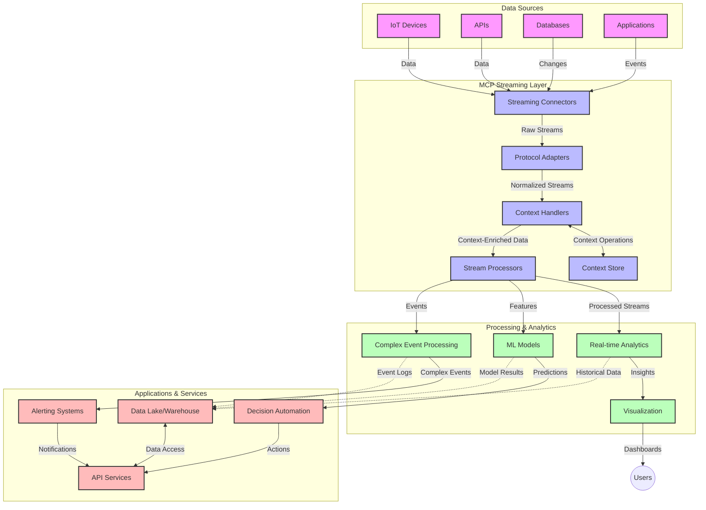

<!--
CO_OP_TRANSLATOR_METADATA:
{
  "original_hash": "68c518dbff8a3b127ed2aa934054c56c",
  "translation_date": "2025-06-11T17:01:21+00:00",
  "source_file": "05-AdvancedTopics/mcp-realtimestreaming/README.md",
  "language_code": "hk"
}
-->
# Model Context Protocol 用於實時數據串流

## 概覽

實時數據串流在現今數據驅動的世界中變得不可或缺，企業和應用程式需要即時取得資訊，以便作出及時決策。Model Context Protocol (MCP) 是優化這些實時串流流程的重要突破，提升數據處理效率、保持上下文完整性，並改善整體系統效能。

本模組探討 MCP 如何透過為 AI 模型、串流平台及應用程式提供標準化的上下文管理方法，改變實時數據串流。

## 實時數據串流簡介

實時數據串流是一種技術範式，能夠持續傳輸、處理及分析數據，隨著數據生成即時反應。與傳統批次處理針對靜態數據集運作不同，串流是對動態數據進行處理，實現低延遲的洞察與行動。

### 實時數據串流的核心概念：

- **持續數據流**：數據以連續、不間斷的事件或記錄流形式處理。
- **低延遲處理**：系統設計以最小化數據生成到處理的時間。
- **可擴展性**：串流架構須能處理不同數量及速度的數據。
- **容錯能力**：系統需具備故障復原能力，確保數據流不中斷。
- **有狀態處理**：跨事件保持上下文對有意義的分析至關重要。

### Model Context Protocol 與實時串流

Model Context Protocol (MCP) 解決實時串流環境中的多項關鍵挑戰：

1. **上下文連續性**：MCP 標準化分散式串流元件之間上下文的維護，確保 AI 模型及處理節點能存取相關的歷史與環境上下文。

2. **高效狀態管理**：透過提供結構化的上下文傳輸機制，MCP 降低串流管線中狀態管理的負擔。

3. **互通性**：MCP 建立多種串流技術與 AI 模型間共享上下文的通用語言，促進更靈活且可擴展的架構。

4. **串流優化的上下文**：MCP 實作能優先處理對即時決策最重要的上下文元素，兼顧效能與準確度。

5. **自適應處理**：透過 MCP 的上下文管理，串流系統能根據數據中不斷變化的條件和模式動態調整處理流程。

在現代應用中，從物聯網感測網絡到金融交易平台，MCP 與串流技術的結合，促使更智慧、具上下文感知的處理，能即時且適當地回應複雜且持續演變的情況。

## 學習目標

完成本課程後，你將能夠：

- 了解實時數據串流的基本原理及挑戰
- 解釋 Model Context Protocol (MCP) 如何提升實時數據串流
- 使用 Kafka 和 Pulsar 等主流框架實作 MCP 串流解決方案
- 設計及部署具容錯性與高效能的 MCP 串流架構
- 將 MCP 概念應用於物聯網、金融交易及 AI 分析案例
- 評估 MCP 串流技術的最新趨勢與未來創新

### 定義與重要性

實時數據串流涉及持續生成、處理及傳遞數據，延遲極低。與批次處理將數據收集後分批處理不同，串流數據隨到即處理，實現即時洞察與反應。

實時數據串流的主要特徵包括：

- **低延遲**：在毫秒至秒級時間內處理與分析數據
- **持續流動**：來自多種來源的不間斷數據流
- **即時處理**：隨數據到達即分析，而非批次處理
- **事件驅動架構**：根據事件發生即時回應

### 傳統數據串流面臨的挑戰

傳統串流方式存在以下限制：

1. **上下文丟失**：難以在分散系統中維持上下文
2. **擴展性問題**：難以應付高量與高速數據
3. **整合複雜**：不同系統間互通性差
4. **延遲管理**：需平衡吞吐量與處理時間
5. **數據一致性**：確保整個串流中數據的準確與完整

## 了解 Model Context Protocol (MCP)

### 什麼是 MCP？

Model Context Protocol (MCP) 是一種標準化的通訊協定，旨在促進 AI 模型與應用程式之間的高效互動。在實時數據串流中，MCP 提供一個框架，用於：

- 在整個數據管線中保留上下文
- 標準化數據交換格式
- 優化大型數據集的傳輸
- 強化模型間及模型與應用間的通訊

### 核心元件與架構

針對實時串流的 MCP 架構包含以下主要元件：

1. **Context Handlers**：管理並維護串流管線中的上下文資訊
2. **Stream Processors**：利用上下文感知技術處理進入的數據流
3. **Protocol Adapters**：在不同串流協定間轉換，並保持上下文
4. **Context Store**：高效存取上下文資訊
5. **Streaming Connectors**：連接多種串流平台（如 Kafka、Pulsar、Kinesis 等）



### MCP 如何改善實時數據處理

MCP 解決傳統串流挑戰，方法包括：

- **上下文完整性**：維護整條管線中數據點間的關聯
- **優化傳輸**：透過智慧上下文管理減少數據交換冗餘
- **標準化介面**：為串流元件提供一致的 API
- **降低延遲**：透過高效上下文處理減少處理負擔
- **提升擴展性**：支援水平擴展同時保持上下文

## 整合與實作

實時數據串流系統需謹慎設計架構與實作，以同時維持效能與上下文完整性。Model Context Protocol 提供標準化方法，整合 AI 模型與串流技術，實現更先進且具上下文感知的處理管線。

### MCP 在串流架構中的整合概述

在實時串流環境中實作 MCP 時需考慮：

1. **上下文序列化與傳輸**：MCP 提供高效機制，將上下文資訊編碼於串流數據包中，確保重要上下文隨數據在管線中傳遞。包含針對串流傳輸優化的標準化序列化格式。

2. **有狀態串流處理**：MCP 透過維持一致的上下文表示，支援更智能的有狀態處理，特別適用於傳統上狀態管理困難的分散式串流架構。

3. **事件時間與處理時間**：MCP 實作須解決事件發生時間與處理時間的區分問題，可納入時間上下文以保留事件時間語意。

4. **背壓管理**：標準化上下文處理，協助串流系統管理背壓，讓元件通報處理能力並調整數據流量。

5. **上下文視窗與聚合**：MCP 提供結構化的時間與關聯上下文表示，促進更有意義的事件流聚合操作。

6. **恰好一次處理**：對於需恰好一次語意的串流系統，MCP 可納入處理元資料，協助追蹤及驗證分散元件的處理狀態。

MCP 在多種串流技術中的實作，打造統一的上下文管理方法，減少客製化整合程式碼，並提升系統在數據流動中保持上下文的能力。

### MCP 在不同數據串流框架中的應用

MCP 可與多種主流串流框架整合，包括：

#### Apache Kafka 整合

```python
from mcp_streaming import MCPKafkaConnector

# Initialize MCP Kafka connector
connector = MCPKafkaConnector(
    bootstrap_servers='localhost:9092',
    context_preservation=True
)

# Create a context-aware consumer
consumer = connector.create_consumer('input-topic')

# Process streaming data with context
for message in consumer:
    context = message.get_context()
    data = message.get_value()
    
    # Process with context awareness
    result = process_with_context(data, context)
    
    # Produce output with preserved context
    connector.produce('output-topic', result, context=context)
```

#### Apache Pulsar 實作

```python
from mcp_streaming import MCPPulsarClient

# Initialize MCP Pulsar client
client = MCPPulsarClient('pulsar://localhost:6650')

# Subscribe with context awareness
consumer = client.subscribe('input-topic', 'subscription-name', 
                           context_enabled=True)

# Process messages with context preservation
while True:
    message = consumer.receive()
    context = message.get_context()
    
    # Process with context
    result = process_with_context(message.data(), context)
    
    # Acknowledge the message
    consumer.acknowledge(message)
    
    # Send result with preserved context
    producer = client.create_producer('output-topic')
    producer.send(result, context=context)
```

### 部署最佳實踐

實作 MCP 實時串流時：

1. **設計容錯性**：
   - 實施適當錯誤處理
   - 使用死信隊列處理失敗訊息
   - 設計冪等處理器

2. **優化效能**：
   - 配置合適緩衝區大小
   - 適時使用批次處理
   - 實施背壓機制

3. **監控與觀察**：
   - 追蹤串流處理指標
   - 監控上下文傳播狀況
   - 設置異常警示

4. **保護串流安全**：
   - 為敏感數據實施加密
   - 使用身份驗證與授權
   - 採用適當存取控制

### MCP 在物聯網與邊緣運算的應用

MCP 強化物聯網串流：

- 保留設備上下文於處理管線中
- 支援高效的邊緣到雲端數據串流
- 支援物聯網數據串流的實時分析
- 促進設備間具上下文的通訊

範例：智慧城市感測網絡  
```
Sensors → Edge Gateways → MCP Stream Processors → Real-time Analytics → Automated Responses
```

### 在金融交易與高頻交易中的角色

MCP 為金融數據串流帶來顯著優勢：

- 超低延遲處理以支持交易決策
- 保持交易上下文貫穿整個處理流程
- 支援具上下文感知的複雜事件處理
- 確保分散交易系統中的數據一致性

### 強化 AI 驅動的數據分析

MCP 為串流分析創造新可能：

- 實時模型訓練與推論
- 持續從串流數據中學習
- 上下文感知的特徵提取
- 多模型推論管線並保持上下文

## 未來趨勢與創新

### MCP 在實時環境的演進

展望未來，預期 MCP 將應對：

- **量子運算整合**：為量子基礎串流系統做準備
- **邊緣原生處理**：將更多上下文感知處理移至邊緣設備
- **自主串流管理**：自我優化的串流管線
- **聯邦串流**：在保護隱私的前提下進行分散處理

### 技術潛在進展

將塑造 MCP 串流未來的技術包括：

1. **AI 優化串流協定**：專為 AI 工作負載設計的自訂協定
2. **神經形態運算整合**：靈感來自大腦的串流處理運算
3. **無伺服器串流**：事件驅動且可擴展的串流，無需基礎設施管理
4. **分散式上下文存儲**：全球分散且高度一致的上下文管理

## 實作練習

### 練習 1：建立基礎 MCP 串流管線

本練習將教你如何：

- 配置基本 MCP 串流環境
- 實作串流處理的上下文管理器
- 測試並驗證上下文的保留

### 練習 2：打造實時分析儀表板

建立完整應用，能：

- 使用 MCP 擷取串流數據
- 在保持上下文的同時處理數據流
- 實時視覺化結果

### 練習 3：用 MCP 實作複雜事件處理

進階練習涵蓋：

- 串流中的模式偵測
- 多串流間的上下文關聯
- 產生具保留上下文的複雜事件

## 額外資源

- [Model Context Protocol Specification](https://github.com/microsoft/model-context-protocol) - 官方 MCP 規範與文件
- [Apache Kafka Documentation](https://kafka.apache.org/documentation/) - Kafka 串流處理學習資源
- [Apache Pulsar](https://pulsar.apache.org/) - 統一訊息與串流平台
- [Streaming Systems: The What, Where, When, and How of Large-Scale Data Processing](https://www.oreilly.com/library/view/streaming-systems/9781491983867/) - 串流架構全面指南
- [Microsoft Azure Event Hubs](https://learn.microsoft.com/en-us/azure/event-hubs/event-hubs-about) - 管理型事件串流服務
- [MLflow Documentation](https://mlflow.org/docs/latest/index.html) - 機器學習模型追蹤與部署
- [Real-Time Analytics with Apache Storm](https://storm.apache.org/releases/current/index.html) - 實時計算處理框架
- [Flink ML](https://nightlies.apache.org/flink/flink-ml-docs-master/) - Apache Flink 的機器學習庫
- [LangChain Documentation](https://python.langchain.com/docs/get_started/introduction) - 使用大型語言模型建立應用

## 學習成果

完成本模組後，你將能：

- 了解實時數據串流的基本原理與挑戰
- 解釋 Model Context Protocol (MCP) 如何提升實時數據串流
- 使用 Kafka 和 Pulsar 等主流框架實作 MCP 串流解決方案
- 設計及部署具容錯性與高效能的 MCP 串流架構
- 將 MCP 概念應用於物聯網、金融交易及 AI 分析案例
- 評估 MCP 串流技術的最新趨勢與未來創新

## 下一步

- [6. 社群貢獻](../../06-CommunityContributions/README.md)

**免責聲明**：  
本文件乃使用 AI 翻譯服務 [Co-op Translator](https://github.com/Azure/co-op-translator) 進行翻譯。雖然我們致力於確保準確性，但請注意自動翻譯可能存在錯誤或不準確之處。原始文件之母語版本應視為權威來源。對於重要資訊，建議採用專業人工翻譯。我們不對因使用此翻譯而引起之任何誤解或誤釋負責。