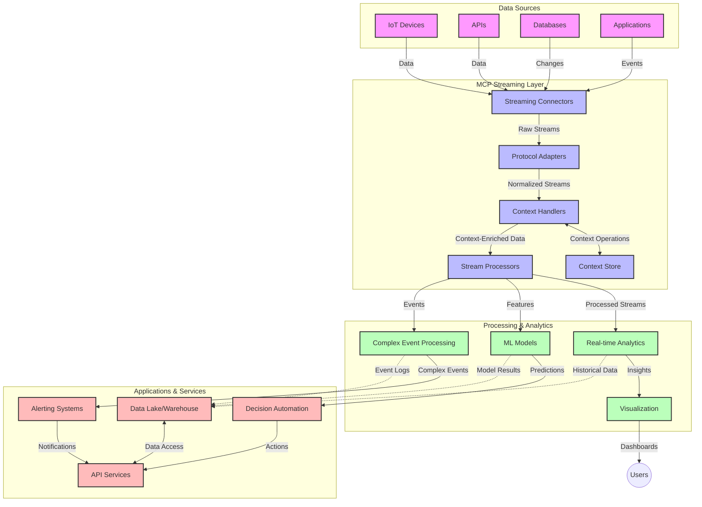

<!--
CO_OP_TRANSLATOR_METADATA:
{
  "original_hash": "195f7287638b77a549acadd96c8f981c",
  "translation_date": "2025-06-12T21:29:07+00:00",
  "source_file": "05-AdvancedTopics/mcp-realtimestreaming/README.md",
  "language_code": "hk"
}
-->
# Model Context Protocol 用於實時數據串流

## 概覽

在現今數據驅動的世界，即時數據串流變得不可或缺，企業和應用程式需要即時取得資訊以作出及時決策。Model Context Protocol (MCP) 在優化這些即時串流過程上帶來重大突破，提高數據處理效率、保持上下文完整性，並提升整體系統效能。

本模組探討 MCP 如何透過為 AI 模型、串流平台及應用程式提供標準化的上下文管理方法，徹底改變即時數據串流。

## 即時數據串流簡介

即時數據串流是一種技術範式，使數據能在產生時持續傳輸、處理和分析，讓系統能夠即時回應新資訊。與傳統批次處理只對靜態資料集操作不同，串流處理的是動態流動中的數據，提供低延遲的洞察和行動。

### 即時數據串流的核心概念：

- **持續數據流**：數據以連續、不間斷的事件或紀錄流動進行處理。
- **低延遲處理**：系統設計旨在縮短數據產生與處理之間的時間。
- **可擴展性**：串流架構必須能處理變化多端的數據量和速度。
- **容錯性**：系統需具備抗故障能力，確保數據流不中斷。
- **有狀態處理**：跨事件維持上下文對於有意義的分析至關重要。

### Model Context Protocol 與即時串流

Model Context Protocol (MCP) 解決了即時串流環境中的多項關鍵挑戰：

1. **上下文連續性**：MCP 標準化分散式串流元件間的上下文維護，確保 AI 模型和處理節點能存取相關的歷史及環境上下文。

2. **高效狀態管理**：透過提供結構化的上下文傳輸機制，MCP 減輕串流管線中狀態管理的負擔。

3. **互通性**：MCP 建立多元串流技術與 AI 模型間共享上下文的通用語言，實現更靈活且可擴展的架構。

4. **串流優化上下文**：MCP 實作可優先處理對即時決策最相關的上下文元素，兼顧效能與準確度。

5. **自適應處理**：透過 MCP 的上下文管理，串流系統能根據數據中不斷變化的條件和模式動態調整處理流程。

從物聯網感測網絡到金融交易平台，MCP 與串流技術的整合使處理更智慧、具上下文感知，能即時且適切地回應複雜且不斷演進的情況。

## 學習目標

完成本課程後，你將能夠：

- 理解即時數據串流的基本原理及其挑戰
- 解釋 Model Context Protocol (MCP) 如何強化即時數據串流
- 使用 Kafka、Pulsar 等流行框架實作基於 MCP 的串流解決方案
- 設計並部署具容錯性及高效能的 MCP 串流架構
- 將 MCP 概念應用於物聯網、金融交易及 AI 驅動的分析案例
- 評估 MCP 串流技術的最新趨勢與未來創新

### 定義與重要性

即時數據串流指的是以極低延遲持續產生、處理及傳遞數據。與收集並批次處理資料的傳統方式不同，串流數據隨著抵達逐步處理，實現即時洞察與行動。

即時數據串流的關鍵特性包括：

- **低延遲**：在毫秒到秒的時間內處理和分析數據
- **持續流動**：來自多元來源的不中斷數據流
- **即時處理**：數據抵達即分析，而非批次
- **事件驅動架構**：隨事件發生即時回應

### 傳統數據串流的挑戰

傳統數據串流方法面臨多項限制：

1. **上下文遺失**：難以跨分散系統維持上下文
2. **擴展性問題**：難以因應高量、高速數據
3. **整合複雜度**：不同系統間互通困難
4. **延遲管理**：需在吞吐量與處理時間間取得平衡
5. **數據一致性**：確保串流中數據的準確與完整

## 了解 Model Context Protocol (MCP)

### 什麼是 MCP？

Model Context Protocol (MCP) 是一套標準化通訊協定，旨在促進 AI 模型與應用程式間的高效互動。在即時數據串流中，MCP 提供：

- 在整個數據管線中保存上下文
- 標準化數據交換格式
- 優化大規模數據傳輸
- 強化模型與模型、模型與應用間的溝通

### 核心元件與架構

即時串流的 MCP 架構包含以下主要元件：

1. **Context Handlers**：管理並維護串流管線中的上下文資訊
2. **Stream Processors**：利用上下文感知技術處理進入的數據串流
3. **Protocol Adapters**：在不同串流協定間轉換，同時保留上下文
4. **Context Store**：高效儲存與檢索上下文資訊
5. **Streaming Connectors**：連接各種串流平台（Kafka、Pulsar、Kinesis 等）



### MCP 如何提升即時數據處理

MCP 透過以下方式解決傳統串流挑戰：

- **上下文完整性**：維持整條管線中數據點間的關聯
- **優化傳輸**：透過智慧上下文管理減少數據交換冗餘
- **標準化介面**：為串流元件提供一致的 API
- **降低延遲**：有效上下文處理降低處理負擔
- **提升可擴展性**：支持橫向擴展同時保持上下文

## 整合與實作

即時數據串流系統需謹慎設計架構與實作，以兼顧效能與上下文完整性。Model Context Protocol 提供標準化方法，協助整合 AI 模型與串流技術，打造更複雜且具上下文感知的處理管線。

### MCP 在串流架構中的整合概覽

在即時串流環境實作 MCP 時需考慮以下重點：

1. **上下文序列化與傳輸**：MCP 提供高效機制將上下文資訊編碼於串流數據封包中，確保關鍵上下文隨數據流轉。包含為串流傳輸優化的標準序列化格式。

2. **有狀態串流處理**：MCP 透過維持一致的上下文表示，促進更智慧的有狀態處理。此點對於分散式串流架構中狀態管理尤為重要。

3. **事件時間與處理時間**：MCP 實作須處理事件發生時間與處理時間的區別，協定可包含保留事件時間語意的時間上下文。

4. **背壓管理**：標準化上下文處理有助於管理串流系統背壓，使元件能通報處理能力並調整流量。

5. **上下文窗口與聚合**：MCP 透過結構化時間及關聯上下文表示，促進更有意義的窗口運算與事件串流聚合。

6. **精確一次處理**：在需確保精確一次語意的串流系統中，MCP 可納入處理元資料，協助追蹤與驗證分散元件間的處理狀態。

MCP 在多種串流技術間的實作建立統一上下文管理方式，減少客製整合程式碼需求，同時提升系統在數據流轉過程中維持有意義上下文的能力。

### MCP 在不同數據串流框架中的應用

以下範例依據目前 MCP 規範，採用基於 JSON-RPC 的協定並具備多種傳輸機制。程式碼示範如何實作自訂傳輸，整合 Kafka 與 Pulsar 等串流平台，同時完全相容 MCP 協定。

這些範例展示如何將串流平台與 MCP 整合，實現即時數據處理並保持 MCP 所強調的上下文感知。確保程式碼範例精準反映截至 2025 年 6 月的 MCP 規範現況。

MCP 可與多個流行串流框架整合，包括：

#### Apache Kafka 整合

```python
import asyncio
import json
from typing import Dict, Any, Optional
from confluent_kafka import Consumer, Producer, KafkaError
from mcp.client import Client, ClientCapabilities
from mcp.core.message import JsonRpcMessage
from mcp.core.transports import Transport

# Custom transport class to bridge MCP with Kafka
class KafkaMCPTransport(Transport):
    def __init__(self, bootstrap_servers: str, input_topic: str, output_topic: str):
        self.bootstrap_servers = bootstrap_servers
        self.input_topic = input_topic
        self.output_topic = output_topic
        self.producer = Producer({'bootstrap.servers': bootstrap_servers})
        self.consumer = Consumer({
            'bootstrap.servers': bootstrap_servers,
            'group.id': 'mcp-client-group',
            'auto.offset.reset': 'earliest'
        })
        self.message_queue = asyncio.Queue()
        self.running = False
        self.consumer_task = None
        
    async def connect(self):
        """Connect to Kafka and start consuming messages"""
        self.consumer.subscribe([self.input_topic])
        self.running = True
        self.consumer_task = asyncio.create_task(self._consume_messages())
        return self
        
    async def _consume_messages(self):
        """Background task to consume messages from Kafka and queue them for processing"""
        while self.running:
            try:
                msg = self.consumer.poll(1.0)
                if msg is None:
                    await asyncio.sleep(0.1)
                    continue
                
                if msg.error():
                    if msg.error().code() == KafkaError._PARTITION_EOF:
                        continue
                    print(f"Consumer error: {msg.error()}")
                    continue
                
                # Parse the message value as JSON-RPC
                try:
                    message_str = msg.value().decode('utf-8')
                    message_data = json.loads(message_str)
                    mcp_message = JsonRpcMessage.from_dict(message_data)
                    await self.message_queue.put(mcp_message)
                except Exception as e:
                    print(f"Error parsing message: {e}")
            except Exception as e:
                print(f"Error in consumer loop: {e}")
                await asyncio.sleep(1)
    
    async def read(self) -> Optional[JsonRpcMessage]:
        """Read the next message from the queue"""
        try:
            message = await self.message_queue.get()
            return message
        except Exception as e:
            print(f"Error reading message: {e}")
            return None
    
    async def write(self, message: JsonRpcMessage) -> None:
        """Write a message to the Kafka output topic"""
        try:
            message_json = json.dumps(message.to_dict())
            self.producer.produce(
                self.output_topic,
                message_json.encode('utf-8'),
                callback=self._delivery_report
            )
            self.producer.poll(0)  # Trigger callbacks
        except Exception as e:
            print(f"Error writing message: {e}")
    
    def _delivery_report(self, err, msg):
        """Kafka producer delivery callback"""
        if err is not None:
            print(f'Message delivery failed: {err}')
        else:
            print(f'Message delivered to {msg.topic()} [{msg.partition()}]')
    
    async def close(self) -> None:
        """Close the transport"""
        self.running = False
        if self.consumer_task:
            self.consumer_task.cancel()
            try:
                await self.consumer_task
            except asyncio.CancelledError:
                pass
        self.consumer.close()
        self.producer.flush()

# Example usage of the Kafka MCP transport
async def kafka_mcp_example():
    # Create MCP client with Kafka transport
    client = Client(
        {"name": "kafka-mcp-client", "version": "1.0.0"},
        ClientCapabilities({})
    )
    
    # Create and connect the Kafka transport
    transport = KafkaMCPTransport(
        bootstrap_servers="localhost:9092",
        input_topic="mcp-responses",
        output_topic="mcp-requests"
    )
    
    await client.connect(transport)
    
    try:
        # Initialize the MCP session
        await client.initialize()
        
        # Example of executing a tool via MCP
        response = await client.execute_tool(
            "process_data",
            {
                "data": "sample data",
                "metadata": {
                    "source": "sensor-1",
                    "timestamp": "2025-06-12T10:30:00Z"
                }
            }
        )
        
        print(f"Tool execution response: {response}")
        
        # Clean shutdown
        await client.shutdown()
    finally:
        await transport.close()

# Run the example
if __name__ == "__main__":
    asyncio.run(kafka_mcp_example())
```

#### Apache Pulsar 實作

```python
import asyncio
import json
import pulsar
from typing import Dict, Any, Optional
from mcp.core.message import JsonRpcMessage
from mcp.core.transports import Transport
from mcp.server import Server, ServerOptions
from mcp.server.tools import Tool, ToolExecutionContext, ToolMetadata

# Create a custom MCP transport that uses Pulsar
class PulsarMCPTransport(Transport):
    def __init__(self, service_url: str, request_topic: str, response_topic: str):
        self.service_url = service_url
        self.request_topic = request_topic
        self.response_topic = response_topic
        self.client = pulsar.Client(service_url)
        self.producer = self.client.create_producer(response_topic)
        self.consumer = self.client.subscribe(
            request_topic,
            "mcp-server-subscription",
            consumer_type=pulsar.ConsumerType.Shared
        )
        self.message_queue = asyncio.Queue()
        self.running = False
        self.consumer_task = None
    
    async def connect(self):
        """Connect to Pulsar and start consuming messages"""
        self.running = True
        self.consumer_task = asyncio.create_task(self._consume_messages())
        return self
    
    async def _consume_messages(self):
        """Background task to consume messages from Pulsar and queue them for processing"""
        while self.running:
            try:
                # Non-blocking receive with timeout
                msg = self.consumer.receive(timeout_millis=500)
                
                # Process the message
                try:
                    message_str = msg.data().decode('utf-8')
                    message_data = json.loads(message_str)
                    mcp_message = JsonRpcMessage.from_dict(message_data)
                    await self.message_queue.put(mcp_message)
                    
                    # Acknowledge the message
                    self.consumer.acknowledge(msg)
                except Exception as e:
                    print(f"Error processing message: {e}")
                    # Negative acknowledge if there was an error
                    self.consumer.negative_acknowledge(msg)
            except Exception as e:
                # Handle timeout or other exceptions
                await asyncio.sleep(0.1)
    
    async def read(self) -> Optional[JsonRpcMessage]:
        """Read the next message from the queue"""
        try:
            message = await self.message_queue.get()
            return message
        except Exception as e:
            print(f"Error reading message: {e}")
            return None
    
    async def write(self, message: JsonRpcMessage) -> None:
        """Write a message to the Pulsar output topic"""
        try:
            message_json = json.dumps(message.to_dict())
            self.producer.send(message_json.encode('utf-8'))
        except Exception as e:
            print(f"Error writing message: {e}")
    
    async def close(self) -> None:
        """Close the transport"""
        self.running = False
        if self.consumer_task:
            self.consumer_task.cancel()
            try:
                await self.consumer_task
            except asyncio.CancelledError:
                pass
        self.consumer.close()
        self.producer.close()
        self.client.close()

# Define a sample MCP tool that processes streaming data
@Tool(
    name="process_streaming_data",
    description="Process streaming data with context preservation",
    metadata=ToolMetadata(
        required_capabilities=["streaming"]
    )
)
async def process_streaming_data(
    ctx: ToolExecutionContext,
    data: str,
    source: str,
    priority: str = "medium"
) -> Dict[str, Any]:
    """
    Process streaming data while preserving context
    
    Args:
        ctx: Tool execution context
        data: The data to process
        source: The source of the data
        priority: Priority level (low, medium, high)
        
    Returns:
        Dict containing processed results and context information
    """
    # Example processing that leverages MCP context
    print(f"Processing data from {source} with priority {priority}")
    
    # Access conversation context from MCP
    conversation_id = ctx.conversation_id if hasattr(ctx, 'conversation_id') else "unknown"
    
    # Return results with enhanced context
    return {
        "processed_data": f"Processed: {data}",
        "context": {
            "conversation_id": conversation_id,
            "source": source,
            "priority": priority,
            "processing_timestamp": ctx.get_current_time_iso()
        }
    }

# Example MCP server implementation using Pulsar transport
async def run_mcp_server_with_pulsar():
    # Create MCP server
    server = Server(
        {"name": "pulsar-mcp-server", "version": "1.0.0"},
        ServerOptions(
            capabilities={"streaming": True}
        )
    )
    
    # Register our tool
    server.register_tool(process_streaming_data)
    
    # Create and connect Pulsar transport
    transport = PulsarMCPTransport(
        service_url="pulsar://localhost:6650",
        request_topic="mcp-requests",
        response_topic="mcp-responses"
    )
    
    try:
        # Start the server with the Pulsar transport
        await server.run(transport)
    finally:
        await transport.close()

# Run the server
if __name__ == "__main__":
    asyncio.run(run_mcp_server_with_pulsar())
```

### 部署最佳實踐

實作 MCP 於即時串流時，建議：

1. **設計容錯性**：
   - 實施完善錯誤處理
   - 使用死信佇列處理失敗訊息
   - 設計冪等處理器

2. **效能優化**：
   - 配置適當緩衝區大小
   - 適當使用批次處理
   - 實施背壓機制

3. **監控與觀察**：
   - 追蹤串流處理指標
   - 監控上下文傳播狀態
   - 設置異常警報

4. **保護串流安全**：
   - 對敏感數據進行加密
   - 使用身份驗證與授權
   - 實施適當存取控制

### MCP 在物聯網與邊緣運算的應用

MCP 強化物聯網串流，具體包括：

- 在處理管線中保留裝置上下文
- 支援高效的邊緣到雲端數據串流
- 支援物聯網數據串流的即時分析
- 促進裝置間具上下文的通訊

範例：智慧城市感測網絡  
```
Sensors → Edge Gateways → MCP Stream Processors → Real-time Analytics → Automated Responses
```

### 在金融交易與高頻交易中的角色

MCP 為金融數據串流帶來顯著優勢：

- 超低延遲處理以支援交易決策
- 在整個處理過程中維持交易上下文
- 支援具上下文感知的複雜事件處理
- 確保分散式交易系統間的數據一致性

### 強化 AI 驅動的數據分析

MCP 為串流分析開創新可能：

- 即時模型訓練與推論
- 從串流數據持續學習
- 具上下文感知的特徵萃取
- 多模型推論管線並保持上下文

## 未來趨勢與創新

### MCP 在即時環境的演進

展望未來，預期 MCP 將進一步應對：

- **量子運算整合**：為量子基礎串流系統做準備
- **邊緣原生處理**：將更多上下文感知處理移至邊緣裝置
- **自主串流管理**：自我優化的串流管線
- **聯邦串流**：在保護隱私前提下的分散式處理

### 潛在技術進展

將塑造 MCP 串流未來的新興技術：

1. **AI 優化串流協定**：專為 AI 工作負載設計的定制協定
2. **神經形態運算整合**：仿腦運算用於串流處理
3. **無伺服器串流**：事件驅動、可擴展且無需基礎設施管理的串流
4. **分散式上下文儲存**：全球分布且高度一致的上下文管理

## 實作練習

### 練習 1：設定基本 MCP 串流管線

本練習將教你如何：

- 配置基本 MCP 串流環境
- 實作上下文處理器進行串流處理
- 測試並驗證上下文保存

### 練習 2：打造即時分析儀表板

建立完整應用程式以：

- 使用 MCP 擷取串流數據
- 在維持上下文的情況下處理串流
- 即時視覺化結果

### 練習 3：用 MCP 實作複雜事件處理

進階練習涵蓋：

- 串流中模式偵測
- 跨多串流的上下文關聯
- 產生具保存上下文的複雜事件

## 其他資源

- [Model Context Protocol Specification](https://github.com/modelcontextprotocol) - 官方 MCP 規範與文件
- [Apache Kafka Documentation](https://kafka.apache.org/documentation/) - Kafka 串流處理介紹
- [Apache Pulsar](https://pulsar.apache.org/) - 統一訊息與串流平台
- [Streaming Systems: The What, Where, When, and How of Large-Scale Data Processing](https://www.oreilly.com/library/view/streaming-systems/9781491983867/) - 串流架構完整指南
- [Microsoft Azure Event Hubs](https://learn.microsoft.com/azure/event-hubs/event-hubs-about) - 託管事件串流服務
- [MLflow Documentation](https://mlflow.org/docs/latest/index.html) - 用於機器學習模型追蹤與部署
- [Real-Time Analytics with Apache Storm](https://storm.apache.org/releases/current/index.html) - 即時計算處理框架
- [Flink ML](https://nightlies.apache.org/flink/flink-ml-docs-master/) - Apache Flink 的機器學習庫
- [LangChain Documentation](https://python.langchain.com/docs/get_started/introduction) - 使用大型語言模型構建應用程式

## 學習成果

完成本模組後，你將能夠：

- 理解即時數據串流的基本原理及挑戰
- 解釋 Model Context Protocol (MCP) 如何強化即時數據串流
- 使用 Kafka、Pulsar 等流行框架實作基於 MCP 的串流解決方案
- 設計並部署具容錯性及高效能的 MCP 串流架構
- 將 MCP 概念應用於物聯網、金融交易及 AI 驅動的分析案例
- 評估 MCP 串流技術的最新趨勢與未來創新

## 下一步

- [5.11 Realtime Search](../mcp-realtimesearch/README.md)

**免責聲明**：  
本文件係使用 AI 翻譯服務 [Co-op Translator](https://github.com/Azure/co-op-translator) 進行翻譯。雖然我哋努力確保準確性，但請注意，自動翻譯可能包含錯誤或不準確之處。原始文件以其母語版本為準，應視為權威來源。對於重要資料，建議採用專業人工翻譯。我哋對因使用本翻譯而引起嘅任何誤解或誤釋概不負責。