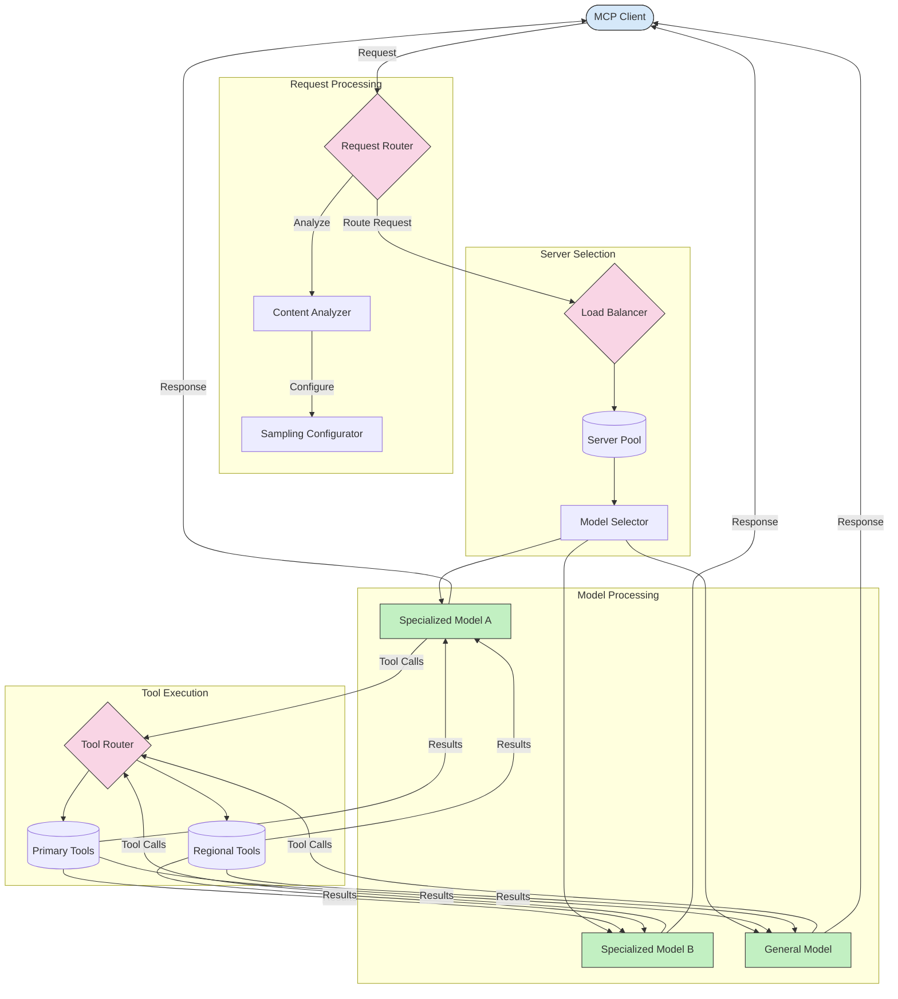

<!--
CO_OP_TRANSLATOR_METADATA:
{
  "original_hash": "a621fc52c7daec552eb8b3b48c0361dd",
  "translation_date": "2025-06-02T19:42:56+00:00",
  "source_file": "05-AdvancedTopics/mcp-routing/README.md",
  "language_code": "hk"
}
-->
## MCP 中的抽樣與路由架構

抽樣是 Model Context Protocol (MCP) 中一個關鍵的組件，能有效地處理和路由請求。它會分析傳入的請求，根據內容類型、用戶上下文和系統負載等不同標準，判斷最合適的模型或服務來處理。

抽樣和路由可以結合起來，建立一個強健的架構，優化資源使用並確保高可用性。抽樣過程用於分類請求，而路由則負責將請求導向合適的模型或服務。

以下圖示說明了抽樣和路由如何在完整的 MCP 架構中協同運作：

## 下一步

- [抽樣](../mcp-sampling/README.md)

**免責聲明**：  
本文件係使用AI翻譯服務 [Co-op Translator](https://github.com/Azure/co-op-translator) 進行翻譯。雖然我哋努力確保準確性，但請注意自動翻譯可能包含錯誤或不準確之處。原始文件嘅母語版本應視為權威來源。對於重要資訊，建議採用專業人工翻譯。我哋對因使用此翻譯而引起嘅任何誤解或誤釋概不負責。