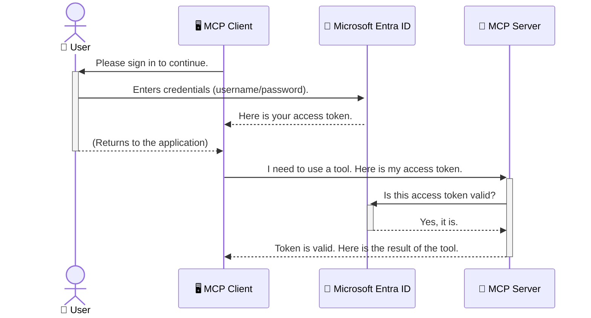

<!--
CO_OP_TRANSLATOR_METADATA:
{
  "original_hash": "9abe1d303ab126f9a8b87f03cebe5213",
  "translation_date": "2025-06-26T14:37:35+00:00",
  "source_file": "05-AdvancedTopics/mcp-security-entra/README.md",
  "language_code": "hk"
}
-->
# 保護 AI 工作流程：Model Context Protocol 伺服器的 Entra ID 認證

## 介紹  
保護你的 Model Context Protocol (MCP) 伺服器，就像鎖好家門一樣重要。若將 MCP 伺服器開放，將會讓你的工具和資料暴露於未經授權的存取，可能導致安全漏洞。Microsoft Entra ID 提供強大且雲端的身分識別與存取管理解決方案，確保只有經授權的使用者和應用程式能與你的 MCP 伺服器互動。在本節中，你將學習如何使用 Entra ID 認證來保護你的 AI 工作流程。

## 學習目標  
完成本節後，你將能夠：

- 理解保護 MCP 伺服器的重要性。  
- 解釋 Microsoft Entra ID 及 OAuth 2.0 認證的基本概念。  
- 區分公開客戶端與機密客戶端的差異。  
- 在本地（公開客戶端）與遠端（機密客戶端） MCP 伺服器場景中實作 Entra ID 認證。  
- 應用開發 AI 工作流程時的安全最佳實踐。

# 保護 AI 工作流程：Model Context Protocol 伺服器的 Entra ID 認證

就像你不會把家門敞開不鎖一樣，也不應該讓 MCP 伺服器任由任何人存取。保護你的 AI 工作流程是打造穩健、值得信賴且安全應用的關鍵。本章將介紹如何使用 Microsoft Entra ID 來保護你的 MCP 伺服器，確保只有經授權的使用者與應用程式能操作你的工具和資料。

## 為什麼 MCP 伺服器的安全性很重要

想像你的 MCP 伺服器有一個可以發送電子郵件或存取客戶資料庫的工具。如果伺服器沒有妥善保護，任何人都有可能使用該工具，導致未經授權的資料存取、垃圾郵件或其他惡意行為。

透過實作認證，你能確保每個送到伺服器的請求都經過驗證，確認發送請求的使用者或應用程式身份。這是保護 AI 工作流程的首要且最關鍵的步驟。

## Microsoft Entra ID 簡介

**Microsoft Entra ID** 是一個基於雲端的身分識別與存取管理服務。你可以把它想像成應用程式的萬能保全。它負責處理驗證使用者身份（認證）以及決定他們能做什麼（授權）的複雜過程。

透過 Entra ID，你可以：

- 啟用安全的使用者登入。  
- 保護 API 和服務。  
- 從中央位置管理存取政策。

對於 MCP 伺服器而言，Entra ID 提供了一個強大且廣受信賴的解決方案，管理誰能存取伺服器功能。

---

## 了解原理：Entra ID 認證如何運作

Entra ID 使用像是 **OAuth 2.0** 這類開放標準來處理認證。雖然細節可能複雜，但核心概念很簡單，以下用比喻來說明。

### OAuth 2.0 入門：代客鑰匙

把 OAuth 2.0 想成你的車子代客泊車服務。當你到餐廳時，你不會給代客泊車的人你的主鑰匙，而是給他一把**代客鑰匙**，這把鑰匙權限有限——它可以發動車子並鎖門，但無法打開後車廂或手套箱。

在這個比喻中：

- **你** 是 **使用者**。  
- **你的車** 是擁有寶貴工具和資料的 **MCP 伺服器**。  
- **代客** 是 **Microsoft Entra ID**。  
- **泊車員** 是嘗試存取伺服器的 **MCP 客戶端**（應用程式）。  
- **代客鑰匙** 是 **存取權杖（Access Token）**。

存取權杖是一串安全的文字，當你登入後，MCP 客戶端會從 Entra ID 取得這個權杖。客戶端每次發送請求給 MCP 伺服器時，都會附上這個權杖。伺服器驗證權杖，以確認請求的合法性以及客戶端是否有權限，而不需要處理你的實際認證資訊（例如密碼）。

### 認證流程

實際流程如下：



### 介紹 Microsoft Authentication Library (MSAL)

在深入程式碼之前，先介紹你會在範例中看到的重要元件：**Microsoft Authentication Library (MSAL)**。

MSAL 是微軟開發的函式庫，讓開發者更輕鬆處理認證。你不用自己撰寫複雜的程式碼來管理安全權杖、登入流程和會話更新，MSAL 幫你處理這些繁重工作。

使用 MSAL 有以下優點：

- **安全可靠**：實作產業標準協議和安全最佳實踐，降低程式碼出現漏洞的風險。  
- **簡化開發**：抽象化 OAuth 2.0 和 OpenID Connect 協議的複雜度，只需少量程式碼即可加入強大的認證功能。  
- **持續維護**：微軟持續更新 MSAL，以因應新的安全威脅和平台變化。

MSAL 支援多種語言與應用框架，包括 .NET、JavaScript/TypeScript、Python、Java、Go，以及 iOS 和 Android 等行動平台，讓你在整個技術堆疊中都能使用一致的認證模式。

想了解更多 MSAL，可參考官方 [MSAL 概覽文件](https://learn.microsoft.com/entra/identity-platform/msal-overview)。

---

## 使用 Entra ID 保護你的 MCP 伺服器：逐步教學

現在，我們來示範如何保護一個本地 MCP 伺服器（透過 `stdio`) using Entra ID. This example uses a **public client**, which is suitable for applications running on a user's machine, like a desktop app or a local development server.

### Scenario 1: Securing a Local MCP Server (with a Public Client)

In this scenario, we'll look at an MCP server that runs locally, communicates over `stdio`, and uses Entra ID to authenticate the user before allowing access to its tools. The server will have a single tool that fetches the user's profile information from the Microsoft Graph API.

#### 1. Setting Up the Application in Entra ID

Before writing any code, you need to register your application in Microsoft Entra ID. This tells Entra ID about your application and grants it permission to use the authentication service.

1. Navigate to the **[Microsoft Entra portal](https://entra.microsoft.com/)**.
2. Go to **App registrations** and click **New registration**.
3. Give your application a name (e.g., "My Local MCP Server").
4. For **Supported account types**, select **Accounts in this organizational directory only**.
5. You can leave the **Redirect URI** blank for this example.
6. Click **Register**.

Once registered, take note of the **Application (client) ID** and **Directory (tenant) ID**. You'll need these in your code.

#### 2. The Code: A Breakdown

Let's look at the key parts of the code that handle authentication. The full code for this example is available in the [Entra ID - Local - WAM](https://github.com/Azure-Samples/mcp-auth-servers/tree/main/src/entra-id-local-wam) folder of the [mcp-auth-servers GitHub repository](https://github.com/Azure-Samples/mcp-auth-servers).

**`AuthenticationService.cs`**

This class is responsible for handling the interaction with Entra ID.

- **`CreateAsync`**: This method initializes the `PublicClientApplication` from the MSAL (Microsoft Authentication Library). It's configured with your application's `clientId` and `tenantId`.
- **`WithBroker`**: This enables the use of a broker (like the Windows Web Account Manager), which provides a more secure and seamless single sign-on experience.
- **`AcquireTokenAsync` **：這是核心方法。它會先嘗試靜默取得權杖（若使用者已有有效會話，則不需重新登入）。若無法靜默取得，則會提示使用者進行互動式登入。

```csharp
// Simplified for clarity
public static async Task<AuthenticationService> CreateAsync(ILogger<AuthenticationService> logger)
{
    var msalClient = PublicClientApplicationBuilder
        .Create(_clientId) // Your Application (client) ID
        .WithAuthority(AadAuthorityAudience.AzureAdMyOrg)
        .WithTenantId(_tenantId) // Your Directory (tenant) ID
        .WithBroker(new BrokerOptions(BrokerOptions.OperatingSystems.Windows))
        .Build();

    // ... cache registration ...

    return new AuthenticationService(logger, msalClient);
}

public async Task<string> AcquireTokenAsync()
{
    try
    {
        // Try silent authentication first
        var accounts = await _msalClient.GetAccountsAsync();
        var account = accounts.FirstOrDefault();

        AuthenticationResult? result = null;

        if (account != null)
        {
            result = await _msalClient.AcquireTokenSilent(_scopes, account).ExecuteAsync();
        }
        else
        {
            // If no account, or silent fails, go interactive
            result = await _msalClient.AcquireTokenInteractive(_scopes).ExecuteAsync();
        }

        return result.AccessToken;
    }
    catch (Exception ex)
    {
        _logger.LogError(ex, "An error occurred while acquiring the token.");
        throw; // Optionally rethrow the exception for higher-level handling
    }
}
```

**`Program.cs`**

This is where the MCP server is set up and the authentication service is integrated.

- **`AddSingleton<AuthenticationService>`**: This registers the `AuthenticationService` with the dependency injection container, so it can be used by other parts of the application (like our tool).
- **`GetUserDetailsFromGraph` tool**: This tool requires an instance of `AuthenticationService`. Before it does anything, it calls `authService.AcquireTokenAsync()` 用來取得有效的存取權杖。若認證成功，會使用該權杖呼叫 Microsoft Graph API，取得使用者詳細資訊。

```csharp
// Simplified for clarity
[McpServerTool(Name = "GetUserDetailsFromGraph")]
public static async Task<string> GetUserDetailsFromGraph(
    AuthenticationService authService)
{
    try
    {
        // This will trigger the authentication flow
        var accessToken = await authService.AcquireTokenAsync();

        // Use the token to create a GraphServiceClient
        var graphClient = new GraphServiceClient(
            new BaseBearerTokenAuthenticationProvider(new TokenProvider(authService)));

        var user = await graphClient.Me.GetAsync();

        return System.Text.Json.JsonSerializer.Serialize(user);
    }
    catch (Exception ex)
    {
        return $"Error: {ex.Message}";
    }
}
```

#### 3. 整體流程運作說明

1. 當 MCP 客戶端嘗試使用 `GetUserDetailsFromGraph` tool, the tool first calls `AcquireTokenAsync`.
2. `AcquireTokenAsync` triggers the MSAL library to check for a valid token.
3. If no token is found, MSAL, through the broker, will prompt the user to sign in with their Entra ID account.
4. Once the user signs in, Entra ID issues an access token.
5. The tool receives the token and uses it to make a secure call to the Microsoft Graph API.
6. The user's details are returned to the MCP client.

This process ensures that only authenticated users can use the tool, effectively securing your local MCP server.

### Scenario 2: Securing a Remote MCP Server (with a Confidential Client)

When your MCP server is running on a remote machine (like a cloud server) and communicates over a protocol like HTTP Streaming, the security requirements are different. In this case, you should use a **confidential client** and the **Authorization Code Flow**. This is a more secure method because the application's secrets are never exposed to the browser.

This example uses a TypeScript-based MCP server that uses Express.js to handle HTTP requests.

#### 1. Setting Up the Application in Entra ID

The setup in Entra ID is similar to the public client, but with one key difference: you need to create a **client secret**.

1. Navigate to the **[Microsoft Entra portal](https://entra.microsoft.com/)**.
2. In your app registration, go to the **Certificates & secrets** tab.
3. Click **New client secret**, give it a description, and click **Add**.
4. **Important:** Copy the secret value immediately. You will not be able to see it again.
5. You also need to configure a **Redirect URI**. Go to the **Authentication** tab, click **Add a platform**, select **Web**, and enter the redirect URI for your application (e.g., `http://localhost:3001/auth/callback`).

> **⚠️ Important Security Note:** For production applications, Microsoft strongly recommends using **secretless authentication** methods such as **Managed Identity** or **Workload Identity Federation** instead of client secrets. Client secrets pose security risks as they can be exposed or compromised. Managed identities provide a more secure approach by eliminating the need to store credentials in your code or configuration.
>
> For more information about managed identities and how to implement them, see the [Managed identities for Azure resources overview](https://learn.microsoft.com/entra/identity/managed-identities-azure-resources/overview).

#### 2. The Code: A Breakdown

This example uses a session-based approach. When the user authenticates, the server stores the access token and refresh token in a session and gives the user a session token. This session token is then used for subsequent requests. The full code for this example is available in the [Entra ID - Confidential client](https://github.com/Azure-Samples/mcp-auth-servers/tree/main/src/entra-id-cca-session) folder of the [mcp-auth-servers GitHub repository](https://github.com/Azure-Samples/mcp-auth-servers).

**`Server.ts`**

This file sets up the Express server and the MCP transport layer.

- **`requireBearerAuth`**: This is middleware that protects the `/sse` and `/message` endpoints. It checks for a valid bearer token in the `Authorization` header of the request.
- **`EntraIdServerAuthProvider`**: This is a custom class that implements the `McpServerAuthorizationProvider` interface. It's responsible for handling the OAuth 2.0 flow.
- **`/auth/callback` **：此端點處理使用者認證完成後，Entra ID 重導向的請求。它會將授權碼交換成存取權杖和更新權杖。

```typescript
// Simplified for clarity
const app = express();
const { server } = createServer();
const provider = new EntraIdServerAuthProvider();

// Protect the SSE endpoint
app.get("/sse", requireBearerAuth({
  provider,
  requiredScopes: ["User.Read"]
}), async (req, res) => {
  // ... connect to the transport ...
});

// Protect the message endpoint
app.post("/message", requireBearerAuth({
  provider,
  requiredScopes: ["User.Read"]
}), async (req, res) => {
  // ... handle the message ...
});

// Handle the OAuth 2.0 callback
app.get("/auth/callback", (req, res) => {
  provider.handleCallback(req.query.code, req.query.state)
    .then(result => {
      // ... handle success or failure ...
    });
});
```

**`Tools.ts`**

This file defines the tools that the MCP server provides. The `getUserDetails` 工具與前例類似，但它從會話中取得存取權杖。

```typescript
// Simplified for clarity
server.setRequestHandler(CallToolRequestSchema, async (request) => {
  const { name } = request.params;
  const context = request.params?.context as { token?: string } | undefined;
  const sessionToken = context?.token;

  if (name === ToolName.GET_USER_DETAILS) {
    if (!sessionToken) {
      throw new AuthenticationError("Authentication token is missing or invalid. Ensure the token is provided in the request context.");
    }

    // Get the Entra ID token from the session store
    const tokenData = tokenStore.getToken(sessionToken);
    const entraIdToken = tokenData.accessToken;

    const graphClient = Client.init({
      authProvider: (done) => {
        done(null, entraIdToken);
      }
    });

    const user = await graphClient.api('/me').get();

    // ... return user details ...
  }
});
```

**`auth/EntraIdServerAuthProvider.ts`**

This class handles the logic for:

- Redirecting the user to the Entra ID sign-in page.
- Exchanging the authorization code for an access token.
- Storing the tokens in the `tokenStore`.
- Refreshing the access token when it expires.

#### 3. How It All Works Together

1. When a user first tries to connect to the MCP server, the `requireBearerAuth` middleware will see that they don't have a valid session and will redirect them to the Entra ID sign-in page.
2. The user signs in with their Entra ID account.
3. Entra ID redirects the user back to the `/auth/callback` endpoint with an authorization code.
4. The server exchanges the code for an access token and a refresh token, stores them, and creates a session token which is sent to the client.
5. The client can now use this session token in the `Authorization` header for all future requests to the MCP server.
6. When the `getUserDetails` 工具被呼叫時，會使用會話權杖查找 Entra ID 存取權杖，然後用該權杖呼叫 Microsoft Graph API。

這個流程比公開客戶端流程複雜，但對於面向網際網路的端點是必要的。由於遠端 MCP 伺服器可從公網存取，因此必須採取更嚴格的安全措施，防範未經授權的存取及潛在攻擊。

## 安全最佳實踐

- **務必使用 HTTPS**：加密客戶端與伺服器之間的通訊，防止權杖被攔截。  
- **實作基於角色的存取控制（RBAC）**：不僅檢查使用者是否已認證，還要檢查其授權範圍。你可以在 Entra ID 中定義角色，並在 MCP 伺服器中檢查這些角色。  
- **監控與稽核**：記錄所有認證事件，以便偵測並回應可疑活動。  
- **處理速率限制與節流**：Microsoft Graph 和其他 API 會實施速率限制以防止濫用。你的 MCP 伺服器應實作指數退避與重試機制，優雅地處理 HTTP 429（請求過多）回應。考慮快取常用資料以減少 API 呼叫。  
- **安全儲存權杖**：妥善儲存存取權杖與更新權杖。對於本地應用，使用系統的安全儲存機制。對伺服器應用，考慮使用加密儲存或安全金鑰管理服務，例如 Azure Key Vault。  
- **權杖過期處理**：存取權杖有有效期限。實作自動使用更新權杖刷新權杖，以維持流暢的使用者體驗，無需重新認證。  
- **考慮使用 Azure API Management**：雖然直接在 MCP 伺服器實作安全性可達到細緻控制，但 API 閘道（如 Azure API Management）能自動處理多數安全議題，包括認證、授權、速率限制和監控。它們提供一層位於客戶端與 MCP 伺服器間的集中式安全防護。想了解更多如何將 API 閘道與 MCP 搭配使用，請參考我們的[Azure API Management Your Auth Gateway For MCP Servers](https://techcommunity.microsoft.com/blog/integrationsonazureblog/azure-api-management-your-auth-gateway-for-mcp-servers/4402690)。

## 重要重點

- 保護 MCP 伺服器對於資料與工具安全至關重要。  
- Microsoft Entra ID 提供強大且可擴展的認證與授權解決方案。  
- 本地應用使用 **公開客戶端**，遠端伺服器使用 **機密客戶端**。  
- 對於網頁應用，**授權碼流程** 是最安全的選擇。

## 練習題

1. 想想你可能會建立的 MCP 伺服器，是本地伺服器還是遠端伺服器？  
2. 根據你的答案，你會使用公開客戶端還是機密客戶端？  
3. 你的 MCP 伺服器會請求哪些權限來對 Microsoft Graph 執行操作？

## 實作練習

### 練習 1：在 Entra ID 註冊應用程式  
前往 Microsoft Entra 入口網站。  
為你的 MCP 伺服器註冊一個新應用程式。  
記錄應用程式（client）ID 與目錄（tenant）ID。

### 練習 2：保護本地 MCP 伺服器（公開客戶端）  
依照程式碼範例整合 MSAL（Microsoft Authentication Library）進行使用者認證。  
透過呼叫取得 Microsoft Graph 使用者資料的 MCP 工具，測試認證流程。

### 練習 3：保護遠端 MCP 伺服器（機密客戶端）  
在 Entra ID 中註冊機密客戶端並建立客戶端密鑰。  
設定你的 Express.js MCP 伺服器使用授權碼流程。  
測試受保護的端點並確認基於權杖的存取。

### 練習 4：應用安全最佳實踐  
為本地或遠端伺服器啟用 HTTPS。  
在伺服器邏輯中實作基於角色的存取控制（RBAC）。  
加入權杖過期處理與安全的權杖儲存。

## 資源

1. **MSAL 概覽文件**  
   了解 Microsoft Authentication Library (MSAL) 如何跨平台實現安全的權杖取得：  
   [MSAL Overview on Microsoft Learn](https://learn.microsoft.com/en-gb/entra/msal/overview)

2. **Azure-Samples/mcp-auth-servers GitHub 倉庫**  
   MCP 伺服器認證流程的參考實作：  
   [Azure-Samples/mcp-auth-servers on GitHub](https://github.com/Azure-Samples/mcp-auth-servers)

3. **Azure 資源的託管身分識別概述**  
   了解如何利用系統或使用者指派的託管身分識別，免除秘密管理：  
   [Managed Identities Overview on Microsoft Learn](https://learn.microsoft.com/en-us/entra/identity/managed-identities-azure-resources/)

4. **Azure API Management：你的 MCP 伺服器認證閘道**  
   深入探討如何使用 APIM 作為 MCP 伺服器的安全 OAuth2 閘道：  
   [Azure API Management Your Auth Gateway For MCP Servers](https://techcommunity.microsoft.com/blog/integrationsonazureblog/azure-api-management-your-auth-gateway-for-mcp-servers/4402690)

5. **Microsoft Graph 權限參考**  
   Microsoft Graph 的委派與應用程式權限完整清單：  
   [Microsoft Graph Permissions Reference](https://learn.microsoft.com/zh-tw/graph/permissions-reference)

## 學習成果  
完成本節後，你將能夠：

- 清楚說明為何認證對 MCP 伺服器與 AI 工作流程至關重要。  
- 設定並配置 Entra ID 認證，涵蓋本地及遠端 MCP 伺服器場景。  
- 根據伺服器部署選擇合適的客戶端類型（公開或機密）。  
- 實作安全編碼實務，包括權杖儲存與基於角色的授權。  
- 自信地保護你的 MCP 伺服器及其工具免於未經授權存取。

## 下一步  

- [6. 社群貢獻](../../06-CommunityContributions/README.md)

**免責聲明**：  
本文件由 AI 翻譯服務 [Co-op Translator](https://github.com/Azure/co-op-translator) 翻譯而成。雖然我們致力於確保翻譯準確，但請注意自動翻譯可能存在錯誤或不準確之處。原始文件的母語版本應視為權威來源。對於重要資訊，建議採用專業人工翻譯。我們不對因使用本翻譯而引起的任何誤解或誤釋負責。