<!--
CO_OP_TRANSLATOR_METADATA:
{
  "original_hash": "6e562d7e5a77c8982da4aa8f762ad1d8",
  "translation_date": "2025-07-02T09:02:30+00:00",
  "source_file": "05-AdvancedTopics/mcp-security-entra/README.md",
  "language_code": "hk"
}
-->
# 保護 AI 工作流程：Entra ID 驗證用於 Model Context Protocol 伺服器

## 介紹
保護您的 Model Context Protocol (MCP) 伺服器就像鎖好家門一樣重要。若讓 MCP 伺服器開放，您的工具和資料可能會遭到未經授權的存取，進而導致安全漏洞。Microsoft Entra ID 提供強大的雲端身分識別與存取管理解決方案，確保只有授權的使用者和應用程式能與您的 MCP 伺服器互動。在本節中，您將學習如何使用 Entra ID 驗證來保護您的 AI 工作流程。

## 學習目標
完成本節後，您將能夠：

- 理解保護 MCP 伺服器的重要性。
- 解釋 Microsoft Entra ID 與 OAuth 2.0 驗證的基本概念。
- 辨別公開用戶端與機密用戶端的差異。
- 在本地（公開用戶端）與遠端（機密用戶端） MCP 伺服器場景中實作 Entra ID 驗證。
- 在開發 AI 工作流程時應用安全最佳實踐。

## 安全與 MCP

就像不會把家門隨意敞開一樣，您也不應該讓 MCP 伺服器任人存取。保護您的 AI 工作流程是建立穩健、可信賴且安全應用程式的關鍵。本章將介紹如何使用 Microsoft Entra ID 來保護 MCP 伺服器，確保只有授權的使用者與應用程式能存取您的工具和資料。

## 為什麼 MCP 伺服器的安全性很重要

想像您的 MCP 伺服器有個功能可以發送電子郵件或存取客戶資料庫。若伺服器未受保護，任何人都可能使用這些功能，導致未經授權的資料存取、垃圾郵件或其他惡意行為。

透過實作驗證，您能確保每個對伺服器的請求都經過驗證，確認發出請求的使用者或應用程式的身份。這是保護 AI 工作流程的第一步，也是最重要的一步。

## Microsoft Entra ID 簡介

[**Microsoft Entra ID**](https://adoption.microsoft.com/microsoft-security/entra/) 是一項雲端身分識別與存取管理服務。您可以把它想像成應用程式的全能保安。它負責複雜的使用者身份驗證（authentication）與權限授權（authorization）流程。

使用 Entra ID，您可以：

- 為使用者啟用安全登入。
- 保護 API 與服務。
- 從中央位置管理存取政策。

對 MCP 伺服器而言，Entra ID 提供一個強大且被廣泛信任的解決方案，管理誰能存取伺服器功能。

---

## 了解原理：Entra ID 驗證運作方式

Entra ID 採用開放標準如 **OAuth 2.0** 來處理驗證。雖然細節可能較複雜，但核心概念簡單易懂，我們用比喻來說明。

### OAuth 2.0 簡介：代客泊車鑰匙

把 OAuth 2.0 想像成您的車子代客泊車服務。當您抵達餐廳時，您不會把車子的主鑰匙交給代客，而是給他一把 **代客鑰匙**，它的權限有限——可以啟動車子並鎖門，但無法打開後車廂或手套箱。

在這個比喻中：

- **您** 是 **使用者**。
- **您的車子** 是擁有珍貴工具和資料的 **MCP 伺服器**。
- **代客** 是 **Microsoft Entra ID**。
- **泊車員** 是嘗試存取伺服器的 **MCP 用戶端**（應用程式）。
- **代客鑰匙** 是 **存取權杖（Access Token）**。

存取權杖是一串安全的文字，MCP 用戶端在您登入後從 Entra ID 取得。用戶端每次請求 MCP 伺服器時都會帶上此權杖，伺服器可以驗證權杖以確保請求合法，且用戶端具備必要權限，過程中不需直接處理您的帳密。

### 驗證流程

實務上的流程如下：

```mermaid
sequenceDiagram
    actor User as 👤 User
    participant Client as 🖥️ MCP Client
    participant Entra as 🔐 Microsoft Entra ID
    participant Server as 🔧 MCP Server

    Client->>+User: Please sign in to continue.
    User->>+Entra: Enters credentials (username/password).
    Entra-->>Client: Here is your access token.
    User-->>-Client: (Returns to the application)

    Client->>+Server: I need to use a tool. Here is my access token.
    Server->>+Entra: Is this access token valid?
    Entra-->>-Server: Yes, it is.
    Server-->>-Client: Token is valid. Here is the result of the tool.
```



### 認識 Microsoft Authentication Library (MSAL)

在進入程式碼前，先介紹您在範例中會看到的重要元件：**Microsoft Authentication Library (MSAL)**。

MSAL 是微軟開發的函式庫，讓開發者更輕鬆處理驗證。您不需自行撰寫複雜的安全權杖管理、登入流程及會話更新程式碼，MSAL 都會幫您處理。

使用 MSAL 的優點包括：

- **安全可靠**：遵循業界標準協議和安全最佳實踐，降低程式碼漏洞風險。
- **簡化開發**：封裝 OAuth 2.0 與 OpenID Connect 的複雜度，讓您用少量程式碼就能加入強大驗證功能。
- **持續維護**：微軟積極更新 MSAL，以應對新安全威脅和平台變化。

MSAL 支援多種程式語言和應用框架，包括 .NET、JavaScript/TypeScript、Python、Java、Go，以及 iOS 和 Android 等行動平台，讓您能在整個技術棧中採用一致的驗證模式。

欲了解更多 MSAL 資訊，可參考官方 [MSAL 總覽文件](https://learn.microsoft.com/entra/identity-platform/msal-overview)。

---

## 使用 Entra ID 保護您的 MCP 伺服器：逐步指南

接著，我們示範如何保護本地 MCP 伺服器（透過 `stdio`) using Entra ID. This example uses a **public client**, which is suitable for applications running on a user's machine, like a desktop app or a local development server.

### Scenario 1: Securing a Local MCP Server (with a Public Client)

In this scenario, we'll look at an MCP server that runs locally, communicates over `stdio`, and uses Entra ID to authenticate the user before allowing access to its tools. The server will have a single tool that fetches the user's profile information from the Microsoft Graph API.

#### 1. Setting Up the Application in Entra ID

Before writing any code, you need to register your application in Microsoft Entra ID. This tells Entra ID about your application and grants it permission to use the authentication service.

1. Navigate to the **[Microsoft Entra portal](https://entra.microsoft.com/)**.
2. Go to **App registrations** and click **New registration**.
3. Give your application a name (e.g., "My Local MCP Server").
4. For **Supported account types**, select **Accounts in this organizational directory only**.
5. You can leave the **Redirect URI** blank for this example.
6. Click **Register**.

Once registered, take note of the **Application (client) ID** and **Directory (tenant) ID**. You'll need these in your code.

#### 2. The Code: A Breakdown

Let's look at the key parts of the code that handle authentication. The full code for this example is available in the [Entra ID - Local - WAM](https://github.com/Azure-Samples/mcp-auth-servers/tree/main/src/entra-id-local-wam) folder of the [mcp-auth-servers GitHub repository](https://github.com/Azure-Samples/mcp-auth-servers).

**`AuthenticationService.cs`**

This class is responsible for handling the interaction with Entra ID.

- **`CreateAsync`**: This method initializes the `PublicClientApplication` from the MSAL (Microsoft Authentication Library). It's configured with your application's `clientId` and `tenantId`.
- **`WithBroker`**: This enables the use of a broker (like the Windows Web Account Manager), which provides a more secure and seamless single sign-on experience.
- **`AcquireTokenAsync`**：此為核心方法。它會先嘗試靜默取得權杖（若使用者已有有效會話，無需再次登入）。若無法靜默取得，則會提示使用者進行互動式登入。

```csharp
// Simplified for clarity
public static async Task<AuthenticationService> CreateAsync(ILogger<AuthenticationService> logger)
{
    var msalClient = PublicClientApplicationBuilder
        .Create(_clientId) // Your Application (client) ID
        .WithAuthority(AadAuthorityAudience.AzureAdMyOrg)
        .WithTenantId(_tenantId) // Your Directory (tenant) ID
        .WithBroker(new BrokerOptions(BrokerOptions.OperatingSystems.Windows))
        .Build();

    // ... cache registration ...

    return new AuthenticationService(logger, msalClient);
}

public async Task<string> AcquireTokenAsync()
{
    try
    {
        // Try silent authentication first
        var accounts = await _msalClient.GetAccountsAsync();
        var account = accounts.FirstOrDefault();

        AuthenticationResult? result = null;

        if (account != null)
        {
            result = await _msalClient.AcquireTokenSilent(_scopes, account).ExecuteAsync();
        }
        else
        {
            // If no account, or silent fails, go interactive
            result = await _msalClient.AcquireTokenInteractive(_scopes).ExecuteAsync();
        }

        return result.AccessToken;
    }
    catch (Exception ex)
    {
        _logger.LogError(ex, "An error occurred while acquiring the token.");
        throw; // Optionally rethrow the exception for higher-level handling
    }
}
```

**`Program.cs`**

This is where the MCP server is set up and the authentication service is integrated.

- **`AddSingleton<AuthenticationService>`**: This registers the `AuthenticationService` with the dependency injection container, so it can be used by other parts of the application (like our tool).
- **`GetUserDetailsFromGraph` tool**: This tool requires an instance of `AuthenticationService`. Before it does anything, it calls `authService.AcquireTokenAsync()` 用以取得有效的存取權杖。若驗證成功，會用該權杖呼叫 Microsoft Graph API，取得使用者資料。

```csharp
// Simplified for clarity
[McpServerTool(Name = "GetUserDetailsFromGraph")]
public static async Task<string> GetUserDetailsFromGraph(
    AuthenticationService authService)
{
    try
    {
        // This will trigger the authentication flow
        var accessToken = await authService.AcquireTokenAsync();

        // Use the token to create a GraphServiceClient
        var graphClient = new GraphServiceClient(
            new BaseBearerTokenAuthenticationProvider(new TokenProvider(authService)));

        var user = await graphClient.Me.GetAsync();

        return System.Text.Json.JsonSerializer.Serialize(user);
    }
    catch (Exception ex)
    {
        return $"Error: {ex.Message}";
    }
}
```

#### 3. 整體運作流程

1. 當 MCP 用戶端嘗試呼叫 `GetUserDetailsFromGraph` tool, the tool first calls `AcquireTokenAsync`.
2. `AcquireTokenAsync` triggers the MSAL library to check for a valid token.
3. If no token is found, MSAL, through the broker, will prompt the user to sign in with their Entra ID account.
4. Once the user signs in, Entra ID issues an access token.
5. The tool receives the token and uses it to make a secure call to the Microsoft Graph API.
6. The user's details are returned to the MCP client.

This process ensures that only authenticated users can use the tool, effectively securing your local MCP server.

### Scenario 2: Securing a Remote MCP Server (with a Confidential Client)

When your MCP server is running on a remote machine (like a cloud server) and communicates over a protocol like HTTP Streaming, the security requirements are different. In this case, you should use a **confidential client** and the **Authorization Code Flow**. This is a more secure method because the application's secrets are never exposed to the browser.

This example uses a TypeScript-based MCP server that uses Express.js to handle HTTP requests.

#### 1. Setting Up the Application in Entra ID

The setup in Entra ID is similar to the public client, but with one key difference: you need to create a **client secret**.

1. Navigate to the **[Microsoft Entra portal](https://entra.microsoft.com/)**.
2. In your app registration, go to the **Certificates & secrets** tab.
3. Click **New client secret**, give it a description, and click **Add**.
4. **Important:** Copy the secret value immediately. You will not be able to see it again.
5. You also need to configure a **Redirect URI**. Go to the **Authentication** tab, click **Add a platform**, select **Web**, and enter the redirect URI for your application (e.g., `http://localhost:3001/auth/callback`).

> **⚠️ Important Security Note:** For production applications, Microsoft strongly recommends using **secretless authentication** methods such as **Managed Identity** or **Workload Identity Federation** instead of client secrets. Client secrets pose security risks as they can be exposed or compromised. Managed identities provide a more secure approach by eliminating the need to store credentials in your code or configuration.
>
> For more information about managed identities and how to implement them, see the [Managed identities for Azure resources overview](https://learn.microsoft.com/entra/identity/managed-identities-azure-resources/overview).

#### 2. The Code: A Breakdown

This example uses a session-based approach. When the user authenticates, the server stores the access token and refresh token in a session and gives the user a session token. This session token is then used for subsequent requests. The full code for this example is available in the [Entra ID - Confidential client](https://github.com/Azure-Samples/mcp-auth-servers/tree/main/src/entra-id-cca-session) folder of the [mcp-auth-servers GitHub repository](https://github.com/Azure-Samples/mcp-auth-servers).

**`Server.ts`**

This file sets up the Express server and the MCP transport layer.

- **`requireBearerAuth`**: This is middleware that protects the `/sse` and `/message` endpoints. It checks for a valid bearer token in the `Authorization` header of the request.
- **`EntraIdServerAuthProvider`**: This is a custom class that implements the `McpServerAuthorizationProvider` interface. It's responsible for handling the OAuth 2.0 flow.
- **`/auth/callback`**：此端點負責處理使用者完成 Entra ID 驗證後的重新導向。它會用授權碼換取存取權杖和刷新權杖。

```typescript
// Simplified for clarity
const app = express();
const { server } = createServer();
const provider = new EntraIdServerAuthProvider();

// Protect the SSE endpoint
app.get("/sse", requireBearerAuth({
  provider,
  requiredScopes: ["User.Read"]
}), async (req, res) => {
  // ... connect to the transport ...
});

// Protect the message endpoint
app.post("/message", requireBearerAuth({
  provider,
  requiredScopes: ["User.Read"]
}), async (req, res) => {
  // ... handle the message ...
});

// Handle the OAuth 2.0 callback
app.get("/auth/callback", (req, res) => {
  provider.handleCallback(req.query.code, req.query.state)
    .then(result => {
      // ... handle success or failure ...
    });
});
```

**`Tools.ts`**

This file defines the tools that the MCP server provides. The `getUserDetails` 工具類似前例，但從會話中取得存取權杖。

```typescript
// Simplified for clarity
server.setRequestHandler(CallToolRequestSchema, async (request) => {
  const { name } = request.params;
  const context = request.params?.context as { token?: string } | undefined;
  const sessionToken = context?.token;

  if (name === ToolName.GET_USER_DETAILS) {
    if (!sessionToken) {
      throw new AuthenticationError("Authentication token is missing or invalid. Ensure the token is provided in the request context.");
    }

    // Get the Entra ID token from the session store
    const tokenData = tokenStore.getToken(sessionToken);
    const entraIdToken = tokenData.accessToken;

    const graphClient = Client.init({
      authProvider: (done) => {
        done(null, entraIdToken);
      }
    });

    const user = await graphClient.api('/me').get();

    // ... return user details ...
  }
});
```

**`auth/EntraIdServerAuthProvider.ts`**

This class handles the logic for:

- Redirecting the user to the Entra ID sign-in page.
- Exchanging the authorization code for an access token.
- Storing the tokens in the `tokenStore`.
- Refreshing the access token when it expires.

#### 3. How It All Works Together

1. When a user first tries to connect to the MCP server, the `requireBearerAuth` middleware will see that they don't have a valid session and will redirect them to the Entra ID sign-in page.
2. The user signs in with their Entra ID account.
3. Entra ID redirects the user back to the `/auth/callback` endpoint with an authorization code.
4. The server exchanges the code for an access token and a refresh token, stores them, and creates a session token which is sent to the client.
5. The client can now use this session token in the `Authorization` header for all future requests to the MCP server.
6. When the `getUserDetails` 工具被呼叫時，會使用會話權杖查找 Entra ID 存取權杖，並用它呼叫 Microsoft Graph API。

此流程較公開用戶端流程複雜，但網際網路公開的遠端 MCP 伺服器必須採用更嚴格的安全措施，以防止未經授權存取及潛在攻擊。

## 安全最佳實踐

- **務必使用 HTTPS**：加密用戶端與伺服器間的通訊，防止權杖被攔截。
- **實作角色基礎存取控制（RBAC）**：不僅檢查使用者是否通過驗證，更要檢查他們有何操作權限。您可以在 Entra ID 定義角色，並在 MCP 伺服器中進行檢查。
- **監控與稽核**：記錄所有驗證事件，以便偵測並回應可疑活動。
- **處理速率限制與節流**：Microsoft Graph 與其他 API 實施速率限制以防濫用。MCP 伺服器應實作指數退避與重試機制，優雅處理 HTTP 429（請求過多）回應。考慮快取常用資料以減少 API 呼叫。
- **安全儲存權杖**：妥善保存存取權杖與刷新權杖。對本地應用程式，使用系統安全儲存機制；對伺服器應用程式，建議使用加密儲存或安全金鑰管理服務，如 Azure Key Vault。
- **權杖過期處理**：存取權杖有效期限有限，應使用刷新權杖自動更新，確保使用者體驗流暢無需重複驗證。
- **考慮使用 Azure API Management**：雖然在 MCP 伺服器內直接實作安全功能能細緻控制，但 API 閘道如 Azure API Management 可自動處理許多安全問題，包括驗證、授權、速率限制與監控。它們提供集中式的安全層，位於用戶端與 MCP 伺服器之間。更多關於 MCP 與 API 閘道的資訊，請參閱我們的 [Azure API Management Your Auth Gateway For MCP Servers](https://techcommunity.microsoft.com/blog/integrationsonazureblog/azure-api-management-your-auth-gateway-for-mcp-servers/4402690)。

## 主要重點

- 保護 MCP 伺服器對於保障資料與工具至關重要。
- Microsoft Entra ID 提供強大且可擴展的驗證與授權解決方案。
- 本地應用使用 **公開用戶端**，遠端伺服器使用 **機密用戶端**。
- **授權碼流程（Authorization Code Flow）** 是網頁應用最安全的選擇。

## 練習題

1. 想想您可能會建立的 MCP 伺服器，是本地還是遠端伺服器？
2. 根據您的答案，會使用公開用戶端還是機密用戶端？
3. 您的 MCP 伺服器會請求哪些權限來對 Microsoft Graph 執行操作？

## 實作練習

### 練習 1：在 Entra ID 中註冊應用程式
前往 Microsoft Entra 入口網站。
註冊一個新的應用程式，用於您的 MCP 伺服器。
記錄應用程式（用戶端）ID 與目錄（租戶）ID。

### 練習 2：保護本地 MCP 伺服器（公開用戶端）
- 依照程式碼範例整合 MSAL（Microsoft Authentication Library）以實現使用者驗證。
- 測試驗證流程，呼叫 MCP 工具取得 Microsoft Graph 的使用者資料。

### 練習 3：保護遠端 MCP 伺服器（機密用戶端）
- 在 Entra ID 中註冊機密用戶端並建立用戶端密鑰。
- 設定您的 Express.js MCP 伺服器使用授權碼流程。
- 測試受保護端點，確認基於權杖的存取。

### 練習 4：應用安全最佳實踐
- 為本地或遠端伺服器啟用 HTTPS。
- 在伺服器邏輯中實作角色基礎存取控制（RBAC）。
- 加入權杖過期處理與安全權杖儲存。

## 資源

1. **MSAL 總覽文件**  
   瞭解 Microsoft Authentication Library (MSAL) 如何在各平台實現安全權杖取得：  
   [MSAL Overview on Microsoft Learn](https://learn.microsoft.com/en-gb/entra/msal/overview)

2. **Azure-Samples/mcp-auth-servers GitHub 儲存庫**  
   MCP 伺服器驗證流程的參考實作：  
   [Azure-Samples/mcp-auth-servers on GitHub](https://github.com/Azure-Samples/mcp-auth-servers)

3. **Azure 資源的管理身分識別總覽**  
   瞭解如何使用系統或使用者指派的管理身分識別來消除機密：  
   [Managed Identities Overview on Microsoft Learn](https://learn.microsoft.com/en-us/entra/identity/managed-identities-azure-resources/)

4. **Azure API Management：MCP 伺服器的驗證閘道**  
   深入介紹如何使用 APIM 作為 MCP 伺服器的安全 OAuth2 閘道：  
   [Azure API Management Your Auth Gateway For MCP Servers](https://techcommunity.microsoft.com/blog/integrationsonazureblog/azure-api-management-your-auth-gateway-for-mcp-servers/4402690)

5. **Microsoft Graph 權限參考**  
   Microsoft Graph 的委派權限與應用權限完整清單：  
   [Microsoft Graph Permissions Reference](https://learn.microsoft.com/zh-tw/graph/permissions-reference)

## 學習成果
完成本節後，您將能夠：

- 清楚說明為何驗證對 MCP 伺服器和 AI 工作流程至關重要。
- 設定並配置 Entra ID 驗證，適用於本地與遠端 MCP 伺服器場景。
- 根據伺服器部署選擇適當的用戶端類型（公開或機密）。
- 實作安全程式設計實務，包括權杖儲存與角色授權。
- 自信地保護您的 MCP 伺服器及其工具免受未經授權存取。

## 下一步

- [5.13 Model Context Protocol (MCP) 與 Azure AI Foundry 整合](../mcp-foundry-agent-integration/README.md)

**免責聲明**：  
本文件乃使用 AI 翻譯服務 [Co-op Translator](https://github.com/Azure/co-op-translator) 進行翻譯。雖然我們致力於確保翻譯準確，但請注意自動翻譯可能存在錯誤或不準確之處。原始文件的母語版本應被視為權威來源。對於重要資訊，建議採用專業人工翻譯。我們對因使用本翻譯而引致的任何誤解或誤釋概不負責。