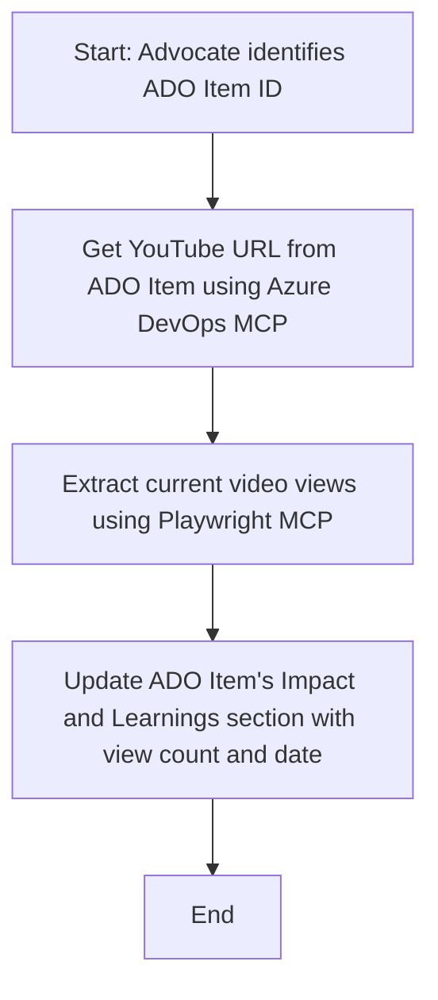

<!--
CO_OP_TRANSLATOR_METADATA:
{
  "original_hash": "14a2dfbea55ef735660a06bd6bdfe5f3",
  "translation_date": "2025-06-13T21:32:11+00:00",
  "source_file": "09-CaseStudy/UpdateADOItemsFromYT.md",
  "language_code": "hk"
}
-->
# 案例研究：用 MCP 從 YouTube 數據更新 Azure DevOps 項目

> **免責聲明：** 市面上已有一些線上工具和報告可以自動化將 YouTube 等平台的數據更新到 Azure DevOps 項目的流程。以下場景純粹作為示範用途，說明 MCP 工具如何用於自動化及整合任務。

## 概覽

本案例展示了如何使用 Model Context Protocol (MCP) 及其工具，自動化將來自線上平台（如 YouTube）的資訊更新到 Azure DevOps (ADO) 工作項目。所描述的場景只是這些工具廣泛功能的一個例子，能夠適用於多種相似的自動化需求。

在此例中，一位 Advocate 利用 ADO 項目追蹤線上會議，每個項目都包含一個 YouTube 影片連結。透過 MCP 工具，Advocate 可以以重複且自動化的方式，保持 ADO 項目與最新的影片觀看次數等數據同步。這種方法同樣適用於其他需要將線上資訊整合到 ADO 或其他系統的情況。

## 場景

Advocate 負責追蹤線上會議和社群互動的影響力。每場會議都以 ADO 工作項目形式記錄在 'DevRel' 專案中，該工作項目包含一個 YouTube 影片連結欄位。為了準確報告會議的觸及範圍，Advocate 需要將目前的影片觀看數及取得該數據的日期更新到 ADO 項目中。

## 使用工具

- [Azure DevOps MCP](https://github.com/microsoft/azure-devops-mcp)：透過 MCP 提供程式化方式存取及更新 ADO 工作項目。
- [Playwright MCP](https://github.com/microsoft/playwright-mcp)：自動化瀏覽器操作，從網頁擷取即時數據，如 YouTube 影片統計資料。

## 步驟流程

1. **識別 ADO 項目**：從 'DevRel' 專案中取得 ADO 工作項目 ID（例如 1234）。
2. **取得 YouTube 連結**：使用 Azure DevOps MCP 工具從工作項目讀取 YouTube URL。
3. **擷取影片觀看數**：使用 Playwright MCP 工具前往 YouTube URL，抓取當前觀看次數。
4. **更新 ADO 項目**：利用 Azure DevOps MCP 工具將最新觀看數及取得日期寫入 ADO 工作項目的「Impact and Learnings」區域。

## 範例提示

```bash
- Work with the ADO Item ID: 1234
- The project is '2025-Awesome'
- Get the YouTube URL for the ADO item
- Use Playwright to get the current views from the YouTube video
- Update the ADO item with the current video views and the updated date of the information
```

## Mermaid 流程圖



## 技術實作

- **MCP 編排**：整個流程由 MCP 伺服器負責編排，協調 Azure DevOps MCP 與 Playwright MCP 工具的使用。
- **自動化**：此流程可手動觸發或定時排程執行，確保 ADO 項目保持最新狀態。
- **擴充性**：同樣模式可擴展至更新其他線上指標（例如按讚數、留言數）或來自其他平台的數據。

## 成果與影響

- **效率提升**：透過自動擷取及更新影片數據，減少 Advocate 的人工操作。
- **準確性**：確保 ADO 項目反映最新的線上數據。
- **可重複使用**：提供一套可用於類似場景、整合其他數據來源的通用工作流程。

## 參考資料

- [Azure DevOps MCP](https://github.com/microsoft/azure-devops-mcp)
- [Playwright MCP](https://github.com/microsoft/playwright-mcp)
- [Model Context Protocol (MCP)](https://modelcontextprotocol.io/)

**免責聲明**：  
本文件乃使用 AI 翻譯服務 [Co-op Translator](https://github.com/Azure/co-op-translator) 所翻譯。雖然我們致力於準確性，但請注意自動翻譯可能包含錯誤或不準確之處。原始文件的母語版本應被視為權威來源。對於重要資訊，建議採用專業人工翻譯。我們不對因使用此翻譯而引起的任何誤解或誤釋負責。