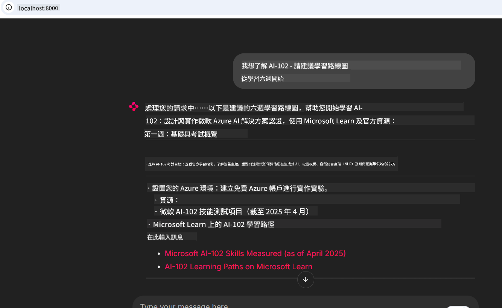

<!--
CO_OP_TRANSLATOR_METADATA:
{
  "original_hash": "4319d291c9d124ecafea52b3d04bfa0e",
  "translation_date": "2025-07-14T06:19:36+00:00",
  "source_file": "09-CaseStudy/docs-mcp/README.md",
  "language_code": "hk"
}
-->
# 案例研究：從客戶端連接到 Microsoft Learn Docs MCP 伺服器

你是否曾經在文件網站、Stack Overflow 和無數搜尋引擎分頁之間切換，同時嘗試解決程式碼中的問題？也許你會專門準備第二個螢幕來看文件，或者不斷在 IDE 和瀏覽器之間切換。若能將文件直接整合到你的工作流程中——無論是在應用程式、IDE，甚至是自訂工具裡——豈不是更方便？在本案例研究中，我們將探討如何從自己的客戶端應用程式直接連接到 Microsoft Learn Docs MCP 伺服器，實現這樣的整合。

## 概覽

現代開發不僅僅是寫程式碼，更是要在正確的時間找到正確的資訊。文件無處不在，但往往不在你最需要的地方：你的工具和工作流程中。透過將文件檢索直接整合到應用程式中，你可以節省時間、減少切換上下文的頻率，並提升生產力。本節將示範如何連接客戶端到 Microsoft Learn Docs MCP 伺服器，讓你能在不離開應用程式的情況下，取得即時且具上下文關聯的文件。

我們將帶你一步步完成建立連線、發送請求，以及有效處理串流回應的過程。這種方法不僅能簡化工作流程，也為打造更智慧、更有幫助的開發者工具打開大門。

## 學習目標

為什麼要這麼做？因為最好的開發者體驗就是消除摩擦。想像一個世界，你的程式碼編輯器、聊天機器人或網頁應用程式能即時回答你的文件問題，並使用 Microsoft Learn 的最新內容。完成本章後，你將能夠：

- 了解 MCP 伺服器與客戶端之間文件通訊的基本概念
- 實作一個控制台或網頁應用程式，連接到 Microsoft Learn Docs MCP 伺服器
- 使用串流 HTTP 客戶端進行即時文件檢索
- 在應用程式中記錄並解析文件回應

你將看到這些技能如何幫助你打造不只是被動回應，而是真正互動且具上下文感知的工具。

## 情境 1 - 使用 MCP 進行即時文件檢索

在此情境中，我們將示範如何連接客戶端到 Microsoft Learn Docs MCP 伺服器，讓你能在不離開應用程式的情況下，取得即時且具上下文關聯的文件。

讓我們實際操作。你的任務是撰寫一個應用程式，連接到 Microsoft Learn Docs MCP 伺服器，呼叫 `microsoft_docs_search` 工具，並將串流回應記錄到控制台。

### 為什麼採用這種方式？
因為這是打造更進階整合的基礎——無論你想驅動聊天機器人、IDE 擴充功能，或是網頁儀表板。

你可以在本案例研究的 [`solution`](./solution/README.md) 資料夾中找到此情境的程式碼和說明。步驟將引導你完成連線設定：
- 使用官方 MCP SDK 和可串流的 HTTP 客戶端進行連線
- 呼叫 `microsoft_docs_search` 工具並帶入查詢參數以取得文件
- 實作適當的記錄與錯誤處理
- 建立互動式控制台介面，允許使用者輸入多個搜尋查詢

此情境示範如何：
- 連接到 Docs MCP 伺服器
- 發送查詢
- 解析並列印結果

以下是執行解決方案的範例畫面：

```
Prompt> What is Azure Key Vault?
Answer> Azure Key Vault is a cloud service for securely storing and accessing secrets. ...
```

以下為簡易範例解決方案。完整程式碼與細節請參考 solution 資料夾。

<details>
<summary>Python</summary>

```python
import asyncio
from mcp.client.streamable_http import streamablehttp_client
from mcp import ClientSession

async def main():
    async with streamablehttp_client("https://learn.microsoft.com/api/mcp") as (read_stream, write_stream, _):
        async with ClientSession(read_stream, write_stream) as session:
            await session.initialize()
            result = await session.call_tool("microsoft_docs_search", {"query": "Azure Functions best practices"})
            print(result.content)

if __name__ == "__main__":
    asyncio.run(main())
```

- 完整實作與記錄請參考 [`scenario1.py`](../../../../09-CaseStudy/docs-mcp/solution/python/scenario1.py)。
- 安裝與使用說明請參考同資料夾下的 [`README.md`](./solution/python/README.md)。
</details>

## 情境 2 - 使用 MCP 的互動式學習計劃產生器網頁應用程式

在此情境中，你將學習如何將 Docs MCP 整合到網頁開發專案中。目標是讓使用者能直接從網頁介面搜尋 Microsoft Learn 文件，讓文件即時可在你的應用程式或網站中取得。

你將學到如何：
- 建立網頁應用程式
- 連接到 Docs MCP 伺服器
- 處理使用者輸入並顯示結果

以下是執行解決方案的範例畫面：

```
User> I want to learn about AI102 - so suggest the roadmap to get it started from learn for 6 weeks

Assistant> Here’s a detailed 6-week roadmap to start your preparation for the AI-102: Designing and Implementing a Microsoft Azure AI Solution certification, using official Microsoft resources and focusing on exam skills areas:

---
## Week 1: Introduction & Fundamentals
- **Understand the Exam**: Review the [AI-102 exam skills outline](https://learn.microsoft.com/en-us/credentials/certifications/exams/ai-102/).
- **Set up Azure**: Sign up for a free Azure account if you don't have one.
- **Learning Path**: [Introduction to Azure AI services](https://learn.microsoft.com/en-us/training/modules/intro-to-azure-ai/)
- **Focus**: Get familiar with Azure portal, AI capabilities, and necessary tools.

....more weeks of the roadmap...

Let me know if you want module-specific recommendations or need more customized weekly tasks!
```

以下為簡易範例解決方案。完整程式碼與細節請參考 solution 資料夾。



<details>
<summary>Python (Chainlit)</summary>

Chainlit 是一個用於建立對話式 AI 網頁應用程式的框架。它讓你輕鬆打造能呼叫 MCP 工具並即時顯示結果的互動式聊天機器人和助理。非常適合快速原型開發和使用者友善介面。

```python
import chainlit as cl
import requests

MCP_URL = "https://learn.microsoft.com/api/mcp"

@cl.on_message
def handle_message(message):
    query = {"question": message}
    response = requests.post(MCP_URL, json=query)
    if response.ok:
        result = response.json()
        cl.Message(content=result.get("answer", "No answer found.")).send()
    else:
        cl.Message(content="Error: " + response.text).send()
```

- 完整實作請參考 [`scenario2.py`](../../../../09-CaseStudy/docs-mcp/solution/python/scenario2.py)。
- 安裝與執行說明請參考 [`README.md`](./solution/python/README.md)。
</details>

## 情境 3：在 VS Code 編輯器內使用 MCP 伺服器查看文件

如果你想直接在 VS Code 裡查看 Microsoft Learn Docs（而不是切換瀏覽器分頁），可以在編輯器中使用 MCP 伺服器。這讓你能：
- 在 VS Code 內搜尋並閱讀文件，無需離開編碼環境
- 直接在 README 或課程檔案中引用文件並插入連結
- 結合 GitHub Copilot 與 MCP，打造無縫的 AI 文件工作流程

**你將學會如何：**
- 在工作區根目錄新增有效的 `.vscode/mcp.json` 檔案（範例如下）
- 開啟 MCP 面板或使用 VS Code 命令面板搜尋並插入文件
- 在撰寫時直接在 markdown 檔案中引用文件
- 將此工作流程與 GitHub Copilot 結合，提升生產力

以下是如何在 VS Code 設定 MCP 伺服器的範例：

```json
{
  "servers": {
    "LearnDocsMCP": {
      "url": "https://learn.microsoft.com/api/mcp"
    }
  }
}
```

</details>

> 詳細的操作說明、截圖與逐步指南，請參考 [`README.md`](./solution/scenario3/README.md)。


這種方式非常適合製作技術課程、撰寫文件或需要頻繁參考的程式開發者。

## 主要重點

將文件直接整合到你的工具中，不只是方便，更是提升生產力的關鍵。透過從客戶端連接到 Microsoft Learn Docs MCP 伺服器，你可以：

- 消除程式碼與文件間的上下文切換
- 即時取得最新且具上下文關聯的文件
- 打造更智慧、更互動的開發者工具

這些技能將幫助你創造不僅高效，且使用起來令人愉快的解決方案。

## 其他資源

想更深入了解，請參考以下官方資源：

- [Microsoft Learn Docs MCP Server (GitHub)](https://github.com/MicrosoftDocs/mcp)
- [Get started with Azure MCP Server (mcp-python)](https://learn.microsoft.com/en-us/azure/developer/azure-mcp-server/get-started#create-the-python-app)
- [What is the Azure MCP Server?](https://learn.microsoft.com/en-us/azure/developer/azure-mcp-server/)
- [Model Context Protocol (MCP) Introduction](https://modelcontextprotocol.io/introduction)
- [Add plugins from a MCP Server (Python)](https://learn.microsoft.com/en-us/semantic-kernel/concepts/plugins/adding-mcp-plugins)

**免責聲明**：  
本文件由 AI 翻譯服務 [Co-op Translator](https://github.com/Azure/co-op-translator) 進行翻譯。雖然我們致力於確保準確性，但請注意自動翻譯可能包含錯誤或不準確之處。原始文件的母語版本應被視為權威來源。對於重要資訊，建議採用專業人工翻譯。我們不對因使用本翻譯而引起的任何誤解或誤釋承擔責任。