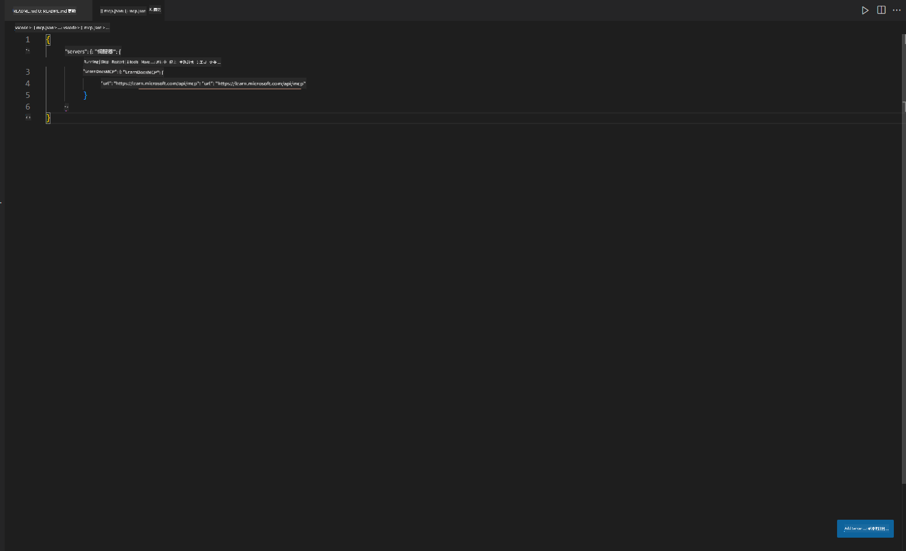
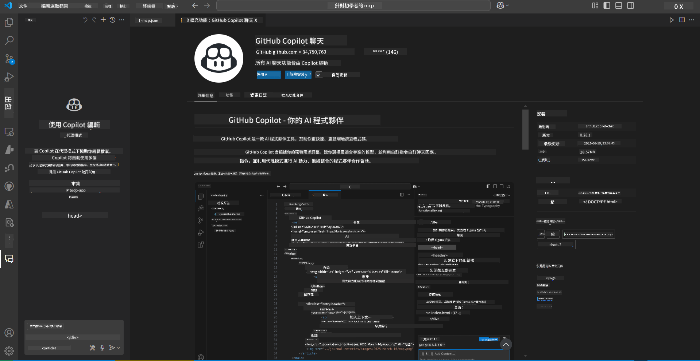
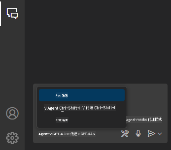
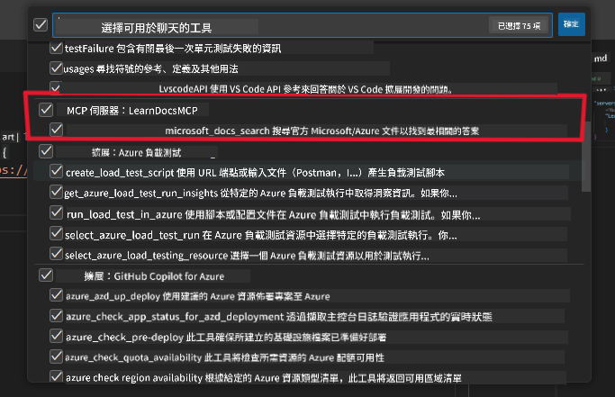

<!--
CO_OP_TRANSLATOR_METADATA:
{
  "original_hash": "db532b1ec386c9ce38c791653dc3c881",
  "translation_date": "2025-06-21T14:36:10+00:00",
  "source_file": "09-CaseStudy/docs-mcp/solution/scenario3/README.md",
  "language_code": "hk"
}
-->
# Scenario 3: 在 VS Code 編輯器內使用 MCP Server 查看文件

## 概覽

在這個情境中，你將學習如何利用 MCP server，直接將 Microsoft Learn 文件帶入 Visual Studio Code 環境。你不用再不斷切換瀏覽器分頁搜尋文件，而是可以在編輯器內直接存取、搜尋和參考官方文件。這種方式能簡化工作流程，讓你更專注，並能無縫結合像 GitHub Copilot 這類工具。

- 在 VS Code 內搜尋及閱讀文件，無需離開編碼環境。
- 直接參考文件並插入連結到 README 或課程檔案。
- 同時使用 GitHub Copilot 和 MCP，打造流暢的 AI 驅動文件工作流程。

## 學習目標

完成本章後，你將了解如何在 VS Code 中設定及使用 MCP server，以提升文件及開發流程。你將能：

- 配置工作區以使用 MCP server 查詢文件。
- 直接在 VS Code 內搜尋並插入文件內容。
- 結合 GitHub Copilot 與 MCP 的力量，打造更高效的 AI 輔助工作流程。

這些技能能幫助你保持專注、提升文件品質，並提高作為開發者或技術作家的生產力。

## 解決方案

為了實現編輯器內的文件存取，你將依序完成一系列步驟，將 MCP server 與 VS Code 及 GitHub Copilot 整合。此方案非常適合課程作者、文件撰寫者和開發者，讓你在編輯器內工作時能同時處理文件與 Copilot。

- 在撰寫課程或專案文件時，快速新增 README 的參考連結。
- 使用 Copilot 產生程式碼，並用 MCP 立即查找並引用相關文件。
- 保持專注於編輯器，提升生產力。

### 逐步指南

開始前，請依照以下步驟操作。每個步驟都可以從資源資料夾加入截圖，方便視覺化說明流程。

1. **新增 MCP 設定檔：**  
   在你的專案根目錄，建立一個 `.vscode/mcp.json` 檔案，並加入以下設定：  
   ```json
   {
     "servers": {
       "LearnDocsMCP": {
         "url": "https://learn.microsoft.com/api/mcp"
       }
     }
   }
   ```  
   此設定告訴 VS Code 如何連接到 [`Microsoft Learn Docs MCP server`](https://github.com/MicrosoftDocs/mcp)。
   
   
    
2. **打開 GitHub Copilot Chat 面板：**  
   如果尚未安裝 GitHub Copilot 擴充套件，請前往 VS Code 的 Extensions 視窗安裝。你也可以直接從 [Visual Studio Code Marketplace](https://marketplace.visualstudio.com/items?itemName=GitHub.copilot-chat) 下載。安裝後，從側邊欄打開 Copilot Chat 面板。

   

3. **啟用 agent 模式並確認工具：**  
   在 Copilot Chat 面板中啟用 agent 模式。

   

   啟用後，確認 MCP server 已列為可用工具之一。這確保 Copilot agent 能存取文件伺服器，取得相關資訊。
   
   

4. **開始新聊天並提示 agent：**  
   在 Copilot Chat 面板開啟新聊天，現在你可以向 agent 提出文件相關問題。agent 會利用 MCP server 直接在編輯器內抓取並顯示相關 Microsoft Learn 文件。

   - *「我想為主題 X 制定一個學習計劃，計劃持續 8 週，請為每週建議應學習的內容。」*

   

5. **即時查詢：**

   > 以下是一則來自 Azure AI Foundry Discord [#get-help](https://discord.gg/D6cRhjHWSC) 頻道的即時查詢（[查看原始訊息](https://discord.com/channels/1113626258182504448/1385498306720829572)）：
   
   *「我想了解如何部署多代理解決方案，這些 AI 代理是在 Azure AI Foundry 開發的。我發現沒有直接部署方法，例如 Copilot Studio 頻道。那麼，企業用戶要如何部署這類方案以互動並完成工作？  
   有很多文章或部落格說可以用 Azure Bot 服務作為 MS Teams 與 Azure AI Foundry 代理之間的橋樑。如果我設定一個 Azure Bot，透過 Azure Function 連接到 Azure AI Foundry 的 Orchestrator Agent 來執行編排，這樣可行嗎？還是我需要為多代理方案中的每個 AI 代理分別建立 Azure Function，在 Bot framework 端做編排？歡迎其他建議。」*

   

   agent 會回應相關文件連結與摘要，你可以直接插入到 markdown 檔案或用作程式碼中的參考。

### 範例查詢

以下是一些你可以嘗試的範例查詢，這些查詢展示 MCP server 與 Copilot 如何協同工作，讓你在 VS Code 內即時取得上下文相關的文件與參考資料：

- 「示範如何使用 Azure Functions 的觸發器。」
- 「插入 Azure Key Vault 官方文件的連結。」
- 「Azure 資源安全的最佳實踐是什麼？」
- 「找一個 Azure AI 服務的快速入門指南。」

這些查詢將展示 MCP server 與 Copilot 如何協同提供即時且具上下文的文件與參考，而不需離開 VS Code。

---

**免責聲明**：  
本文件經由 AI 翻譯服務 [Co-op Translator](https://github.com/Azure/co-op-translator) 翻譯而成。雖然我們致力於確保準確性，但請注意，自動翻譯可能包含錯誤或不準確之處。原始文件的母語版本應視為權威來源。對於重要資訊，建議採用專業人工翻譯。我們不對因使用本翻譯而引起的任何誤解或誤釋負責。