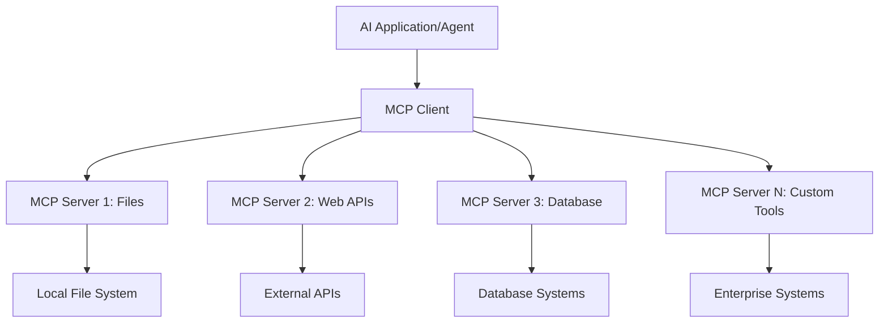
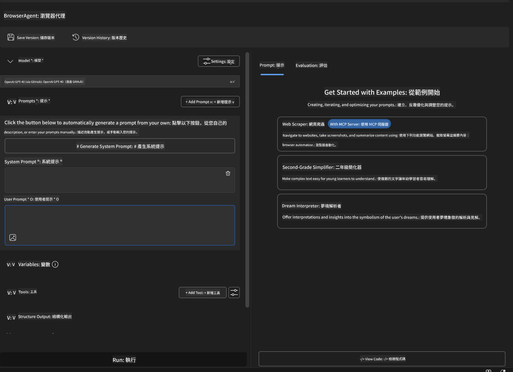
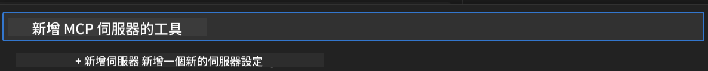
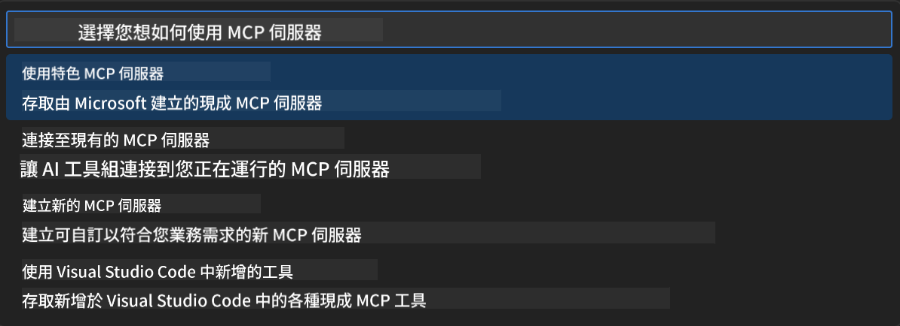
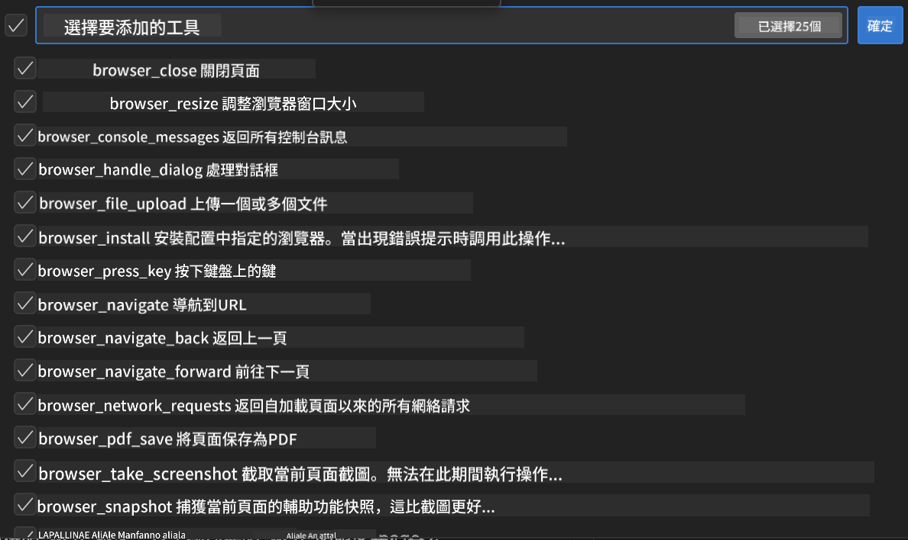
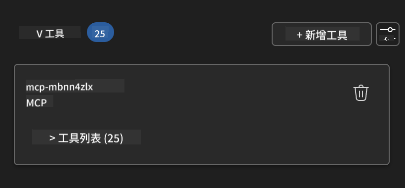
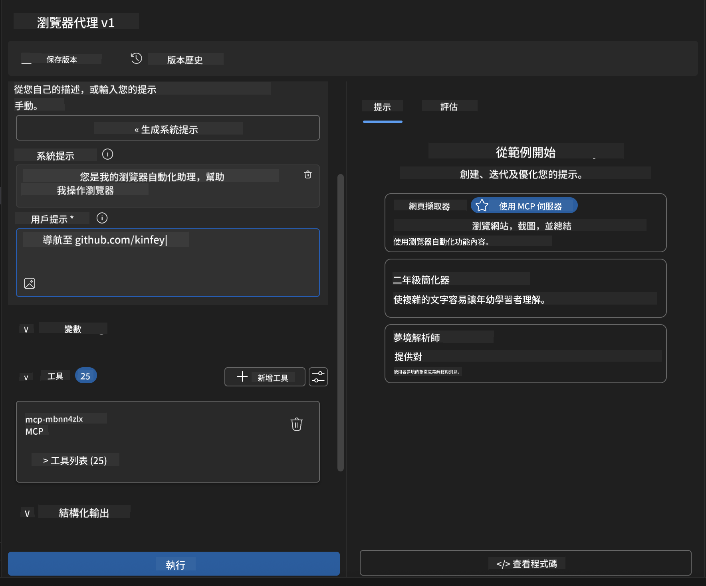
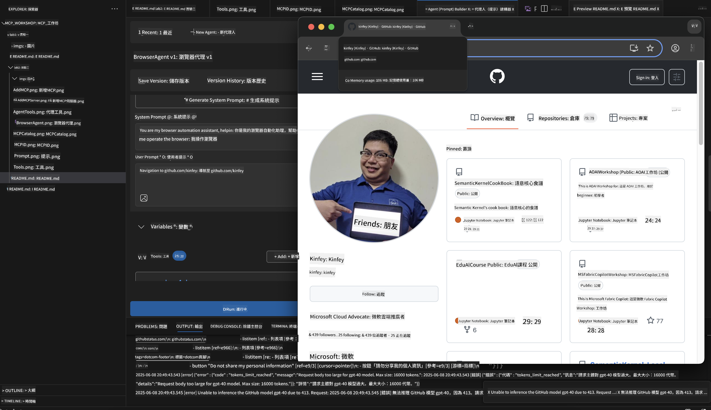
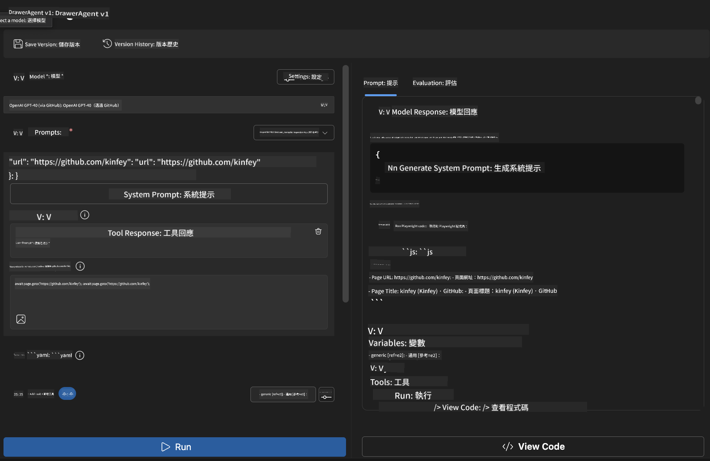
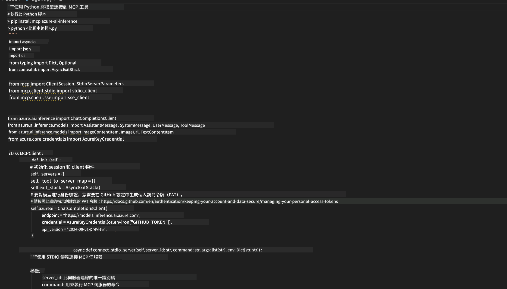

<!--
CO_OP_TRANSLATOR_METADATA:
{
  "original_hash": "a22b7dd11cd7690f99f9195877cafdc3",
  "translation_date": "2025-06-10T05:39:51+00:00",
  "source_file": "10-StreamliningAIWorkflowsBuildingAnMCPServerWithAIToolkit/lab2/README.md",
  "language_code": "hk"
}
-->
# 🌐 模組 2：MCP 與 AI Toolkit 基礎知識

[]()
[]()
[]()

## 📋 學習目標

完成本模組後，你將能夠：
- ✅ 了解 Model Context Protocol (MCP) 的架構及優勢
- ✅ 探索 Microsoft 的 MCP 伺服器生態系
- ✅ 將 MCP 伺服器整合至 AI Toolkit Agent Builder
- ✅ 使用 Playwright MCP 建立功能完善的瀏覽器自動化代理
- ✅ 在代理中配置並測試 MCP 工具
- ✅ 匯出並部署具 MCP 功能的代理進行生產應用

## 🎯 延續模組 1

在模組 1 中，我們掌握了 AI Toolkit 的基礎並創建了第一個 Python 代理。現在，我們將透過革命性的 **Model Context Protocol (MCP)**，把代理升級，連接外部工具和服務。

想像這是從簡易計算機升級到完整電腦—你的 AI 代理將具備：
- 🌐 瀏覽及互動網站的能力
- 📁 存取及操作檔案
- 🔧 與企業系統整合
- 📊 即時處理 API 傳來的資料

## 🧠 了解 Model Context Protocol (MCP)

### 🔍 MCP 是什麼？

Model Context Protocol (MCP) 是 AI 應用的 **「USB-C」** — 一個革命性的開放標準，將大型語言模型（LLM）連接到外部工具、資料來源及服務。就像 USB-C 解決了線材混亂問題，MCP 也以單一標準協定消除 AI 整合的複雜性。

### 🎯 MCP 解決了什麼問題

**MCP 出現前：**
- 🔧 每個工具都需自訂整合
- 🔄 被供應商鎖定，使用專有方案
- 🔒 即興連接帶來安全漏洞
- ⏱️ 基本整合需耗費數月開發

**MCP 出現後：**
- ⚡ 即插即用的工具整合
- 🔄 不受供應商限制的架構
- 🛡️ 內建最佳安全實務
- 🚀 幾分鐘即可新增功能

### 🏗️ MCP 架構深入解析

MCP 採用 **客戶端-伺服器架構**，打造安全且可擴展的生態系：



**🔧 核心元件：**

| 元件 | 角色 | 範例 |
|-----------|------|----------|
| **MCP Hosts** | 使用 MCP 服務的應用程式 | Claude Desktop、VS Code、AI Toolkit |
| **MCP Clients** | 協定處理器（與伺服器一對一） | 內建於 Host 應用程式 |
| **MCP Servers** | 透過標準協定提供功能 | Playwright、Files、Azure、GitHub |
| **傳輸層** | 通訊方式 | stdio、HTTP、WebSockets |


## 🏢 Microsoft 的 MCP 伺服器生態系

Microsoft 領導 MCP 生態系，提供一套完整的企業級伺服器，滿足實際商業需求。

### 🌟 特色 Microsoft MCP 伺服器

#### 1. ☁️ Azure MCP Server
**🔗 儲存庫**: [azure/azure-mcp](https://github.com/azure/azure-mcp)
**🎯 目的**: 全面 Azure 資源管理與 AI 整合

**✨ 主要功能：**
- 宣告式基礎架構佈建
- 即時資源監控
- 成本優化建議
- 安全合規檢查

**🚀 使用情境：**
- 以基礎架構即程式碼搭配 AI 輔助
- 自動化資源擴展
- 雲端成本優化
- DevOps 工作流程自動化

#### 2. 📊 Microsoft Dataverse MCP
**📚 文件**: [Microsoft Dataverse Integration](https://go.microsoft.com/fwlink/?linkid=2320176)
**🎯 目的**: 商業資料的自然語言介面

**✨ 主要功能：**
- 自然語言資料庫查詢
- 商業情境理解
- 自訂提示模板
- 企業資料治理

**🚀 使用情境：**
- 商業智慧報告
- 客戶資料分析
- 銷售管道洞察
- 合規性資料查詢

#### 3. 🌐 Playwright MCP Server
**🔗 儲存庫**: [microsoft/playwright-mcp](https://github.com/microsoft/playwright-mcp)
**🎯 目的**: 瀏覽器自動化與網頁互動功能

**✨ 主要功能：**
- 跨瀏覽器自動化（Chrome、Firefox、Safari）
- 智能元素偵測
- 截圖與 PDF 產生
- 網路流量監控

**🚀 使用情境：**
- 自動化測試工作流程
- 網頁爬蟲與資料擷取
- UI/UX 監控
- 競爭分析自動化

#### 4. 📁 Files MCP Server
**🔗 儲存庫**: [microsoft/files-mcp-server](https://github.com/microsoft/files-mcp-server)
**🎯 目的**: 智慧型檔案系統操作

**✨ 主要功能：**
- 宣告式檔案管理
- 內容同步
- 版本控制整合
- 從檔案抽取元資料

**🚀 使用情境：**
- 文件管理
- 程式碼庫組織
- 內容發佈工作流程
- 資料管線檔案處理

#### 5. 📝 MarkItDown MCP Server
**🔗 儲存庫**: [microsoft/markitdown](https://github.com/microsoft/markitdown)
**🎯 目的**: 進階 Markdown 處理與操作

**✨ 主要功能：**
- 完整 Markdown 解析
- 格式轉換（MD ↔ HTML ↔ PDF）
- 內容結構分析
- 模板處理

**🚀 使用情境：**
- 技術文件工作流程
- 內容管理系統
- 報告產生
- 知識庫自動化

#### 6. 📈 Clarity MCP Server
**📦 套件**: [@microsoft/clarity-mcp-server](https://www.npmjs.com/package/@microsoft/clarity-mcp-server)
**🎯 目的**: 網頁分析與用戶行為洞察

**✨ 主要功能：**
- 熱點圖資料分析
- 用戶會話錄影
- 效能指標
- 轉換漏斗分析

**🚀 使用情境：**
- 網站優化
- 用戶體驗研究
- A/B 測試分析
- 商業智慧儀表板

### 🌍 社群生態系

除了 Microsoft 的伺服器，MCP 生態系還包含：
- **🐙 GitHub MCP**：程式碼管理與分析
- **🗄️ 資料庫 MCP**：PostgreSQL、MySQL、MongoDB 整合
- **☁️ 雲端供應商 MCP**：AWS、GCP、Digital Ocean 工具
- **📧 通訊 MCP**：Slack、Teams、Email 整合

## 🛠️ 實作實驗室：建立瀏覽器自動化代理

**🎯 專案目標**：利用 Playwright MCP 伺服器建立智慧型瀏覽器自動化代理，能夠瀏覽網站、擷取資訊及執行複雜網頁互動。

### 🚀 階段 1：代理基礎設定

#### 步驟 1：初始化你的代理
1. **開啟 AI Toolkit Agent Builder**
2. **建立新代理**，設定如下：
   - **名稱**：`BrowserAgent`
   - **Model**: Choose GPT-4o 




### 🔧 Phase 2: MCP Integration Workflow

#### Step 3: Add MCP Server Integration
1. **Navigate to Tools Section** in Agent Builder
2. **Click "Add Tool"** to open the integration menu
3. **Select "MCP Server"** from available options


**🔍 Understanding Tool Types:**
- **Built-in Tools**: Pre-configured AI Toolkit functions
- **MCP Servers**: External service integrations
- **Custom APIs**: Your own service endpoints
- **Function Calling**: Direct model function access

#### Step 4: MCP Server Selection
1. **Choose "MCP Server"** option to proceed


2. **Browse MCP Catalog** to explore available integrations



### 🎮 Phase 3: Playwright MCP Configuration

#### Step 5: Select and Configure Playwright
1. **Click "Use Featured MCP Servers"** to access Microsoft's verified servers
2. **Select "Playwright"** from the featured list
3. **Accept Default MCP ID** or customize for your environment


#### Step 6: Enable Playwright Capabilities
**🔑 Critical Step**: Select **ALL** available Playwright methods for maximum functionality



**🛠️ Essential Playwright Tools:**
- **Navigation**: `goto`, `goBack`, `goForward`, `reload`
- **Interaction**: `click`, `fill`, `press`, `hover`, `drag`
- **Extraction**: `textContent`, `innerHTML`, `getAttribute`
- **Validation**: `isVisible`, `isEnabled`, `waitForSelector`
- **Capture**: `screenshot`, `pdf`, `video`
- **Network**: `setExtraHTTPHeaders`, `route`, `waitForResponse`

#### 步驟 7：驗證整合成功
**✅ 成功指標：**
- 所有工具都出現在 Agent Builder 介面
- 整合面板無錯誤訊息
- Playwright 伺服器狀態顯示「Connected」



**🔧 常見問題排解：**
- **連線失敗**：檢查網路連線與防火牆設定
- **缺少工具**：確認設定時已選擇所有功能
- **權限錯誤**：確認 VS Code 具備必要系統權限

### 🎯 階段 4：進階提示工程

#### 步驟 8：設計智慧系統提示
建立能發揮 Playwright 全功能的複雜提示：

```markdown
# Web Automation Expert System Prompt

## Core Identity
You are an advanced web automation specialist with deep expertise in browser automation, web scraping, and user experience analysis. You have access to Playwright tools for comprehensive browser control.

## Capabilities & Approach
### Navigation Strategy
- Always start with screenshots to understand page layout
- Use semantic selectors (text content, labels) when possible
- Implement wait strategies for dynamic content
- Handle single-page applications (SPAs) effectively

### Error Handling
- Retry failed operations with exponential backoff
- Provide clear error descriptions and solutions
- Suggest alternative approaches when primary methods fail
- Always capture diagnostic screenshots on errors

### Data Extraction
- Extract structured data in JSON format when possible
- Provide confidence scores for extracted information
- Validate data completeness and accuracy
- Handle pagination and infinite scroll scenarios

### Reporting
- Include step-by-step execution logs
- Provide before/after screenshots for verification
- Suggest optimizations and alternative approaches
- Document any limitations or edge cases encountered

## Ethical Guidelines
- Respect robots.txt and rate limiting
- Avoid overloading target servers
- Only extract publicly available information
- Follow website terms of service
```

#### 步驟 9：創建動態使用者提示
設計展示各種功能的提示：

**🌐 網頁分析範例：**
```markdown
Navigate to github.com/kinfey and provide a comprehensive analysis including:
1. Repository structure and organization
2. Recent activity and contribution patterns  
3. Documentation quality assessment
4. Technology stack identification
5. Community engagement metrics
6. Notable projects and their purposes

Include screenshots at key steps and provide actionable insights.
```



### 🚀 階段 5：執行與測試

#### 步驟 10：執行你的第一個自動化
1. **點擊「Run」** 開始自動化流程
2. **監控即時執行狀況**：
   - 自動啟動 Chrome 瀏覽器
   - 代理導航至目標網站
   - 每個主要步驟截圖保存
   - 分析結果即時串流



#### 步驟 11：分析結果與洞察
在 Agent Builder 介面查看完整分析：



### 🌟 階段 6：進階功能與部署

#### 步驟 12：匯出與生產部署
Agent Builder 支援多種部署選項：



## 🎓 模組 2 總結與後續步驟

### 🏆 解鎖成就：MCP 整合大師

**✅ 精通技能：**
- [ ] 了解 MCP 架構及其優勢
- [ ] 掌握 Microsoft MCP 伺服器生態系
- [ ] 將 Playwright MCP 整合至 AI Toolkit
- [ ] 建立複雜的瀏覽器自動化代理
- [ ] 進階的網頁自動化提示工程

### 📚 延伸資源

- **🔗 MCP 規範**： [官方協定文件](https://modelcontextprotocol.io/)
- **🛠️ Playwright API**： [完整方法參考](https://playwright.dev/docs/api/class-playwright)
- **🏢 Microsoft MCP 伺服器**： [企業整合指南](https://github.com/microsoft/mcp-servers)
- **🌍 社群範例**： [MCP 伺服器展示](https://github.com/modelcontextprotocol/servers)

**🎉 恭喜你！** 你已成功掌握 MCP 整合，現在能打造具備外部工具能力的生產級 AI 代理！


### 🔜 繼續下一模組

準備好挑戰更高階的 MCP 技能了嗎？前往 **[模組 3：進階 MCP 開發與 AI Toolkit](../lab3/README.md)**，學習如何：
- 建立自訂 MCP 伺服器
- 配置並使用最新 MCP Python SDK
- 設定 MCP Inspector 進行除錯
- 精通進階 MCP 伺服器開發流程
- 從零開始打造天氣 MCP 伺服器

**免責聲明**：  
本文件係用 AI 翻譯服務 [Co-op Translator](https://github.com/Azure/co-op-translator) 進行翻譯。雖然我哋致力保持準確性，但請注意自動翻譯可能包含錯誤或不準確之處。原文文件嘅母語版本應視為權威來源。對於重要資訊，建議採用專業人工翻譯。本公司概不負責因使用本翻譯而引起嘅任何誤解或誤釋。