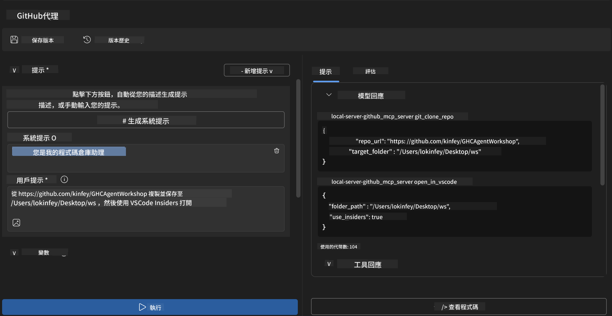

<!--
CO_OP_TRANSLATOR_METADATA:
{
  "original_hash": "f83bc722dc758efffd68667d6a1db470",
  "translation_date": "2025-06-10T06:43:05+00:00",
  "source_file": "10-StreamliningAIWorkflowsBuildingAnMCPServerWithAIToolkit/lab4/README.md",
  "language_code": "hk"
}
-->
# 🐙 Module 4: 實戰 MCP 開發 - 自訂 GitHub Clone 伺服器


> **⚡ 快速開始：** 喺30分鐘內打造一個生產級 MCP 伺服器，自動化 GitHub 倉庫複製同 VS Code 整合！

## 🎯 學習目標

完成呢個實驗後，你將能夠：

- ✅ 建立一個符合真實開發流程嘅自訂 MCP 伺服器
- ✅ 透過 MCP 實現 GitHub 倉庫複製功能
- ✅ 將自訂 MCP 伺服器同 VS Code 同 Agent Builder 整合
- ✅ 喺自訂 MCP 工具中使用 GitHub Copilot Agent Mode
- ✅ 測試同部署生產環境嘅自訂 MCP 伺服器

## 📋 先決條件

- 完成 Labs 1-3（MCP 基礎同進階開發）
- GitHub Copilot 訂閱（[免費註冊](https://github.com/github-copilot/signup)）
- 安裝好 VS Code，並裝好 AI Toolkit 同 GitHub Copilot 擴充功能
- 已安裝並設定好 Git CLI

## 🏗️ 專案概覽

### **真實開發挑戰**
作為開發者，我哋經常要喺 GitHub 複製倉庫，然後喺 VS Code 或 VS Code Insiders 開啟。呢個手動流程包括：
1. 開啟終端機/命令提示字元
2. 去到目標目錄
3. 執行 `git clone` 指令
4. 喺複製嘅目錄打開 VS Code

**我哋嘅 MCP 解決方案將呢個流程簡化成一條智能指令！**

### **你會建立嘅嘢**
一個 **GitHub Clone MCP Server** (`git_mcp_server`)，功能包括：

| 功能 | 說明 | 好處 |
|---------|-------------|---------|
| 🔄 **智能倉庫複製** | 複製 GitHub 倉庫並進行驗證 | 自動錯誤檢查 |
| 📁 **智能目錄管理** | 安全檢查及建立目錄 | 避免覆蓋 |
| 🚀 **跨平台 VS Code 整合** | 喺 VS Code/Insiders 開啟專案 | 流程無縫銜接 |
| 🛡️ **強健錯誤處理** | 處理網絡、權限及路徑問題 | 生產環境級穩定性 |

---

## 📖 步驟教學

### 第一步：喺 Agent Builder 建立 GitHub Agent

1. **透過 AI Toolkit 擴充功能開啟 Agent Builder**
2. **建立新 agent，設定如下：**
   ```
   Agent Name: GitHubAgent
   ```

3. **初始化自訂 MCP 伺服器：**
   - 去到 **Tools** → **Add Tool** → **MCP Server**
   - 選擇 **"Create A new MCP Server"**
   - 選擇 **Python 範本**，靈活度最高
   - **伺服器名稱：** `git_mcp_server`

### 第二步：設定 GitHub Copilot Agent Mode

1. **喺 VS Code 開啟 GitHub Copilot**（Ctrl/Cmd + Shift + P → "GitHub Copilot: Open"）
2. **喺 Copilot 介面揀選 Agent Model**
3. **選擇 Claude 3.7 模型**，提升推理能力
4. **啟用 MCP 整合**，方便使用工具

> **💡 專家提示：** Claude 3.7 喺理解開發流程同錯誤處理模式上表現更佳。

### 第三步：實作核心 MCP 伺服器功能

**使用以下詳細提示配合 GitHub Copilot Agent Mode：**

```
Create two MCP tools with the following comprehensive requirements:

🔧 TOOL A: clone_repository
Requirements:
- Clone any GitHub repository to a specified local folder
- Return the absolute path of the successfully cloned project
- Implement comprehensive validation:
  ✓ Check if target directory already exists (return error if exists)
  ✓ Validate GitHub URL format (https://github.com/user/repo)
  ✓ Verify git command availability (prompt installation if missing)
  ✓ Handle network connectivity issues
  ✓ Provide clear error messages for all failure scenarios

🚀 TOOL B: open_in_vscode
Requirements:
- Open specified folder in VS Code or VS Code Insiders
- Cross-platform compatibility (Windows/Linux/macOS)
- Use direct application launch (not terminal commands)
- Auto-detect available VS Code installations
- Handle cases where VS Code is not installed
- Provide user-friendly error messages

Additional Requirements:
- Follow MCP 1.9.3 best practices
- Include proper type hints and documentation
- Implement logging for debugging purposes
- Add input validation for all parameters
- Include comprehensive error handling
```

### 第四步：測試你嘅 MCP 伺服器

#### 4a. 喺 Agent Builder 測試

1. **啟動 Agent Builder 嘅除錯設定**
2. **用以下系統提示設定你嘅 agent：**

```
SYSTEM_PROMPT:
You are my intelligent coding repository assistant. You help developers efficiently clone GitHub repositories and set up their development environment. Always provide clear feedback about operations and handle errors gracefully.
```

3. **用真實用戶場景測試：**

```
USER_PROMPT EXAMPLES:

Scenario : Basic Clone and Open
"Clone {Your GitHub Repo link such as https://github.com/kinfey/GHCAgentWorkshop
 } and save to {The global path you specify}, then open it with VS Code Insiders"
```



**預期結果：**
- ✅ 成功複製並確認路徑
- ✅ 自動開啟 VS Code
- ✅ 清晰錯誤訊息處理無效情況
- ✅ 適當處理邊緣情況

#### 4b. 喺 MCP Inspector 測試


---

**🎉 恭喜晒！** 你已成功打造一個實用、生產級嘅 MCP 伺服器，解決真實開發流程嘅挑戰。你嘅自訂 GitHub 複製伺服器展示咗 MCP 喺自動化同提升開發效率方面嘅威力。

### 🏆 解鎖成就：
- ✅ **MCP 開發者** - 建立自訂 MCP 伺服器
- ✅ **流程自動化專家** - 精簡開發程序  
- ✅ **整合高手** - 連接多個開發工具
- ✅ **生產準備** - 打造可部署解決方案

---

## 🎓 工作坊結業：你嘅 Model Context Protocol 旅程

**親愛嘅工作坊參加者，**

恭喜你完成 Model Context Protocol 工作坊嘅四個模組！你由認識 AI Toolkit 基礎，到打造生產級 MCP 伺服器，成功解決真實開發挑戰，走咗好長一段路。

### 🚀 你嘅學習路線回顧：

**[Module 1](../lab1/README.md)**：你開始探索 AI Toolkit 基礎、模型測試同建立第一個 AI agent。

**[Module 2](../lab2/README.md)**：你學識 MCP 架構，整合 Playwright MCP，打造第一個瀏覽器自動化 agent。

**[Module 3](../lab3/README.md)**：你進階至自訂 MCP 伺服器開發，建立 Weather MCP 伺服器並精通除錯工具。

**[Module 4](../lab4/README.md)**：而家你將所學應用到打造實用嘅 GitHub 倉庫工作流程自動化工具。

### 🌟 你嘅掌握技能：

- ✅ **AI Toolkit 生態系統**：模型、agents 同整合模式
- ✅ **MCP 架構**：客戶端-伺服器設計、傳輸協議同安全性
- ✅ **開發者工具**：由 Playground 到 Inspector 再到生產部署
- ✅ **自訂開發**：建立、測試同部署你自己嘅 MCP 伺服器
- ✅ **實戰應用**：用 AI 解決真實工作流程挑戰

### 🔮 你嘅下一步：

1. **打造你自己嘅 MCP 伺服器**：應用所學自動化你獨特嘅工作流程
2. **加入 MCP 社群**：分享作品同向其他人學習
3. **探索進階整合**：將 MCP 伺服器接駁企業系統
4. **貢獻開源**：幫助改善 MCP 工具同文件

記住，呢個工作坊只係開始。Model Context Protocol 生態系統快速發展，而你而家已裝備好成為 AI 助力開發工具嘅先鋒。

**多謝你嘅參與同學習熱忱！**

希望呢個工作坊激發咗你嘅靈感，改變你未來同 AI 工具互動嘅方式。

**編程愉快！**

---

**免責聲明**：  
本文件係使用 AI 翻譯服務 [Co-op Translator](https://github.com/Azure/co-op-translator) 進行翻譯。雖然我哋致力確保準確性，但請注意自動翻譯可能包含錯誤或不準確之處。原文文件嘅母語版本應被視為權威來源。對於重要資料，建議採用專業人工翻譯。我哋對因使用本翻譯而引致嘅任何誤解或誤釋概不負責。