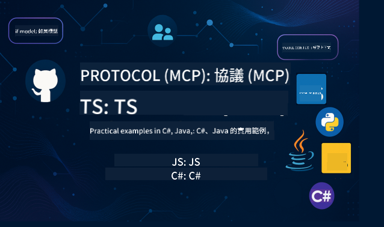

<!--
CO_OP_TRANSLATOR_METADATA:
{
  "original_hash": "14ff8da45161b7c294d7c0e60115c2b8",
  "translation_date": "2025-10-03T07:10:43+00:00",
  "source_file": "README.md",
  "language_code": "hk"
}
-->
 

按照以下步驟開始使用這些資源：
1. **Fork 此儲存庫**：點擊 
2. **Clone 此儲存庫**：   `git clone https://github.com/microsoft/mcp-for-beginners.git`
3. [**加入 Azure AI Foundry Discord，與專家及其他開發者交流**](https://discord.com/invite/ByRwuEEgH4)

### 🌐 多語言支援

#### 透過 GitHub Action 支援（自動化且始終保持最新）

 [阿拉伯文](../ar/README.md) | [孟加拉文](../bn/README.md) | [保加利亞文](../bg/README.md) | [緬甸文](../my/README.md) | [中文（簡體）](../zh/README.md) | [中文（繁體，香港）](./README.md) | [中文（繁體，澳門）](../mo/README.md) | [中文（繁體，台灣）](../tw/README.md) | [克羅地亞文](../hr/README.md) | [捷克文](../cs/README.md) | [丹麥文](../da/README.md) | [荷蘭文](../nl/README.md) | [芬蘭文](../fi/README.md) | [法文](../fr/README.md) | [德文](../de/README.md) | [希臘文](../el/README.md) | [希伯來文](../he/README.md) | [印地文](../hi/README.md) | [匈牙利文](../hu/README.md) | [印尼文](../id/README.md) | [意大利文](../it/README.md) | [日文](../ja/README.md) | [韓文](../ko/README.md) | [馬來文](../ms/README.md) | [馬拉地文](../mr/README.md) | [尼泊爾文](../ne/README.md) | [挪威文](../no/README.md) | [波斯文（法爾西）](../fa/README.md) | [波蘭文](../pl/README.md) | [葡萄牙文（巴西）](../br/README.md) | [葡萄牙文（葡萄牙）](../pt/README.md) | [旁遮普文（古木基文）](../pa/README.md) | [羅馬尼亞文](../ro/README.md) | [俄文](../ru/README.md) | [塞爾維亞文（西里爾文）](../sr/README.md) | [斯洛伐克文](../sk/README.md) | [斯洛文尼亞文](../sl/README.md) | [西班牙文](../es/README.md) | [斯瓦希里文](../sw/README.md) | [瑞典文](../sv/README.md) | [塔加洛文（菲律賓文）](../tl/README.md) | [泰文](../th/README.md) | [土耳其文](../tr/README.md) | [烏克蘭文](../uk/README.md) | [烏爾都文](../ur/README.md) | [越南文](../vi/README.md)

# 🚀 初學者的模型上下文協議（MCP）課程

## **透過 C#、Java、JavaScript、Rust、Python 和 TypeScript 的實作範例學習 MCP**

## 🧠 模型上下文協議課程概述

**模型上下文協議（MCP）** 是一個前沿框架，旨在標準化 AI 模型與客戶端應用程式之間的互動。本開源課程提供結構化的學習路徑，包含實際的程式碼範例和真實世界的使用案例，涵蓋流行的程式語言如 C#、Java、JavaScript、TypeScript 和 Python。

無論您是 AI 開發者、系統架構師還是軟體工程師，這份指南都是您掌握 MCP 基礎知識和實作策略的全面資源。

## 🔗 官方 MCP 資源

- 📘 [MCP 文件](https://modelcontextprotocol.io/) – 詳細的教程和使用指南  
- 📜 [MCP 規範](https://modelcontextprotocol.io/docs/) – 協議架構和技術參考  
- 📜 [原始 MCP 規範](https://spec.modelcontextprotocol.io/) – 傳統技術參考（可能包含更多細節）  
- 🧑‍💻 [MCP GitHub 儲存庫](https://github.com/modelcontextprotocol) – 開源 SDK、工具和程式碼範例
- 🌐 [MCP 社群](https://github.com/orgs/modelcontextprotocol/discussions) – 加入討論並為社群做出貢獻

## 🧭 MCP 課程概述

### 📚 完整課程結構

| 模組 | 主題 | 描述 | 連結 |
|--------|-------|-------------|------|
| **模組 1-3：基礎知識** | | | |
| 00 | MCP 簡介 | MCP 的概述及其在 AI 管道中的重要性 | [了解更多](./00-Introduction/README.md) |
| 01 | 核心概念解析 | 深入探討 MCP 的核心概念 | [了解更多](./01-CoreConcepts/README.md) |
| 02 | MCP 的安全性 | 安全威脅及最佳實踐 | [了解更多](./02-Security/README.md) |
| 03 | MCP 入門 | 環境設置、基本伺服器/客戶端、整合 | [了解更多](./03-GettingStarted/README.md) |
| **模組 3：建立您的第一個伺服器和客戶端** | | | |
| 3.1 | 第一個伺服器 | 建立您的第一個 MCP 伺服器 | [指南](./03-GettingStarted/01-first-server/README.md) |
| 3.2 | 第一個客戶端 | 開發一個基本的 MCP 客戶端 | [指南](./03-GettingStarted/02-client/README.md) |
| 3.3 | 客戶端與 LLM | 整合大型語言模型 | [指南](./03-GettingStarted/03-llm-client/README.md) |
| 3.4 | VS Code 整合 | 在 VS Code 中使用 MCP 伺服器 | [指南](./03-GettingStarted/04-vscode/README.md) |
| 3.5 | stdio 伺服器 | 使用 stdio 傳輸建立伺服器 | [指南](./03-GettingStarted/05-stdio-server/README.md) |
| 3.6 | HTTP 串流 | 在 MCP 中實作 HTTP 串流 | [指南](./03-GettingStarted/06-http-streaming/README.md) |
| 3.7 | AI 工具包 | 使用 MCP 的 AI 工具包 | [指南](./03-GettingStarted/07-aitk/README.md) |
| 3.8 | 測試 | 測試您的 MCP 伺服器實作 | [指南](./03-GettingStarted/08-testing/README.md) |
| 3.9 | 部署 | 將 MCP 伺服器部署到生產環境 | [指南](./03-GettingStarted/09-deployment/README.md) |
| **模組 4-5：實作與進階** | | | |
| 04 | 實際應用 | SDK、除錯、測試、可重用的提示模板 | [了解更多](./04-PracticalImplementation/README.md) |
| 05 | MCP 的進階主題 | 多模態 AI、擴展、企業應用 | [了解更多](./05-AdvancedTopics/README.md) |
| 5.1 | Azure 整合 | MCP 與 Azure 的整合 | [指南](./05-AdvancedTopics/mcp-integration/README.md) |
| 5.2 | 多模態 | 處理多種模態 | [指南](./05-AdvancedTopics/mcp-multi-modality/README.md) |
| 5.3 | OAuth2 示範 | 實作 OAuth2 認證 | [指南](./05-AdvancedTopics/mcp-oauth2-demo/README.md) |
| 5.4 | 根上下文 | 理解並實作根上下文 | [指南](./05-AdvancedTopics/mcp-root-contexts/README.md) |
| 5.5 | 路由 | MCP 的路由策略 | [指南](./05-AdvancedTopics/mcp-routing/README.md) |
| 5.6 | 抽樣 | MCP 中的抽樣技術 | [指南](./05-AdvancedTopics/mcp-sampling/README.md) |
| 5.7 | 擴展 | 擴展 MCP 的實作 | [指南](./05-AdvancedTopics/mcp-scaling/README.md) |
| 5.8 | 安全性 | 進階安全考量 | [指南](./05-AdvancedTopics/mcp-security/README.md) |
| 5.9 | 網頁搜尋 | 實作網頁搜尋功能 | [指南](./05-AdvancedTopics/web-search-mcp/README.md) |
| 5.10 | 即時串流 | 建立即時串流功能 | [指南](./05-AdvancedTopics/mcp-realtimestreaming/README.md) |
| 5.11 | 即時搜尋 | 實作即時搜尋 | [指南](./05-AdvancedTopics/mcp-realtimesearch/README.md) |
| 5.12 | Entra ID 認證 | 使用 Microsoft Entra ID 進行認證 | [指南](./05-AdvancedTopics/mcp-security-entra/README.md) |
| 5.13 | Foundry 整合 | 與 Azure AI Foundry 整合 | [指南](./05-AdvancedTopics/mcp-foundry-agent-integration/README.md) |
| 5.14 | 上下文工程 | 有效上下文工程的技巧 | [指南](./05-AdvancedTopics/mcp-contextengineering/README.md) |
| 5.15 | MCP 自訂傳輸 | 自訂傳輸的實作 | [指南](./05-AdvancedTopics/mcp-transport/README.md) |
| **模組 6-10：社群與最佳實踐** | | | |
| 06 | 社群貢獻 | 如何為 MCP 生態系統做出貢獻 | [指南](./06-CommunityContributions/README.md) |
| 07 | 早期採用的洞察 | 真實世界的實作故事 | [指南](./07-LessonsFromEarlyAdoption/README.md) |
| 08 | MCP 的最佳實踐 | 性能、容錯、韌性 | [指南](./08-BestPractices/README.md) |
| 09 | MCP 案例研究 | 實際應用範例 | [指南](./09-CaseStudy/README.md) |
| 10 | 實作工作坊 | 使用 AI 工具包建立 MCP 伺服器 | [實驗](./10-StreamliningAIWorkflowsBuildingAnMCPServerWithAIToolkit/README.md) |
| **模組 11：MCP 伺服器實作實驗室** | | | |
| 11 | MCP 伺服器資料庫整合 | 涵蓋 PostgreSQL 整合的完整 13 實驗學習路徑 | [實驗](./11-MCPServerHandsOnLabs/README.md) |
| 11.1 | 簡介 | MCP 與資料庫整合及零售分析使用案例概述 | [實驗 00](./11-MCPServerHandsOnLabs/00-Introduction/README.md) |
| 11.2 | 核心架構 | 理解 MCP 伺服器架構、資料庫層及安全模式 | [實驗 01](./11-MCPServerHandsOnLabs/01-Architecture/README.md) |
| 11.3 | 安全性與多租戶 | 行級安全性、身份驗證及多租戶數據訪問 | [Lab 02](./11-MCPServerHandsOnLabs/02-Security/README.md) |
| 11.4 | 環境設置 | 設置開發環境、Docker、Azure 資源 | [Lab 03](./11-MCPServerHandsOnLabs/03-Setup/README.md) |
| 11.5 | 數據庫設計 | PostgreSQL 設置、零售模式設計及示例數據 | [Lab 04](./11-MCPServerHandsOnLabs/04-Database/README.md) |
| 11.6 | MCP 伺服器實現 | 構建與數據庫集成的 FastMCP 伺服器 | [Lab 05](./11-MCPServerHandsOnLabs/05-MCP-Server/README.md) |
| 11.7 | 工具開發 | 創建數據庫查詢工具及模式檢視工具 | [Lab 06](./11-MCPServerHandsOnLabs/06-Tools/README.md) |
| 11.8 | 語義搜索 | 使用 Azure OpenAI 和 pgvector 實現向量嵌入 | [Lab 07](./11-MCPServerHandsOnLabs/07-Semantic-Search/README.md) |
| 11.9 | 測試與調試 | 測試策略、調試工具及驗證方法 | [Lab 08](./11-MCPServerHandsOnLabs/08-Testing/README.md) |
| 11.10 | VS Code 集成 | 配置 VS Code MCP 集成及 AI 聊天功能 | [Lab 09](./11-MCPServerHandsOnLabs/09-VS-Code/README.md) |
| 11.11 | 部署策略 | Docker 部署、Azure Container Apps 及擴展考量 | [Lab 10](./11-MCPServerHandsOnLabs/10-Deployment/README.md) |
| 11.12 | 監控 | 應用洞察、日誌記錄及性能監控 | [Lab 11](./11-MCPServerHandsOnLabs/11-Monitoring/README.md) |
| 11.13 | 最佳實踐 | 性能優化、安全加固及生產環境技巧 | [Lab 12](./11-MCPServerHandsOnLabs/12-Best-Practices/README.md) |

### 💻 示例代碼項目

#### 基礎 MCP 計算器示例

| 語言 | 描述 | 連結 |
|------|------|------|
| C# | MCP 伺服器示例 | [查看代碼](./03-GettingStarted/samples/csharp/README.md) |
| Java | MCP 計算器 | [查看代碼](./03-GettingStarted/samples/java/calculator/README.md) |
| JavaScript | MCP 演示 | [查看代碼](./03-GettingStarted/samples/javascript/README.md) |
| Python | MCP 伺服器 | [查看代碼](../../03-GettingStarted/samples/python/mcp_calculator_server.py) |
| TypeScript | MCP 示例 | [查看代碼](./03-GettingStarted/samples/typescript/README.md) |
| Rust | MCP 示例 | [查看代碼](./03-GettingStarted/samples/rust/README.md) |

#### 高級 MCP 實現

| 語言 | 描述 | 連結 |
|------|------|------|
| C# | 高級示例 | [查看代碼](./04-PracticalImplementation/samples/csharp/README.md) |
| Java with Spring | 容器應用示例 | [查看代碼](./04-PracticalImplementation/samples/java/containerapp/README.md) |
| JavaScript | 高級示例 | [查看代碼](./04-PracticalImplementation/samples/javascript/README.md) |
| Python | 複雜實現 | [查看代碼](../../04-PracticalImplementation/samples/python/READMEmd) |
| TypeScript | 容器示例 | [查看代碼](./04-PracticalImplementation/samples/typescript/README.md) |

## 🎯 學習 MCP 的先決條件

為了充分利用此課程內容，您應具備以下知識：

- 至少熟悉以下任一編程語言：C#、Java、JavaScript、Python 或 TypeScript
- 理解客戶端-伺服器模型及 API
- 熟悉 REST 和 HTTP 概念
- （可選）具備 AI/ML 概念背景

- 加入我們的社區討論以獲得支持

## 📚 學習指南與資源

此存儲庫包含多種資源，幫助您有效學習：

### 學習指南

提供一份全面的 [學習指南](./study_guide.md)，幫助您有效地瀏覽此存儲庫。指南包括：

- 涵蓋所有主題的視覺課程地圖
- 每個存儲庫部分的詳細分解
- 使用示例項目的指導
- 根據不同技能水平推薦的學習路徑
- 補充學習旅程的額外資源

### 更新記錄

我們維護了一份詳細的 [更新記錄](./changelog.md)，追蹤課程材料的所有重要更新，包括：

- 新內容添加
- 結構變更
- 功能改進
- 文檔更新

## 🛠️ 如何有效使用此課程

本指南中的每節課程包括：

1. 清晰的 MCP 概念解釋  
2. 多種語言的即時代碼示例  
3. 構建真實 MCP 應用的練習  
4. 為高級學習者提供的額外資源  

## 活動 

### [MCP 開發者日 2025 年 7 月](https://developer.microsoft.com/en-us/reactor/series/S-1563/)
#### [➡️隨時觀看 - MCP 開發者日](https://developer.microsoft.com/en-us/reactor/series/S-1563/)
準備好參加為期兩天的深入技術洞察、社區連接和實踐學習的 MCP 開發者日活動，這是一個專注於模型上下文協議（MCP）的虛擬活動——這項新興標準將 AI 模型與其依賴的工具聯繫起來。
您可以通過註冊我們的活動頁面觀看 MCP 開發者日：https://aka.ms/mcpdevdays。

#### [第一天：MCP 生產力、開發工具與社區](https://developer.microsoft.com/en-us/reactor/series/S-1563/)

第一天旨在幫助開發者將 MCP 融入其開發工作流程，並慶祝 MCP 社區的卓越成就。我們將與社區成員和合作夥伴（如 Arcade、Block、Okta 和 Neon）一起探討他們如何與 Microsoft 合作，共同塑造開放、可擴展的 MCP 生態系統。  
- 展示 VS Code、Visual Studio、GitHub Copilot 和流行社區工具的真實案例  
- 實用的上下文驅動開發工作流程  
- 社區主導的會議和洞察  
無論您是剛開始接觸 MCP 還是已經在使用它，第一天將為您提供靈感和可操作的收穫。

#### [第二天：自信地構建 MCP 伺服器](https://developer.microsoft.com/en-us/reactor/series/S-1563/)

第二天專為 MCP 構建者設計。我們將深入探討構建 MCP 伺服器的實現策略和最佳實踐，並將 MCP 集成到您的 AI 工作流程中。

#### 主題包括：

- 構建 MCP 伺服器並將其集成到代理體驗中  
- 驅動式開發  
- 安全性最佳實踐  
- 使用功能、ACA 和 API 管理等構建模塊  
- 註冊對齊和工具（1P + 3P）  

如果您是開發者、工具構建者或 AI 產品策略師，第二天將為您提供構建可擴展、安全且面向未來的 MCP 解決方案所需的洞察。

### MCP 訓練營 2025 年 8 月
通過密集的視頻課程學習如何創建 MCP 伺服器、集成 VS Code 並基於 MCP 初學者課程內容在 Azure 上專業部署。掌握主要公司已經使用的技術的實用技能。

#### [➡️隨時觀看 MCP 訓練營 | 英文](https://developer.microsoft.com/en-us/reactor/series/s-1568/)
#### [➡️隨時觀看 MCP 訓練營 | 巴西](https://developer.microsoft.com/en-us/reactor/series/S-1566/)
#### [➡️隨時觀看 MCP 訓練營 | 西班牙文](https://developer.microsoft.com/en-us/reactor/series/S-1567/)

### 一起學習 MCP 與 C# - 教程系列
一起學習模型上下文協議（MCP），這是一個旨在標準化 AI 模型與客戶端應用之間交互的前沿框架。在這個面向初學者的課程中，我們將向您介紹 MCP，並指導您創建第一個 MCP 伺服器。
#### C#: [https://aka.ms/letslearnmcp-csharp](https://aka.ms/letslearnmcp-csharp)
#### Java: [https://aka.ms/letslearnmcp-java](https://aka.ms/letslearnmcp-java)
#### JavaScript: [https://aka.ms/letslearnmcp-javascript](https://aka.ms/letslearnmcp-javascript)
#### Python: [https://aka.ms/letslearnmcp-python](https://aka.ms/letslearnmcp-python)

## 🌟 社區感謝

感謝 Microsoft Valued Professional [Shivam Goyal](https://www.linkedin.com/in/shivam2003/) 為此課程提供重要代碼示例。

## 📜 授權信息

此內容基於 **MIT 授權**。有關條款和條件，請參閱 [LICENSE](../../LICENSE)。

## 🤝 貢獻指南

此項目歡迎貢獻和建議。大多數貢獻需要您同意一份貢獻者授權協議（CLA），聲明您有權並實際授予我們使用您的貢獻的權利。詳情請訪問 <https://cla.opensource.microsoft.com>。

當您提交拉取請求時，CLA 機器人將自動判斷您是否需要提供 CLA 並適當地標記 PR（例如，狀態檢查、評論）。只需按照機器人提供的指示操作即可。您只需在所有使用 CLA 的存儲庫中執行一次此操作。

此項目採用了 [Microsoft 開源行為準則](https://opensource.microsoft.com/codeofconduct/)。  
如需更多信息，請參閱 [行為準則 FAQ](https://opensource.microsoft.com/codeofconduct/faq/) 或聯繫 [opencode@microsoft.com](mailto:opencode@microsoft.com) 提出其他問題或意見。

## 📂 存儲庫結構

此存儲庫的組織結構如下：

- **核心課程 (00-11)**：主要內容分為十一個連續模塊，包括全面的數據庫集成實驗室  
- **11-MCPServerHandsOnLabs/**：完整的 13 個實驗室學習路徑，用於構建具有 PostgreSQL 集成的生產級 MCP 伺服器  
- **images/**：課程中使用的圖表和插圖  
- **translations/**：多語言支持及自動翻譯  
- **translated_images/**：本地化版本的圖表和插圖  
- **study_guide.md**：瀏覽存儲庫的全面指南  
- **changelog.md**：課程材料所有重要變更的記錄  
- **mcp.json**：MCP 規範的配置文件  
- **CODE_OF_CONDUCT.md, LICENSE, SECURITY.md, SUPPORT.md**：項目治理文件  

## 🎒 其他課程
我們的團隊還製作了其他課程！查看以下內容：

- [**新** 初學者的邊緣 AI](https://github.com/microsoft/edgeai-for-beginners?WT.mc_id=academic-105485-koreyst)
- [初學者的 AI 代理](https://github.com/microsoft/ai-agents-for-beginners?WT.mc_id=academic-105485-koreyst)
- [使用 .NET 的生成式 AI 初學者課程](https://github.com/microsoft/Generative-AI-for-beginners-dotnet?WT.mc_id=academic-105485-koreyst)
- [使用 JavaScript 的生成式 AI 初學者課程](https://github.com/microsoft/generative-ai-with-javascript?WT.mc_id=academic-105485-koreyst)
- [生成式 AI 初學者課程](https://github.com/microsoft/generative-ai-for-beginners?WT.mc_id=academic-105485-koreyst)
- [使用 Java 的生成式 AI 初學者課程](https://github.com/microsoft/generative-ai-for-beginners-java?WT.mc_id=academic-105485-koreyst)
- [初學者的機器學習](https://aka.ms/ml-beginners?WT.mc_id=academic-105485-koreyst)
- [初學者的數據科學](https://aka.ms/datascience-beginners?WT.mc_id=academic-105485-koreyst)
- [初學者的人工智能](https://aka.ms/ai-beginners?WT.mc_id=academic-105485-koreyst)
- [初學者的網絡安全](https://github.com/microsoft/Security-101?WT.mc_id=academic-96948-sayoung)
- [初學者的網頁開發](https://aka.ms/webdev-beginners?WT.mc_id=academic-105485-koreyst)
- [初學者的物聯網](https://aka.ms/iot-beginners?WT.mc_id=academic-105485-koreyst)
- [初學者的 XR 開發](https://github.com/microsoft/xr-development-for-beginners?WT.mc_id=academic-105485-koreyst)
- [掌握 GitHub Copilot 用於 AI 配對編程](https://aka.ms/GitHubCopilotAI?WT.mc_id=academic-105485-koreyst)
- [掌握 GitHub Copilot 用於 C#/.NET 開發者](https://github.com/microsoft/mastering-github-copilot-for-dotnet-csharp-developers?WT.mc_id=academic-105485-koreyst)
- [選擇您的 Copilot 冒險](https://github.com/microsoft/CopilotAdventures?WT.mc_id=academic-105485-koreyst)
## ™️ 商標通知

此項目可能包含與項目、產品或服務相關的商標或標誌。使用 Microsoft 商標或標誌需獲授權，並必須遵守 [Microsoft 的商標與品牌指南](https://www.microsoft.com/legal/intellectualproperty/trademarks/usage/general)。  
在修改版本的此項目中使用 Microsoft 商標或標誌，不得引起混淆或暗示 Microsoft 的贊助。  
任何使用第三方商標或標誌的行為均需遵守該第三方的政策。

## 尋求幫助

如果您遇到困難或對建立 AI 應用有任何疑問，請加入：

如果您有產品反饋或在構建過程中遇到錯誤，請訪問：

---

**免責聲明**：  
本文件已使用 AI 翻譯服務 [Co-op Translator](https://github.com/Azure/co-op-translator) 進行翻譯。儘管我們致力於提供準確的翻譯，請注意自動翻譯可能包含錯誤或不準確之處。原始語言的文件應被視為權威來源。對於重要資訊，建議使用專業的人力翻譯。我們對因使用此翻譯而引起的任何誤解或錯誤解釋概不負責。