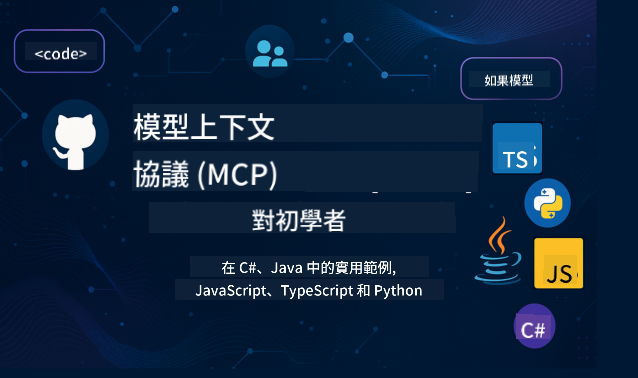

<!--
CO_OP_TRANSLATOR_METADATA:
{
  "original_hash": "2a21391378c12ecfef50f866329dfde0",
  "translation_date": "2025-05-17T05:19:30+00:00",
  "source_file": "README.md",
  "language_code": "hk"
}
-->

跟隨以下步驟開始使用這些資源：
1. **Fork儲存庫**：點擊 
2. **Clone儲存庫**： `git clone https://github.com/microsoft/mcp-for-beginners.git`
3. [**加入Microsoft Azure AI Foundry Discord，與專家和其他開發者交流**](https://discord.com/invite/ByRwuEEgH4)

### 🌐 多語言支持

#### 通過GitHub Action支持（自動化且始終保持最新）
[法文](../fr/README.md) | [西班牙文](../es/README.md) | [德文](../de/README.md) | [俄文](../ru/README.md) | [阿拉伯文](../ar/README.md) | [波斯文 (法爾西)](../fa/README.md) | [烏爾都文](../ur/README.md) | [中文 (簡體)](../zh/README.md) | [中文 (繁體, 澳門)](../mo/README.md) | [中文 (繁體, 香港)](./README.md) | [中文 (繁體, 台灣)](../tw/README.md) | [日文](../ja/README.md) | [韓文](../ko/README.md) | [印地文](../hi/README.md) | [孟加拉文](../bn/README.md) | [馬拉地文](../mr/README.md) | [尼泊爾文](../ne/README.md) | [旁遮普文 (古木基)](../pa/README.md) | [葡萄牙文 (葡萄牙)](../pt/README.md) | [葡萄牙文 (巴西)](../br/README.md) | [意大利文](../it/README.md) | [波蘭文](../pl/README.md) | [土耳其文](../tr/README.md) | [希臘文](../el/README.md) | [泰文](../th/README.md) | [瑞典文](../sv/README.md) | [丹麥文](../da/README.md) | [挪威文](../no/README.md) | [芬蘭文](../fi/README.md) | [荷蘭文](../nl/README.md) | [希伯來文](../he/README.md) | [越南文](../vi/README.md) | [印尼文](../id/README.md) | [馬來文](../ms/README.md) | [塔加洛語 (菲律賓語)](../tl/README.md) | [斯瓦希里文](../sw/README.md) | [匈牙利文](../hu/README.md) | [捷克文](../cs/README.md) | [斯洛伐克文](../sk/README.md) | [羅馬尼亞文](../ro/README.md) | [保加利亞文](../bg/README.md) | [塞爾維亞文 (西里爾文)](../sr/README.md) | [克羅地亞文](../hr/README.md) | [斯洛文尼亞文](../sl/README.md)
# 🚀 初學者的模型上下文協議 (MCP) 課程終極指南

## **通過 C#、Java、JavaScript、Python 和 TypeScript 的實踐代碼示例學習 MCP**

## 🧠 模型上下文協議課程概述

**模型上下文協議 (MCP)** 是一個尖端框架，旨在標準化 AI 模型與客戶端應用程序之間的交互。這個開源課程提供了結構化的學習路徑，包含實用的編程示例和真實案例，涵蓋流行的編程語言，包括 C#、Java、JavaScript、TypeScript 和 Python。

無論你是 AI 開發者、系統架構師還是軟件工程師，這本指南都是你掌握 MCP 基礎和實施策略的全面資源。

## 🔗 官方 MCP 資源

- 📘 [MCP 文檔](https://modelcontextprotocol.io/) – 詳細教程和用戶指南  
- 📜 [MCP 規範](https://spec.modelcontextprotocol.io/) – 協議架構和技術參考  
- 🧑‍💻 [MCP GitHub 存儲庫](https://github.com/modelcontextprotocol) – 開源 SDK、工具和代碼示例  

## 🧭 完整的 MCP 課程結構

### 📌 [MCP 介紹](./00-Introduction/README.md)

- 什麼是模型上下文協議？
- 標準化在 AI 管道中的重要性
- MCP 的實際案例和優勢

### 🧩 [核心概念解析](./01-CoreConcepts/README.md)

- 理解 MCP 中的客戶端-服務器架構
- 協議的關鍵組成部分：請求、響應和結構
- MCP 消息和數據交換模式

### 🔐 [MCP 中的安全性](./02-Security/readme.md)

- 識別 MCP 系統中的安全威脅
- 保護實施的技術和最佳實踐

### 🚀 [開始使用 MCP](./03-GettingStarted/README.md)

- 環境設置和配置
- 創建基本的 MCP 服務器和客戶端
- 將 MCP 與現有應用程序集成

#### 🧮 MCP 計算器示例項目：

  
<strong>按語言探索代碼實現</strong>

  - [C# MCP 服務器示例](./03-GettingStarted/samples/csharp/README.md)
  - [Java MCP 計算器](./03-GettingStarted/samples/java/calculator/README.md)
  - [JavaScript MCP 演示](./03-GettingStarted/samples/javascript/README.md)
  - [Python MCP 服務器](../../03-GettingStarted/samples/python/mcp_calculator_server.py)
  - [TypeScript MCP 示例](./03-GettingStarted/samples/typescript/README.md)

### 🛠️ [實用實施](./04-PracticalImplementation/README.md)

- 使用不同語言的 SDK
- 調試、測試和驗證
- 創建可重用的提示模板和工作流程

#### 💡 MCP 高級計算器項目：

  
<strong>探索高級示例</strong>

  - [高級 C# 示例](./04-PracticalImplementation/samples/csharp/README.md)
  - [Java 容器應用示例](./04-PracticalImplementation/samples/java/containerapp/README.md)
  - [JavaScript 高級示例](./04-PracticalImplementation/samples/javascript/README.md)
  - [Python 複雜實施](../../04-PracticalImplementation/samples/python/mcp_sample.py)
  - [TypeScript 容器示例](./04-PracticalImplementation/samples/typescript/README.md)

### 🎓 [MCP 高級主題](./05-AdvancedTopics/README.md)

- 多模態 AI 工作流程和擴展性
- 安全擴展策略
- MCP 在企業生態系統中的應用

### 🌍 [社區貢獻](./06-CommunityContributions/README.md)

- 如何貢獻代碼和文檔
- 通過 GitHub 進行合作
- 社區驅動的增強和反饋

### 📈 [早期採用的洞察](./07-CaseStudies/README.md)

- 真實世界的實施和有效方法
- 構建和部署基於 MCP 的解決方案
- 趨勢和未來路線圖

### 📏 [MCP 的最佳實踐](./08-BestPractices/README.md)

- 性能調整和優化
- 設計容錯 MCP 系統
- 測試和恢復策略

### 📊 [MCP 案例研究](./09-CaseStudy/Readme.md)

- 深入研究 MCP 解決方案架構
- 部署藍圖和集成提示
- 帶註釋的圖表和項目演示

## 🎯 學習 MCP 的前提條件

為了充分利用這門課程，你應該具備：

- 基本的 C#、Java 或 Python 知識
- 理解客戶端-服務器模型和 API
- （可選）熟悉機器學習概念

## 🛠️ 如何有效地使用這門課程

本指南中的每節課包括：

1. MCP 概念的清晰解釋  
2. 多語言的即時代碼示例  
3. 構建真實 MCP 應用的練習  
4. 為高級學習者提供的額外資源  

## 📜 許可信息

此內容是根據 **MIT 許可** 授權的。欲知條款和條件，請參閱 [LICENSE](../../LICENSE)。

## 🤝 貢獻指南

此項目歡迎貢獻和建議。大多數貢獻需要你同意一份
貢獻者許可協議 (CLA)，聲明你有權利並實際授予我們使用你貢獻的權利。詳情請訪問 <https://cla.opensource.microsoft.com>。

當你提交拉取請求時，CLA 機器人會自動確定你是否需要提供 CLA 並適當地裝飾 PR（例如，狀態檢查、評論）。只需按照機器人提供的指示操作即可。你只需在所有使用我們 CLA 的存儲庫中執行一次。

此項目採用了 [Microsoft 開源行為準則](https://opensource.microsoft.com/codeofconduct/)。
欲知更多信息，請參閱 [行為準則 FAQ](https://opensource.microsoft.com/codeofconduct/faq/) 或
聯繫 [opencode@microsoft.com](mailto:opencode@microsoft.com) 提出任何其他問題或評論。

## ™️ 商標聲明

此項目可能包含項目、產品或服務的商標或徽標。授權使用 Microsoft
商標或徽標必須遵循 [Microsoft 的商標和品牌指南](https://www.microsoft.com/legal/intellectualproperty/trademarks/usage/general)。
在修改版本的此項目中使用 Microsoft 商標或徽標不得造成混淆或暗示 Microsoft 的贊助。
任何使用第三方商標或徽標的行為均需遵循第三方的政策。

**免責聲明**：
本文檔使用AI翻譯服務[Co-op Translator](https://github.com/Azure/co-op-translator)進行翻譯。我們努力追求準確性，但請注意，自動翻譯可能包含錯誤或不準確之處。原始文件的母語版本應被視為權威來源。對於關鍵信息，建議使用專業人工翻譯。對於因使用此翻譯而產生的任何誤解或誤讀，我們概不負責。