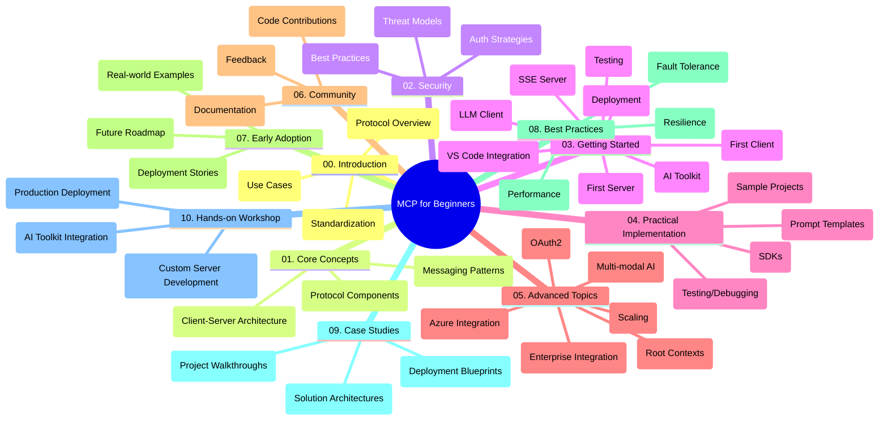

<!--
CO_OP_TRANSLATOR_METADATA:
{
  "original_hash": "a607d4febc94caee9a12b77795f7fc9a",
  "translation_date": "2025-06-11T16:38:41+00:00",
  "source_file": "study_guide.md",
  "language_code": "hk"
}
-->
# Model Context Protocol (MCP) 初學者指南

本指南概述「Model Context Protocol (MCP) 初學者」課程的倉庫結構及內容，助你有效瀏覽倉庫並善用各項資源。

## 倉庫概覽

Model Context Protocol (MCP) 是 AI 模型與客戶端應用之間互動的標準框架。此倉庫提供完整課程，包含 C#、Java、JavaScript、Python 及 TypeScript 的實作範例，專為 AI 開發者、系統架構師及軟件工程師設計。

## 視覺課程地圖

## 倉庫結構

倉庫分為十個主要章節，各自聚焦 MCP 的不同面向：

1. **Introduction (00-Introduction/)**
   - Model Context Protocol 概述
   - AI 流程中標準化的重要性
   - 實際應用案例與效益

2. **Core Concepts (01-CoreConcepts/)**
   - 客戶端-伺服器架構
   - 協議核心組件
   - MCP 中的訊息傳遞模式

3. **Security (02-Security/)**
   - MCP 系統中的安全威脅
   - 安全實作最佳做法
   - 身份驗證與授權策略

4. **Getting Started (03-GettingStarted/)**
   - 環境設定與配置
   - 建立基本 MCP 伺服器與客戶端
   - 與現有應用整合
   - 包含首次伺服器、首次客戶端、LLM 客戶端、VS Code 整合、SSE 伺服器、AI 工具包、測試與部署子章節

5. **Practical Implementation (04-PracticalImplementation/)**
   - 跨多種程式語言使用 SDK
   - 除錯、測試與驗證技巧
   - 製作可重用的提示模板與工作流程
   - 範例專案與實作示範

6. **Advanced Topics (05-AdvancedTopics/)**
   - 多模態 AI 工作流程與擴充性
   - 安全擴展策略
   - MCP 在企業生態系統的應用
   - 專題包括 Azure 整合、多模態、OAuth2、根上下文、路由、取樣、擴展、安全、網頁搜尋整合及串流等

7. **Community Contributions (06-CommunityContributions/)**
   - 如何貢獻程式碼與文件
   - 透過 GitHub 協作
   - 社群驅動的改進與回饋

8. **Lessons from Early Adoption (07-LessonsfromEarlyAdoption/)**
   - 真實世界的實作與成功案例
   - MCP 解決方案的建置與部署
   - 趨勢與未來發展路線圖

9. **Best Practices (08-BestPractices/)**
   - 效能調校與優化
   - 設計容錯的 MCP 系統
   - 測試與韌性策略

10. **Case Studies (09-CaseStudy/)**
    - 深入探討 MCP 解決方案架構
    - 部署藍圖與整合技巧
    - 附註圖表與專案導覽

11. **Hands-on Workshop (10-StreamliningAIWorkflowsBuildingAnMCPServerWithAIToolkit/)**
    - 結合 MCP 與 Microsoft AI Toolkit for VS Code 的完整實作工作坊
    - 建立智慧應用，串接 AI 模型與實務工具
    - 實作模組涵蓋基礎、客製化伺服器開發及生產部署策略

## 範例專案

倉庫內含多個示範 MCP 實作的範例，涵蓋不同程式語言：

### 基本 MCP 計算機範例
- C# MCP 伺服器範例
- Java MCP 計算機
- JavaScript MCP 示範
- Python MCP 伺服器
- TypeScript MCP 範例

### 進階 MCP 計算機專案
- 進階 C# 範例
- Java 容器應用範例
- JavaScript 進階範例
- Python 複雜實作
- TypeScript 容器範例

## 額外資源

倉庫提供以下支援資源：

- **Images 資料夾**：課程中使用的圖表與插圖
- **Translations**：多語言支援與自動文件翻譯
- **官方 MCP 資源**：
  - [MCP Documentation](https://modelcontextprotocol.io/)
  - [MCP Specification](https://spec.modelcontextprotocol.io/)
  - [MCP GitHub Repository](https://github.com/modelcontextprotocol)

## 如何使用此倉庫

1. **依序學習**：依章節順序（00 至 10）進行，獲得完整結構化學習體驗。
2. **語言專注**：若偏好特定程式語言，可至範例資料夾探索該語言實作。
3. **實作入門**：從「Getting Started」開始，設定環境並建立第一個 MCP 伺服器與客戶端。
4. **進階探索**：熟悉基礎後，深入進階主題擴展知識。
5. **社群互動**：加入 [Azure AI Foundry Discord](https://discord.com/invite/ByRwuEEgH4)，與專家及開發者交流。

## 貢獻指南

歡迎社群貢獻，詳見 Community Contributions 章節了解如何參與。

---

*本學習指南於 2025 年 6 月 11 日製作，內容反映該日期的倉庫狀況，後續可能有所更新。*

**免責聲明**：  
本文件係用 AI 翻譯服務 [Co-op Translator](https://github.com/Azure/co-op-translator) 翻譯。雖然我哋努力追求準確，但請注意，自動翻譯可能會有錯誤或不準確嘅地方。原始文件嘅母語版本應視為權威來源。對於重要資訊，建議使用專業人工翻譯。對於因使用本翻譯而引起嘅任何誤會或誤解，我哋概不負責。