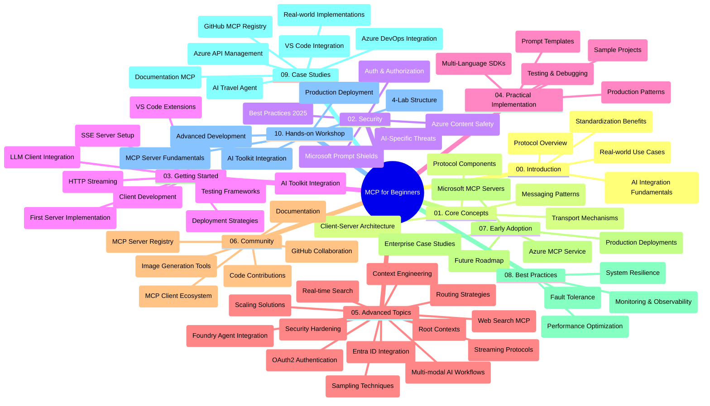

<!--
CO_OP_TRANSLATOR_METADATA:
{
  "original_hash": "719117a0a5f34ade7b5dfb61ee06fb13",
  "translation_date": "2025-09-26T17:51:24+00:00",
  "source_file": "study_guide.md",
  "language_code": "hk"
}
-->
# 初學者的模型上下文協議 (MCP) - 學習指南

此學習指南概述了「模型上下文協議 (MCP) 初學者」課程的存儲庫結構和內容。使用此指南可高效瀏覽存儲庫並充分利用可用資源。

## 存儲庫概述

模型上下文協議 (MCP) 是一個標準化框架，用於 AI 模型與客戶端應用之間的交互。MCP 最初由 Anthropic 創建，現由更廣泛的 MCP 社群通過官方 GitHub 組織進行維護。此存儲庫提供了全面的課程，包括 C#、Java、JavaScript、Python 和 TypeScript 的實操代碼示例，專為 AI 開發者、系統架構師和軟件工程師設計。

## 視覺化課程地圖

## 存儲庫結構

存儲庫分為十個主要部分，每部分專注於 MCP 的不同方面：

1. **簡介 (00-Introduction/)**
   - 模型上下文協議概述
   - 標準化在 AI 管道中的重要性
   - 實際應用案例及其優勢

2. **核心概念 (01-CoreConcepts/)**
   - 客戶端-伺服器架構
   - 協議的關鍵組件
   - MCP 中的消息模式

3. **安全性 (02-Security/)**
   - MCP 系統中的安全威脅
   - 實施安全的最佳做法
   - 身份驗證和授權策略
   - **全面的安全文檔**：
     - MCP 安全最佳實踐 2025
     - Azure 內容安全實施指南
     - MCP 安全控制和技術
     - MCP 快速參考最佳實踐
   - **關鍵安全主題**：
     - 提示注入和工具中毒攻擊
     - 會話劫持和混淆代理問題
     - 令牌透傳漏洞
     - 過度授權和訪問控制
     - AI 組件的供應鏈安全
     - Microsoft Prompt Shields 集成

4. **入門指南 (03-GettingStarted/)**
   - 環境設置和配置
   - 創建基本的 MCP 伺服器和客戶端
   - 與現有應用集成
   - 包括以下部分：
     - 首次伺服器實現
     - 客戶端開發
     - LLM 客戶端集成
     - VS Code 集成
     - 伺服器推送事件 (SSE) 伺服器
     - HTTP 流式傳輸
     - AI 工具包集成
     - 測試策略
     - 部署指南

5. **實際應用 (04-PracticalImplementation/)**
   - 使用不同編程語言的 SDK
   - 調試、測試和驗證技術
   - 創建可重用的提示模板和工作流程
   - 帶有實現示例的樣本項目

6. **高級主題 (05-AdvancedTopics/)**
   - 上下文工程技術
   - Foundry 代理集成
   - 多模態 AI 工作流程
   - OAuth2 身份驗證演示
   - 實時搜索功能
   - 實時流式傳輸
   - 根上下文實現
   - 路由策略
   - 抽樣技術
   - 擴展方法
   - 安全考量
   - Entra ID 安全集成
   - 網絡搜索集成

7. **社群貢獻 (06-CommunityContributions/)**
   - 如何貢獻代碼和文檔
   - 通過 GitHub 協作
   - 社群驅動的增強和反饋
   - 使用各種 MCP 客戶端 (Claude Desktop、Cline、VSCode)
   - 使用流行的 MCP 伺服器，包括圖像生成

8. **早期採用的經驗教訓 (07-LessonsfromEarlyAdoption/)**
   - 實際應用和成功案例
   - 構建和部署基於 MCP 的解決方案
   - 趨勢和未來路線圖
   - **Microsoft MCP 伺服器指南**：10 個生產就緒的 Microsoft MCP 伺服器的全面指南，包括：
     - Microsoft Learn Docs MCP 伺服器
     - Azure MCP 伺服器 (15+ 專用連接器)
     - GitHub MCP 伺服器
     - Azure DevOps MCP 伺服器
     - MarkItDown MCP 伺服器
     - SQL Server MCP 伺服器
     - Playwright MCP 伺服器
     - Dev Box MCP 伺服器
     - Azure AI Foundry MCP 伺服器
     - Microsoft 365 Agents Toolkit MCP 伺服器

9. **最佳實踐 (08-BestPractices/)**
   - 性能調優和優化
   - 設計容錯 MCP 系統
   - 測試和韌性策略

10. **案例研究 (09-CaseStudy/)**
    - **七個全面的案例研究**展示 MCP 在不同場景中的多樣性：
    - **Azure AI 旅行代理**：使用 Azure OpenAI 和 AI 搜索進行多代理協作
    - **Azure DevOps 集成**：使用 YouTube 數據更新自動化工作流程
    - **實時文檔檢索**：Python 控制台客戶端與流式 HTTP
    - **互動學習計劃生成器**：使用 Chainlit 網頁應用進行對話式 AI
    - **編輯器內文檔**：VS Code 集成與 GitHub Copilot 工作流程
    - **Azure API 管理**：企業 API 集成與 MCP 伺服器創建
    - **GitHub MCP 註冊表**：生態系統開發和代理集成平台
    - 涵蓋企業集成、開發者生產力和生態系統開發的實現示例

11. **實操工作坊 (10-StreamliningAIWorkflowsBuildingAnMCPServerWithAIToolkit/)**
    - 結合 MCP 和 AI 工具包的全面實操工作坊
    - 構建將 AI 模型與現實工具相結合的智能應用
    - 涵蓋基礎、自定義伺服器開發和生產部署策略的實用模塊
    - **實驗室結構**：
      - 實驗室 1：MCP 伺服器基礎
      - 實驗室 2：高級 MCP 伺服器開發
      - 實驗室 3：AI 工具包集成
      - 實驗室 4：生產部署和擴展
    - 基於實驗室的學習方法，提供逐步指導

## 附加資源

存儲庫包含支持資源：

- **圖片文件夾**：包含課程中使用的圖表和插圖
- **翻譯**：多語言支持，提供文檔的自動翻譯
- **官方 MCP 資源**：
  - [MCP 文檔](https://modelcontextprotocol.io/)
  - [MCP 規範](https://spec.modelcontextprotocol.io/)
  - [MCP GitHub 存儲庫](https://github.com/modelcontextprotocol)

## 如何使用此存儲庫

1. **循序學習**：按順序學習章節 (00 至 10)，以獲得結構化的學習體驗。
2. **特定語言重點**：如果您對某種編程語言感興趣，可探索樣本目錄中該語言的實現。
3. **實際應用**：從「入門指南」部分開始，設置環境並創建您的第一個 MCP 伺服器和客戶端。
4. **高級探索**：熟悉基礎知識後，深入高級主題以擴展您的知識。
5. **社群參與**：通過 GitHub 討論和 Discord 頻道加入 MCP 社群，與專家和其他開發者交流。

## MCP 客戶端和工具

課程涵蓋各種 MCP 客戶端和工具：

1. **官方客戶端**：
   - Visual Studio Code 
   - MCP 在 Visual Studio Code 中
   - Claude Desktop
   - Claude 在 VSCode 中
   - Claude API

2. **社群客戶端**：
   - Cline (基於終端)
   - Cursor (代碼編輯器)
   - ChatMCP
   - Windsurf

3. **MCP 管理工具**：
   - MCP CLI
   - MCP Manager
   - MCP Linker
   - MCP Router

## 流行的 MCP 伺服器

存儲庫介紹了各種 MCP 伺服器，包括：

1. **官方 Microsoft MCP 伺服器**：
   - Microsoft Learn Docs MCP 伺服器
   - Azure MCP 伺服器 (15+ 專用連接器)
   - GitHub MCP 伺服器
   - Azure DevOps MCP 伺服器
   - MarkItDown MCP 伺服器
   - SQL Server MCP 伺服器
   - Playwright MCP 伺服器
   - Dev Box MCP 伺服器
   - Azure AI Foundry MCP 伺服器
   - Microsoft 365 Agents Toolkit MCP 伺服器

2. **官方參考伺服器**：
   - 文件系統
   - Fetch
   - 記憶體
   - 順序思考

3. **圖像生成**：
   - Azure OpenAI DALL-E 3
   - Stable Diffusion WebUI
   - Replicate

4. **開發工具**：
   - Git MCP
   - 終端控制
   - 代碼助手

5. **專用伺服器**：
   - Salesforce
   - Microsoft Teams
   - Jira & Confluence

## 貢獻

此存儲庫歡迎社群的貢獻。請參閱「社群貢獻」部分，了解如何有效地為 MCP 生態系統做出貢獻。

## 更新記錄

| 日期 | 更改 |
|------|---------|
| 2025 年 9 月 26 日 | - 在 09-CaseStudy 部分新增 GitHub MCP 註冊表案例研究 - 更新案例研究以反映七個全面的案例研究 - 增強案例研究描述，提供具體實現細節 - 更新視覺化課程地圖以包含 GitHub MCP 註冊表 - 修訂學習指南結構以反映生態系統開發重點 |
| 2025 年 7 月 18 日 | - 更新存儲庫結構以包含 Microsoft MCP 伺服器指南 - 新增 10 個生產就緒的 Microsoft MCP 伺服器的全面列表 - 增強流行 MCP 伺服器部分，加入官方 Microsoft MCP 伺服器 - 更新案例研究部分，提供實際文件示例 - 新增實操工作坊的實驗室結構細節 |
| 2025 年 7 月 16 日 | - 更新存儲庫結構以反映當前內容 - 新增 MCP 客戶端和工具部分 - 新增流行 MCP 伺服器部分 - 更新視覺化課程地圖，涵蓋所有當前主題 - 增強高級主題部分，涵蓋所有專業領域 - 更新案例研究以反映實際示例 - 明確 MCP 起源由 Anthropic 創建 |
| 2025 年 6 月 11 日 | - 初次創建學習指南 - 新增視覺化課程地圖 - 概述存儲庫結構 - 包括樣本項目和附加資源 |

---

*此學習指南於 2025 年 9 月 26 日更新，概述了截至該日期的存儲庫內容。存儲庫內容可能在此日期後更新。*

---

