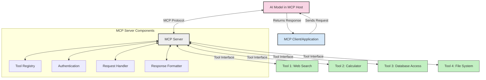
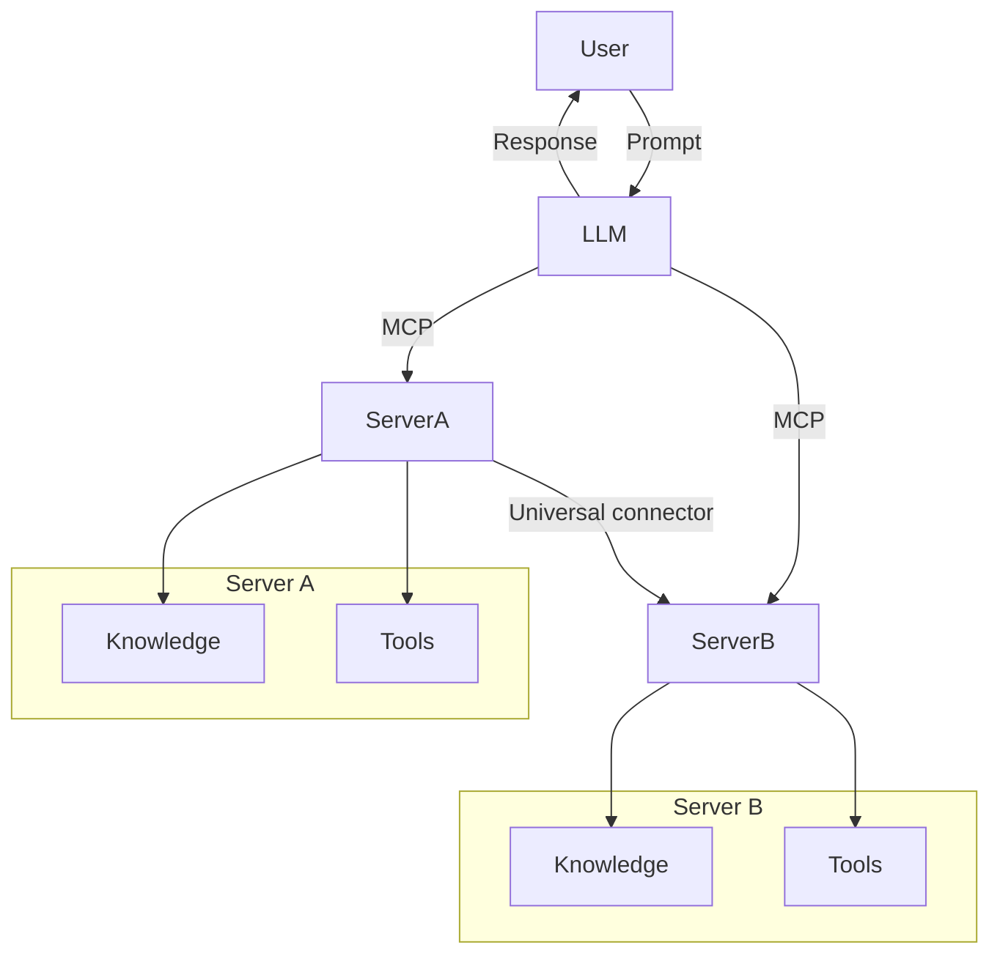

<!--
CO_OP_TRANSLATOR_METADATA:
{
  "original_hash": "1d88dee994dcbb3fa52c271d0c0817b5",
  "translation_date": "2025-05-20T22:40:34+00:00",
  "source_file": "00-Introduction/README.md",
  "language_code": "hr"
}
-->
# Uvod u Model Context Protocol (MCP): Zašto je važan za skalabilne AI aplikacije

Generativne AI aplikacije predstavljaju veliki korak naprijed jer često omogućuju korisnicima da komuniciraju s aplikacijom koristeći prirodni jezik. Međutim, kako se u takve aplikacije ulaže više vremena i resursa, važno je osigurati jednostavnu integraciju funkcionalnosti i resursa na način da se aplikacija lako može proširivati, da može podržavati više modela istovremeno i da može upravljati različitim složenostima modela. Ukratko, izrada Gen AI aplikacija je na početku jednostavna, ali kako aplikacije rastu i postaju složenije, potrebno je definirati arhitekturu i vjerojatno se osloniti na standard koji osigurava da su aplikacije konzistentno izgrađene. Upravo tu MCP dolazi kao rješenje za organizaciju i uspostavljanje standarda.

---

## **🔍 Što je Model Context Protocol (MCP)?**

**Model Context Protocol (MCP)** je **otvoreni, standardizirani sučelje** koje omogućuje velikim jezičnim modelima (LLM) da neprimjetno komuniciraju s vanjskim alatima, API-jima i izvorima podataka. Pruža dosljednu arhitekturu koja proširuje funkcionalnost AI modela izvan njihovih podataka za obuku, omogućujući pametnije, skalabilnije i responzivnije AI sustave.

---

## **🎯 Zašto je standardizacija u AI važna**

Kako generativne AI aplikacije postaju složenije, ključno je usvojiti standarde koji osiguravaju **skalabilnost, proširivost** i **održivost**. MCP zadovoljava ove potrebe kroz:

- Ujedinjenje integracija modela i alata
- Smanjenje krhkih, jednokratnih prilagođenih rješenja
- Omogućavanje suživota više modela unutar jednog ekosustava

---

## **📚 Ciljevi učenja**

Na kraju ovog članka moći ćete:

- Definirati **Model Context Protocol (MCP)** i njegove primjene
- Razumjeti kako MCP standardizira komunikaciju između modela i alata
- Prepoznati ključne komponente MCP arhitekture
- Istražiti stvarne primjere primjene MCP-a u poslovnom i razvojnom okruženju

---

## **💡 Zašto je Model Context Protocol (MCP) revolucionaran**

### **🔗 MCP rješava fragmentaciju u AI interakcijama**

Prije MCP-a, integracija modela s alatima zahtijevala je:

- Prilagođeni kod za svaki par alat-model
- Nestandardizirane API-je za svakog dobavljača
- Česte prekide zbog ažuriranja
- Lošu skalabilnost s rastom broja alata

### **✅ Prednosti MCP standardizacije**

| **Prednost**             | **Opis**                                                                        |
|--------------------------|---------------------------------------------------------------------------------|
| Interoperabilnost        | LLM modeli besprijekorno surađuju s alatima različitih dobavljača               |
| Konzistentnost           | Jednako ponašanje na svim platformama i alatima                                |
| Ponovna iskoristivost    | Alati izrađeni jednom mogu se koristiti u različitim projektima i sustavima     |
| Brži razvoj              | Skratite vrijeme razvoja koristeći standardizirana, plug-and-play sučelja       |

---

## **🧱 Pregled MCP arhitekture na visokoj razini**

MCP koristi **klijent-poslužitelj model**, gdje:

- **MCP Hostovi** pokreću AI modele
- **MCP Klijenti** iniciraju zahtjeve
- **MCP Poslužitelji** pružaju kontekst, alate i mogućnosti

### **Ključne komponente:**

- **Resursi** – Statički ili dinamički podaci za modele  
- **Prompts** – Preddefinirani tijekovi rada za vođenu generaciju  
- **Alati** – Izvršne funkcije poput pretraživanja, izračuna  
- **Sampling** – Agentno ponašanje kroz rekurzivne interakcije

---

## Kako MCP poslužitelji rade

MCP poslužitelji rade na sljedeći način:

- **Tijek zahtjeva**:  
    1. MCP Klijent šalje zahtjev AI modelu koji radi u MCP Hostu.  
    2. AI model prepoznaje kada mu trebaju vanjski alati ili podaci.  
    3. Model komunicira s MCP Poslužiteljem koristeći standardizirani protokol.

- **Funkcionalnosti MCP Poslužitelja**:  
    - Registar alata: održava katalog dostupnih alata i njihovih mogućnosti.  
    - Autentifikacija: provjerava dopuštenja za pristup alatima.  
    - Obrada zahtjeva: obrađuje dolazne zahtjeve za alate od modela.  
    - Formatiranje odgovora: strukturira izlaze alata u oblik koji model razumije.

- **Izvršenje alata**:  
    - Poslužitelj usmjerava zahtjeve odgovarajućim vanjskim alatima  
    - Alati izvršavaju svoje specijalizirane funkcije (pretraživanje, izračun, upiti u bazu podataka itd.)  
    - Rezultati se vraćaju modelu u dosljednom formatu.

- **Dovršetak odgovora**:  
    - AI model uključuje izlaze alata u svoj odgovor.  
    - Konačni odgovor se šalje nazad klijentskoj aplikaciji.

## 👨‍💻 Kako izgraditi MCP poslužitelj (s primjerima)

MCP poslužitelji omogućuju proširenje mogućnosti LLM-a pružajući podatke i funkcionalnosti.

Spremni za isprobavanje? Evo primjera kako napraviti jednostavan MCP poslužitelj u različitim programskim jezicima:

- **Python primjer**: https://github.com/modelcontextprotocol/python-sdk

- **TypeScript primjer**: https://github.com/modelcontextprotocol/typescript-sdk

- **Java primjer**: https://github.com/modelcontextprotocol/java-sdk

- **C#/.NET primjer**: https://github.com/modelcontextprotocol/csharp-sdk

## 🌍 Stvarni primjeri upotrebe MCP-a

MCP omogućuje širok spektar primjena proširujući AI mogućnosti:

| **Primjena**                | **Opis**                                                                      |
|----------------------------|-------------------------------------------------------------------------------|
| Integracija podataka u poduzeću | Povezivanje LLM-ova s bazama podataka, CRM sustavima ili internim alatima   |
| Agentni AI sustavi          | Omogućavanje autonomnih agenata s pristupom alatima i tijekovima donošenja odluka |
| Multimodalne aplikacije     | Kombiniranje tekstualnih, slikovnih i audio alata unutar jedne AI aplikacije  |
| Integracija podataka u stvarnom vremenu | Uvođenje živih podataka u AI interakcije za točnije i aktualne rezultate |

### 🧠 MCP = Univerzalni standard za AI interakcije

Model Context Protocol (MCP) djeluje kao univerzalni standard za AI interakcije, slično kao što je USB-C standardizirao fizičke veze za uređaje. U svijetu AI-a, MCP pruža dosljedno sučelje koje omogućuje modelima (klijentima) neprimjetnu integraciju s vanjskim alatima i pružateljima podataka (poslužiteljima). Time se eliminira potreba za različitim, prilagođenim protokolima za svaki API ili izvor podataka.

Prema MCP-u, alat kompatibilan s MCP-om (nazvan MCP poslužitelj) slijedi jedinstveni standard. Ti poslužitelji mogu navesti alate ili radnje koje nude i izvršavati ih kada ih AI agent zatraži. Platforme AI agenata koje podržavaju MCP mogu otkriti dostupne alate na poslužiteljima i pozivati ih putem ovog standardnog protokola.

### 💡 Omogućuje pristup znanju

Osim što nudi alate, MCP olakšava pristup znanju. Omogućuje aplikacijama da daju kontekst velikim jezičnim modelima (LLM) povezivanjem s različitim izvorima podataka. Na primjer, MCP poslužitelj može predstavljati repozitorij dokumenata tvrtke, omogućujući agentima da po potrebi dohvaćaju relevantne informacije. Drugi poslužitelj može upravljati specifičnim radnjama poput slanja e-mailova ili ažuriranja zapisa. Iz perspektive agenta, to su samo alati koje može koristiti — neki alati vraćaju podatke (kontekst znanja), dok drugi izvršavaju radnje. MCP učinkovito upravlja oboje.

Agent koji se povezuje s MCP poslužiteljem automatski uči o dostupnim mogućnostima i pristupačnim podacima poslužitelja putem standardiziranog formata. Ova standardizacija omogućuje dinamičnu dostupnost alata. Na primjer, dodavanjem novog MCP poslužitelja u sustav agenta njegove funkcije postaju odmah dostupne bez dodatnih prilagodbi u uputama za agenta.

Ova pojednostavljena integracija usklađena je s tijekom prikazanim na mermaid dijagramu, gdje poslužitelji pružaju i alate i znanje, osiguravajući besprijekornu suradnju među sustavima.

### 👉 Primjer: Skalabilno agentno rješenje

## 🔐 Praktične prednosti MCP-a

Evo praktičnih prednosti korištenja MCP-a:

- **Svježina**: modeli mogu pristupati ažuriranim informacijama izvan svojih podataka za obuku  
- **Proširenje mogućnosti**: modeli mogu koristiti specijalizirane alate za zadatke za koje nisu trenirani  
- **Smanjenje halucinacija**: vanjski izvori podataka pružaju činjeničnu osnovu  
- **Privatnost**: osjetljivi podaci mogu ostati u sigurnim okruženjima umjesto da budu ugrađeni u upite

## 📌 Ključni zaključci

Evo glavnih zaključaka za korištenje MCP-a:

- **MCP** standardizira način na koji AI modeli komuniciraju s alatima i podacima  
- Promiče **proširivost, konzistentnost i interoperabilnost**  
- MCP pomaže **skratiti vrijeme razvoja, povećati pouzdanost i proširiti mogućnosti modela**  
- Klijent-poslužitelj arhitektura **omogućuje fleksibilne i proširive AI aplikacije**

## 🧠 Vježba

Razmislite o AI aplikaciji koju želite razviti.

- Koji bi **vanjski alati ili podaci** mogli poboljšati njezine mogućnosti?  
- Kako bi MCP mogao učiniti integraciju **jednostavnijom i pouzdanijom**?

## Dodatni resursi

- [MCP GitHub spremište](https://github.com/modelcontextprotocol)

## Što slijedi

Sljedeće: [Poglavlje 1: Osnovni koncepti](/01-CoreConcepts/README.md)

**Odricanje od odgovornosti**:  
Ovaj dokument je preveden pomoću AI usluge za prevođenje [Co-op Translator](https://github.com/Azure/co-op-translator). Iako nastojimo postići točnost, imajte na umu da automatski prijevodi mogu sadržavati pogreške ili netočnosti. Izvorni dokument na izvornom jeziku treba smatrati autoritativnim izvorom. Za važne informacije preporučuje se profesionalni ljudski prijevod. Ne snosimo odgovornost za bilo kakve nesporazume ili pogrešne interpretacije koje proizlaze iz korištenja ovog prijevoda.