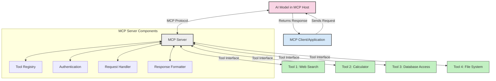
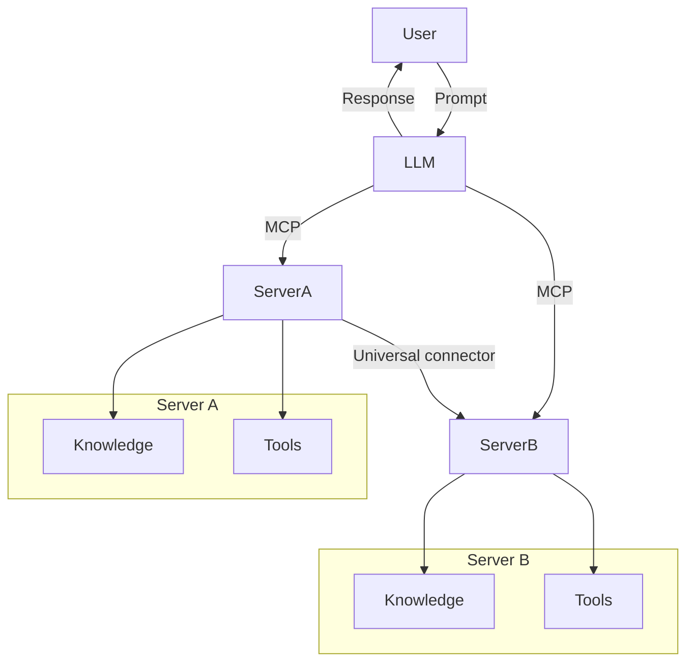

<!--
CO_OP_TRANSLATOR_METADATA:
{
  "original_hash": "02301140adbd807ecf0f17720fa307bc",
  "translation_date": "2025-05-17T06:10:56+00:00",
  "source_file": "00-Introduction/README.md",
  "language_code": "hr"
}
-->
# Uvod u Model Context Protocol (MCP): Zašto je važan za skalabilne AI aplikacije

Generativne AI aplikacije predstavljaju velik korak naprijed jer često omogućuju korisniku interakciju s aplikacijom pomoću prirodnog jezika. Međutim, kako se sve više vremena i resursa ulaže u takve aplikacije, želite osigurati da možete lako integrirati funkcionalnosti i resurse na način koji omogućuje lako proširenje, da vaša aplikacija može podržavati više od jednog modela koji se koristi, i njegove složenosti. Ukratko, izgradnja Gen AI aplikacija je lako započeti, ali kako raste i postaje složenija, trebate početi definirati arhitekturu i najvjerojatnije će vam trebati oslonac na standard kako biste osigurali da su vaše aplikacije izgrađene na dosljedan način. Tu dolazi MCP kako bi organizirao stvari i pružio standard.

---

## **🔍 Što je Model Context Protocol (MCP)?**

**Model Context Protocol (MCP)** je **otvoreno, standardizirano sučelje** koje omogućuje velikim jezičnim modelima (LLM) da bez problema komuniciraju s vanjskim alatima, API-jima i izvorima podataka. Pruža dosljednu arhitekturu za poboljšanje funkcionalnosti AI modela izvan njihovih podataka o obuci, omogućujući pametnije, skalabilnije i responzivnije AI sustave.

---

## **🎯 Zašto je standardizacija u AI-u važna**

Kako generativne AI aplikacije postaju složenije, ključno je usvojiti standarde koji osiguravaju **skalabilnost, proširivost** i **održivost**. MCP zadovoljava ove potrebe:

- Ujedinjuje integracije modela i alata
- Smanjuje krhka, jednokratna prilagođena rješenja
- Omogućuje koegzistenciju više modela unutar jednog ekosustava

---

## **📚 Ciljevi učenja**

Do kraja ovog članka moći ćete:

- Definirati **Model Context Protocol (MCP)** i njegove primjene
- Razumjeti kako MCP standardizira komunikaciju modela s alatima
- Identificirati ključne komponente MCP arhitekture
- Istražiti stvarne primjene MCP-a u poslovnim i razvojnim kontekstima

---

## **💡 Zašto je Model Context Protocol (MCP) revolucionaran**

### **🔗 MCP rješava fragmentaciju u AI interakcijama**

Prije MCP-a, integracija modela s alatima zahtijevala je:

- Prilagođeni kod za svaki par alat-model
- Nestandardizirani API-ji za svakog dobavljača
- Česte prekide zbog ažuriranja
- Lošu skalabilnost s više alata

### **✅ Prednosti standardizacije MCP-a**

| **Prednost**              | **Opis**                                                                |
|--------------------------|-------------------------------------------------------------------------|
| Interoperabilnost         | LLM-ovi rade bez problema s alatima različitih dobavljača               |
| Dosljednost               | Jednoliko ponašanje na platformama i alatima                            |
| Ponovna upotrebljivost    | Alati izrađeni jednom mogu se koristiti u različitim projektima i sustavima |
| Ubrzani razvoj            | Smanjenje vremena razvoja korištenjem standardiziranih, plug-and-play sučelja |

---

## **🧱 Pregled visoke razine MCP arhitekture**

MCP slijedi **model klijent-server**, gdje:

- **MCP domaćini** pokreću AI modele
- **MCP klijenti** iniciraju zahtjeve
- **MCP serveri** pružaju kontekst, alate i mogućnosti

### **Ključne komponente:**

- **Resursi** – Statički ili dinamički podaci za modele  
- **Prompti** – Preddefinirani tijekovi rada za vođenu generaciju  
- **Alati** – Izvršne funkcije poput pretraživanja, izračuna  
- **Sampling** – Agentičko ponašanje putem rekurzivnih interakcija

---

## Kako MCP serveri rade

MCP serveri rade na sljedeći način:

- **Tijek zahtjeva**: 
    1. MCP klijent šalje zahtjev AI modelu koji se pokreće u MCP domaćinu.
    2. AI model identificira kada mu trebaju vanjski alati ili podaci.
    3. Model komunicira s MCP serverom koristeći standardizirani protokol.

- **Funkcionalnost MCP servera**:
    - Registar alata: Održava katalog dostupnih alata i njihovih mogućnosti.
    - Autentifikacija: Provjerava dozvole za pristup alatima.
    - Obrada zahtjeva: Procesira dolazne zahtjeve alata od modela.
    - Formatiranje odgovora: Struktuira izlaze alata u formatu koji model može razumjeti.

- **Izvršavanje alata**: 
    - Server usmjerava zahtjeve odgovarajućim vanjskim alatima
    - Alati izvršavaju svoje specijalizirane funkcije (pretraživanje, izračun, upiti u bazu podataka itd.)
    - Rezultati se vraćaju modelu u dosljednom formatu.

- **Dovršavanje odgovora**: 
    - AI model uključuje izlaze alata u svoj odgovor.
    - Konačni odgovor se šalje natrag klijentskoj aplikaciji.

## 👨‍💻 Kako izgraditi MCP server (s primjerima)

MCP serveri omogućuju proširenje mogućnosti LLM-ova pružanjem podataka i funkcionalnosti. 

Spremni za isprobavanje? Evo primjera izrade jednostavnog MCP servera u različitim jezicima:

- **Primjer u Pythonu**: https://github.com/modelcontextprotocol/python-sdk

- **Primjer u TypeScriptu**: https://github.com/modelcontextprotocol/typescript-sdk

- **Primjer u Javi**: https://github.com/modelcontextprotocol/java-sdk

- **Primjer u C#/.NET-u**: https://github.com/modelcontextprotocol/csharp-sdk

## 🌍 Stvarni primjeri upotrebe MCP-a

MCP omogućuje širok raspon aplikacija proširujući AI mogućnosti:

| **Aplikacija**              | **Opis**                                                                |
|------------------------------|-------------------------------------------------------------------------|
| Integracija poslovnih podataka  | Povezivanje LLM-ova s bazama podataka, CRM-ovima ili internim alatima |
| Agentički AI sustavi           | Omogućavanje autonomnih agenata s pristupom alatima i tijekovima odlučivanja |
| Multimodalne aplikacije     | Kombiniranje tekstualnih, slikovnih i audio alata unutar jedne ujedinjene AI aplikacije |
| Integracija podataka u stvarnom vremenu   | Uvođenje živih podataka u AI interakcije za točnije, aktualne izlaze |

### 🧠 MCP = Univerzalni standard za AI interakcije

Model Context Protocol (MCP) djeluje kao univerzalni standard za AI interakcije, slično kao što je USB-C standardizirao fizičke veze za uređaje. U svijetu AI-a, MCP pruža dosljedno sučelje, omogućujući modelima (klijentima) da se bez problema integriraju s vanjskim alatima i pružateljima podataka (serverima). Ovo eliminira potrebu za raznovrsnim, prilagođenim protokolima za svaki API ili izvor podataka.

Pod MCP-om, alat kompatibilan s MCP-om (nazvan MCP server) slijedi jedinstveni standard. Ovi serveri mogu navesti alate ili radnje koje nude i izvršiti te radnje kada ih AI agent zatraži. Platforme AI agenata koje podržavaju MCP sposobne su otkriti dostupne alate s servera i pozvati ih putem ovog standardnog protokola.

### 💡 Omogućuje pristup znanju

Osim što nudi alate, MCP također olakšava pristup znanju. Omogućuje aplikacijama da pruže kontekst velikim jezičnim modelima (LLM-ovima) povezujući ih s različitim izvorima podataka. Na primjer, MCP server može predstavljati repozitorij dokumenata tvrtke, omogućujući agentima da po potrebi dohvaćaju relevantne informacije. Drugi server može rukovati specifičnim radnjama poput slanja e-pošte ili ažuriranja zapisa. Iz perspektive agenta, ovo su jednostavno alati koje može koristiti—neki alati vraćaju podatke (kontekst znanja), dok drugi izvode radnje. MCP učinkovito upravlja oboje.

Agent koji se povezuje s MCP serverom automatski uči dostupne mogućnosti servera i dostupne podatke putem standardnog formata. Ova standardizacija omogućuje dinamičnu dostupnost alata. Na primjer, dodavanje novog MCP servera u sustav agenta čini njegove funkcije odmah upotrebljivima bez potrebe za daljnjim prilagođavanjem uputa agenta.

Ova pojednostavljena integracija usklađena je s tokom prikazanim u dijagramu mermaid, gdje serveri pružaju i alate i znanje, osiguravajući besprijekornu suradnju između sustava. 

### 👉 Primjer: Skalabilno rješenje za agenta

## 🔐 Praktične prednosti MCP-a

Evo nekoliko praktičnih prednosti korištenja MCP-a:

- **Svježina**: Modeli mogu pristupiti ažuriranim informacijama izvan svojih podataka o obuci
- **Proširenje sposobnosti**: Modeli mogu koristiti specijalizirane alate za zadatke za koje nisu obučeni
- **Smanjene halucinacije**: Vanjski izvori podataka pružaju činjenično utemeljenje
- **Privatnost**: Osjetljivi podaci mogu ostati unutar sigurnih okruženja umjesto da budu ugrađeni u promptove

## 📌 Ključne točke

Sljedeće su ključne točke za korištenje MCP-a:

- **MCP** standardizira kako AI modeli interagiraju s alatima i podacima
- Promovira **proširivost, dosljednost i interoperabilnost**
- MCP pomaže **smanjiti vrijeme razvoja, poboljšati pouzdanost i proširiti mogućnosti modela**
- Arhitektura klijent-server omogućuje **fleksibilne, proširive AI aplikacije**

## 🧠 Vježba

Razmislite o AI aplikaciji koju želite izgraditi.

- Koji **vanjski alati ili podaci** bi mogli poboljšati njezine mogućnosti?
- Kako bi MCP mogao učiniti integraciju **jednostavnijom i pouzdanijom?**

## Dodatni resursi

- [MCP GitHub repozitorij](https://github.com/modelcontextprotocol)

## Što slijedi

Sljedeće: [Poglavlje 1: Osnovni pojmovi](/01-CoreConcepts/README.md)

**Odricanje odgovornosti**:  
Ovaj dokument je preveden korištenjem AI usluge prevođenja [Co-op Translator](https://github.com/Azure/co-op-translator). Iako težimo točnosti, imajte na umu da automatizirani prijevodi mogu sadržavati pogreške ili netočnosti. Izvorni dokument na izvornom jeziku treba smatrati mjerodavnim izvorom. Za ključne informacije preporučuje se profesionalni ljudski prijevod. Ne odgovaramo za bilo kakve nesporazume ili pogrešna tumačenja proizašla iz korištenja ovog prijevoda.