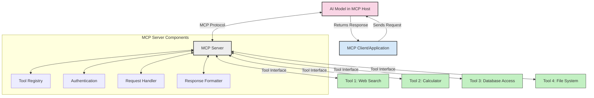
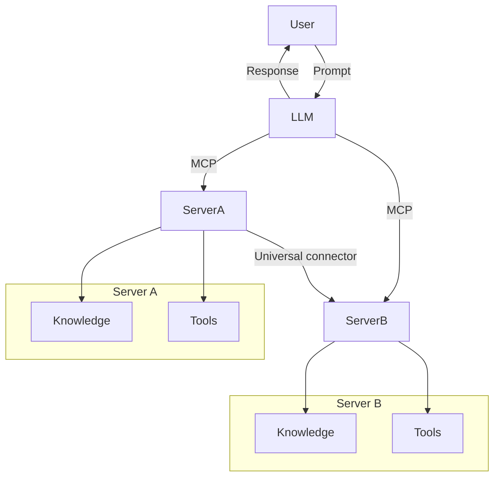

<!--
CO_OP_TRANSLATOR_METADATA:
{
  "original_hash": "cf84f987e1b771d2201408e110dfd2db",
  "translation_date": "2025-05-20T18:20:35+00:00",
  "source_file": "00-Introduction/README.md",
  "language_code": "hr"
}
-->
# Uvod u Model Context Protocol (MCP): Zašto je važan za skalabilne AI aplikacije

Generativne AI aplikacije predstavljaju veliki korak naprijed jer često omogućuju korisnicima interakciju s aplikacijom putem prirodnog jezika. Međutim, kako se ulaže više vremena i resursa u takve aplikacije, važno je osigurati jednostavnu integraciju funkcionalnosti i resursa na način koji je lako proširiv, da aplikacija može podržavati više modela i njihove složenosti. Ukratko, izrada Gen AI aplikacija je jednostavna na početku, ali kako rastu i postaju složenije, potrebno je definirati arhitekturu i najvjerojatnije se osloniti na standard koji će osigurati dosljednu izgradnju aplikacija. Tu na scenu stupa MCP kako bi organizirao stvari i pružio standard.

---

## **🔍 Što je Model Context Protocol (MCP)?**

**Model Context Protocol (MCP)** je **otvoreni, standardizirani sučelje** koje omogućuje velikim jezičnim modelima (LLM-ovima) da se besprijekorno povežu s vanjskim alatima, API-jima i izvorima podataka. Pruža dosljednu arhitekturu za proširenje funkcionalnosti AI modela izvan njihovih podataka za treniranje, omogućujući pametnije, skalabilnije i responzivnije AI sustave.

---

## **🎯 Zašto je standardizacija u AI važna**

Kako generativne AI aplikacije postaju složenije, ključno je usvojiti standarde koji osiguravaju **skalabilnost, proširivost** i **održivost**. MCP zadovoljava ove potrebe kroz:

- Ujednačavanje integracija modela i alata
- Smanjenje krhkih, jedinstvenih prilagođenih rješenja
- Omogućavanje istovremenog korištenja više modela unutar jednog ekosustava

---

## **📚 Ciljevi učenja**

Na kraju ovog članka moći ćete:

- Definirati **Model Context Protocol (MCP)** i njegove primjene
- Razumjeti kako MCP standardizira komunikaciju između modela i alata
- Prepoznati ključne komponente MCP arhitekture
- Istražiti primjere stvarnih primjena MCP-a u poduzećima i razvoju

---

## **💡 Zašto je Model Context Protocol (MCP) revolucionaran**

### **🔗 MCP rješava fragmentaciju u AI interakcijama**

Prije MCP-a, integracija modela s alatima zahtijevala je:

- Prilagođeni kod za svaki par alat-model
- Nestandardne API-je za svakog dobavljača
- Česte prekide zbog ažuriranja
- Lošu skalabilnost s povećanjem broja alata

### **✅ Prednosti standardizacije MCP-a**

| **Prednost**             | **Opis**                                                                     |
|--------------------------|------------------------------------------------------------------------------|
| Interoperabilnost        | LLM-ovi besprijekorno rade s alatima različitih dobavljača                  |
| Dosljednost              | Jednako ponašanje na različitim platformama i alatima                        |
| Ponovna upotrebljivost   | Alati napravljeni jednom mogu se koristiti u različitim projektima i sustavima |
| Brži razvoj              | Smanjuje vrijeme razvoja korištenjem standardiziranih, plug-and-play sučelja |

---

## **🧱 Pregled MCP arhitekture na visokoj razini**

MCP slijedi **model klijent-poslužitelj**, gdje:

- **MCP Hosts** pokreću AI modele
- **MCP Clients** iniciraju zahtjeve
- **MCP Servers** pružaju kontekst, alate i mogućnosti

### **Ključne komponente:**

- **Resursi** – Statički ili dinamički podaci za modele  
- **Prompts** – Definirani tijekovi rada za vođenu generaciju  
- **Alati** – Izvršne funkcije poput pretraživanja, izračuna  
- **Sampling** – Agentno ponašanje putem rekurzivnih interakcija

---

## Kako MCP serveri rade

MCP serveri funkcioniraju na sljedeći način:

- **Tijek zahtjeva**:  
    1. MCP Client šalje zahtjev AI modelu koji radi na MCP Hostu.  
    2. AI model prepoznaje kada su mu potrebni vanjski alati ili podaci.  
    3. Model komunicira s MCP Serverom koristeći standardizirani protokol.

- **Funkcionalnosti MCP Servera**:  
    - Registar alata: održava katalog dostupnih alata i njihovih mogućnosti.  
    - Autentikacija: provjerava dozvole za pristup alatima.  
    - Obrada zahtjeva: obrađuje dolazne zahtjeve za alate od modela.  
    - Formatiranje odgovora: strukturira izlaze alata u format koji model može razumjeti.

- **Izvršavanje alata**:  
    - Server usmjerava zahtjeve prema odgovarajućim vanjskim alatima  
    - Alati izvršavaju svoje specijalizirane funkcije (pretraživanje, izračun, upiti u bazu podataka itd.)  
    - Rezultati se vraćaju modelu u dosljednom formatu.

- **Završetak odgovora**:  
    - AI model uključuje izlaze alata u svoj odgovor.  
    - Završni odgovor se šalje natrag klijentskoj aplikaciji.

## 👨‍💻 Kako izgraditi MCP server (s primjerima)

MCP serveri omogućuju proširenje mogućnosti LLM-ova pružajući podatke i funkcionalnosti.

Spremni za isprobavanje? Evo primjera kako napraviti jednostavan MCP server u različitim jezicima:

- **Primjer u Pythonu**: https://github.com/modelcontextprotocol/python-sdk

- **Primjer u TypeScriptu**: https://github.com/modelcontextprotocol/typescript-sdk

- **Primjer u Javi**: https://github.com/modelcontextprotocol/java-sdk

- **Primjer u C#/.NET**: https://github.com/modelcontextprotocol/csharp-sdk

## 🌍 Stvarni primjeri korištenja MCP-a

MCP omogućuje širok spektar primjena proširujući AI mogućnosti:

| **Primjena**               | **Opis**                                                                       |
|----------------------------|--------------------------------------------------------------------------------|
| Integracija podataka u poduzećima | Povezuje LLM-ove s bazama podataka, CRM sustavima ili internim alatima        |
| Agentni AI sustavi         | Omogućuje autonomnim agentima pristup alatima i tijekovima donošenja odluka    |
| Multimodalne aplikacije    | Kombinira tekstualne, slikovne i audio alate unutar jedinstvene AI aplikacije  |
| Integracija podataka u stvarnom vremenu | Uvodi žive podatke u AI interakcije za točnije i aktualne rezultate          |

### 🧠 MCP = Univerzalni standard za AI interakcije

Model Context Protocol (MCP) djeluje kao univerzalni standard za AI interakcije, slično kao što je USB-C standardizirao fizičke veze za uređaje. U svijetu AI-a, MCP pruža dosljedno sučelje koje omogućuje modelima (klijentima) da se lako povežu s vanjskim alatima i pružateljima podataka (poslužiteljima). Time se eliminira potreba za raznolikim, prilagođenim protokolima za svaki API ili izvor podataka.

Prema MCP-u, MCP-kompatibilni alat (poznat kao MCP server) slijedi jedinstveni standard. Ti serveri mogu navesti alate ili radnje koje nude i izvršavati ih na zahtjev AI agenta. Platforme AI agenata koje podržavaju MCP mogu otkrivati dostupne alate na serverima i pozivati ih putem ovog standardiziranog protokola.

### 💡 Olakšava pristup znanju

Osim pružanja alata, MCP olakšava i pristup znanju. Omogućuje aplikacijama da pruže kontekst velikim jezičnim modelima (LLM-ovima) povezujući ih s različitim izvorima podataka. Na primjer, MCP server može predstavljati spremište dokumenata tvrtke, omogućujući agentima da po potrebi dohvaćaju relevantne informacije. Drugi server može upravljati specifičnim radnjama poput slanja e-mailova ili ažuriranja zapisa. Iz perspektive agenta, to su jednostavno alati koje može koristiti — neki alati vraćaju podatke (kontekst znanja), dok drugi izvršavaju radnje. MCP učinkovito upravlja oboje.

Agent koji se povezuje na MCP server automatski uči o dostupnim mogućnostima i pristupačnim podacima kroz standardizirani format. Ta standardizacija omogućuje dinamičku dostupnost alata. Na primjer, dodavanjem novog MCP servera u sustav agenta njegove funkcije odmah postaju dostupne bez potrebe za dodatnim prilagođavanjem uputa agenta.

Ova pojednostavljena integracija odgovara tijeku prikazanom na mermaid dijagramu, gdje serveri pružaju i alate i znanje, osiguravajući nesmetanu suradnju među sustavima.

### 👉 Primjer: Skalabilno agentno rješenje

## 🔐 Praktične prednosti MCP-a

Evo praktičnih prednosti korištenja MCP-a:

- **Aktualnost**: Modeli mogu pristupiti najnovijim informacijama izvan svojih podataka za treniranje  
- **Proširenje mogućnosti**: Modeli mogu koristiti specijalizirane alate za zadatke za koje nisu bili trenirani  
- **Smanjenje halucinacija**: Vanjski izvori podataka pružaju činjeničnu osnovu  
- **Privatnost**: Osjetljivi podaci mogu ostati u sigurnim okruženjima, a ne biti ugrađeni u upite

## 📌 Ključni zaključci

Evo glavnih zaključaka za korištenje MCP-a:

- **MCP** standardizira način na koji AI modeli komuniciraju s alatima i podacima  
- Promiče **proširivost, dosljednost i interoperabilnost**  
- MCP pomaže **smanjiti vrijeme razvoja, poboljšati pouzdanost i proširiti mogućnosti modela**  
- Klijent-poslužitelj arhitektura omogućuje **fleksibilne, proširive AI aplikacije**

## 🧠 Vježba

Razmislite o AI aplikaciji koju želite izgraditi.

- Koji **vanjski alati ili podaci** bi mogli poboljšati njene mogućnosti?  
- Kako bi MCP mogao učiniti integraciju **jednostavnijom i pouzdanijom**?

## Dodatni resursi

- [MCP GitHub Repository](https://github.com/modelcontextprotocol)

## Što slijedi

Sljedeće: [Poglavlje 1: Osnovni pojmovi](/01-CoreConcepts/README.md)

**Odricanje od odgovornosti**:  
Ovaj dokument je preveden korištenjem AI usluge prevođenja [Co-op Translator](https://github.com/Azure/co-op-translator). Iako težimo točnosti, imajte na umu da automatski prijevodi mogu sadržavati pogreške ili netočnosti. Izvorni dokument na izvornom jeziku treba smatrati službenim i autoritativnim izvorom. Za kritične informacije preporučuje se profesionalni ljudski prijevod. Ne snosimo odgovornost za bilo kakve nesporazume ili pogrešna tumačenja koja proizlaze iz korištenja ovog prijevoda.