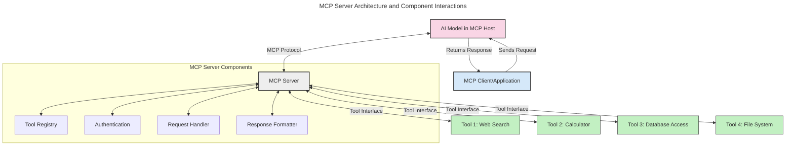
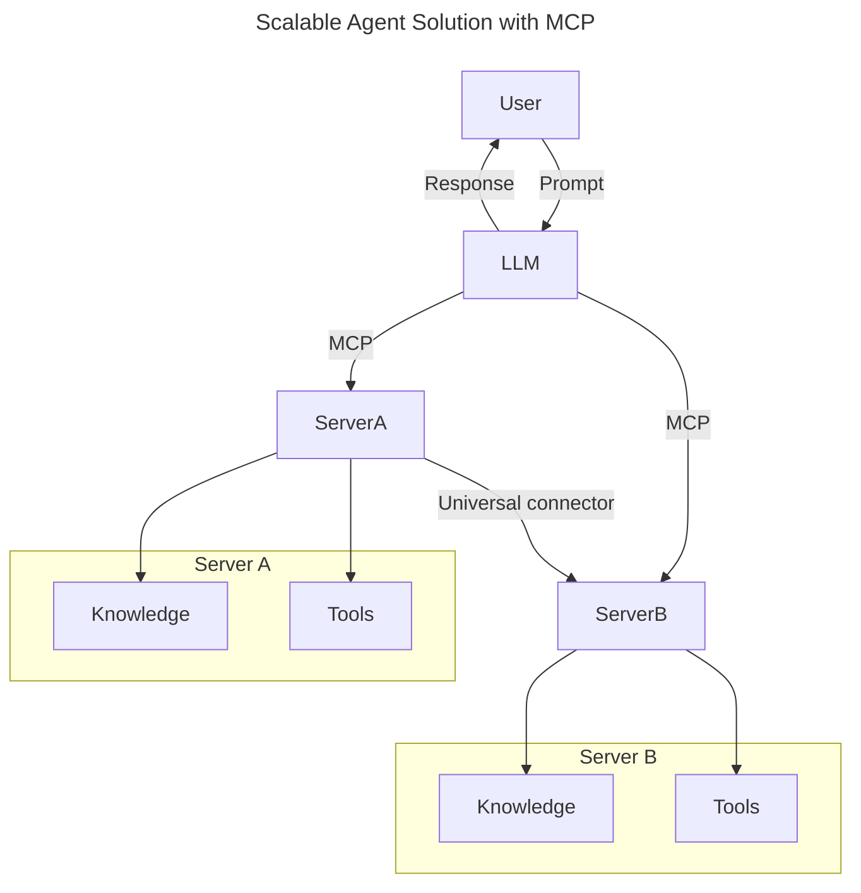
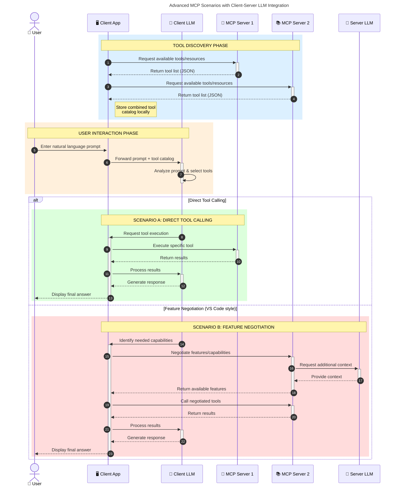

<!--
CO_OP_TRANSLATOR_METADATA:
{
  "original_hash": "105c2ddbb77bc38f7e9df009e1b06e45",
  "translation_date": "2025-07-04T19:05:44+00:00",
  "source_file": "00-Introduction/README.md",
  "language_code": "hr"
}
-->
# Uvod u Model Context Protocol (MCP): Zašto je važan za skalabilne AI aplikacije

Generativne AI aplikacije predstavljaju veliki iskorak jer često omogućuju korisnicima interakciju s aplikacijom putem prirodnog jezika. Međutim, kako se u takve aplikacije ulaže više vremena i resursa, važno je osigurati jednostavnu integraciju funkcionalnosti i resursa na način koji omogućuje lako proširenje, podržava korištenje više modela i upravlja različitim složenostima modela. Ukratko, izrada Gen AI aplikacija je jednostavna na početku, ali kako rastu i postaju složenije, potrebno je definirati arhitekturu i vjerojatno se osloniti na standard koji osigurava dosljednu izgradnju aplikacija. Tu na scenu stupa MCP koji organizira stvari i pruža standard.

---

## **🔍 Što je Model Context Protocol (MCP)?**

**Model Context Protocol (MCP)** je **otvoreni, standardizirani sučelje** koje omogućuje velikim jezičnim modelima (LLM-ovima) besprijekornu interakciju s vanjskim alatima, API-jima i izvorima podataka. Pruža dosljednu arhitekturu za proširenje funkcionalnosti AI modela izvan njihovih podataka za treniranje, omogućujući pametnije, skalabilnije i responzivnije AI sustave.

---

## **🎯 Zašto je standardizacija u AI važna**

Kako generativne AI aplikacije postaju složenije, ključno je usvojiti standarde koji osiguravaju **skalabilnost, proširivost** i **održivost**. MCP odgovara na ove potrebe tako da:

- Ujedinjuje integracije modela i alata
- Smanjuje krhka, jednokratna prilagođena rješenja
- Omogućuje suživot više modela unutar jednog ekosustava

---

## **📚 Ciljevi učenja**

Na kraju ovog članka moći ćete:

- Definirati **Model Context Protocol (MCP)** i njegove primjene
- Razumjeti kako MCP standardizira komunikaciju između modela i alata
- Prepoznati ključne komponente MCP arhitekture
- Istražiti stvarne primjene MCP-a u poslovnom i razvojnom okruženju

---

## **💡 Zašto je Model Context Protocol (MCP) revolucionaran**

### **🔗 MCP rješava fragmentaciju u AI interakcijama**

Prije MCP-a, integracija modela s alatima zahtijevala je:

- Prilagođeni kod za svaki par alat-model
- Nestandardizirane API-je za svakog dobavljača
- Česte prekide zbog ažuriranja
- Lošu skalabilnost s povećanjem broja alata

### **✅ Prednosti MCP standardizacije**

| **Prednost**             | **Opis**                                                                       |
|--------------------------|--------------------------------------------------------------------------------|
| Interoperabilnost        | LLM-ovi besprijekorno rade s alatima različitih dobavljača                    |
| Dosljednost              | Jednako ponašanje na različitim platformama i alatima                         |
| Ponovna upotrebljivost   | Alati izgrađeni jednom mogu se koristiti u različitim projektima i sustavima  |
| Ubrzani razvoj           | Smanjuje vrijeme razvoja korištenjem standardiziranih, plug-and-play sučelja  |

---

## **🧱 Pregled MCP arhitekture na visokoj razini**

MCP slijedi **klijent-poslužitelj model**, gdje:

- **MCP Hostovi** pokreću AI modele
- **MCP Klijenti** iniciraju zahtjeve
- **MCP Poslužitelji** pružaju kontekst, alate i mogućnosti

### **Ključne komponente:**

- **Resursi** – Statički ili dinamički podaci za modele  
- **Promptovi** – Preddefinirani tijekovi rada za vođenu generaciju  
- **Alati** – Izvršne funkcije poput pretraživanja, izračuna  
- **Uzorkovanje** – Agentno ponašanje putem rekurzivnih interakcija

---

## Kako MCP poslužitelji rade

MCP poslužitelji funkcioniraju na sljedeći način:

- **Tijek zahtjeva**:  
    1. MCP Klijent šalje zahtjev AI modelu koji radi u MCP Hostu.  
    2. AI model prepoznaje kada mu trebaju vanjski alati ili podaci.  
    3. Model komunicira s MCP poslužiteljem koristeći standardizirani protokol.

- **Funkcionalnosti MCP poslužitelja**:  
    - Registar alata: Održava katalog dostupnih alata i njihovih mogućnosti.  
    - Autentikacija: Provjerava dozvole za pristup alatima.  
    - Obrada zahtjeva: Procesira dolazne zahtjeve za alate od modela.  
    - Formatiranje odgovora: Strukturira izlaze alata u format koji model može razumjeti.

- **Izvršenje alata**:  
    - Poslužitelj usmjerava zahtjeve prema odgovarajućim vanjskim alatima  
    - Alati izvršavaju svoje specijalizirane funkcije (pretraživanje, izračun, upiti u bazu podataka itd.)  
    - Rezultati se vraćaju modelu u dosljednom formatu.

- **Završetak odgovora**:  
    - AI model uključi izlaze alata u svoj odgovor.  
    - Konačni odgovor se šalje natrag klijentskoj aplikaciji.

## 👨‍💻 Kako izgraditi MCP poslužitelj (s primjerima)

MCP poslužitelji omogućuju proširenje mogućnosti LLM-ova pružajući podatke i funkcionalnosti.

Spremni za isprobavanje? Evo primjera kako napraviti jednostavan MCP poslužitelj u različitim jezicima:

- **Python primjer**: https://github.com/modelcontextprotocol/python-sdk

- **TypeScript primjer**: https://github.com/modelcontextprotocol/typescript-sdk

- **Java primjer**: https://github.com/modelcontextprotocol/java-sdk

- **C#/.NET primjer**: https://github.com/modelcontextprotocol/csharp-sdk

## 🌍 Stvarni primjeri primjene MCP-a

MCP omogućuje širok spektar primjena proširujući AI mogućnosti:

| **Primjena**               | **Opis**                                                                       |
|---------------------------|--------------------------------------------------------------------------------|
| Integracija podataka u poduzeću | Povezivanje LLM-ova s bazama podataka, CRM-ovima ili internim alatima       |
| Agentni AI sustavi         | Omogućavanje autonomnih agenata s pristupom alatima i tijekovima donošenja odluka |
| Multimodalne aplikacije    | Kombinacija tekstualnih, slikovnih i audio alata unutar jedne AI aplikacije    |
| Integracija podataka u stvarnom vremenu | Uvođenje živih podataka u AI interakcije za točnije i aktualnije rezultate |

### 🧠 MCP = univerzalni standard za AI interakcije

Model Context Protocol (MCP) djeluje kao univerzalni standard za AI interakcije, slično kao što je USB-C standardizirao fizičke veze za uređaje. U svijetu AI-a, MCP pruža dosljedno sučelje koje omogućuje modelima (klijentima) besprijekornu integraciju s vanjskim alatima i pružateljima podataka (poslužiteljima). Time se uklanja potreba za različitim, prilagođenim protokolima za svaki API ili izvor podataka.

Prema MCP-u, alat kompatibilan s MCP-om (nazvan MCP poslužitelj) slijedi jedinstveni standard. Ti poslužitelji mogu navesti alate ili radnje koje nude i izvršavati ih na zahtjev AI agenta. Platforme AI agenata koje podržavaju MCP mogu otkrivati dostupne alate s poslužitelja i pozivati ih putem ovog standardnog protokola.

### 💡 Omogućuje pristup znanju

Osim što nudi alate, MCP također olakšava pristup znanju. Omogućuje aplikacijama da pruže kontekst velikim jezičnim modelima (LLM-ovima) povezivanjem s različitim izvorima podataka. Na primjer, MCP poslužitelj može predstavljati repozitorij dokumenata tvrtke, omogućujući agentima dohvat relevantnih informacija na zahtjev. Drugi poslužitelj može upravljati specifičnim radnjama poput slanja e-pošte ili ažuriranja zapisa. Iz perspektive agenta, to su jednostavno alati koje može koristiti — neki alati vraćaju podatke (kontekst znanja), dok drugi izvršavaju radnje. MCP učinkovito upravlja oboje.

Agent koji se povezuje na MCP poslužitelj automatski uči o dostupnim mogućnostima i pristupačnim podacima poslužitelja kroz standardizirani format. Ova standardizacija omogućuje dinamičnu dostupnost alata. Na primjer, dodavanjem novog MCP poslužitelja u sustav agenta njegove funkcije postaju odmah dostupne bez potrebe za dodatnim prilagodbama u uputama agenta.

Ova pojednostavljena integracija usklađena je s tijekom prikazanim u mermaid dijagramu, gdje poslužitelji pružaju i alate i znanje, osiguravajući besprijekornu suradnju između sustava.

### 👉 Primjer: skalabilno rješenje za agente

### 🔄 Napredni MCP scenariji s integracijom LLM-a na strani klijenta

Osim osnovne MCP arhitekture, postoje napredni scenariji u kojima i klijent i poslužitelj sadrže LLM-ove, omogućujući sofisticiranije interakcije:

## 🔐 Praktične prednosti MCP-a

Evo praktičnih prednosti korištenja MCP-a:

- **Svježina**: modeli mogu pristupiti ažuriranim informacijama izvan svojih podataka za treniranje  
- **Proširenje mogućnosti**: modeli mogu koristiti specijalizirane alate za zadatke za koje nisu trenirani  
- **Smanjenje halucinacija**: vanjski izvori podataka pružaju čvrstu činjenicu  
- **Privatnost**: osjetljivi podaci mogu ostati u sigurnim okruženjima umjesto da budu ugrađeni u promptove

## 📌 Ključni zaključci

Evo ključnih zaključaka za korištenje MCP-a:

- **MCP** standardizira način na koji AI modeli komuniciraju s alatima i podacima  
- Promiče **proširivost, dosljednost i interoperabilnost**  
- MCP pomaže **skratiti vrijeme razvoja, poboljšati pouzdanost i proširiti mogućnosti modela**  
- Klijent-poslužitelj arhitektura **omogućuje fleksibilne, proširive AI aplikacije**

## 🧠 Vježba

Razmislite o AI aplikaciji koju želite izgraditi.

- Koji bi **vanjski alati ili podaci** mogli poboljšati njezine mogućnosti?  
- Kako bi MCP mogao učiniti integraciju **jednostavnijom i pouzdanijom**?

## Dodatni resursi

- [MCP GitHub repozitorij](https://github.com/modelcontextprotocol)

## Što slijedi

Sljedeće: [Poglavlje 1: Osnovni pojmovi](../01-CoreConcepts/README.md)

**Odricanje od odgovornosti**:  
Ovaj dokument je preveden korištenjem AI usluge za prevođenje [Co-op Translator](https://github.com/Azure/co-op-translator). Iako težimo točnosti, imajte na umu da automatski prijevodi mogu sadržavati pogreške ili netočnosti. Izvorni dokument na izvornom jeziku treba smatrati službenim i autoritativnim izvorom. Za kritične informacije preporučuje se profesionalni ljudski prijevod. Ne snosimo odgovornost za bilo kakva nesporazuma ili pogrešna tumačenja koja proizlaze iz korištenja ovog prijevoda.