<!--
CO_OP_TRANSLATOR_METADATA:
{
  "original_hash": "25a94c681cf43612ff394d8cf78a74de",
  "translation_date": "2025-05-27T16:14:17+00:00",
  "source_file": "00-Introduction/README.md",
  "language_code": "hr"
}
-->
# Uvod u Model Context Protocol (MCP): Zašto je važan za skalabilne AI aplikacije

Generativne AI aplikacije predstavljaju veliki iskorak jer korisnicima često omogućuju interakciju s aplikacijom putem prirodnog jezika. Međutim, kako se ulaže sve više vremena i resursa u takve aplikacije, važno je osigurati jednostavnu integraciju funkcionalnosti i resursa na način koji je lako proširiv, koji može podržati korištenje više modela i upravljati različitim složenostima modela. Ukratko, izrada Gen AI aplikacija na početku je jednostavna, ali kako aplikacije rastu i postaju složenije, potrebno je definirati arhitekturu i vjerojatno se osloniti na standard koji će osigurati dosljednu izgradnju aplikacija. Tu MCP dolazi kao rješenje za organizaciju i uspostavljanje standarda.

---

## **🔍 Što je Model Context Protocol (MCP)?**

**Model Context Protocol (MCP)** je **otvoreni, standardizirani sučelje** koje omogućuje velikim jezičnim modelima (LLM) besprijekornu interakciju s vanjskim alatima, API-jima i izvorima podataka. Pruža dosljednu arhitekturu koja proširuje funkcionalnost AI modela izvan njihovih podataka za treniranje, omogućujući pametnije, skalabilnije i responzivnije AI sustave.

---

## **🎯 Zašto je standardizacija u AI važna**

Kako generativne AI aplikacije postaju složenije, ključno je usvojiti standarde koji osiguravaju **skalabilnost, proširivost** i **održivost**. MCP odgovara na ove potrebe:

- Ujedinjuje integracije modela i alata
- Smanjuje krhka, jednokratna prilagođena rješenja
- Omogućuje istovremeni rad više modela unutar jednog ekosustava

---

## **📚 Ciljevi učenja**

Na kraju ovog članka moći ćete:

- Definirati **Model Context Protocol (MCP)** i njegove primjene
- Razumjeti kako MCP standardizira komunikaciju između modela i alata
- Prepoznati ključne komponente MCP arhitekture
- Istražiti stvarne primjene MCP-a u poslovnom i razvojnom okruženju

---

## **💡 Zašto je Model Context Protocol (MCP) revolucionaran**

### **🔗 MCP rješava fragmentaciju u AI interakcijama**

Prije MCP-a, integracija modela s alatima zahtijevala je:

- Prilagođeni kod za svaki par alat-model
- Nestandardizirane API-je za svakog dobavljača
- Česte prekide zbog ažuriranja
- Lošu skalabilnost s povećanjem broja alata

### **✅ Prednosti standardizacije MCP-a**

| **Prednost**              | **Opis**                                                                        |
|--------------------------|---------------------------------------------------------------------------------|
| Interoperabilnost        | LLM modeli rade besprijekorno s alatima različitih dobavljača                  |
| Dosljednost              | Jednako ponašanje na različitim platformama i alatima                          |
| Ponovna upotrebljivost   | Alati izgrađeni jednom mogu se koristiti u različitim projektima i sustavima    |
| Ubrzani razvoj           | Smanjuje vrijeme razvoja korištenjem standardiziranih, plug-and-play sučelja   |

---

## **🧱 Pregled MCP arhitekture na visokoj razini**

MCP koristi **klijent-poslužitelj model**, gdje:

- **MCP Hosts** pokreću AI modele
- **MCP Clients** iniciraju zahtjeve
- **MCP Servers** pružaju kontekst, alate i mogućnosti

### **Ključne komponente:**

- **Resursi** – Statički ili dinamički podaci za modele  
- **Prompts** – Definirani tijekovi rada za vođenu generaciju  
- **Alati** – Izvršne funkcije poput pretraživanja, izračuna  
- **Sampling** – Agencijsko ponašanje kroz rekurzivne interakcije

---

## Kako MCP poslužitelji rade

MCP poslužitelji funkcioniraju na sljedeći način:

- **Tijek zahtjeva**: 
    1. MCP Klijent šalje zahtjev AI modelu koji radi u MCP Hostu.
    2. AI model prepoznaje kada su mu potrebni vanjski alati ili podaci.
    3. Model komunicira s MCP poslužiteljem koristeći standardizirani protokol.

- **Funkcionalnosti MCP poslužitelja**:
    - Registar alata: Održava katalog dostupnih alata i njihovih mogućnosti.
    - Autentikacija: Provjerava dozvole za pristup alatima.
    - Obrada zahtjeva: Procesira dolazne zahtjeve za alate od modela.
    - Formatiranje odgovora: Strukturira izlaz alata u oblik koji model razumije.

- **Izvršenje alata**: 
    - Poslužitelj usmjerava zahtjeve prema odgovarajućim vanjskim alatima
    - Alati izvršavaju svoje specijalizirane funkcije (pretraživanje, izračun, upiti u bazu podataka itd.)
    - Rezultati se vraćaju modelu u dosljednom formatu.

- **Završetak odgovora**: 
    - AI model uključuje izlaze alata u svoj odgovor.
    - Konačni odgovor se šalje natrag klijentskoj aplikaciji.

## 👨‍💻 Kako izgraditi MCP poslužitelj (s primjerima)

MCP poslužitelji omogućuju proširenje mogućnosti LLM-a pružanjem podataka i funkcionalnosti.

Spremni za isprobavanje? Evo primjera kako napraviti jednostavan MCP poslužitelj u različitim jezicima:

- **Python primjer**: https://github.com/modelcontextprotocol/python-sdk

- **TypeScript primjer**: https://github.com/modelcontextprotocol/typescript-sdk

- **Java primjer**: https://github.com/modelcontextprotocol/java-sdk

- **C#/.NET primjer**: https://github.com/modelcontextprotocol/csharp-sdk

## 🌍 Primjeri stvarne primjene MCP-a

MCP omogućuje širok spektar primjena proširujući AI mogućnosti:

| **Primjena**                 | **Opis**                                                                       |
|-----------------------------|--------------------------------------------------------------------------------|
| Integracija podataka u poduzeću | Povezivanje LLM-ova s bazama podataka, CRM sustavima ili internim alatima     |
| Agencijski AI sustavi        | Omogućavanje autonomnih agenata s pristupom alatima i radnim tokovima donošenja odluka |
| Multimodalne aplikacije      | Kombinacija tekstualnih, slikovnih i audio alata unutar jedne AI aplikacije    |
| Integracija podataka u stvarnom vremenu | Uvođenje aktualnih podataka u AI interakcije za preciznije i ažurnije rezultate |

### 🧠 MCP = univerzalni standard za AI interakcije

Model Context Protocol (MCP) djeluje kao univerzalni standard za AI interakcije, slično kao što je USB-C standardizirao fizičke veze uređaja. U svijetu AI-a, MCP pruža dosljedno sučelje koje omogućuje modelima (klijentima) besprijekornu integraciju s vanjskim alatima i pružateljima podataka (poslužiteljima). Time se uklanja potreba za različitim, prilagođenim protokolima za svaki API ili izvor podataka.

U MCP-u, alat kompatibilan s MCP-om (nazvan MCP poslužitelj) slijedi jedinstveni standard. Ti poslužitelji mogu navesti alate ili radnje koje nude i izvršavati ih kada ih AI agent zatraži. Platforme AI agenata koje podržavaju MCP mogu otkriti dostupne alate na poslužiteljima i pozivati ih putem ovog standardiziranog protokola.

### 💡 Olakšava pristup znanju

Osim što nudi alate, MCP također olakšava pristup znanju. Omogućuje aplikacijama da pruže kontekst velikim jezičnim modelima (LLM) povezivanjem s različitim izvorima podataka. Na primjer, MCP poslužitelj može predstavljati repozitorij dokumenata tvrtke, dopuštajući agentima da na zahtjev dobiju relevantne informacije. Drugi poslužitelj može upravljati specifičnim radnjama poput slanja e-mailova ili ažuriranja zapisa. Iz perspektive agenta, to su jednostavno alati koje može koristiti – neki alati vraćaju podatke (kontekst znanja), dok drugi izvršavaju radnje. MCP učinkovito upravlja oboje.

Agent koji se povezuje s MCP poslužiteljem automatski uči o dostupnim mogućnostima i pristupačnim podacima kroz standardizirani format. Ta standardizacija omogućuje dinamičnu dostupnost alata. Na primjer, dodavanje novog MCP poslužitelja u sustav agenta odmah čini njegove funkcije dostupnima bez potrebe za dodatnim prilagodbama u uputama za agenta.

Ova pojednostavljena integracija prati tijek prikazan na mermaid dijagramu, gdje poslužitelji pružaju i alate i znanje, osiguravajući besprijekornu suradnju između sustava.

### 👉 Primjer: skalabilno rješenje za agente

### 🔄 Napredni MCP scenariji s integracijom LLM-a na strani klijenta

Osim osnovne MCP arhitekture, postoje napredni scenariji u kojima i klijent i poslužitelj sadrže LLM-ove, omogućujući sofisticiranije interakcije:

```mermaid
sequenceDiagram
    autonumber
    actor User as 👤 User
    participant ClientApp as 🖥️ Client App
    participant ClientLLM as 🧠 Client LLM
    participant Server1 as 🔧 MCP Server 1
    participant Server2 as 📚 MCP Server 2
    participant ServerLLM as 🤖 Server LLM
    
    %% Discovery Phase
    rect rgb(220, 240, 255)
        Note over ClientApp, Server2: TOOL DISCOVERY PHASE
        ClientApp->>+Server1: Request available tools/resources
        Server1-->>-ClientApp: Return tool list (JSON)
        ClientApp->>+Server2: Request available tools/resources
        Server2-->>-ClientApp: Return tool list (JSON)
        Note right of ClientApp: Store combined tool<br/>catalog locally
    end
    
    %% User Interaction
    rect rgb(255, 240, 220)
        Note over User, ClientLLM: USER INTERACTION PHASE
        User->>+ClientApp: Enter natural language prompt
        ClientApp->>+ClientLLM: Forward prompt + tool catalog
        ClientLLM->>-ClientLLM: Analyze prompt & select tools
    end
    
    %% Scenario A: Direct Tool Calling
    alt Direct Tool Calling
        rect rgb(220, 255, 220)
            Note over ClientApp, Server1: SCENARIO A: DIRECT TOOL CALLING
            ClientLLM->>+ClientApp: Request tool execution
            ClientApp->>+Server1: Execute specific tool
            Server1-->>-ClientApp: Return results
            ClientApp->>+ClientLLM: Process results
            ClientLLM-->>-ClientApp: Generate response
            ClientApp-->>-User: Display final answer
        end
    
    %% Scenario B: Feature Negotiation (VS Code style)
    else Feature Negotiation (VS Code style)
        rect rgb(255, 220, 220)
            Note over ClientApp, ServerLLM: SCENARIO B: FEATURE NEGOTIATION
            ClientLLM->>+ClientApp: Identify needed capabilities
            ClientApp->>+Server2: Negotiate features/capabilities
            Server2->>+ServerLLM: Request additional context
            ServerLLM-->>-Server2: Provide context
            Server2-->>-ClientApp: Return available features
            ClientApp->>+Server2: Call negotiated tools
            Server2-->>-ClientApp: Return results
            ClientApp->>+ClientLLM: Process results
            ClientLLM-->>-ClientApp: Generate response
            ClientApp-->>-User: Display final answer
        end
    end
```

## 🔐 Praktične prednosti MCP-a

Evo praktičnih prednosti korištenja MCP-a:

- **Ažurnost**: modeli mogu pristupiti najnovijim informacijama izvan svojih podataka za treniranje
- **Proširenje mogućnosti**: modeli mogu koristiti specijalizirane alate za zadatke za koje nisu trenirani
- **Smanjenje halucinacija**: vanjski izvori podataka pružaju čvrstu činjenicu
- **Privatnost**: osjetljivi podaci mogu ostati u sigurnim okruženjima umjesto da se ugrađuju u upite

## 📌 Ključne poruke

Evo glavnih zaključaka o korištenju MCP-a:

- **MCP** standardizira način na koji AI modeli komuniciraju s alatima i podacima
- Promiče **proširivost, dosljednost i interoperabilnost**
- MCP pomaže **smanjiti vrijeme razvoja, povećati pouzdanost i proširiti mogućnosti modela**
- Klijent-poslužitelj arhitektura omogućuje **fleksibilne, proširive AI aplikacije**

## 🧠 Vježba

Razmislite o AI aplikaciji koju želite razviti.

- Koji bi **vanjski alati ili podaci** mogli poboljšati njene mogućnosti?
- Kako bi MCP mogao učiniti integraciju **jednostavnijom i pouzdanijom?**

## Dodatni resursi

- [MCP GitHub Repository](https://github.com/modelcontextprotocol)

## Što slijedi

Sljedeće: [Chapter 1: Core Concepts](/01-CoreConcepts/README.md)

**Odricanje od odgovornosti**:  
Ovaj je dokument preveden pomoću AI prevoditeljskog servisa [Co-op Translator](https://github.com/Azure/co-op-translator). Iako nastojimo postići točnost, imajte na umu da automatski prijevodi mogu sadržavati pogreške ili netočnosti. Izvorni dokument na izvornom jeziku treba smatrati službenim i autoritativnim izvorom. Za kritične informacije preporučuje se profesionalni ljudski prijevod. Ne snosimo odgovornost za bilo kakva nesporazume ili kriva tumačenja proizašla iz korištenja ovog prijevoda.