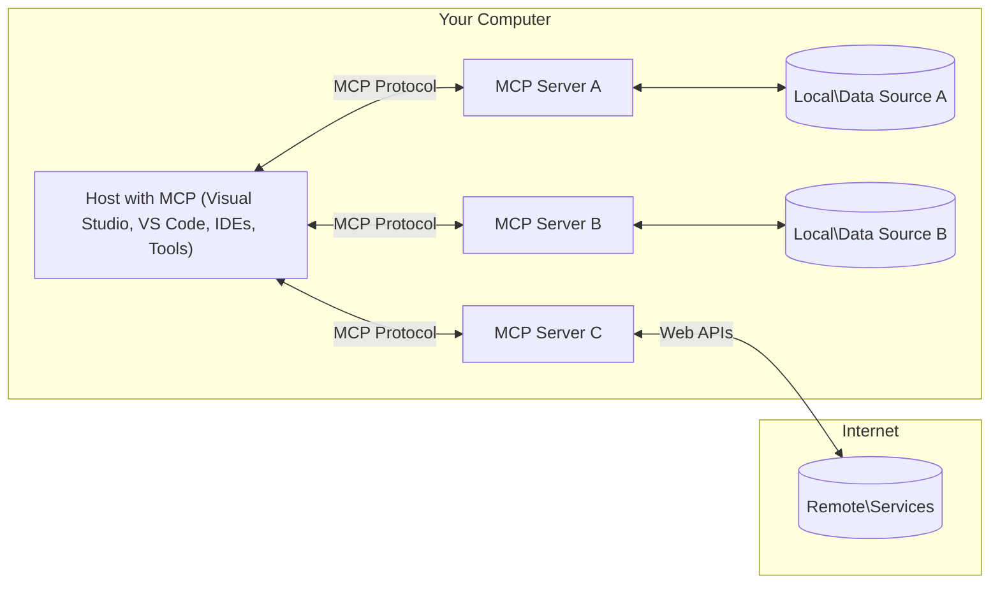

<!--
CO_OP_TRANSLATOR_METADATA:
{
  "original_hash": "0a6a7bcb289c024a91289e0444cb370b",
  "translation_date": "2025-08-18T17:16:37+00:00",
  "source_file": "01-CoreConcepts/README.md",
  "language_code": "hr"
}
-->
# MCP Osnovni Pojmovi: Ovladavanje Model Context Protocolom za AI Integraciju

[](https://youtu.be/earDzWGtE84)

_(Kliknite na sliku iznad za pregled videa ove lekcije)_

[Model Context Protocol (MCP)](https://gi- **Izričita korisnička suglasnost**: Svi pristupi podacima i operacije zahtijevaju izričitu korisničku suglasnost prije izvršenja. Korisnici moraju jasno razumjeti koji će podaci biti pristupljeni i koje će radnje biti izvedene, uz detaljnu kontrolu nad dozvolama i autorizacijama.

- **Zaštita privatnosti podataka**: Korisnički podaci izloženi su samo uz izričitu suglasnost i moraju biti zaštićeni snažnim kontrolama pristupa tijekom cijelog životnog ciklusa interakcije. Implementacije moraju spriječiti neovlašten prijenos podataka i održavati stroge granice privatnosti.

- **Sigurnost izvršavanja alata**: Svaka aktivacija alata zahtijeva izričitu korisničku suglasnost uz jasno razumijevanje funkcionalnosti alata, parametara i potencijalnog utjecaja. Snažne sigurnosne granice moraju spriječiti nenamjerno, nesigurno ili zlonamjerno izvršavanje alata.

- **Sigurnost transportnog sloja**: Svi komunikacijski kanali trebaju koristiti odgovarajuće mehanizme enkripcije i autentifikacije. Udaljene veze trebaju implementirati sigurne transportne protokole i pravilno upravljanje vjerodajnicama.

#### Smjernice za implementaciju:

- **Upravljanje dozvolama**: Implementirajte sustave dozvola s finom granularnošću koji omogućuju korisnicima kontrolu nad time koji serveri, alati i resursi su dostupni
- **Autentifikacija i autorizacija**: Koristite sigurne metode autentifikacije (OAuth, API ključeve) uz pravilno upravljanje tokenima i njihovim istekom  
- **Validacija unosa**: Validirajte sve parametre i podatke prema definiranim shemama kako biste spriječili napade injekcijom
- **Zapisivanje revizije**: Održavajte sveobuhvatne zapise svih operacija za sigurnosno praćenje i usklađenostcom/modelcontextprotocol) je moćan, standardizirani okvir koji optimizira komunikaciju između velikih jezičnih modela (LLM) i vanjskih alata, aplikacija i izvora podataka. Ovaj vodič će vas provesti kroz osnovne pojmove MCP-a, osiguravajući da razumijete njegovu klijent-server arhitekturu, ključne komponente, mehaniku komunikacije i najbolje prakse implementacije.

## Pregled

Ova lekcija istražuje temeljnu arhitekturu i komponente koje čine ekosustav Model Context Protocola (MCP). Naučit ćete o klijent-server arhitekturi, ključnim komponentama i komunikacijskim mehanizmima koji pokreću MCP interakcije.

## Ključni ciljevi učenja

Na kraju ove lekcije, moći ćete:

- Razumjeti MCP klijent-server arhitekturu.
- Identificirati uloge i odgovornosti domaćina, klijenata i servera.
- Analizirati ključne značajke koje MCP čine fleksibilnim slojem integracije.
- Naučiti kako informacije teku unutar MCP ekosustava.
- Steći praktične uvide kroz primjere koda u .NET-u, Javi, Pythonu i JavaScriptu.

## MCP Arhitektura: Detaljniji pogled

Ekosustav MCP-a temelji se na klijent-server modelu. Ova modularna struktura omogućuje AI aplikacijama učinkovitu interakciju s alatima, bazama podataka, API-jima i kontekstualnim resursima. Razmotrimo ovu arhitekturu kroz njezine osnovne komponente.

U svojoj srži, MCP slijedi klijent-server arhitekturu gdje aplikacija domaćin može povezati više servera:



- **MCP Domaćini**: Programi poput VSCode-a, Claude Desktopa, IDE-a ili AI alata koji žele pristupiti podacima putem MCP-a
- **MCP Klijenti**: Protokolni klijenti koji održavaju 1:1 veze sa serverima
- **MCP Serveri**: Lagani programi koji svaki izlažu specifične mogućnosti putem standardiziranog Model Context Protocola
- **Lokalni izvori podataka**: Datoteke, baze podataka i usluge vašeg računala kojima MCP serveri mogu sigurno pristupiti
- **Udaljene usluge**: Vanjski sustavi dostupni putem interneta kojima MCP serveri mogu pristupiti putem API-ja.

MCP protokol je evoluirajući standard koji koristi verzioniranje temeljeno na datumu (YYYY-MM-DD format). Trenutna verzija protokola je **2025-06-18**. Najnovija ažuriranja specifikacije protokola možete vidjeti na [specifikaciji protokola](https://modelcontextprotocol.io/specification/2025-06-18/)

### 1. Domaćini

U Model Context Protocolu (MCP), **Domaćini** su AI aplikacije koje služe kao primarno sučelje putem kojeg korisnici komuniciraju s protokolom. Domaćini koordiniraju i upravljaju vezama s više MCP servera stvaranjem posvećenih MCP klijenata za svaku vezu sa serverom. Primjeri domaćina uključuju:

- **AI aplikacije**: Claude Desktop, Visual Studio Code, Claude Code
- **Razvojna okruženja**: IDE-i i uređivači koda s MCP integracijom  
- **Prilagođene aplikacije**: AI agenti i alati izrađeni za specifične svrhe

**Domaćini** su aplikacije koje koordiniraju interakcije AI modela. Oni:

- **Orkestriraju AI modele**: Izvršavaju ili komuniciraju s LLM-ovima za generiranje odgovora i koordinaciju AI tijekova rada
- **Upravljaju vezama klijenata**: Stvaraju i održavaju jednog MCP klijenta po vezi sa MCP serverom
- **Kontroliraju korisničko sučelje**: Upravljaju tijekovima razgovora, korisničkim interakcijama i prikazom odgovora  
- **Provode sigurnost**: Kontroliraju dozvole, sigurnosna ograničenja i autentifikaciju
- **Upravljaju korisničkom suglasnošću**: Upravljaju korisničkim odobrenjem za dijeljenje podataka i izvršavanje alata

### 2. Klijenti

**Klijenti** su ključne komponente koje održavaju posvećene veze jedan-na-jedan između domaćina i MCP servera. Svaki MCP klijent instancira domaćin kako bi se povezao s određenim MCP serverom, osiguravajući organizirane i sigurne komunikacijske kanale. Više klijenata omogućuje domaćinima povezivanje s više servera istovremeno.

**Klijenti** su konektorske komponente unutar aplikacije domaćina. Oni:

- **Komunikacija protokola**: Šalju JSON-RPC 2.0 zahtjeve serverima s upitima i uputama
- **Pregovaranje mogućnosti**: Pregovaraju podržane značajke i verzije protokola sa serverima tijekom inicijalizacije
- **Izvršavanje alata**: Upravljaju zahtjevima za izvršavanje alata od modela i obrađuju odgovore
- **Ažuriranja u stvarnom vremenu**: Upravljaju obavijestima i ažuriranjima u stvarnom vremenu od servera
- **Obrada odgovora**: Obrađuju i formatiraju odgovore servera za prikaz korisnicima

### 3. Serveri

**Serveri** su programi koji pružaju kontekst, alate i mogućnosti MCP klijentima. Oni mogu raditi lokalno (na istom računalu kao domaćin) ili udaljeno (na vanjskim platformama), i odgovorni su za obradu zahtjeva klijenata i pružanje strukturiranih odgovora. Serveri izlažu specifične funkcionalnosti putem standardiziranog Model Context Protocola.

**Serveri** su usluge koje pružaju kontekst i mogućnosti. Oni:

- **Registracija značajki**: Registriraju i izlažu dostupne primitive (resurse, upite, alate) klijentima
- **Obrada zahtjeva**: Primaju i izvršavaju pozive alata, zahtjeve za resursima i upite od klijenata
- **Pružanje konteksta**: Pružaju kontekstualne informacije i podatke za poboljšanje odgovora modela
- **Upravljanje stanjem**: Održavaju stanje sesije i upravljaju interakcijama koje zahtijevaju stanje kada je potrebno
- **Obavijesti u stvarnom vremenu**: Šalju obavijesti o promjenama mogućnosti i ažuriranjima povezanim klijentima

Serveri mogu biti razvijeni od strane bilo koga kako bi proširili mogućnosti modela specijaliziranom funkcionalnošću, i podržavaju lokalne i udaljene scenarije implementacije.

### 4. Primitivi servera

Serveri u Model Context Protocolu (MCP) pružaju tri osnovna **primitiva** koji definiraju temeljne gradivne blokove za bogate interakcije između klijenata, domaćina i jezičnih modela. Ovi primitivi specificiraju vrste kontekstualnih informacija i radnji dostupnih putem protokola.

MCP serveri mogu izložiti bilo koju kombinaciju sljedećih tri osnovna primitiva:

#### Resursi 

**Resursi** su izvori podataka koji pružaju kontekstualne informacije AI aplikacijama. Oni predstavljaju statički ili dinamički sadržaj koji može poboljšati razumijevanje i donošenje odluka modela:

- **Kontekstualni podaci**: Strukturirane informacije i kontekst za potrošnju AI modela
- **Baze znanja**: Repozitoriji dokumenata, članci, priručnici i istraživački radovi
- **Lokalni izvori podataka**: Datoteke, baze podataka i informacije lokalnog sustava  
- **Vanjski podaci**: API odgovori, web usluge i podaci udaljenih sustava
- **Dinamički sadržaj**: Podaci u stvarnom vremenu koji se ažuriraju na temelju vanjskih uvjeta

Resursi se identificiraju URI-ima i podržavaju otkrivanje putem `resources/list` i dohvaćanje putem `resources/read` metoda:

```text
file://documents/project-spec.md
database://production/users/schema
api://weather/current
```

#### Upiti

**Upiti** su ponovno upotrebljivi predlošci koji pomažu strukturirati interakcije s jezičnim modelima. Oni pružaju standardizirane obrasce interakcije i predloške tijekova rada:

- **Interakcije temeljene na predlošcima**: Predstrukturirane poruke i pokretači razgovora
- **Predlošci tijekova rada**: Standardizirani slijedovi za uobičajene zadatke i interakcije
- **Primjeri s malo podataka**: Predlošci temeljeni na primjerima za instrukcije modela
- **Sistemski upiti**: Temeljni upiti koji definiraju ponašanje i kontekst modela
- **Dinamički predlošci**: Parametrizirani upiti koji se prilagođavaju specifičnim kontekstima

Upiti podržavaju zamjenu varijabli i mogu se otkriti putem `prompts/list` i dohvatiti s `prompts/get`:

```markdown
Generate a {{task_type}} for {{product}} targeting {{audience}} with the following requirements: {{requirements}}
```

#### Alati

**Alati** su izvršne funkcije koje AI modeli mogu pozvati za obavljanje specifičnih radnji. Oni predstavljaju "glagole" MCP ekosustava, omogućujući modelima interakciju s vanjskim sustavima:

- **Izvršne funkcije**: Diskretne operacije koje modeli mogu pozvati s određenim parametrima
- **Integracija vanjskih sustava**: API pozivi, upiti baza podataka, operacije datoteka, izračuni
- **Jedinstveni identitet**: Svaki alat ima jedinstveno ime, opis i shemu parametara
- **Strukturirani I/O**: Alati prihvaćaju validirane parametre i vraćaju strukturirane, tipizirane odgovore
- **Mogućnosti radnji**: Omogućuju modelima obavljanje stvarnih radnji i dohvaćanje živih podataka

Alati su definirani JSON shemom za validaciju parametara i otkriveni putem `tools/list` te izvršeni putem `tools/call`:

```typescript
server.tool(
  "search_products", 
  {
    query: z.string().describe("Search query for products"),
    category: z.string().optional().describe("Product category filter"),
    max_results: z.number().default(10).describe("Maximum results to return")
  }, 
  async (params) => {
    // Execute search and return structured results
    return await productService.search(params);
  }
);
```

## Primitivi klijenata

U Model Context Protocolu (MCP), **klijenti** mogu izložiti primitive koji omogućuju serverima zahtijevanje dodatnih mogućnosti od aplikacije domaćina. Ovi primitivni na strani klijenta omogućuju bogatije, interaktivnije implementacije servera koje mogu pristupiti mogućnostima AI modela i korisničkim interakcijama.

### Uzorkovanje

**Uzorkovanje** omogućuje serverima da zahtijevaju dovršavanje jezičnog modela od AI aplikacije klijenta. Ovaj primitiv omogućuje serverima pristup LLM mogućnostima bez ugrađivanja vlastitih modelskih ovisnosti:

- **Pristup neovisan o modelu**: Serveri mogu zahtijevati dovršavanje bez uključivanja LLM SDK-ova ili upravljanja pristupom modelu
- **AI iniciran od servera**: Omogućuje serverima autonomno generiranje sadržaja koristeći AI model klijenta
- **Rekurzivne LLM interakcije**: Podržava složene scenarije gdje serveri trebaju AI pomoć za obradu
- **Generiranje dinamičkog sadržaja**: Omogućuje serverima stvaranje kontekstualnih odgovora koristeći model domaćina

Uzorkovanje se inicira putem metode `sampling/complete`, gdje serveri šalju zahtjeve za dovršavanje klijentima.

### Elicitacija  

**Elicitacija** omogućuje serverima da zahtijevaju dodatne informacije ili potvrdu od korisnika putem sučelja klijenta:

- **Zahtjevi za unos korisnika**: Serveri mogu tražiti dodatne informacije kada su potrebne za izvršavanje alata
- **Dijalozi za potvrdu**: Zahtijevaju korisničku suglasnost za osjetljive ili značajne operacije
- **Interaktivni tijekovi rada**: Omogućuju serverima stvaranje korak-po-korak korisničkih interakcija
- **Dinamičko prikupljanje parametara**: Prikupljanje nedostajućih ili opcionalnih parametara tijekom izvršavanja alata

Zahtjevi za elicitaciju se izrađuju koristeći metodu `elicitation/request` za prikupljanje korisničkog unosa putem sučelja klijenta.

### Zapisivanje

**Zapisivanje** omogućuje serverima slanje strukturiranih poruka zapisa klijentima za otklanjanje poteškoća, praćenje i operativnu vidljivost:

- **Podrška za otklanjanje poteškoća**: Omogućuje serverima pružanje detaljnih zapisa izvršenja za dijagnostiku
- **Operativno praćenje**: Šalje ažuriranja statusa i metrike performansi klijentima
- **Izvještavanje o greškama**: Pruža detaljan kontekst grešaka i dijagnostičke informacije
- **Revizijski tragovi**: Stvara sveobuhvatne zapise operacija servera i odluka

Poruke zapisivanja se šalju klijentima kako bi se osigurala transparentnost operacija servera i olakšalo otklanjanje poteškoća.

## Tok informacija u MCP-u

Model Context Protocol (MCP) definira strukturirani tok informacija između domaćina, klijenata, servera i modela. Razumijevanje ovog toka pomaže razjasniti kako se korisnički zahtjevi obrađuju i kako se vanjski alati i podaci integriraju u odgovore modela.

- **Domaćin inicira vezu**  
  Aplikacija domaćin (kao što je IDE ili sučelje za chat) uspostavlja vezu s MCP serverom, obično putem STDIO-a, WebSocketa ili drugog podržanog transporta.

- **Pregovaranje mogućnosti**  
  Klijent (ugrađen u domaćina) i server razmjenjuju informacije o svojim podržanim značajkama, alatima, resursima i verzijama protokola. Ovo osigurava da obje strane razumiju koje su mogućnosti dostupne za sesiju.

- **Korisnički zahtjev**  
  Korisnik komunicira s domaćinom (npr. unosi upit ili naredbu). Domaćin prikuplja ovaj unos i prosljeđuje ga klijentu na obradu.

- **Korištenje resursa ili alata**  
  - Klijent može zatražiti dodatni kontekst ili resurse od servera (kao što su datoteke, unosi baze podataka ili članci iz baze znanja) kako bi obogatio razumijevanje modela.
  - Ako model utvrdi da je potreban alat (npr. za dohvaćanje podataka, izvođenje izračuna ili pozivanje API-ja), klijent šalje zahtjev za aktivaciju alata
- **Upravljanje životnim ciklusom**: Upravljanje inicijalizacijom veze, pregovorima o sposobnostima i završetkom sesije između klijenata i servera  
- **Server primitivni elementi**: Omogućuje serverima pružanje osnovne funkcionalnosti putem alata, resursa i predložaka  
- **Klijent primitivni elementi**: Omogućuje serverima zahtijevanje uzorkovanja od LLM-ova, prikupljanje korisničkog unosa i slanje poruka zapisnika  
- **Obavijesti u stvarnom vremenu**: Podržava asinkrone obavijesti za dinamička ažuriranja bez potrebe za stalnim provjerama  

#### Ključne značajke:

- **Pregovaranje o verziji protokola**: Koristi verzioniranje temeljeno na datumu (YYYY-MM-DD) za osiguranje kompatibilnosti  
- **Otkrivanje sposobnosti**: Klijenti i serveri razmjenjuju informacije o podržanim značajkama tijekom inicijalizacije  
- **Stanje sesije**: Održava stanje veze kroz više interakcija za kontinuitet konteksta  

### Transportni sloj

**Transportni sloj** upravlja komunikacijskim kanalima, oblikovanjem poruka i autentifikacijom između MCP sudionika:

#### Podržani transportni mehanizmi:

1. **STDIO transport**:  
   - Koristi standardne ulazne/izlazne tokove za direktnu komunikaciju procesa  
   - Optimalno za lokalne procese na istom uređaju bez mrežnog opterećenja  
   - Često se koristi za lokalne MCP server implementacije  

2. **Streamable HTTP transport**:  
   - Koristi HTTP POST za poruke od klijenta prema serveru  
   - Opcionalni Server-Sent Events (SSE) za streaming od servera prema klijentu  
   - Omogućuje komunikaciju s udaljenim serverima preko mreža  
   - Podržava standardnu HTTP autentifikaciju (tokeni, API ključevi, prilagođeni zaglavlja)  
   - MCP preporučuje OAuth za sigurnu autentifikaciju temeljenu na tokenima  

#### Apstrakcija transporta:

Transportni sloj apstrahira detalje komunikacije od podatkovnog sloja, omogućujući isti JSON-RPC 2.0 format poruka kroz sve transportne mehanizme. Ova apstrakcija omogućuje aplikacijama da bez problema prelaze između lokalnih i udaljenih servera.

### Sigurnosni aspekti

MCP implementacije moraju se pridržavati nekoliko ključnih sigurnosnih principa kako bi osigurale sigurne, pouzdane i zaštićene interakcije kroz sve operacije protokola:

- **Korisnički pristanak i kontrola**: Korisnici moraju dati izričit pristanak prije nego što se pristupi bilo kojim podacima ili izvrše operacije. Trebali bi imati jasnu kontrolu nad time koji se podaci dijele i koje su radnje autorizirane, uz intuitivna korisnička sučelja za pregled i odobravanje aktivnosti.  

- **Privatnost podataka**: Korisnički podaci smiju biti izloženi samo uz izričit pristanak i moraju biti zaštićeni odgovarajućim kontrolama pristupa. MCP implementacije moraju spriječiti neovlašten prijenos podataka i osigurati da se privatnost održava kroz sve interakcije.  

- **Sigurnost alata**: Prije pozivanja bilo kojeg alata, potreban je izričit pristanak korisnika. Korisnici bi trebali jasno razumjeti funkcionalnost svakog alata, a robusne sigurnosne granice moraju biti provedene kako bi se spriječilo nenamjerno ili nesigurno izvršavanje alata.  

Pridržavanjem ovih sigurnosnih principa, MCP osigurava povjerenje korisnika, zaštitu privatnosti i sigurnost kroz sve interakcije protokola, omogućujući moćne AI integracije.

## Primjeri koda: Ključne komponente

Ispod su primjeri koda u nekoliko popularnih programskih jezika koji ilustriraju kako implementirati ključne MCP server komponente i alate.

### .NET primjer: Kreiranje jednostavnog MCP servera s alatima

Ovo je praktičan .NET primjer koda koji pokazuje kako implementirati jednostavan MCP server s prilagođenim alatima. Ovaj primjer prikazuje kako definirati i registrirati alate, obrađivati zahtjeve i povezati server koristeći Model Context Protocol.

```csharp
using System;
using System.Threading.Tasks;
using ModelContextProtocol.Server;
using ModelContextProtocol.Server.Transport;
using ModelContextProtocol.Server.Tools;

public class WeatherServer
{
    public static async Task Main(string[] args)
    {
        // Create an MCP server
        var server = new McpServer(
            name: "Weather MCP Server",
            version: "1.0.0"
        );
        
        // Register our custom weather tool
        server.AddTool<string, WeatherData>("weatherTool", 
            description: "Gets current weather for a location",
            execute: async (location) => {
                // Call weather API (simplified)
                var weatherData = await GetWeatherDataAsync(location);
                return weatherData;
            });
        
        // Connect the server using stdio transport
        var transport = new StdioServerTransport();
        await server.ConnectAsync(transport);
        
        Console.WriteLine("Weather MCP Server started");
        
        // Keep the server running until process is terminated
        await Task.Delay(-1);
    }
    
    private static async Task<WeatherData> GetWeatherDataAsync(string location)
    {
        // This would normally call a weather API
        // Simplified for demonstration
        await Task.Delay(100); // Simulate API call
        return new WeatherData { 
            Temperature = 72.5,
            Conditions = "Sunny",
            Location = location
        };
    }
}

public class WeatherData
{
    public double Temperature { get; set; }
    public string Conditions { get; set; }
    public string Location { get; set; }
}
```

### Java primjer: Komponente MCP servera

Ovaj primjer demonstrira isti MCP server i registraciju alata kao gore navedeni .NET primjer, ali implementiran u Javi.

```java
import io.modelcontextprotocol.server.McpServer;
import io.modelcontextprotocol.server.McpToolDefinition;
import io.modelcontextprotocol.server.transport.StdioServerTransport;
import io.modelcontextprotocol.server.tool.ToolExecutionContext;
import io.modelcontextprotocol.server.tool.ToolResponse;

public class WeatherMcpServer {
    public static void main(String[] args) throws Exception {
        // Create an MCP server
        McpServer server = McpServer.builder()
            .name("Weather MCP Server")
            .version("1.0.0")
            .build();
            
        // Register a weather tool
        server.registerTool(McpToolDefinition.builder("weatherTool")
            .description("Gets current weather for a location")
            .parameter("location", String.class)
            .execute((ToolExecutionContext ctx) -> {
                String location = ctx.getParameter("location", String.class);
                
                // Get weather data (simplified)
                WeatherData data = getWeatherData(location);
                
                // Return formatted response
                return ToolResponse.content(
                    String.format("Temperature: %.1f°F, Conditions: %s, Location: %s", 
                    data.getTemperature(), 
                    data.getConditions(), 
                    data.getLocation())
                );
            })
            .build());
        
        // Connect the server using stdio transport
        try (StdioServerTransport transport = new StdioServerTransport()) {
            server.connect(transport);
            System.out.println("Weather MCP Server started");
            // Keep server running until process is terminated
            Thread.currentThread().join();
        }
    }
    
    private static WeatherData getWeatherData(String location) {
        // Implementation would call a weather API
        // Simplified for example purposes
        return new WeatherData(72.5, "Sunny", location);
    }
}

class WeatherData {
    private double temperature;
    private String conditions;
    private String location;
    
    public WeatherData(double temperature, String conditions, String location) {
        this.temperature = temperature;
        this.conditions = conditions;
        this.location = location;
    }
    
    public double getTemperature() {
        return temperature;
    }
    
    public String getConditions() {
        return conditions;
    }
    
    public String getLocation() {
        return location;
    }
}
```

### Python primjer: Izrada MCP servera

U ovom primjeru pokazujemo kako izraditi MCP server u Pythonu. Također su prikazana dva različita načina za kreiranje alata.

```python
#!/usr/bin/env python3
import asyncio
from mcp.server.fastmcp import FastMCP
from mcp.server.transports.stdio import serve_stdio

# Create a FastMCP server
mcp = FastMCP(
    name="Weather MCP Server",
    version="1.0.0"
)

@mcp.tool()
def get_weather(location: str) -> dict:
    """Gets current weather for a location."""
    # This would normally call a weather API
    # Simplified for demonstration
    return {
        "temperature": 72.5,
        "conditions": "Sunny",
        "location": location
    }

# Alternative approach using a class
class WeatherTools:
    @mcp.tool()
    def forecast(self, location: str, days: int = 1) -> dict:
        """Gets weather forecast for a location for the specified number of days."""
        # This would normally call a weather API forecast endpoint
        # Simplified for demonstration
        return {
            "location": location,
            "forecast": [
                {"day": i+1, "temperature": 70 + i, "conditions": "Partly Cloudy"}
                for i in range(days)
            ]
        }

# Instantiate the class to register its tools
weather_tools = WeatherTools()

# Start the server using stdio transport
if __name__ == "__main__":
    asyncio.run(serve_stdio(mcp))
```

### JavaScript primjer: Kreiranje MCP servera

Ovaj primjer prikazuje kreiranje MCP servera u JavaScriptu i kako registrirati dva alata povezana s vremenskim uvjetima.

```javascript
// Using the official Model Context Protocol SDK
import { McpServer } from "@modelcontextprotocol/sdk/server/mcp.js";
import { StdioServerTransport } from "@modelcontextprotocol/sdk/server/stdio.js";
import { z } from "zod"; // For parameter validation

// Create an MCP server
const server = new McpServer({
  name: "Weather MCP Server",
  version: "1.0.0"
});

// Define a weather tool
server.tool(
  "weatherTool",
  {
    location: z.string().describe("The location to get weather for")
  },
  async ({ location }) => {
    // This would normally call a weather API
    // Simplified for demonstration
    const weatherData = await getWeatherData(location);
    
    return {
      content: [
        { 
          type: "text", 
          text: `Temperature: ${weatherData.temperature}°F, Conditions: ${weatherData.conditions}, Location: ${weatherData.location}` 
        }
      ]
    };
  }
);

// Define a forecast tool
server.tool(
  "forecastTool",
  {
    location: z.string(),
    days: z.number().default(3).describe("Number of days for forecast")
  },
  async ({ location, days }) => {
    // This would normally call a weather API
    // Simplified for demonstration
    const forecast = await getForecastData(location, days);
    
    return {
      content: [
        { 
          type: "text", 
          text: `${days}-day forecast for ${location}: ${JSON.stringify(forecast)}` 
        }
      ]
    };
  }
);

// Helper functions
async function getWeatherData(location) {
  // Simulate API call
  return {
    temperature: 72.5,
    conditions: "Sunny",
    location: location
  };
}

async function getForecastData(location, days) {
  // Simulate API call
  return Array.from({ length: days }, (_, i) => ({
    day: i + 1,
    temperature: 70 + Math.floor(Math.random() * 10),
    conditions: i % 2 === 0 ? "Sunny" : "Partly Cloudy"
  }));
}

// Connect the server using stdio transport
const transport = new StdioServerTransport();
server.connect(transport).catch(console.error);

console.log("Weather MCP Server started");
```

Ovaj JavaScript primjer demonstrira kako kreirati MCP klijent koji se povezuje na server, šalje upit i obrađuje odgovor uključujući sve pozive alata koji su izvršeni.

## Sigurnost i autorizacija

MCP uključuje nekoliko ugrađenih koncepata i mehanizama za upravljanje sigurnošću i autorizacijom kroz cijeli protokol:

1. **Kontrola dozvola alata**:  
   Klijenti mogu specificirati koje alate model smije koristiti tijekom sesije. Ovo osigurava da su dostupni samo izričito autorizirani alati, smanjujući rizik od nenamjernih ili nesigurnih operacija. Dozvole se mogu dinamički konfigurirati na temelju korisničkih preferencija, organizacijskih politika ili konteksta interakcije.  

2. **Autentifikacija**:  
   Serveri mogu zahtijevati autentifikaciju prije odobravanja pristupa alatima, resursima ili osjetljivim operacijama. Ovo može uključivati API ključeve, OAuth tokene ili druge sheme autentifikacije. Pravilna autentifikacija osigurava da samo pouzdani klijenti i korisnici mogu pozivati mogućnosti servera.  

3. **Validacija**:  
   Validacija parametara provodi se za sve pozive alata. Svaki alat definira očekivane tipove, formate i ograničenja za svoje parametre, a server validira dolazne zahtjeve u skladu s tim. Ovo sprječava neispravan ili zlonamjeran unos da dođe do implementacije alata i pomaže u održavanju integriteta operacija.  

4. **Ograničenje brzine**:  
   Kako bi se spriječila zloupotreba i osigurala pravedna upotreba server resursa, MCP serveri mogu implementirati ograničenje brzine za pozive alata i pristup resursima. Ograničenja brzine mogu se primijeniti po korisniku, po sesiji ili globalno, i pomažu u zaštiti od napada uskraćivanja usluge ili prekomjerne potrošnje resursa.  

Kombiniranjem ovih mehanizama, MCP pruža sigurnu osnovu za integraciju jezičnih modela s vanjskim alatima i izvorima podataka, dok korisnicima i programerima daje preciznu kontrolu nad pristupom i upotrebom.

## Poruke protokola i tok komunikacije

MCP komunikacija koristi strukturirane **JSON-RPC 2.0** poruke za omogućavanje jasnih i pouzdanih interakcija između domaćina, klijenata i servera. Protokol definira specifične obrasce poruka za različite vrste operacija:

### Osnovne vrste poruka:

#### **Poruke inicijalizacije**
- **`initialize` zahtjev**: Uspostavlja vezu i pregovara o verziji protokola i sposobnostima  
- **`initialize` odgovor**: Potvrđuje podržane značajke i informacije o serveru  
- **`notifications/initialized`**: Signalizira da je inicijalizacija dovršena i da je sesija spremna  

#### **Poruke otkrivanja**
- **`tools/list` zahtjev**: Otkriva dostupne alate na serveru  
- **`resources/list` zahtjev**: Navodi dostupne resurse (izvore podataka)  
- **`prompts/list` zahtjev**: Dohvaća dostupne predloške upita  

#### **Poruke izvršenja**  
- **`tools/call` zahtjev**: Izvršava određeni alat s dostavljenim parametrima  
- **`resources/read` zahtjev**: Dohvaća sadržaj iz određenog resursa  
- **`prompts/get` zahtjev**: Dohvaća predložak upita s opcionalnim parametrima  

#### **Poruke na strani klijenta**
- **`sampling/complete` zahtjev**: Server zahtijeva dovršetak LLM-a od klijenta  
- **`elicitation/request`**: Server zahtijeva korisnički unos putem klijentskog sučelja  
- **Poruke zapisnika**: Server šalje strukturirane poruke zapisnika klijentu  

#### **Poruke obavijesti**
- **`notifications/tools/list_changed`**: Server obavještava klijenta o promjenama alata  
- **`notifications/resources/list_changed`**: Server obavještava klijenta o promjenama resursa  
- **`notifications/prompts/list_changed`**: Server obavještava klijenta o promjenama predložaka  

### Struktura poruka:

Sve MCP poruke slijede JSON-RPC 2.0 format s:  
- **Zahtjevima**: Uključuju `id`, `method` i opcionalne `params`  
- **Odgovorima**: Uključuju `id` i ili `result` ili `error`  
- **Obavijestima**: Uključuju `method` i opcionalne `params` (bez `id` ili očekivanog odgovora)  

Ova strukturirana komunikacija osigurava pouzdane, sljedive i proširive interakcije koje podržavaju napredne scenarije poput ažuriranja u stvarnom vremenu, povezivanja alata i robusnog rukovanja greškama.

## Ključni zaključci

- **Arhitektura**: MCP koristi arhitekturu klijent-server gdje domaćini upravljaju višestrukim klijentskim vezama prema serverima  
- **Sudionici**: Ekosustav uključuje domaćine (AI aplikacije), klijente (konektore protokola) i servere (pružatelje sposobnosti)  
- **Transportni mehanizmi**: Komunikacija podržava STDIO (lokalno) i Streamable HTTP s opcionalnim SSE (udaljeno)  
- **Osnovni primitivni elementi**: Serveri izlažu alate (izvršne funkcije), resurse (izvori podataka) i predloške (predlošci upita)  
- **Klijent primitivni elementi**: Serveri mogu zahtijevati uzorkovanje (LLM dovršetke), prikupljanje unosa (korisnički unos) i zapisivanje od klijenata  
- **Osnova protokola**: Temeljen na JSON-RPC 2.0 s verzioniranjem temeljenim na datumu (trenutno: 2025-06-18)  
- **Sposobnosti u stvarnom vremenu**: Podržava obavijesti za dinamička ažuriranja i sinkronizaciju u stvarnom vremenu  
- **Sigurnost na prvom mjestu**: Izričit korisnički pristanak, zaštita privatnosti podataka i siguran transport su ključni zahtjevi  

## Vježba

Dizajnirajte jednostavan MCP alat koji bi bio koristan u vašem području. Definirajte:  
1. Kako bi se alat zvao  
2. Koje parametre bi prihvaćao  
3. Koji izlaz bi vraćao  
4. Kako bi model mogao koristiti ovaj alat za rješavanje korisničkih problema  

---

## Što slijedi

Sljedeće: [Poglavlje 2: Sigurnost](../02-Security/README.md)

**Odricanje od odgovornosti**:  
Ovaj dokument je preveden korištenjem AI usluge za prevođenje [Co-op Translator](https://github.com/Azure/co-op-translator). Iako nastojimo osigurati točnost, imajte na umu da automatski prijevodi mogu sadržavati pogreške ili netočnosti. Izvorni dokument na izvornom jeziku treba smatrati mjerodavnim izvorom. Za ključne informacije preporučuje se profesionalni prijevod od strane stručnjaka. Ne preuzimamo odgovornost za bilo kakve nesporazume ili pogrešne interpretacije proizašle iz korištenja ovog prijevoda.