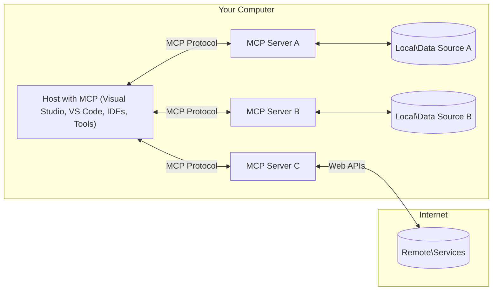

<!--
CO_OP_TRANSLATOR_METADATA:
{
  "original_hash": "355b12a5970c5c9e6db0bee970c751ba",
  "translation_date": "2025-07-13T16:26:27+00:00",
  "source_file": "01-CoreConcepts/README.md",
  "language_code": "hr"
}
-->
# 📖 Osnovni pojmovi MCP-a: Ovladavanje Model Context Protocolom za integraciju AI-ja

[Model Context Protocol (MCP)](https://github.com/modelcontextprotocol) je moćan, standardizirani okvir koji optimizira komunikaciju između velikih jezičnih modela (LLM) i vanjskih alata, aplikacija i izvora podataka. Ovaj SEO-optimizirani vodič provest će vas kroz osnovne koncepte MCP-a, osiguravajući da razumijete njegovu klijent-poslužitelj arhitekturu, ključne komponente, mehaniku komunikacije i najbolje prakse implementacije.

## Pregled

Ova lekcija istražuje temeljnu arhitekturu i komponente koje čine MCP ekosustav. Naučit ćete o klijent-poslužitelj arhitekturi, ključnim komponentama i mehanizmima komunikacije koji pokreću MCP interakcije.

## Ključni ciljevi učenja

Na kraju ove lekcije, moći ćete:

- Razumjeti MCP klijent-poslužitelj arhitekturu.
- Prepoznati uloge i odgovornosti Hostova, Klijenata i Poslužitelja.
- Analizirati osnovne značajke koje MCP čine fleksibilnim slojem za integraciju.
- Naučiti kako informacije teku unutar MCP ekosustava.
- Steći praktične uvide kroz primjere koda u .NET-u, Javi, Pythonu i JavaScriptu.

## MCP Arhitektura: Detaljniji pogled

MCP ekosustav temelji se na modelu klijent-poslužitelj. Ova modularna struktura omogućuje AI aplikacijama učinkovitu interakciju s alatima, bazama podataka, API-jima i kontekstualnim resursima. Razložimo ovu arhitekturu na njezine osnovne komponente.

U svojoj srži, MCP slijedi klijent-server arhitekturu gdje aplikacija domaćin može povezati više servera:



- **MCP Hostovi**: Programi poput VSCode, Claude Desktop, IDE-ovi ili AI alati koji žele pristupiti podacima putem MCP-a
- **MCP Klijenti**: Protokol klijenti koji održavaju 1:1 veze s poslužiteljima
- **MCP Poslužitelji**: Laki programi koji izlažu specifične mogućnosti kroz standardizirani Model Context Protocol
- **Lokalni izvori podataka**: Datoteke, baze podataka i servisi na vašem računalu kojima MCP poslužitelji mogu sigurno pristupiti
- **Udaljene usluge**: Vanjski sustavi dostupni preko interneta kojima se MCP poslužitelji mogu povezati putem API-ja.

MCP protokol je evoluirajući standard koji koristi verzioniranje temeljeno na datumu (YYYY-MM-DD format). Trenutna verzija protokola je **2025-06-18**. Najnovija ažuriranja specifikacije protokola možete vidjeti na [specifikaciji protokola](https://modelcontextprotocol.io/specification/2025-06-18/)

### 1. Domaćini

U Model Context Protocolu (MCP), Hostovi igraju ključnu ulogu kao primarni sučelje kroz koje korisnici komuniciraju s protokolom. Hostovi su aplikacije ili okruženja koja iniciraju veze s MCP poslužiteljima kako bi pristupili podacima, alatima i promptovima. Primjeri Hostova uključuju integrirana razvojna okruženja (IDE) poput Visual Studio Codea, AI alate poput Claude Desktopa ili prilagođene agente dizajnirane za specifične zadatke.

**Hostovi** su LLM aplikacije koje pokreću veze. Oni:

- Izvršavaju ili komuniciraju s AI modelima za generiranje odgovora.
- Iniciraju veze s MCP poslužiteljima.
- Upravljaju tijekom razgovora i korisničkim sučeljem.
- Kontroliraju dozvole i sigurnosne uvjete.
- Rukovode korisničkim pristankom za dijeljenje podataka i izvršavanje alata.

### 2. Klijenti

**Klijenti** su ključne komponente koje održavaju posvećene veze jedan-na-jedan između domaćina i MCP servera. Svaki MCP klijent instancira domaćin kako bi se povezao s određenim MCP serverom, osiguravajući organizirane i sigurne komunikacijske kanale. Više klijenata omogućuje domaćinima povezivanje s više servera istovremeno.

**Klijenti** su konektorske komponente unutar aplikacije domaćina. Oni:

- Šalju zahtjeve poslužiteljima s promptovima/instrukcijama.
- Pregovaraju o mogućnostima s poslužiteljima.
- Upravljaju zahtjevima za izvršavanje alata od modela.
- Procesuiraju i prikazuju odgovore korisnicima.

### 3. Poslužitelji

Poslužitelji su odgovorni za obradu zahtjeva MCP klijenata i pružanje odgovarajućih odgovora. Upravljaju raznim operacijama poput dohvaćanja podataka, izvršavanja alata i generiranja promptova. Poslužitelji osiguravaju da je komunikacija između klijenata i Hostova učinkovita i pouzdana, održavajući integritet procesa interakcije.

**Serveri** su usluge koje pružaju kontekst i mogućnosti. Oni:

- **Registracija značajki**: Registriraju i izlažu dostupne primitive (resurse, upite, alate) klijentima
- **Obrada zahtjeva**: Primaju i izvršavaju pozive alata, zahtjeve za resursima i upite od klijenata
- **Pružanje konteksta**: Pružaju kontekstualne informacije i podatke za poboljšanje odgovora modela
- **Upravljanje stanjem**: Održavaju stanje sesije i upravljaju interakcijama koje zahtijevaju stanje kada je potrebno
- **Obavijesti u stvarnom vremenu**: Šalju obavijesti o promjenama mogućnosti i ažuriranjima povezanim klijentima

Serveri mogu biti razvijeni od strane bilo koga kako bi proširili mogućnosti modela specijaliziranom funkcionalnošću, i podržavaju lokalne i udaljene scenarije implementacije.

### 4. Značajke poslužitelja

Poslužitelji u Model Context Protocolu (MCP) pružaju temeljne gradivne blokove koji omogućuju bogate interakcije između klijenata, hostova i jezičnih modela. Ove značajke su dizajnirane da unaprijede mogućnosti MCP-a nudeći strukturirani kontekst, alate i promptove.

MCP serveri mogu izložiti bilo koju kombinaciju sljedećih tri osnovna primitiva:

#### 📑 Resursi

Resursi u Model Context Protocolu (MCP) obuhvaćaju različite vrste konteksta i podataka koje korisnici ili AI modeli mogu koristiti. To uključuje:

- **Kontekstualni podaci**: Strukturirane informacije i kontekst za potrošnju AI modela
- **Baze znanja**: Repozitoriji dokumenata, članci, priručnici i istraživački radovi
- **Lokalni izvori podataka**: Datoteke, baze podataka i informacije lokalnog sustava  
- **Vanjski podaci**: API odgovori, web usluge i podaci udaljenih sustava
- **Dinamički sadržaj**: Podaci u stvarnom vremenu koji se ažuriraju na temelju vanjskih uvjeta

Resursi se identificiraju URI-ima i podržavaju otkrivanje putem `resources/list` i dohvaćanje putem `resources/read` metoda:

```text
file://documents/project-spec.md
database://production/users/schema
api://weather/current
```

#### Upiti

**Upiti** su ponovno upotrebljivi predlošci koji pomažu strukturirati interakcije s jezičnim modelima. Oni pružaju standardizirane obrasce interakcije i predloške tijekova rada:

- **Interakcije temeljene na predlošcima**: Predstrukturirane poruke i pokretači razgovora
- **Predlošci tijekova rada**: Standardizirani slijedovi za uobičajene zadatke i interakcije
- **Primjeri s malo podataka**: Predlošci temeljeni na primjerima za instrukcije modela
- **Sistemski upiti**: Temeljni upiti koji definiraju ponašanje i kontekst modela
- **Dinamički predlošci**: Parametrizirani upiti koji se prilagođavaju specifičnim kontekstima

Upiti podržavaju zamjenu varijabli i mogu se otkriti putem `prompts/list` i dohvatiti s `prompts/get`:

```markdown
Generate a {{task_type}} for {{product}} targeting {{audience}} with the following requirements: {{requirements}}
```

#### Alati

Alati u Model Context Protocolu (MCP) su funkcije koje AI model može izvršiti za obavljanje specifičnih zadataka. Ovi alati su dizajnirani da unaprijede mogućnosti AI modela pružajući strukturirane i pouzdane operacije. Ključni aspekti uključuju:

- **Funkcije koje AI model može izvršiti**: Alati su izvršne funkcije koje AI model može pozvati za obavljanje različitih zadataka.
- **Jedinstveno ime i opis**: Svaki alat ima jedinstveno ime i detaljan opis koji objašnjava njegovu svrhu i funkcionalnost.
- **Parametri i izlazi**: Alati prihvaćaju specifične parametre i vraćaju strukturirane rezultate, osiguravajući dosljedne i predvidive ishode.
- **Diskretne funkcije**: Alati obavljaju diskretne funkcije poput pretraživanja weba, izračuna i upita u bazu podataka.

Primjer alata može izgledati ovako:

```typescript
server.tool(
  "search_products", 
  {
    query: z.string().describe("Search query for products"),
    category: z.string().optional().describe("Product category filter"),
    max_results: z.number().default(10).describe("Maximum results to return")
  }, 
  async (params) => {
    // Execute search and return structured results
    return await productService.search(params);
  }
);
```

## Primitivi klijenata

U Model Context Protocolu (MCP), klijenti nude nekoliko ključnih značajki poslužiteljima, poboljšavajući ukupnu funkcionalnost i interakciju unutar protokola. Jedna od značajnih značajki je Sampling.

### 👉 Sampling

- **Agentna ponašanja inicirana od strane poslužitelja**: Klijenti omogućuju poslužiteljima da autonomno pokreću specifične radnje ili ponašanja, povećavajući dinamičke mogućnosti sustava.
- **Rekurzivne LLM interakcije**: Ova značajka omogućuje rekurzivne interakcije s velikim jezičnim modelima (LLM), omogućujući složeniju i iterativnu obradu zadataka.
- **Zahtjevi za dodatnim dovršecima modela**: Poslužitelji mogu zatražiti dodatne dovršetke od modela, osiguravajući da su odgovori temeljiti i kontekstualno relevantni.

## Tok informacija u MCP-u

Model Context Protocol (MCP) definira strukturirani tok informacija između domaćina, klijenata, servera i modela. Razumijevanje ovog toka pomaže razjasniti kako se korisnički zahtjevi obrađuju i kako se vanjski alati i podaci integriraju u odgovore modela.

- **Host inicira vezu**  
  Host aplikacija (poput IDE-a ili chat sučelja) uspostavlja vezu s MCP poslužiteljem, obično putem STDIO, WebSocket-a ili drugog podržanog transporta.

- **Pregovaranje mogućnosti**  
  Klijent (ugrađen u domaćina) i server razmjenjuju informacije o svojim podržanim značajkama, alatima, resursima i verzijama protokola. Ovo osigurava da obje strane razumiju koje su mogućnosti dostupne za sesiju.

- **Korisnički zahtjev**  
  Korisnik komunicira s domaćinom (npr. unosi upit ili naredbu). Domaćin prikuplja ovaj unos i prosljeđuje ga klijentu na obradu.

- **Korištenje resursa ili alata**  
  - Klijent može zatražiti dodatni kontekst ili resurse od poslužitelja (poput datoteka, unosa u bazu podataka ili članaka iz baze znanja) kako bi obogatio razumijevanje modela.
  - Ako model procijeni da je potreban alat (npr. za dohvat podataka, izvođenje izračuna ili poziv API-ja), klijent šalje zahtjev za poziv alata poslužitelju, navodeći ime alata i parametre.

- **Izvršenje na poslužitelju**  
  Poslužitelj prima zahtjev za resurs ili alat, izvršava potrebne operacije (poput pokretanja funkcije, upita u bazu podataka ili dohvaćanja datoteke) i vraća rezultate klijentu u strukturiranom obliku.

- **Generiranje odgovora**  
  Klijent integrira odgovore poslužitelja (podatke resursa, izlaze alata itd.) u tekuću interakciju s modelom. Model koristi ove informacije za generiranje sveobuhvatnog i kontekstualno relevantnog odgovora.

- **Prikaz rezultata**  
  Host prima konačni izlaz od klijenta i prikazuje ga korisniku, često uključujući i generirani tekst modela i rezultate izvršenja alata ili pretraživanja resursa.

Ovaj tok omogućuje MCP-u podršku za napredne, interaktivne i kontekstualno osviještene AI aplikacije povezivanjem modela s vanjskim alatima i izvorima podataka.

## Detalji protokola

MCP (Model Context Protocol) je izgrađen na temelju [JSON-RPC 2.0](https://www.jsonrpc.org/), pružajući standardizirani, jezično neovisan format poruka za komunikaciju između hostova, klijenata i poslužitelja. Ova osnova omogućuje pouzdane, strukturirane i proširive interakcije na različitim platformama i programskim jezicima.

### Ključne značajke protokola

MCP proširuje JSON-RPC 2.0 dodatnim konvencijama za pozivanje alata, pristup resursima i upravljanje promptovima. Podržava više transportnih slojeva (STDIO, WebSocket, SSE) i omogućuje sigurnu, proširivu i jezično neovisnu komunikaciju između komponenti.

#### 🧢 Osnovni protokol

- **JSON-RPC format poruka**: Svi zahtjevi i odgovori koriste JSON-RPC 2.0 specifikaciju, osiguravajući dosljednu strukturu za pozive metoda, parametre, rezultate i rukovanje pogreškama.
- **Stanje veza**: MCP sesije održavaju stanje kroz više zahtjeva, podržavajući kontinuirane razgovore, akumulaciju konteksta i upravljanje resursima.
- **Pregovaranje o mogućnostima**: Tijekom uspostave veze, klijenti i poslužitelji razmjenjuju informacije o podržanim značajkama, verzijama protokola, dostupnim alatima i resursima. To osigurava da obje strane razumiju mogućnosti i mogu se prilagoditi.

#### ➕ Dodatne funkcionalnosti

Ispod su neke dodatne funkcionalnosti i proširenja protokola koje MCP pruža za poboljšanje iskustva programera i omogućavanje naprednih scenarija:

- **Opcije konfiguracije**: MCP omogućuje dinamičku konfiguraciju parametara sesije, poput dozvola za alate, pristupa resursima i postavki modela, prilagođeno svakoj interakciji.
- **Praćenje napretka**: Operacije koje traju dulje mogu izvještavati o napretku, omogućujući responzivna korisnička sučelja i bolje korisničko iskustvo tijekom složenih zadataka.
- **Otkaživanje zahtjeva**: Klijenti mogu otkazati zahtjeve u tijeku, dopuštajući korisnicima da prekinu operacije koje više nisu potrebne ili traju predugo.
- **Izvještavanje o pogreškama**: Standardizirane poruke o pogreškama i kodovi pomažu u dijagnostici problema, elegantnom rukovanju neuspjesima i pružanju korisnih povratnih informacija korisnicima i programerima.
- **Logiranje**: I klijenti i poslužitelji mogu emitirati strukturirane zapise za reviziju, otklanjanje pogrešaka i nadzor interakcija protokola.

Korištenjem ovih značajki protokola, MCP osigurava robusnu, sigurnu i fleksibilnu komunikaciju između jezičnih modela i vanjskih alata ili izvora podataka.

### 🔐 Sigurnosne napomene

Implementacije MCP-a trebaju se pridržavati nekoliko ključnih sigurnosnih načela kako bi osigurale sigurne i pouzdane interakcije:

- **Korisnički pristanak i kontrola**: Korisnici moraju dati izričit pristanak prije nego što se pristupi bilo kakvim podacima ili izvrše operacije. Trebaju imati jasnu kontrolu nad time koji se podaci dijele i koje su radnje ovlaštene, uz intuitivna korisnička sučelja za pregled i odobrenje aktivnosti.

- **Privatnost podataka**: Korisnički podaci trebaju biti izloženi samo uz izričit pristanak i moraju biti zaštićeni odgovarajućim kontrolama pristupa. Implementacije MCP-a moraju spriječiti neovlašteni prijenos podataka i osigurati da se privatnost održava tijekom svih interakcija.

- **Sigurnost alata**: Prije pozivanja bilo kojeg alata, potreban je izričit korisnički pristanak. Korisnici trebaju jasno razumjeti funkcionalnost svakog alata, a moraju se provoditi stroge sigurnosne granice kako bi se spriječilo neželjeno ili nesigurno izvršavanje alata.

Slijedeći ova načela, MCP osigurava da se povjerenje korisnika, privatnost i sigurnost održavaju u svim interakcijama protokola.

## Primjeri koda: Ključne komponente

Ispod su primjeri koda u nekoliko popularnih programskih jezika koji ilustriraju kako implementirati ključne MCP poslužiteljske komponente i alate.

### .NET primjer: Kreiranje jednostavnog MCP poslužitelja s alatima

Evo praktičnog .NET primjera koda koji pokazuje kako implementirati jednostavan MCP posluž
MCP uključuje nekoliko ugrađenih koncepata i mehanizama za upravljanje sigurnošću i autorizacijom kroz cijeli protokol:

1. **Kontrola dozvola alata**:  
  Klijenti mogu odrediti koje alate model smije koristiti tijekom sesije. To osigurava da su dostupni samo eksplicitno ovlašteni alati, smanjujući rizik od neželjenih ili nesigurnih operacija. Dozvole se mogu dinamički konfigurirati na temelju korisničkih preferencija, organizacijskih pravila ili konteksta interakcije.

2. **Autentikacija**:  
  Serveri mogu zahtijevati autentikaciju prije nego što omoguće pristup alatima, resursima ili osjetljivim operacijama. To može uključivati API ključeve, OAuth tokene ili druge sheme autentikacije. Ispravna autentikacija osigurava da samo pouzdani klijenti i korisnici mogu koristiti mogućnosti na strani servera.

3. **Validacija**:  
  Validacija parametara se provodi za sve pozive alata. Svaki alat definira očekivane tipove, formate i ograničenja za svoje parametre, a server provjerava dolazne zahtjeve u skladu s tim. To sprječava da nepravilni ili zlonamjerni unosi dođu do implementacija alata i pomaže u održavanju integriteta operacija.

4. **Ograničenje brzine (Rate Limiting)**:  
  Kako bi se spriječila zloupotreba i osigurala poštena upotreba resursa servera, MCP serveri mogu implementirati ograničenja brzine za pozive alata i pristup resursima. Ograničenja se mogu primjenjivati po korisniku, po sesiji ili globalno, te pomažu u zaštiti od napada uskraćivanja usluge ili pretjerane potrošnje resursa.

Kombiniranjem ovih mehanizama, MCP pruža sigurnu osnovu za integraciju jezičnih modela s vanjskim alatima i izvorima podataka, istovremeno dajući korisnicima i developerima detaljnu kontrolu nad pristupom i korištenjem.

## Poruke protokola

MCP komunikacija koristi strukturirane JSON poruke kako bi omogućila jasne i pouzdane interakcije između klijenata, servera i modela. Glavne vrste poruka uključuju:

- **Zahtjev klijenta**  
  Poslan od klijenta serveru, ova poruka obično sadrži:
  - Korisnički upit ili naredbu
  - Povijest razgovora za kontekst
  - Konfiguraciju alata i dozvole
  - Bilo koje dodatne metapodatke ili informacije o sesiji

- **Odgovor modela**  
  Vraća model (putem klijenta), a poruka sadrži:
  - Generirani tekst ili dovršetak na temelju upita i konteksta
  - Opcionalne upute za poziv alata ako model procijeni da treba pozvati alat
  - Reference na resurse ili dodatni kontekst po potrebi

- **Zahtjev alata**  
  Poslan od klijenta serveru kada je potrebno izvršiti alat. Ova poruka uključuje:
  - Ime alata koji se poziva
  - Parametre potrebne alatu (validirane prema shemi alata)
  - Kontekstualne informacije ili identifikatore za praćenje zahtjeva

- **Odgovor alata**  
  Vraća server nakon izvršenja alata. Ova poruka pruža:
  - Rezultate izvršenja alata (strukturirani podaci ili sadržaj)
  - Sve pogreške ili informacije o statusu ako je poziv alata neuspješan
  - Opcionalno, dodatne metapodatke ili zapise vezane uz izvršenje

Ove strukturirane poruke osiguravaju da je svaki korak u MCP tijeku rada jasan, pratljiv i proširiv, podržavajući napredne scenarije poput višekratnih razgovora, povezivanja alata i robusnog upravljanja pogreškama.

## Ključne napomene

- MCP koristi arhitekturu klijent-server za povezivanje modela s vanjskim mogućnostima
- Ekosustav se sastoji od klijenata, hostova, servera, alata i izvora podataka
- Komunikacija može biti putem STDIO, SSE ili WebSockets
- Alati su osnovne jedinice funkcionalnosti dostupne modelima
- Strukturirani komunikacijski protokoli osiguravaju dosljedne interakcije

## Vježba

Dizajnirajte jednostavan MCP alat koji bi bio koristan u vašem području. Definirajte:  
1. Kako bi se alat zvao  
2. Koje parametre bi prihvaćao  
3. Koji izlaz bi vraćao  
4. Kako bi model mogao koristiti ovaj alat za rješavanje korisničkih problema  

---

## Što slijedi

Dalje: [Poglavlje 2: Sigurnost](../02-Security/README.md)  

**Odricanje od odgovornosti**:  
Ovaj dokument je preveden korištenjem AI usluge za prevođenje [Co-op Translator](https://github.com/Azure/co-op-translator). Iako nastojimo postići točnost, imajte na umu da automatski prijevodi mogu sadržavati pogreške ili netočnosti. Izvorni dokument na izvornom jeziku treba smatrati autoritativnim izvorom. Za kritične informacije preporučuje se profesionalni ljudski prijevod. Ne snosimo odgovornost za bilo kakva nesporazuma ili pogrešna tumačenja koja proizlaze iz korištenja ovog prijevoda.