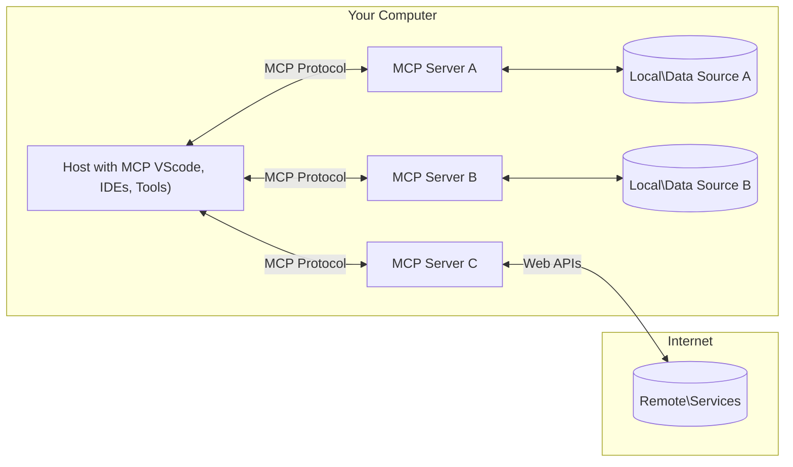

<!--
CO_OP_TRANSLATOR_METADATA:
{
  "original_hash": "b3b4a6ad10c3c0edbf7fa7cfa0ec496b",
  "translation_date": "2025-07-02T07:36:38+00:00",
  "source_file": "01-CoreConcepts/README.md",
  "language_code": "hr"
}
-->
# 📖 MCP Osnovni Koncepti: Savladavanje Model Context Protocol za AI Integraciju

[Model Context Protocol (MCP)](https://github.com/modelcontextprotocol) je moćan, standardizirani okvir koji optimizira komunikaciju između velikih jezičnih modela (LLM) i vanjskih alata, aplikacija i izvora podataka. Ovaj SEO-optimizirani vodič provest će vas kroz osnovne koncepte MCP-a, osiguravajući da razumijete njegovu klijent-server arhitekturu, ključne komponente, mehanizme komunikacije i najbolje prakse implementacije.

## Pregled

Ova lekcija istražuje osnovnu arhitekturu i komponente koje čine Model Context Protocol (MCP) ekosustav. Naučit ćete o klijent-server arhitekturi, ključnim komponentama i mehanizmima komunikacije koji pokreću MCP interakcije.

## 👩‍🎓 Ključni Ciljevi Učenja

Na kraju ove lekcije moći ćete:

- Razumjeti MCP klijent-server arhitekturu.
- Prepoznati uloge i odgovornosti Hostova, Klijenata i Servera.
- Analizirati osnovne značajke koje MCP čine fleksibilnim slojem za integraciju.
- Naučiti kako informacije teku unutar MCP ekosustava.
- Steći praktične uvide kroz primjere koda u .NET, Java, Python i JavaScript.

## 🔎 MCP Arhitektura: Detaljniji Pregled

MCP ekosustav temelji se na klijent-server modelu. Ova modularna struktura omogućava AI aplikacijama učinkovitu interakciju s alatima, bazama podataka, API-jima i kontekstualnim resursima. Razložimo ovu arhitekturu na njene osnovne komponente.

U svojoj srži, MCP slijedi klijent-server arhitekturu gdje host aplikacija može povezati više servera:



- **MCP Hostovi**: Programi poput VSCode, Claude Desktop, IDE-ovi ili AI alati koji žele pristupiti podacima putem MCP-a
- **MCP Klijenti**: Protokolni klijenti koji održavaju 1:1 veze sa serverima
- **MCP Serveri**: Laki programi koji izlažu specifične mogućnosti kroz standardizirani Model Context Protocol
- **Lokalni Izvori Podataka**: Datoteke, baze podataka i servisi na vašem računalu kojima MCP serveri mogu sigurno pristupiti
- **Udaljene Usluge**: Vanjski sustavi dostupni putem interneta kojima se MCP serveri mogu povezati putem API-ja.

MCP Protokol je standard u razvoju; najnovije promjene možete pratiti u [specifikaciji protokola](https://modelcontextprotocol.io/specification/2025-06-18/)

### 1. Hostovi

U Model Context Protocolu (MCP), Hostovi igraju ključnu ulogu kao primarni sučelje preko kojeg korisnici komuniciraju s protokolom. Hostovi su aplikacije ili okruženja koja iniciraju veze s MCP serverima kako bi pristupili podacima, alatima i promptovima. Primjeri Hostova su integrirana razvojna okruženja (IDE) poput Visual Studio Code, AI alati poput Claude Desktop ili prilagođeni agenti za specifične zadatke.

**Hostovi** su LLM aplikacije koje pokreću veze. Oni:

- Izvršavaju ili komuniciraju s AI modelima za generiranje odgovora.
- Iniciraju veze s MCP serverima.
- Upravljaju tijekom razgovora i korisničkim sučeljem.
- Kontroliraju dozvole i sigurnosne mjere.
- Rukovode korisničkim pristankom za dijeljenje podataka i izvršavanje alata.

### 2. Klijenti

Klijenti su ključne komponente koje olakšavaju interakciju između Hostova i MCP servera. Klijenti djeluju kao posrednici, omogućujući Hostovima pristup i korištenje funkcionalnosti koje pružaju MCP serveri. Oni igraju važnu ulogu u osiguravanju glatke komunikacije i učinkovitog razmjene podataka unutar MCP arhitekture.

**Klijenti** su konektori unutar host aplikacije. Oni:

- Šalju zahtjeve serverima s promptovima/instrukcijama.
- Pregovaraju o mogućnostima sa serverima.
- Upravljaju zahtjevima za izvršavanje alata od modela.
- Procesuiraju i prikazuju odgovore korisnicima.

### 3. Serveri

Serveri su odgovorni za obradu zahtjeva MCP klijenata i pružanje odgovarajućih odgovora. Oni upravljaju raznim operacijama poput dohvaćanja podataka, izvršavanja alata i generiranja promptova. Serveri osiguravaju da komunikacija između klijenata i Hostova bude učinkovita i pouzdana, održavajući integritet procesa interakcije.

**Serveri** su servisi koji pružaju kontekst i mogućnosti. Oni:

- Registriraju dostupne značajke (resurse, promptove, alate)
- Primaju i izvršavaju pozive alata od klijenta
- Pružaju kontekstualne informacije za poboljšanje odgovora modela
- Vraćaju rezultate natrag klijentu
- Održavaju stanje kroz interakcije kada je potrebno

Serveri mogu biti razvijeni od strane bilo koga za proširenje mogućnosti modela specijaliziranim funkcionalnostima.

### 4. Značajke Servera

Serveri u Model Context Protocolu (MCP) pružaju temeljne gradivne blokove koji omogućuju bogate interakcije između klijenata, hostova i jezičnih modela. Ove značajke su dizajnirane da unaprijede mogućnosti MCP-a nudeći strukturirani kontekst, alate i promptove.

MCP serveri mogu nuditi bilo koju od sljedećih značajki:

#### 📑 Resursi

Resursi u Model Context Protocolu (MCP) obuhvaćaju različite vrste konteksta i podataka koje korisnici ili AI modeli mogu koristiti. To uključuje:

- **Kontekstualni Podaci**: Informacije i kontekst koje korisnici ili AI modeli mogu iskoristiti za donošenje odluka i izvršavanje zadataka.
- **Baze Znanja i Repozitoriji Dokumenata**: Skupovi strukturiranih i nestrukturiranih podataka, poput članaka, priručnika i istraživačkih radova, koji pružaju vrijedne uvide i informacije.
- **Lokalne Datoteke i Baze Podataka**: Podaci pohranjeni lokalno na uređajima ili u bazama podataka, dostupni za obradu i analizu.
- **API-ji i Web Servisi**: Vanjska sučelja i servisi koji nude dodatne podatke i funkcionalnosti, omogućujući integraciju s različitim online resursima i alatima.

Primjer resursa može biti shema baze podataka ili datoteka kojoj se može pristupiti na sljedeći način:

```text
file://log.txt
database://schema
```

### 🤖 Promptovi

Promptovi u Model Context Protocolu (MCP) uključuju različite unaprijed definirane predloške i obrasce interakcije dizajnirane za pojednostavljenje korisničkih tijekova rada i poboljšanje komunikacije. To uključuje:

- **Predložene Poruke i Tijekovi Rada**: Unaprijed strukturirane poruke i procesi koji vode korisnike kroz specifične zadatke i interakcije.
- **Unaprijed Definirani Obrasci Interakcije**: Standardizirani slijedovi radnji i odgovora koji omogućuju dosljednu i učinkovitu komunikaciju.
- **Specijalizirani Obrasci Razgovora**: Prilagodljivi predlošci namijenjeni određenim vrstama razgovora, osiguravajući relevantne i kontekstualno prikladne interakcije.

Predložak prompta može izgledati ovako:

```markdown
Generate a product slogan based on the following {{product}} with the following {{keywords}}
```

#### ⛏️ Alati

Alati u Model Context Protocolu (MCP) su funkcije koje AI model može izvršiti za obavljanje specifičnih zadataka. Ti alati su dizajnirani za proširenje mogućnosti AI modela pružajući strukturirane i pouzdane operacije. Ključni aspekti uključuju:

- **Funkcije koje AI model može izvršiti**: Alati su izvršne funkcije koje AI model može pozvati za obavljanje različitih zadataka.
- **Jedinstveno Ime i Opis**: Svaki alat ima jedinstveno ime i detaljan opis koji objašnjava njegovu svrhu i funkcionalnost.
- **Parametri i Izlazi**: Alati prihvaćaju specifične parametre i vraćaju strukturirane rezultate, osiguravajući dosljedne i predvidljive ishode.
- **Diskretne Funkcije**: Alati izvršavaju diskretne funkcije poput pretraživanja weba, izračuna i upita baza podataka.

Primjer alata može izgledati ovako:

```typescript
server.tool(
  "GetProducts",
  {
    pageSize: z.string().optional(),
    pageCount: z.string().optional()
  }, () => {
    // return results from API
  }
)
```

## Značajke Klijenta

U Model Context Protocolu (MCP), klijenti nude nekoliko ključnih značajki serverima, poboljšavajući ukupnu funkcionalnost i interakciju unutar protokola. Jedna od značajnih značajki je Sampling.

### 👉 Sampling

- **Server-Inicirane Agencijske Radnje**: Klijenti omogućuju serverima da samostalno iniciraju određene akcije ili ponašanja, povećavajući dinamičke mogućnosti sustava.
- **Rekurzivne LLM Interakcije**: Ova značajka omogućuje rekurzivne interakcije s velikim jezičnim modelima (LLM), što omogućava složeniju i iterativnu obradu zadataka.
- **Zahtjevanje Dodatnih Završetaka Modela**: Serveri mogu zatražiti dodatne završetke od modela, osiguravajući da su odgovori temeljiti i kontekstualno relevantni.

## Protok Informacija u MCP-u

Model Context Protocol (MCP) definira strukturirani protok informacija između hostova, klijenata, servera i modela. Razumijevanje ovog protoka pomaže razjasniti kako se korisnički zahtjevi obrađuju i kako se vanjski alati i podaci integriraju u odgovore modela.

- **Host Inicira Vezu**  
  Host aplikacija (kao IDE ili chat sučelje) uspostavlja vezu s MCP serverom, obično preko STDIO, WebSocket ili drugog podržanog transporta.

- **Pregovaranje o Mogućnostima**  
  Klijent (ugrađen u host) i server razmjenjuju informacije o podržanim značajkama, alatima, resursima i verzijama protokola. Time se osigurava da obje strane razumiju koje su mogućnosti dostupne tijekom sesije.

- **Korisnički Zahtjev**  
  Korisnik komunicira s hostom (npr. unosi prompt ili naredbu). Host prikuplja taj unos i prosljeđuje ga klijentu na obradu.

- **Korištenje Resursa ili Alata**  
  - Klijent može zatražiti dodatni kontekst ili resurse od servera (poput datoteka, unosa u bazu podataka ili članaka iz baze znanja) kako bi obogatio razumijevanje modela.
  - Ako model procijeni da je potreban alat (npr. za dohvaćanje podataka, izvođenje izračuna ili pozivanje API-ja), klijent šalje zahtjev za poziv alata serveru, navodeći ime alata i parametre.

- **Izvršenje Servera**  
  Server prima zahtjev za resurs ili alat, izvršava potrebne operacije (poput pokretanja funkcije, upita baze podataka ili dohvaćanja datoteke) i vraća rezultate klijentu u strukturiranom formatu.

- **Generiranje Odgovora**  
  Klijent integrira odgovore servera (podatke resursa, izlaze alata itd.) u tekuću interakciju modela. Model koristi te informacije za generiranje sveobuhvatnog i kontekstualno relevantnog odgovora.

- **Prikaz Rezultata**  
  Host prima konačni izlaz od klijenta i prikazuje ga korisniku, često uključujući i generirani tekst modela te rezultate izvršenja alata ili pretraživanja resursa.

Ovaj protok omogućuje MCP-u podršku za napredne, interaktivne i kontekstualno svjesne AI aplikacije povezivanjem modela s vanjskim alatima i izvorima podataka.

## Detalji Protokola

MCP (Model Context Protocol) je izgrađen na temelju [JSON-RPC 2.0](https://www.jsonrpc.org/), pružajući standardizirani, jezično-neovisan format poruka za komunikaciju između hostova, klijenata i servera. Ova osnova omogućava pouzdane, strukturirane i proširive interakcije preko različitih platformi i programskih jezika.

### Ključne Značajke Protokola

MCP proširuje JSON-RPC 2.0 dodatnim konvencijama za pozivanje alata, pristup resursima i upravljanje promptovima. Podržava više transportnih slojeva (STDIO, WebSocket, SSE) i omogućava sigurnu, proširivu i jezično-neovisnu komunikaciju između komponenti.

#### 🧢 Osnovni Protokol

- **JSON-RPC Format Poruka**: Svi zahtjevi i odgovori koriste JSON-RPC 2.0 specifikaciju, osiguravajući dosljednu strukturu za pozive metoda, parametre, rezultate i rukovanje greškama.
- **Stanje Veze**: MCP sesije održavaju stanje kroz više zahtjeva, podržavajući tekuće razgovore, akumulaciju konteksta i upravljanje resursima.
- **Pregovaranje o Mogućnostima**: Tijekom uspostave veze, klijenti i serveri razmjenjuju informacije o podržanim značajkama, verzijama protokola, dostupnim alatima i resursima. Time se osigurava da obje strane razumiju mogućnosti i mogu se prilagoditi.

#### ➕ Dodatne Pomoćne Funkcije

Ispod su neke dodatne funkcije i proširenja protokola koje MCP nudi za poboljšanje iskustva programera i omogućavanje naprednih scenarija:

- **Opcije Konfiguracije**: MCP dopušta dinamičku konfiguraciju parametara sesije, poput dozvola za alate, pristupa resursima i postavki modela, prilagođenih svakoj interakciji.
- **Praćenje Napretka**: Operacije koje traju dulje mogu prijavljivati ažuriranja napretka, omogućujući responzivna korisnička sučelja i bolje korisničko iskustvo tijekom složenih zadataka.
- **Otkazivanje Zahtjeva**: Klijenti mogu otkazati zahtjeve u tijeku, dopuštajući korisnicima da prekinu operacije koje više nisu potrebne ili traju predugo.
- **Izvještavanje o Greškama**: Standardizirane poruke o greškama i kodovi pomažu u dijagnostici problema, upravljanju neuspjesima i pružanju korisnih povratnih informacija korisnicima i programerima.
- **Evidencija**: I klijenti i serveri mogu emitirati strukturirane zapise za reviziju, otklanjanje pogrešaka i nadzor interakcija protokola.

Korištenjem ovih značajki protokola, MCP osigurava robusnu, sigurnu i fleksibilnu komunikaciju između jezičnih modela i vanjskih alata ili izvora podataka.

### 🔐 Sigurnosni Aspekti

Implementacije MCP-a trebaju slijediti nekoliko ključnih sigurnosnih principa kako bi osigurale sigurne i pouzdane interakcije:

- **Korisnički Pristanak i Kontrola**: Korisnici moraju dati izričit pristanak prije pristupa podacima ili izvršavanja operacija. Trebaju imati jasnu kontrolu nad time koji se podaci dijele i koje su radnje ovlaštene, uz intuitivna sučelja za pregled i odobrenje aktivnosti.

- **Privatnost Podataka**: Korisnički podaci trebaju biti izloženi samo uz izričit pristanak i zaštićeni odgovarajućim kontrolama pristupa. Implementacije MCP-a moraju spriječiti neovlašteni prijenos podataka i osigurati da se privatnost održava tijekom svih interakcija.

- **Sigurnost Alata**: Prije pozivanja bilo kojeg alata, potreban je izričit korisnički pristanak. Korisnici trebaju jasno razumjeti funkcionalnost svakog alata, a sigurnosne granice moraju biti strogo provedene kako bi se spriječilo nenamjerno ili nesigurno izvršavanje alata.

Slijedeći ove principe, MCP osigurava da se povjerenje korisnika, privatnost i sigurnost održavaju u svim interakcijama protokola.

## Primjeri Koda: Ključne Komponente

Ispod su primjeri koda u nekoliko popularnih programskih jezika koji ilustriraju kako implementirati ključne MCP server komponente i alate.

### .NET Primjer: Kreiranje Jednostavnog MCP Servera s Alatima

Evo praktičnog .NET primjera koda koji pokazuje kako implementirati jednostavan MCP server s prilagođenim alatima. Ovaj primjer prikazuje kako definirati i registrirati alate, rukovati zahtjevima i povezati server koristeći Model Context Protocol.

```csharp
using System;
using System.Threading.Tasks;
using ModelContextProtocol.Server;
using ModelContextProtocol.Server.Transport;
using ModelContextProtocol.Server.Tools;

public class WeatherServer
{
    public static async Task Main(string[] args)
    {
        // Create an MCP server
        var server = new McpServer(
            name: "Weather MCP Server",
            version: "1.0.0"
        );
        
        // Register our custom weather tool
        server.AddTool<string, WeatherData>("weatherTool", 
            description: "Gets current weather for a location",
            execute: async (location) => {
                // Call weather API (simplified)
                var weatherData = await GetWeatherDataAsync(location);
                return weatherData;
            });
        
        // Connect the server using stdio transport
        var transport = new StdioServerTransport();
        await server.ConnectAsync(transport);
        
        Console.WriteLine("Weather MCP Server started");
        
        // Keep the server running until process is terminated
        await Task.Delay(-1);
    }
    
    private static async Task<WeatherData> GetWeatherDataAsync(string location)
    {
        // This would normally call a weather API
        // Simplified for demonstration
        await Task.Delay(100); // Simulate API call
        return new WeatherData { 
            Temperature = 72.5,
            Conditions = "Sunny",
            Location = location
        };
    }
}

public class WeatherData
{
    public double Temperature { get; set; }
    public string Conditions { get; set; }
    public string Location { get; set; }
}
```

### Java Primjer: MCP Server Komponente

Ovaj primjer prikazuje isti MCP server i registraciju alata kao i .

**Odricanje od odgovornosti**:  
Ovaj dokument preveden je korištenjem AI usluge za prevođenje [Co-op Translator](https://github.com/Azure/co-op-translator). Iako težimo točnosti, imajte na umu da automatski prijevodi mogu sadržavati pogreške ili netočnosti. Izvorni dokument na izvornom jeziku treba smatrati autoritativnim izvorom. Za kritične informacije preporučuje se profesionalni ljudski prijevod. Nismo odgovorni za bilo kakva nesporazuma ili kriva tumačenja koja proizlaze iz korištenja ovog prijevoda.