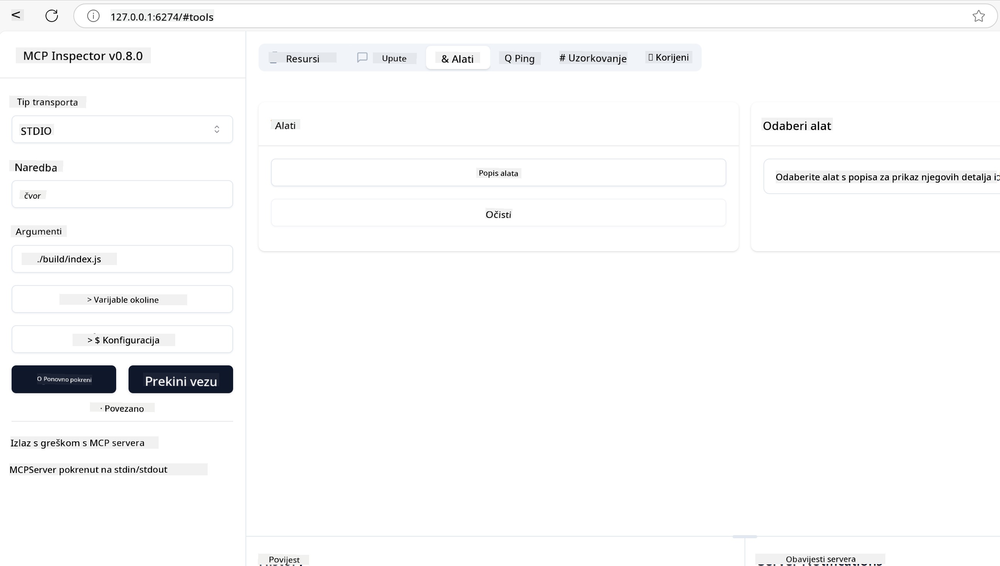
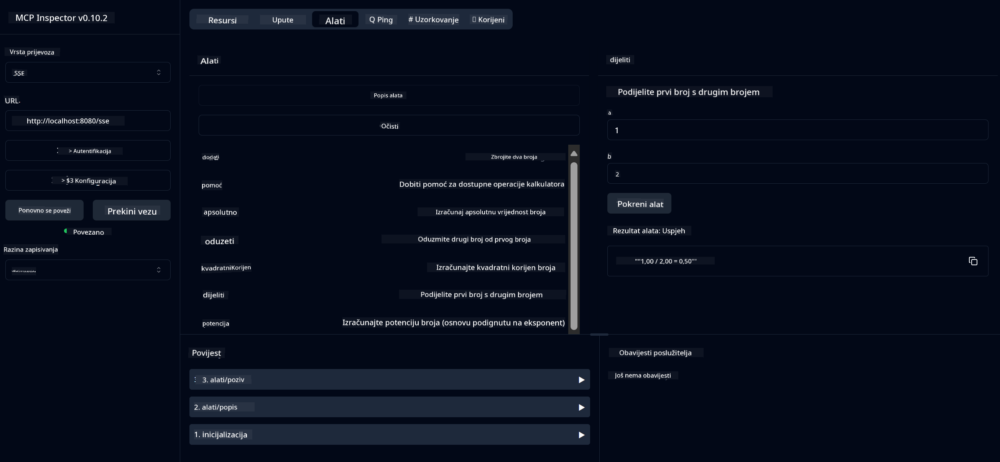
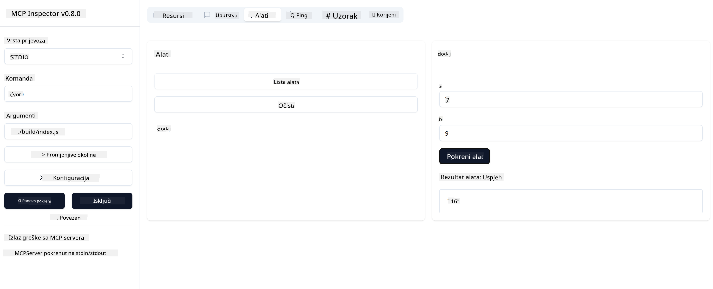

<!--
CO_OP_TRANSLATOR_METADATA:
{
  "original_hash": "fa635ae747c9b4d5c2f61c6c46cb695f",
  "translation_date": "2025-07-17T19:30:20+00:00",
  "source_file": "03-GettingStarted/01-first-server/README.md",
  "language_code": "hr"
}
-->
# Početak rada s MCP-om

Dobrodošli u svoje prve korake s Model Context Protocolom (MCP)! Bilo da ste novi u MCP-u ili želite produbiti svoje znanje, ovaj vodič će vas provesti kroz osnovnu postavku i razvojni proces. Saznat ćete kako MCP omogućuje besprijekornu integraciju između AI modela i aplikacija te kako brzo pripremiti svoje okruženje za izgradnju i testiranje rješenja temeljenih na MCP-u.

> TLDR; Ako izrađujete AI aplikacije, znate da možete dodati alate i druge resurse svom LLM-u (velikom jezičnom modelu) kako biste ga učinili informiranijim. Međutim, ako te alate i resurse postavite na poslužitelj, mogućnosti aplikacije i poslužitelja mogu koristiti bilo koji klijent s ili bez LLM-a.

## Pregled

Ova lekcija pruža praktične upute za postavljanje MCP okruženja i izradu vaših prvih MCP aplikacija. Naučit ćete kako postaviti potrebne alate i okvire, izgraditi osnovne MCP poslužitelje, kreirati host aplikacije i testirati svoje implementacije.

Model Context Protocol (MCP) je otvoreni protokol koji standardizira način na koji aplikacije pružaju kontekst LLM-ovima. Zamislite MCP kao USB-C priključak za AI aplikacije – pruža standardizirani način povezivanja AI modela s različitim izvorima podataka i alatima.

## Ciljevi učenja

Na kraju ove lekcije moći ćete:

- Postaviti razvojna okruženja za MCP u C#, Javi, Pythonu, TypeScriptu i JavaScriptu
- Izgraditi i implementirati osnovne MCP poslužitelje s prilagođenim značajkama (resursi, promptovi i alati)
- Kreirati host aplikacije koje se povezuju s MCP poslužiteljima
- Testirati i otklanjati pogreške u MCP implementacijama

## Postavljanje MCP okruženja

Prije nego što započnete rad s MCP-om, važno je pripremiti razvojno okruženje i razumjeti osnovni tijek rada. Ovaj odjeljak će vas voditi kroz početne korake postavljanja kako biste osigurali nesmetan početak rada s MCP-om.

### Preduvjeti

Prije nego što se upustite u razvoj s MCP-om, provjerite imate li:

- **Razvojno okruženje**: Za odabrani programski jezik (C#, Java, Python, TypeScript ili JavaScript)
- **IDE/Uređivač**: Visual Studio, Visual Studio Code, IntelliJ, Eclipse, PyCharm ili bilo koji suvremeni uređivač koda
- **Upravitelji paketa**: NuGet, Maven/Gradle, pip ili npm/yarn
- **API ključevi**: Za bilo koje AI usluge koje planirate koristiti u svojim host aplikacijama

## Osnovna struktura MCP poslužitelja

MCP poslužitelj obično uključuje:

- **Konfiguracija poslužitelja**: Postavljanje porta, autentikacije i drugih postavki
- **Resursi**: Podaci i kontekst dostupni LLM-ovima
- **Alati**: Funkcionalnosti koje modeli mogu pozivati
- **Promptovi**: Predlošci za generiranje ili strukturiranje teksta

Evo pojednostavljenog primjera u TypeScriptu:

```typescript
import { Server, Tool, Resource } from "@modelcontextprotocol/typescript-server-sdk";

// Create a new MCP server
const server = new Server({
  port: 3000,
  name: "Example MCP Server",
  version: "1.0.0"
});

// Register a tool
server.registerTool({
  name: "calculator",
  description: "Performs basic calculations",
  parameters: {
    expression: {
      type: "string",
      description: "The math expression to evaluate"
    }
  },
  handler: async (params) => {
    const result = eval(params.expression);
    return { result };
  }
});

// Start the server
server.start();
```

U prethodnom kodu smo:

- Uvezli potrebne klase iz MCP TypeScript SDK-a.
- Kreirali i konfigurirali novu instancu MCP poslužitelja.
- Registrirali prilagođeni alat (`calculator`) s funkcijom rukovanja.
- Pokrenuli poslužitelj da sluša dolazne MCP zahtjeve.

## Testiranje i otklanjanje pogrešaka

Prije nego što započnete testiranje svog MCP poslužitelja, važno je razumjeti dostupne alate i najbolje prakse za otklanjanje pogrešaka. Učinkovito testiranje osigurava da se poslužitelj ponaša kako se očekuje i pomaže vam brzo identificirati i riješiti probleme. Sljedeći odjeljak opisuje preporučene pristupe za provjeru vaše MCP implementacije.

MCP pruža alate koji vam pomažu u testiranju i otklanjanju pogrešaka poslužitelja:

- **Inspector tool**, ovaj grafički sučelje omogućuje vam povezivanje s poslužiteljem i testiranje vaših alata, promptova i resursa.
- **curl**, također se možete povezati s poslužiteljem koristeći alat naredbenog retka poput curl ili druge klijente koji mogu kreirati i izvršavati HTTP naredbe.

### Korištenje MCP Inspectora

[MCP Inspector](https://github.com/modelcontextprotocol/inspector) je vizualni alat za testiranje koji vam pomaže:

1. **Otkrivanje mogućnosti poslužitelja**: Automatski detektira dostupne resurse, alate i promptove
2. **Testiranje izvršavanja alata**: Isprobajte različite parametre i vidite odgovore u stvarnom vremenu
3. **Pregled metapodataka poslužitelja**: Pregledajte informacije o poslužitelju, sheme i konfiguracije

```bash
# ex TypeScript, installing and running MCP Inspector
npx @modelcontextprotocol/inspector node build/index.js
```

Kada pokrenete gore navedene naredbe, MCP Inspector će otvoriti lokalno web sučelje u vašem pregledniku. Možete očekivati nadzornu ploču koja prikazuje vaše registrirane MCP poslužitelje, njihove dostupne alate, resurse i promptove. Sučelje vam omogućuje interaktivno testiranje izvršavanja alata, pregled metapodataka poslužitelja i prikaz odgovora u stvarnom vremenu, što olakšava provjeru i otklanjanje pogrešaka u vašim MCP implementacijama.

Evo snimke zaslona kako to može izgledati:



## Česti problemi pri postavljanju i rješenja

| Problem | Moguće rješenje |
|---------|-----------------|
| Veza odbijena | Provjerite je li poslužitelj pokrenut i je li port ispravan |
| Pogreške pri izvršavanju alata | Provjerite validaciju parametara i rukovanje pogreškama |
| Neuspjeh autentikacije | Provjerite API ključeve i dozvole |
| Pogreške validacije sheme | Provjerite jesu li parametri u skladu s definiranim shemama |
| Poslužitelj se ne pokreće | Provjerite sukobe portova ili nedostajuće ovisnosti |
| CORS pogreške | Konfigurirajte ispravne CORS zaglavlja za zahtjeve s drugih izvora |
| Problemi s autentikacijom | Provjerite valjanost tokena i dozvole |

## Lokalni razvoj

Za lokalni razvoj i testiranje možete pokretati MCP poslužitelje izravno na svom računalu:

1. **Pokrenite proces poslužitelja**: Pokrenite svoju MCP poslužiteljsku aplikaciju
2. **Konfigurirajte mrežu**: Osigurajte da je poslužitelj dostupan na očekivanom portu
3. **Povežite klijente**: Koristite lokalne URL-ove poput `http://localhost:3000`

```bash
# Example: Running a TypeScript MCP server locally
npm run start
# Server running at http://localhost:3000
```

## Izrada vašeg prvog MCP poslužitelja

Obradili smo [Osnovne koncepte](/01-CoreConcepts/README.md) u prethodnoj lekciji, sada je vrijeme da to znanje primijenimo.

### Što poslužitelj može raditi

Prije nego što počnemo pisati kod, podsjetimo se što poslužitelj može raditi:

MCP poslužitelj može, na primjer:

- Pristupati lokalnim datotekama i bazama podataka
- Povezivati se s udaljenim API-jima
- Izvoditi izračune
- Integrirati se s drugim alatima i uslugama
- Pružati korisničko sučelje za interakciju

Odlično, sada kad znamo što može, krenimo s kodiranjem.

## Vježba: Kreiranje poslužitelja

Za kreiranje poslužitelja trebate slijediti ove korake:

- Instalirajte MCP SDK.
- Kreirajte projekt i postavite strukturu projekta.
- Napišite kod poslužitelja.
- Testirajte poslužitelj.

### -1- Instalacija SDK-a

Ovo se malo razlikuje ovisno o odabranom runtime-u, pa odaberite jedan od dolje navedenih:

> [!NOTE]
> Za Python prvo ćemo kreirati strukturu projekta, a zatim instalirati ovisnosti.

### TypeScript

```sh
npm install @modelcontextprotocol/sdk zod
npm install -D @types/node typescript
```

### Python

```sh
# Create project dir
mkdir calculator-server
cd calculator-server
# Open the folder in Visual Studio Code - Skip this if you are using a different IDE
code .
```

### .NET

```sh
dotnet new console -n McpCalculatorServer
cd McpCalculatorServer
```

### Java

Za Javu kreirajte Spring Boot projekt:

```bash
curl https://start.spring.io/starter.zip \
  -d dependencies=web \
  -d javaVersion=21 \
  -d type=maven-project \
  -d groupId=com.example \
  -d artifactId=calculator-server \
  -d name=McpServer \
  -d packageName=com.microsoft.mcp.sample.server \
  -o calculator-server.zip
```

Raspakirajte zip datoteku:

```bash
unzip calculator-server.zip -d calculator-server
cd calculator-server
# optional remove the unused test
rm -rf src/test/java
```

Dodajte sljedeću kompletnu konfiguraciju u svoj *pom.xml*:

```xml
<?xml version="1.0" encoding="UTF-8"?>
<project xmlns="http://maven.apache.org/POM/4.0.0"
    xmlns:xsi="http://www.w3.org/2001/XMLSchema-instance"
    xsi:schemaLocation="http://maven.apache.org/POM/4.0.0 http://maven.apache.org/xsd/maven-4.0.0.xsd">
    <modelVersion>4.0.0</modelVersion>
    
    <!-- Spring Boot parent for dependency management -->
    <parent>
        <groupId>org.springframework.boot</groupId>
        <artifactId>spring-boot-starter-parent</artifactId>
        <version>3.5.0</version>
        <relativePath />
    </parent>

    <!-- Project coordinates -->
    <groupId>com.example</groupId>
    <artifactId>calculator-server</artifactId>
    <version>0.0.1-SNAPSHOT</version>
    <name>Calculator Server</name>
    <description>Basic calculator MCP service for beginners</description>

    <!-- Properties -->
    <properties>
        <java.version>21</java.version>
        <maven.compiler.source>21</maven.compiler.source>
        <maven.compiler.target>21</maven.compiler.target>
    </properties>

    <!-- Spring AI BOM for version management -->
    <dependencyManagement>
        <dependencies>
            <dependency>
                <groupId>org.springframework.ai</groupId>
                <artifactId>spring-ai-bom</artifactId>
                <version>1.0.0-SNAPSHOT</version>
                <type>pom</type>
                <scope>import</scope>
            </dependency>
        </dependencies>
    </dependencyManagement>

    <!-- Dependencies -->
    <dependencies>
        <dependency>
            <groupId>org.springframework.ai</groupId>
            <artifactId>spring-ai-starter-mcp-server-webflux</artifactId>
        </dependency>
        <dependency>
            <groupId>org.springframework.boot</groupId>
            <artifactId>spring-boot-starter-actuator</artifactId>
        </dependency>
        <dependency>
         <groupId>org.springframework.boot</groupId>
         <artifactId>spring-boot-starter-test</artifactId>
         <scope>test</scope>
      </dependency>
    </dependencies>

    <!-- Build configuration -->
    <build>
        <plugins>
            <plugin>
                <groupId>org.springframework.boot</groupId>
                <artifactId>spring-boot-maven-plugin</artifactId>
            </plugin>
            <plugin>
                <groupId>org.apache.maven.plugins</groupId>
                <artifactId>maven-compiler-plugin</artifactId>
                <configuration>
                    <release>21</release>
                </configuration>
            </plugin>
        </plugins>
    </build>

    <!-- Repositories for Spring AI snapshots -->
    <repositories>
        <repository>
            <id>spring-milestones</id>
            <name>Spring Milestones</name>
            <url>https://repo.spring.io/milestone</url>
            <snapshots>
                <enabled>false</enabled>
            </snapshots>
        </repository>
        <repository>
            <id>spring-snapshots</id>
            <name>Spring Snapshots</name>
            <url>https://repo.spring.io/snapshot</url>
            <releases>
                <enabled>false</enabled>
            </releases>
        </repository>
    </repositories>
</project>
```

### -2- Kreiranje projekta

Sada kada ste instalirali SDK, kreirajmo projekt:

### TypeScript

```sh
mkdir src
npm install -y
```

### Python

```sh
# Create a virtual env and install dependencies
python -m venv venv
venv\Scripts\activate
pip install "mcp[cli]"
```

### Java

```bash
cd calculator-server
./mvnw clean install -DskipTests
```

### -3- Kreiranje datoteka projekta  
### TypeScript

Kreirajte *package.json* s ovim sadržajem:

```json
{
   "type": "module",
   "bin": {
     "weather": "./build/index.js"
   },
   "scripts": {
     "build": "tsc && node build/index.js"
   },
   "files": [
     "build"
   ]
}
```

Kreirajte *tsconfig.json* s ovim sadržajem:

```json
{
  "compilerOptions": {
    "target": "ES2022",
    "module": "Node16",
    "moduleResolution": "Node16",
    "outDir": "./build",
    "rootDir": "./src",
    "strict": true,
    "esModuleInterop": true,
    "skipLibCheck": true,
    "forceConsistentCasingInFileNames": true
  },
  "include": ["src/**/*"],
  "exclude": ["node_modules"]
}
```

### Python

Kreirajte datoteku *server.py*

```sh
touch server.py
```

### .NET

Instalirajte potrebne NuGet pakete:

```sh
dotnet add package ModelContextProtocol --prerelease
dotnet add package Microsoft.Extensions.Hosting
```

### Java

Za Java Spring Boot projekte, struktura projekta se kreira automatski.

### -4- Pisanje koda poslužitelja

### TypeScript

Kreirajte datoteku *index.ts* i dodajte sljedeći kod:

```typescript
import { McpServer, ResourceTemplate } from "@modelcontextprotocol/sdk/server/mcp.js";
import { StdioServerTransport } from "@modelcontextprotocol/sdk/server/stdio.js";
import { z } from "zod";
 
// Create an MCP server
const server = new McpServer({
  name: "Demo",
  version: "1.0.0"
});
```

Sada imate poslužitelj, ali on ne radi mnogo, popravimo to.

### Python

```python
# server.py
from mcp.server.fastmcp import FastMCP

# Create an MCP server
mcp = FastMCP("Demo")
```

### .NET

```csharp
using Microsoft.Extensions.DependencyInjection;
using Microsoft.Extensions.Hosting;
using Microsoft.Extensions.Logging;
using ModelContextProtocol.Server;
using System.ComponentModel;

var builder = Host.CreateApplicationBuilder(args);
builder.Logging.AddConsole(consoleLogOptions =>
{
    // Configure all logs to go to stderr
    consoleLogOptions.LogToStandardErrorThreshold = LogLevel.Trace;
});

builder.Services
    .AddMcpServer()
    .WithStdioServerTransport()
    .WithToolsFromAssembly();
await builder.Build().RunAsync();

// add features
```

### Java

Za Javu kreirajte osnovne komponente poslužitelja. Prvo, izmijenite glavnu klasu aplikacije:

*src/main/java/com/microsoft/mcp/sample/server/McpServerApplication.java*:

```java
package com.microsoft.mcp.sample.server;

import org.springframework.ai.tool.ToolCallbackProvider;
import org.springframework.ai.tool.method.MethodToolCallbackProvider;
import org.springframework.boot.SpringApplication;
import org.springframework.boot.autoconfigure.SpringBootApplication;
import org.springframework.context.annotation.Bean;
import com.microsoft.mcp.sample.server.service.CalculatorService;

@SpringBootApplication
public class McpServerApplication {

    public static void main(String[] args) {
        SpringApplication.run(McpServerApplication.class, args);
    }
    
    @Bean
    public ToolCallbackProvider calculatorTools(CalculatorService calculator) {
        return MethodToolCallbackProvider.builder().toolObjects(calculator).build();
    }
}
```

Kreirajte servis kalkulatora *src/main/java/com/microsoft/mcp/sample/server/service/CalculatorService.java*:

```java
package com.microsoft.mcp.sample.server.service;

import org.springframework.ai.tool.annotation.Tool;
import org.springframework.stereotype.Service;

/**
 * Service for basic calculator operations.
 * This service provides simple calculator functionality through MCP.
 */
@Service
public class CalculatorService {

    /**
     * Add two numbers
     * @param a The first number
     * @param b The second number
     * @return The sum of the two numbers
     */
    @Tool(description = "Add two numbers together")
    public String add(double a, double b) {
        double result = a + b;
        return formatResult(a, "+", b, result);
    }

    /**
     * Subtract one number from another
     * @param a The number to subtract from
     * @param b The number to subtract
     * @return The result of the subtraction
     */
    @Tool(description = "Subtract the second number from the first number")
    public String subtract(double a, double b) {
        double result = a - b;
        return formatResult(a, "-", b, result);
    }

    /**
     * Multiply two numbers
     * @param a The first number
     * @param b The second number
     * @return The product of the two numbers
     */
    @Tool(description = "Multiply two numbers together")
    public String multiply(double a, double b) {
        double result = a * b;
        return formatResult(a, "*", b, result);
    }

    /**
     * Divide one number by another
     * @param a The numerator
     * @param b The denominator
     * @return The result of the division
     */
    @Tool(description = "Divide the first number by the second number")
    public String divide(double a, double b) {
        if (b == 0) {
            return "Error: Cannot divide by zero";
        }
        double result = a / b;
        return formatResult(a, "/", b, result);
    }

    /**
     * Calculate the power of a number
     * @param base The base number
     * @param exponent The exponent
     * @return The result of raising the base to the exponent
     */
    @Tool(description = "Calculate the power of a number (base raised to an exponent)")
    public String power(double base, double exponent) {
        double result = Math.pow(base, exponent);
        return formatResult(base, "^", exponent, result);
    }

    /**
     * Calculate the square root of a number
     * @param number The number to find the square root of
     * @return The square root of the number
     */
    @Tool(description = "Calculate the square root of a number")
    public String squareRoot(double number) {
        if (number < 0) {
            return "Error: Cannot calculate square root of a negative number";
        }
        double result = Math.sqrt(number);
        return String.format("√%.2f = %.2f", number, result);
    }

    /**
     * Calculate the modulus (remainder) of division
     * @param a The dividend
     * @param b The divisor
     * @return The remainder of the division
     */
    @Tool(description = "Calculate the remainder when one number is divided by another")
    public String modulus(double a, double b) {
        if (b == 0) {
            return "Error: Cannot divide by zero";
        }
        double result = a % b;
        return formatResult(a, "%", b, result);
    }

    /**
     * Calculate the absolute value of a number
     * @param number The number to find the absolute value of
     * @return The absolute value of the number
     */
    @Tool(description = "Calculate the absolute value of a number")
    public String absolute(double number) {
        double result = Math.abs(number);
        return String.format("|%.2f| = %.2f", number, result);
    }

    /**
     * Get help about available calculator operations
     * @return Information about available operations
     */
    @Tool(description = "Get help about available calculator operations")
    public String help() {
        return "Basic Calculator MCP Service\n\n" +
               "Available operations:\n" +
               "1. add(a, b) - Adds two numbers\n" +
               "2. subtract(a, b) - Subtracts the second number from the first\n" +
               "3. multiply(a, b) - Multiplies two numbers\n" +
               "4. divide(a, b) - Divides the first number by the second\n" +
               "5. power(base, exponent) - Raises a number to a power\n" +
               "6. squareRoot(number) - Calculates the square root\n" + 
               "7. modulus(a, b) - Calculates the remainder of division\n" +
               "8. absolute(number) - Calculates the absolute value\n\n" +
               "Example usage: add(5, 3) will return 5 + 3 = 8";
    }

    /**
     * Format the result of a calculation
     */
    private String formatResult(double a, String operator, double b, double result) {
        return String.format("%.2f %s %.2f = %.2f", a, operator, b, result);
    }
}
```

**Opcionalne komponente za produkcijski servis:**

Kreirajte konfiguraciju pokretanja *src/main/java/com/microsoft/mcp/sample/server/config/StartupConfig.java*:

```java
package com.microsoft.mcp.sample.server.config;

import org.springframework.boot.CommandLineRunner;
import org.springframework.context.annotation.Bean;
import org.springframework.context.annotation.Configuration;

@Configuration
public class StartupConfig {
    
    @Bean
    public CommandLineRunner startupInfo() {
        return args -> {
            System.out.println("\n" + "=".repeat(60));
            System.out.println("Calculator MCP Server is starting...");
            System.out.println("SSE endpoint: http://localhost:8080/sse");
            System.out.println("Health check: http://localhost:8080/actuator/health");
            System.out.println("=".repeat(60) + "\n");
        };
    }
}
```

Kreirajte kontroler zdravlja *src/main/java/com/microsoft/mcp/sample/server/controller/HealthController.java*:

```java
package com.microsoft.mcp.sample.server.controller;

import org.springframework.http.ResponseEntity;
import org.springframework.web.bind.annotation.GetMapping;
import org.springframework.web.bind.annotation.RestController;
import java.time.LocalDateTime;
import java.util.HashMap;
import java.util.Map;

@RestController
public class HealthController {
    
    @GetMapping("/health")
    public ResponseEntity<Map<String, Object>> healthCheck() {
        Map<String, Object> response = new HashMap<>();
        response.put("status", "UP");
        response.put("timestamp", LocalDateTime.now().toString());
        response.put("service", "Calculator MCP Server");
        return ResponseEntity.ok(response);
    }
}
```

Kreirajte rukovatelja iznimkama *src/main/java/com/microsoft/mcp/sample/server/exception/GlobalExceptionHandler.java*:

```java
package com.microsoft.mcp.sample.server.exception;

import org.springframework.http.HttpStatus;
import org.springframework.http.ResponseEntity;
import org.springframework.web.bind.annotation.ExceptionHandler;
import org.springframework.web.bind.annotation.RestControllerAdvice;

@RestControllerAdvice
public class GlobalExceptionHandler {

    @ExceptionHandler(IllegalArgumentException.class)
    public ResponseEntity<ErrorResponse> handleIllegalArgumentException(IllegalArgumentException ex) {
        ErrorResponse error = new ErrorResponse(
            "Invalid_Input", 
            "Invalid input parameter: " + ex.getMessage());
        return new ResponseEntity<>(error, HttpStatus.BAD_REQUEST);
    }

    public static class ErrorResponse {
        private String code;
        private String message;

        public ErrorResponse(String code, String message) {
            this.code = code;
            this.message = message;
        }

        // Getters
        public String getCode() { return code; }
        public String getMessage() { return message; }
    }
}
```

Kreirajte prilagođeni banner *src/main/resources/banner.txt*:

```text
_____      _            _       _             
 / ____|    | |          | |     | |            
| |     __ _| | ___ _   _| | __ _| |_ ___  _ __ 
| |    / _` | |/ __| | | | |/ _` | __/ _ \| '__|
| |___| (_| | | (__| |_| | | (_| | || (_) | |   
 \_____\__,_|_|\___|\__,_|_|\__,_|\__\___/|_|   
                                                
Calculator MCP Server v1.0
Spring Boot MCP Application
```

</details>

### -5- Dodavanje alata i resursa

Dodajte alat i resurs dodavanjem sljedećeg koda:

### TypeScript

```typescript
  server.tool("add",
  { a: z.number(), b: z.number() },
  async ({ a, b }) => ({
    content: [{ type: "text", text: String(a + b) }]
  })
);

server.resource(
  "greeting",
  new ResourceTemplate("greeting://{name}", { list: undefined }),
  async (uri, { name }) => ({
    contents: [{
      uri: uri.href,
      text: `Hello, ${name}!`
    }]
  })
);
```

Vaš alat prima parametre `a` i `b` i izvršava funkciju koja proizvodi odgovor u obliku:

```typescript
{
  contents: [{
    type: "text", content: "some content"
  }]
}
```

Vaš resurs se pristupa putem stringa "greeting", prima parametar `name` i proizvodi sličan odgovor kao alat:

```typescript
{
  uri: "<href>",
  text: "a text"
}
```

### Python

```python
# Add an addition tool
@mcp.tool()
def add(a: int, b: int) -> int:
    """Add two numbers"""
    return a + b


# Add a dynamic greeting resource
@mcp.resource("greeting://{name}")
def get_greeting(name: str) -> str:
    """Get a personalized greeting"""
    return f"Hello, {name}!"
```

U prethodnom kodu smo:

- Definirali alat `add` koji prima parametre `a` i `p`, oba cijeli brojevi.
- Kreirali resurs nazvan `greeting` koji prima parametar `name`.

### .NET

Dodajte ovo u svoj Program.cs:

```csharp
[McpServerToolType]
public static class CalculatorTool
{
    [McpServerTool, Description("Adds two numbers")]
    public static string Add(int a, int b) => $"Sum {a + b}";
}
```

### Java

Alati su već kreirani u prethodnom koraku.

### -6- Završni kod

Dodajmo posljednji kod koji je potreban da se poslužitelj može pokrenuti:

### TypeScript

```typescript
// Start receiving messages on stdin and sending messages on stdout
const transport = new StdioServerTransport();
await server.connect(transport);
```

Evo kompletnog koda:

```typescript
// index.ts
import { McpServer, ResourceTemplate } from "@modelcontextprotocol/sdk/server/mcp.js";
import { StdioServerTransport } from "@modelcontextprotocol/sdk/server/stdio.js";
import { z } from "zod";

// Create an MCP server
const server = new McpServer({
  name: "Demo",
  version: "1.0.0"
});

// Add an addition tool
server.tool("add",
  { a: z.number(), b: z.number() },
  async ({ a, b }) => ({
    content: [{ type: "text", text: String(a + b) }]
  })
);

// Add a dynamic greeting resource
server.resource(
  "greeting",
  new ResourceTemplate("greeting://{name}", { list: undefined }),
  async (uri, { name }) => ({
    contents: [{
      uri: uri.href,
      text: `Hello, ${name}!`
    }]
  })
);

// Start receiving messages on stdin and sending messages on stdout
const transport = new StdioServerTransport();
await server.connect(transport);
```

### Python

```python
# server.py
from mcp.server.fastmcp import FastMCP

# Create an MCP server
mcp = FastMCP("Demo")


# Add an addition tool
@mcp.tool()
def add(a: int, b: int) -> int:
    """Add two numbers"""
    return a + b


# Add a dynamic greeting resource
@mcp.resource("greeting://{name}")
def get_greeting(name: str) -> str:
    """Get a personalized greeting"""
    return f"Hello, {name}!"

# Main execution block - this is required to run the server
if __name__ == "__main__":
    mcp.run()
```

### .NET

Kreirajte Program.cs s ovim sadržajem:

```csharp
using Microsoft.Extensions.DependencyInjection;
using Microsoft.Extensions.Hosting;
using Microsoft.Extensions.Logging;
using ModelContextProtocol.Server;
using System.ComponentModel;

var builder = Host.CreateApplicationBuilder(args);
builder.Logging.AddConsole(consoleLogOptions =>
{
    // Configure all logs to go to stderr
    consoleLogOptions.LogToStandardErrorThreshold = LogLevel.Trace;
});

builder.Services
    .AddMcpServer()
    .WithStdioServerTransport()
    .WithToolsFromAssembly();
await builder.Build().RunAsync();

[McpServerToolType]
public static class CalculatorTool
{
    [McpServerTool, Description("Adds two numbers")]
    public static string Add(int a, int b) => $"Sum {a + b}";
}
```

### Java

Vaša kompletna glavna klasa aplikacije trebala bi izgledati ovako:

```java
// McpServerApplication.java
package com.microsoft.mcp.sample.server;

import org.springframework.ai.tool.ToolCallbackProvider;
import org.springframework.ai.tool.method.MethodToolCallbackProvider;
import org.springframework.boot.SpringApplication;
import org.springframework.boot.autoconfigure.SpringBootApplication;
import org.springframework.context.annotation.Bean;
import com.microsoft.mcp.sample.server.service.CalculatorService;

@SpringBootApplication
public class McpServerApplication {

    public static void main(String[] args) {
        SpringApplication.run(McpServerApplication.class, args);
    }
    
    @Bean
    public ToolCallbackProvider calculatorTools(CalculatorService calculator) {
        return MethodToolCallbackProvider.builder().toolObjects(calculator).build();
    }
}
```

### -7- Testiranje poslužitelja

Pokrenite poslužitelj sljedećom naredbom:

### TypeScript

```sh
npm run build
```

### Python

```sh
mcp run server.py
```

> Za korištenje MCP Inspectora, koristite `mcp dev server.py` koji automatski pokreće Inspector i pruža potrebni proxy session token. Ako koristite `mcp run server.py`, morat ćete ručno pokrenuti Inspector i konfigurirati vezu.

### .NET

Provjerite jeste li u direktoriju projekta:

```sh
cd McpCalculatorServer
dotnet run
```

### Java

```bash
./mvnw clean install -DskipTests
java -jar target/calculator-server-0.0.1-SNAPSHOT.jar
```

### -8- Pokretanje pomoću Inspectora

Inspector je izvrstan alat koji može pokrenuti vaš poslužitelj i omogućiti vam interakciju s njim kako biste testirali njegov rad. Pokrenimo ga:

> [!NOTE]
> Može izgledati drugačije u polju "command" jer sadrži naredbu za pokretanje poslužitelja s vašim specifičnim runtime-om.

### TypeScript

```sh
npx @modelcontextprotocol/inspector node build/index.js
```

ili ga dodajte u svoj *package.json* ovako: `"inspector": "npx @modelcontextprotocol/inspector node build/index.js"` i zatim pokrenite `npm run inspect`

Python koristi Node.js alat nazvan inspector. Moguće je pozvati taj alat ovako:

```sh
mcp dev server.py
```

Međutim, ne implementira sve metode dostupne u alatu, stoga se preporučuje izravno pokretanje Node.js alata kao u nastavku:

```sh
npx @modelcontextprotocol/inspector mcp run server.py
```

Ako koristite alat ili IDE koji omogućuje konfiguraciju naredbi i argumenata za pokretanje skripti,  
pobrinite se da u polju `Command` postavite `python`, a u `Arguments` `server.py`. To osigurava ispravan rad skripte.

### .NET

Provjerite jeste li u direktoriju projekta:

```sh
cd McpCalculatorServer
npx @modelcontextprotocol/inspector dotnet run
```

### Java

Provjerite da je vaš kalkulator poslužitelj pokrenut  
Zatim pokrenite inspector:

```cmd
npx @modelcontextprotocol/inspector
```

U web sučelju Inspectora:

1. Odaberite "SSE" kao tip transporta
2. Postavite URL na: `http://localhost:8080/sse`
3. Kliknite "Connect"



**Sada ste povezani s poslužiteljem**  
**Sekcija testiranja Java poslužitelja je sada završena**

Sljedeći odjeljak odnosi se na interakciju s poslužiteljem.

Trebali biste vidjeti sljedeće korisničko sučelje:


1. Povežite se s poslužiteljem klikom na gumb Connect  
   Nakon povezivanja trebali biste vidjeti sljedeće:

   

2. Odaberite "Tools" i "listTools", trebali biste vidjeti "Add", odaberite "Add" i unesite vrijednosti parametara.

   Trebali biste vidjeti sljedeći odgovor, tj. rezultat iz alata "add":

   

Čestitamo, uspjeli ste kreirati i pokrenuti svoj prvi poslužitelj!

### Službeni SDK-ovi

MCP pruža službene SDK-ove za više jezika:

- [C# SDK](https://github.com/modelcontextprotocol/csharp-sdk) - Održava se u suradnji s Microsoftom
- [Java SDK](https://github.com/modelcontextprotocol/java-sdk) - Održava se u suradnji sa Spring AI
- [TypeScript SDK](https://github.com/modelcontextprotocol/typescript-sdk) - Službena TypeScript implementacija
- [Python SDK](https://github.com/modelcontextprotocol/python-sdk) - Službena Python implementacija
- [Kotlin SDK](https://github.com/modelcontextprotocol/kotlin-sdk) - Službena Kotlin implementacija  
- [Swift SDK](https://github.com/modelcontextprotocol/swift-sdk) - Održava se u suradnji s Loopwork AI  
- [Rust SDK](https://github.com/modelcontextprotocol/rust-sdk) - Službena Rust implementacija  

## Ključne napomene

- Postavljanje MCP razvojne okoline je jednostavno uz SDK-ove specifične za jezik  
- Izgradnja MCP servera uključuje kreiranje i registraciju alata s jasnim shemama  
- Testiranje i ispravljanje pogrešaka su ključni za pouzdane MCP implementacije  

## Primjeri

- [Java Calculator](../samples/java/calculator/README.md)  
- [.Net Calculator](../../../../03-GettingStarted/samples/csharp)  
- [JavaScript Calculator](../samples/javascript/README.md)  
- [TypeScript Calculator](../samples/typescript/README.md)  
- [Python Calculator](../../../../03-GettingStarted/samples/python)  

## Zadatak

Napravite jednostavan MCP server s alatom po vašem izboru:

1. Implementirajte alat u željenom jeziku (.NET, Java, Python ili JavaScript).  
2. Definirajte ulazne parametre i povratne vrijednosti.  
3. Pokrenite alat za inspekciju kako biste provjerili radi li server kako treba.  
4. Testirajte implementaciju s različitim ulazima.  

## Rješenje

[Rješenje](./solution/README.md)  

## Dodatni resursi

- [Izgradnja agenata koristeći Model Context Protocol na Azureu](https://learn.microsoft.com/azure/developer/ai/intro-agents-mcp)  
- [Remote MCP s Azure Container Apps (Node.js/TypeScript/JavaScript)](https://learn.microsoft.com/samples/azure-samples/mcp-container-ts/mcp-container-ts/)  
- [.NET OpenAI MCP Agent](https://learn.microsoft.com/samples/azure-samples/openai-mcp-agent-dotnet/openai-mcp-agent-dotnet/)  

## Što slijedi

Sljedeće: [Uvod u MCP klijente](../02-client/README.md)

**Odricanje od odgovornosti**:  
Ovaj dokument je preveden korištenjem AI usluge za prevođenje [Co-op Translator](https://github.com/Azure/co-op-translator). Iako nastojimo postići točnost, imajte na umu da automatski prijevodi mogu sadržavati pogreške ili netočnosti. Izvorni dokument na izvornom jeziku treba smatrati autoritativnim izvorom. Za kritične informacije preporučuje se profesionalni ljudski prijevod. Ne snosimo odgovornost za bilo kakva nesporazuma ili pogrešna tumačenja koja proizlaze iz korištenja ovog prijevoda.