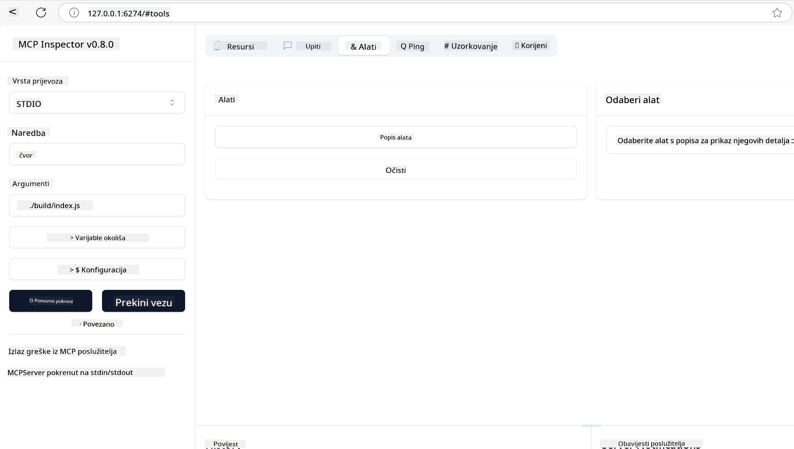
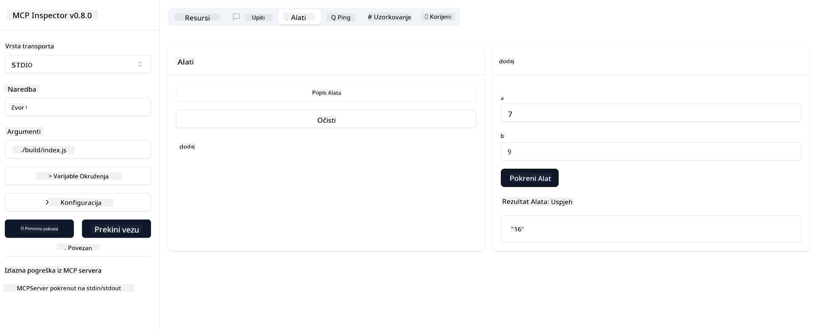

<!--
CO_OP_TRANSLATOR_METADATA:
{
  "original_hash": "5331ffd328a54b90f76706c52b673e27",
  "translation_date": "2025-05-17T08:57:44+00:00",
  "source_file": "03-GettingStarted/01-first-server/README.md",
  "language_code": "hr"
}
-->
# Početak rada s MCP

Dobrodošli u vaše prve korake s Model Context Protocol (MCP)! Bilo da ste novi u MCP-u ili želite produbiti svoje razumijevanje, ovaj vodič će vas provesti kroz osnovno postavljanje i razvojni proces. Otkrit ćete kako MCP omogućuje besprijekornu integraciju između AI modela i aplikacija, te naučiti kako brzo pripremiti svoje okruženje za izgradnju i testiranje rješenja pogonjenih MCP-om.

> Ukratko; Ako gradite AI aplikacije, znate da možete dodati alate i druge resurse svom LLM-u (veliki jezični model), kako biste LLM učinili informiranijim. Međutim, ako te alate i resurse postavite na poslužitelj, mogućnosti aplikacije i poslužitelja mogu koristiti bilo koji klijent s/bez LLM-a.

## Pregled

Ova lekcija pruža praktične smjernice za postavljanje MCP okruženja i izgradnju vaših prvih MCP aplikacija. Naučit ćete kako postaviti potrebne alate i okvire, izgraditi osnovne MCP poslužitelje, stvoriti host aplikacije i testirati svoje implementacije.

Model Context Protocol (MCP) je otvoreni protokol koji standardizira kako aplikacije pružaju kontekst LLM-ovima. Razmislite o MCP-u kao o USB-C priključku za AI aplikacije - pruža standardizirani način povezivanja AI modela s različitim izvorima podataka i alatima.

## Ciljevi učenja

Na kraju ove lekcije, bit ćete sposobni:

- Postaviti razvojna okruženja za MCP u C#, Java, Python, TypeScript i JavaScript
- Izgraditi i implementirati osnovne MCP poslužitelje s prilagođenim značajkama (resursi, upiti i alati)
- Stvoriti host aplikacije koje se povezuju s MCP poslužiteljima
- Testirati i otkloniti pogreške u MCP implementacijama

## Postavljanje vašeg MCP okruženja

Prije nego što počnete raditi s MCP-om, važno je pripremiti svoje razvojno okruženje i razumjeti osnovni tijek rada. Ovaj dio će vas voditi kroz početne korake postavljanja kako biste osigurali lagan početak s MCP-om.

### Preduvjeti

Prije nego što uronite u MCP razvoj, osigurajte da imate:

- **Razvojno okruženje**: Za vaš odabrani jezik (C#, Java, Python, TypeScript ili JavaScript)
- **IDE/Uređivač**: Visual Studio, Visual Studio Code, IntelliJ, Eclipse, PyCharm ili bilo koji moderni uređivač koda
- **Upravitelji paketa**: NuGet, Maven/Gradle, pip ili npm/yarn
- **API ključevi**: Za sve AI usluge koje planirate koristiti u svojim host aplikacijama

## Osnovna struktura MCP poslužitelja

MCP poslužitelj obično uključuje:

- **Konfiguracija poslužitelja**: Postavljanje porta, autentifikacija i druge postavke
- **Resursi**: Podaci i kontekst dostupni LLM-ovima
- **Alati**: Funkcionalnost koju modeli mogu pozvati
- **Upiti**: Predlošci za generiranje ili strukturiranje teksta

Evo pojednostavljenog primjera u TypeScriptu:

```typescript
import { Server, Tool, Resource } from "@modelcontextprotocol/typescript-server-sdk";

// Create a new MCP server
const server = new Server({
  port: 3000,
  name: "Example MCP Server",
  version: "1.0.0"
});

// Register a tool
server.registerTool({
  name: "calculator",
  description: "Performs basic calculations",
  parameters: {
    expression: {
      type: "string",
      description: "The math expression to evaluate"
    }
  },
  handler: async (params) => {
    const result = eval(params.expression);
    return { result };
  }
});

// Start the server
server.start();
```

U prethodnom kodu mi:

- Uvozimo potrebne klase iz MCP TypeScript SDK-a.
- Kreiramo i konfiguriramo novu instancu MCP poslužitelja.
- Registriramo prilagođeni alat (`kalkulator`) s funkcijom rukovatelja.
- Pokrećemo poslužitelj kako bi slušao dolazne MCP zahtjeve.

## Testiranje i otklanjanje pogrešaka

Prije nego što počnete testirati svoj MCP poslužitelj, važno je razumjeti dostupne alate i najbolje prakse za otklanjanje pogrešaka. Učinkovito testiranje osigurava da se vaš poslužitelj ponaša kako se očekuje i pomaže vam brzo identificirati i riješiti probleme. Sljedeći dio opisuje preporučene pristupe za provjeru vaše MCP implementacije.

MCP pruža alate koji vam pomažu testirati i otkloniti pogreške na vašim poslužiteljima:

- **Alat za inspekciju**, ovo grafičko sučelje omogućuje vam povezivanje s vašim poslužiteljem i testiranje vaših alata, upita i resursa.
- **curl**, također se možete povezati s vašim poslužiteljem koristeći alat naredbenog retka kao što je curl ili drugi klijenti koji mogu stvarati i pokretati HTTP naredbe.

### Korištenje MCP Inspektora

[MCP Inspektor](https://github.com/modelcontextprotocol/inspector) je vizualni alat za testiranje koji vam pomaže:

1. **Otkriti mogućnosti poslužitelja**: Automatski otkriti dostupne resurse, alate i upite
2. **Testirati izvršenje alata**: Isprobati različite parametre i vidjeti odgovore u stvarnom vremenu
3. **Pregledati metapodatke poslužitelja**: Ispitati informacije o poslužitelju, sheme i konfiguracije

```bash
# ex TypeScript, installing and running MCP Inspector
npx @modelcontextprotocol/inspector node build/index.js
```

Kada pokrenete gore navedene naredbe, MCP Inspektor će pokrenuti lokalno web sučelje u vašem pregledniku. Možete očekivati da ćete vidjeti nadzornu ploču koja prikazuje vaše registrirane MCP poslužitelje, njihove dostupne alate, resurse i upite. Sučelje vam omogućuje interaktivno testiranje izvršenja alata, pregled metapodataka poslužitelja i prikaz odgovora u stvarnom vremenu, što olakšava provjeru i otklanjanje pogrešaka u vašim MCP poslužiteljskim implementacijama.

Evo snimke zaslona kako to može izgledati:



## Uobičajeni problemi s postavljanjem i rješenja

| Problem | Moguće rješenje |
|-------|-------------------|
| Veza odbijena | Provjerite je li poslužitelj pokrenut i je li port ispravan |
| Pogreške u izvršenju alata | Pregledajte provjeru valjanosti parametara i rukovanje pogreškama |
| Neuspjesi autentifikacije | Provjerite API ključeve i dozvole |
| Pogreške valjanosti sheme | Osigurajte da parametri odgovaraju definiranoj shemi |
| Poslužitelj se ne pokreće | Provjerite ima li sukoba porta ili nedostajućih ovisnosti |
| CORS pogreške | Konfigurirajte ispravne CORS zaglavlja za zahtjeve s različitih izvora |
| Problemi s autentifikacijom | Provjerite valjanost tokena i dozvole |

## Lokalni razvoj

Za lokalni razvoj i testiranje, možete pokrenuti MCP poslužitelje izravno na svom računalu:

1. **Pokrenite proces poslužitelja**: Pokrenite svoju MCP poslužiteljsku aplikaciju
2. **Konfigurirajte mrežu**: Osigurajte da je poslužitelj dostupan na očekivanom portu
3. **Povežite klijente**: Koristite lokalne URL-ove veze poput `http://localhost:3000`

```bash
# Example: Running a TypeScript MCP server locally
npm run start
# Server running at http://localhost:3000
```

## Izgradnja vašeg prvog MCP poslužitelja

Pokrenuli smo [Osnovne pojmove](/01-CoreConcepts/README.md) u prethodnoj lekciji, sada je vrijeme da to znanje primijenimo.

### Što poslužitelj može učiniti

Prije nego što počnemo pisati kod, prisjetimo se što poslužitelj može učiniti:

MCP poslužitelj može, na primjer:

- Pristupiti lokalnim datotekama i bazama podataka
- Povezati se s udaljenim API-jima
- Izvoditi proračune
- Integrirati se s drugim alatima i uslugama
- Pružiti korisničko sučelje za interakciju

Odlično, sada kada znamo što možemo učiniti za to, krenimo s kodiranjem.

## Vježba: Kreiranje poslužitelja

Da biste stvorili poslužitelj, trebate slijediti ove korake:

- Instalirajte MCP SDK.
- Stvorite projekt i postavite strukturu projekta.
- Napišite kod poslužitelja.
- Testirajte poslužitelj.

### -1- Instalirajte SDK

Ovo se malo razlikuje ovisno o vašem odabranom runtimeu, pa odaberite jedan od dolje navedenih runtimea:

Generativna AI može generirati tekst, slike, pa čak i kod.

### -2- Stvorite projekt

Sada kada ste instalirali svoj SDK, idemo sljedeće stvoriti projekt:

### -3- Stvorite datoteke projekta

### -4- Stvorite kod poslužitelja

### -5- Dodavanje alata i resursa

Dodajte alat i resurs dodavanjem sljedećeg koda:

### -6 Završni kod

Dodajmo zadnji kod koji nam je potreban kako bi poslužitelj mogao započeti:

### -7- Testirajte poslužitelj

Pokrenite poslužitelj pomoću sljedeće naredbe:

### -8- Pokrenite koristeći inspektor

Inspektor je izvrstan alat koji može pokrenuti vaš poslužitelj i omogućiti vam interakciju s njim kako biste mogli testirati da radi. Pokrenimo ga:

> [!NOTE]
> može izgledati drugačije u polju "command" jer sadrži naredbu za pokretanje poslužitelja s vašim specifičnim runtimeom

Trebali biste vidjeti sljedeće korisničko sučelje:


1. Povežite se s poslužiteljem odabirom gumba Poveži se 
   Kada se povežete s poslužiteljem, trebali biste sada vidjeti sljedeće:

   

1. Odaberite "Alati" i "listTools", trebali biste vidjeti "Add" kako se pojavljuje, odaberite "Add" i ispunite vrijednosti parametara.

   Trebali biste vidjeti sljedeći odgovor, tj. rezultat iz "add" alata:

   

Čestitamo, uspjeli ste stvoriti i pokrenuti svoj prvi poslužitelj!

### Službeni SDK-ovi

MCP pruža službene SDK-ove za više jezika:
- [C# SDK](https://github.com/modelcontextprotocol/csharp-sdk) - Održava se u suradnji s Microsoftom
- [Java SDK](https://github.com/modelcontextprotocol/java-sdk) - Održava se u suradnji sa Spring AI
- [TypeScript SDK](https://github.com/modelcontextprotocol/typescript-sdk) - Službena TypeScript implementacija
- [Python SDK](https://github.com/modelcontextprotocol/python-sdk) - Službena Python implementacija
- [Kotlin SDK](https://github.com/modelcontextprotocol/kotlin-sdk) - Službena Kotlin implementacija
- [Swift SDK](https://github.com/modelcontextprotocol/swift-sdk) - Održava se u suradnji s Loopwork AI
- [Rust SDK](https://github.com/modelcontextprotocol/rust-sdk) - Službena Rust implementacija

## Ključni zaključci

- Postavljanje MCP razvojnog okruženja je jednostavno uz SDK-ove specifične za jezik
- Izgradnja MCP poslužitelja uključuje stvaranje i registraciju alata s jasnim shemama
- Testiranje i otklanjanje pogrešaka su ključni za pouzdane MCP implementacije

## Primjeri

- [Java Kalkulator](../samples/java/calculator/README.md)
- [.Net Kalkulator](../../../../03-GettingStarted/samples/csharp)
- [JavaScript Kalkulator](../samples/javascript/README.md)
- [TypeScript Kalkulator](../samples/typescript/README.md)
- [Python Kalkulator](../../../../03-GettingStarted/samples/python)

## Zadaci

Stvorite jednostavan MCP poslužitelj s alatom po vašem izboru:
1. Implementirajte alat na željenom jeziku (.NET, Java, Python ili JavaScript).
2. Definirajte ulazne parametre i povratne vrijednosti.
3. Pokrenite alat za inspekciju kako biste osigurali da poslužitelj radi prema očekivanjima.
4. Testirajte implementaciju s različitim unosima.

## Rješenje

[Rješenje](./solution/README.md)

## Dodatni resursi

- [MCP GitHub repozitorij](https://github.com/microsoft/mcp-for-beginners)

## Što slijedi

Sljedeće: [Početak rada s MCP klijentima](/03-GettingStarted/02-client/README.md)

**Odricanje odgovornosti**:  
Ovaj dokument je preveden korištenjem AI usluge prevođenja [Co-op Translator](https://github.com/Azure/co-op-translator). Iako težimo točnosti, molimo vas da budete svjesni da automatski prijevodi mogu sadržavati pogreške ili netočnosti. Izvorni dokument na izvornom jeziku treba smatrati mjerodavnim izvorom. Za ključne informacije preporučuje se profesionalni ljudski prijevod. Ne odgovaramo za nesporazume ili pogrešna tumačenja proizašla iz korištenja ovog prijevoda.