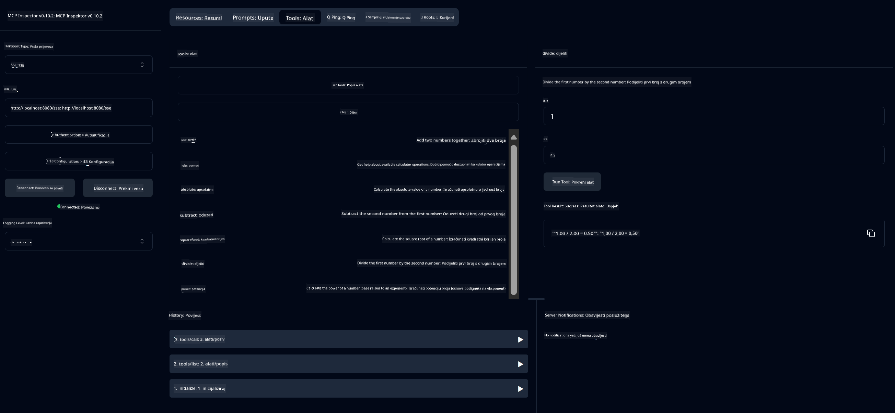

<!--
CO_OP_TRANSLATOR_METADATA:
{
  "original_hash": "ed9cab32cc67c12d8969b407aa47100a",
  "translation_date": "2025-07-13T17:56:56+00:00",
  "source_file": "03-GettingStarted/01-first-server/solution/java/README.md",
  "language_code": "hr"
}
-->
# Osnovna kalkulator MCP usluga

Ova usluga pruža osnovne kalkulatorske operacije putem Model Context Protocol (MCP) koristeći Spring Boot s WebFlux transportom. Dizajnirana je kao jednostavan primjer za početnike koji uče o MCP implementacijama.

Za više informacija, pogledajte referentnu dokumentaciju [MCP Server Boot Starter](https://docs.spring.io/spring-ai/reference/api/mcp/mcp-server-boot-starter-docs.html).


## Korištenje usluge

Usluga izlaže sljedeće API krajnje točke putem MCP protokola:

- `add(a, b)`: Zbrajanje dva broja
- `subtract(a, b)`: Oduzimanje drugog broja od prvog
- `multiply(a, b)`: Množenje dva broja
- `divide(a, b)`: Dijeljenje prvog broja s drugim (s provjerom na nulu)
- `power(base, exponent)`: Izračunavanje potencije broja
- `squareRoot(number)`: Izračunavanje kvadratnog korijena (s provjerom negativnog broja)
- `modulus(a, b)`: Izračunavanje ostatka pri dijeljenju
- `absolute(number)`: Izračunavanje apsolutne vrijednosti

## Ovisnosti

Projekt zahtijeva sljedeće ključne ovisnosti:

```xml
<dependency>
    <groupId>org.springframework.ai</groupId>
    <artifactId>spring-ai-starter-mcp-server-webflux</artifactId>
</dependency>
```

## Izgradnja projekta

Projekt izgradite koristeći Maven:
```bash
./mvnw clean install -DskipTests
```

## Pokretanje servera

### Korištenje Jave

```bash
java -jar target/calculator-server-0.0.1-SNAPSHOT.jar
```

### Korištenje MCP Inspectora

MCP Inspector je koristan alat za interakciju s MCP uslugama. Za korištenje s ovom kalkulatorskom uslugom:

1. **Instalirajte i pokrenite MCP Inspector** u novom terminal prozoru:
   ```bash
   npx @modelcontextprotocol/inspector
   ```

2. **Pristupite web sučelju** klikom na URL koji aplikacija prikazuje (obično http://localhost:6274)

3. **Konfigurirajte vezu**:
   - Postavite tip transporta na "SSE"
   - Postavite URL na SSE krajnju točku vašeg pokrenutog servera: `http://localhost:8080/sse`
   - Kliknite "Connect"

4. **Koristite alate**:
   - Kliknite "List Tools" za prikaz dostupnih kalkulatorskih operacija
   - Odaberite alat i kliknite "Run Tool" za izvršavanje operacije



**Odricanje od odgovornosti**:  
Ovaj dokument je preveden korištenjem AI usluge za prevođenje [Co-op Translator](https://github.com/Azure/co-op-translator). Iako nastojimo postići točnost, imajte na umu da automatski prijevodi mogu sadržavati pogreške ili netočnosti. Izvorni dokument na izvornom jeziku treba smatrati autoritativnim izvorom. Za kritične informacije preporučuje se profesionalni ljudski prijevod. Ne snosimo odgovornost za bilo kakva nesporazuma ili pogrešna tumačenja koja proizlaze iz korištenja ovog prijevoda.