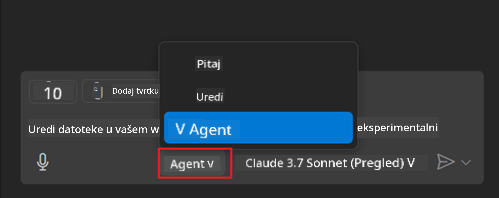
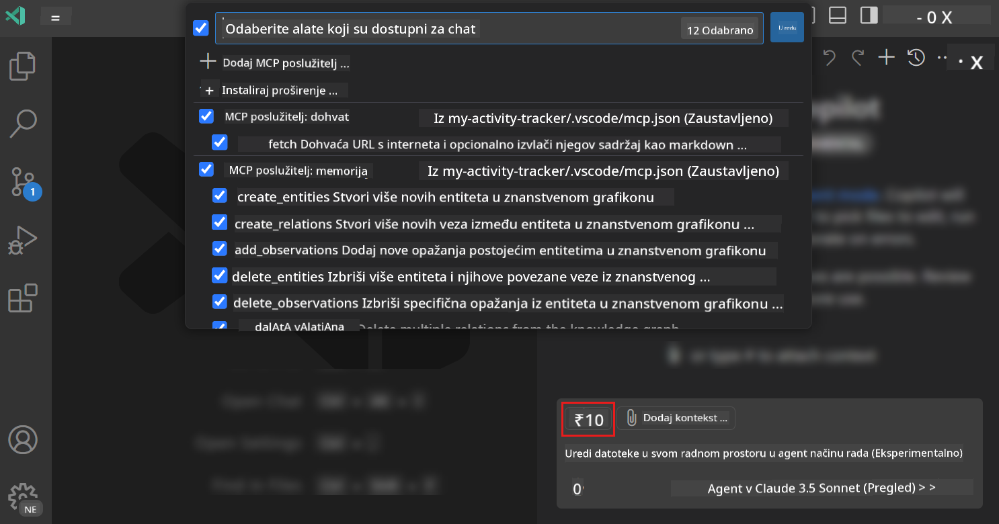
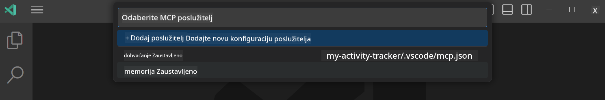
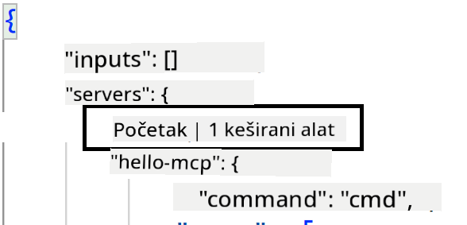
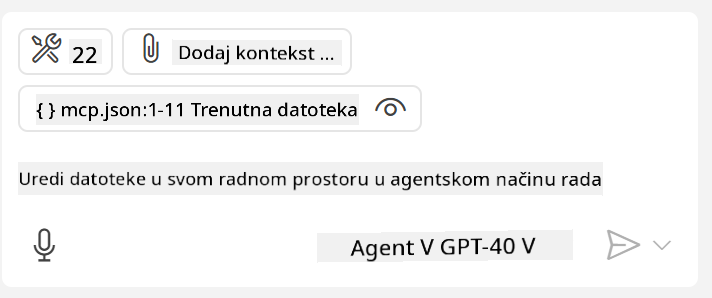
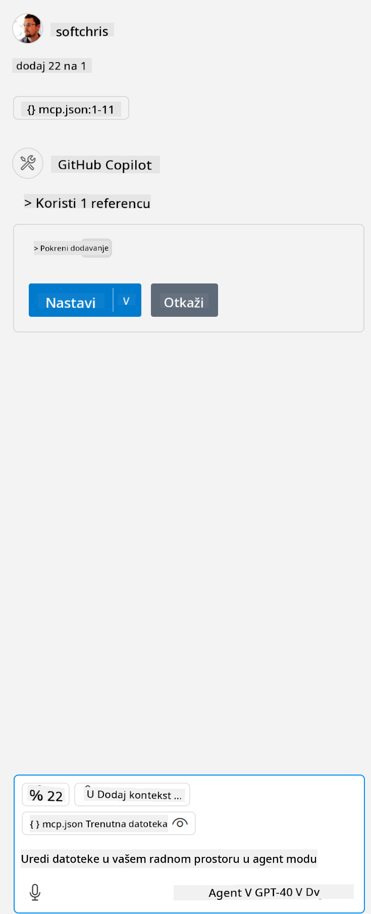

<!--
CO_OP_TRANSLATOR_METADATA:
{
  "original_hash": "d940b5e0af75e3a3a4d1c3179120d1d9",
  "translation_date": "2025-08-26T18:23:57+00:00",
  "source_file": "03-GettingStarted/04-vscode/README.md",
  "language_code": "hr"
}
-->
# Korištenje servera u GitHub Copilot Agent modu

Visual Studio Code i GitHub Copilot mogu djelovati kao klijent i koristiti MCP Server. Zašto bismo to željeli, pitate se? Pa, to znači da se sve funkcionalnosti MCP Servera sada mogu koristiti unutar vašeg IDE-a. Zamislite da dodate, na primjer, GitHubov MCP server – to bi omogućilo upravljanje GitHubom putem upita umjesto pisanja specifičnih naredbi u terminalu. Ili zamislite bilo što što bi moglo poboljšati vaše iskustvo razvoja, sve kontrolirano prirodnim jezikom. Sada počinjete uviđati prednosti, zar ne?

## Pregled

Ova lekcija pokriva kako koristiti Visual Studio Code i GitHub Copilotov Agent mod kao klijent za vaš MCP Server.

## Ciljevi učenja

Na kraju ove lekcije, moći ćete:

- Koristiti MCP Server putem Visual Studio Code-a.
- Pokretati funkcionalnosti poput alata putem GitHub Copilota.
- Konfigurirati Visual Studio Code za pronalaženje i upravljanje vašim MCP Serverom.

## Upotreba

MCP server možete kontrolirati na dva različita načina:

- Korisničko sučelje – kasnije u ovom poglavlju vidjet ćete kako se to radi.
- Terminal – moguće je kontrolirati stvari iz terminala koristeći `code` izvršnu datoteku:

  Da biste dodali MCP server u svoj korisnički profil, koristite opciju naredbenog retka --add-mcp i navedite JSON konfiguraciju servera u obliku {\"name\":\"server-name\",\"command\":...}.

  ```
  code --add-mcp "{\"name\":\"my-server\",\"command\": \"uvx\",\"args\": [\"mcp-server-fetch\"]}"
  ```

### Snimke zaslona





Razgovarajmo više o tome kako koristiti vizualno sučelje u sljedećim odjeljcima.

## Pristup

Evo kako trebamo pristupiti ovome na visokoj razini:

- Konfigurirajte datoteku za pronalaženje MCP Servera.
- Pokrenite/Povežite se s navedenim serverom kako bi prikazao svoje funkcionalnosti.
- Koristite navedene funkcionalnosti putem GitHub Copilot Chat sučelja.

Odlično, sada kada razumijemo tijek, pokušajmo koristiti MCP Server putem Visual Studio Code-a kroz vježbu.

## Vježba: Korištenje servera

U ovoj vježbi konfigurirat ćemo Visual Studio Code za pronalaženje vašeg MCP servera kako bi se mogao koristiti putem GitHub Copilot Chat sučelja.

### -0- Predkorak, omogućite otkrivanje MCP Servera

Možda ćete trebati omogućiti otkrivanje MCP Servera.

1. Idite na `File -> Preferences -> Settings` u Visual Studio Code-u.

1. Potražite "MCP" i omogućite `chat.mcp.discovery.enabled` u datoteci settings.json.

### -1- Kreirajte konfiguracijsku datoteku

Započnite kreiranjem konfiguracijske datoteke u korijenu vašeg projekta. Trebat će vam datoteka nazvana MCP.json koju ćete smjestiti u mapu .vscode. Trebala bi izgledati ovako:

```text
.vscode
|-- mcp.json
```

Zatim, pogledajmo kako možemo dodati unos servera.

### -2- Konfigurirajte server

Dodajte sljedeći sadržaj u *mcp.json*:

```json
{
    "inputs": [],
    "servers": {
       "hello-mcp": {
           "command": "node",
           "args": [
               "build/index.js"
           ]
       }
    }
}
```

Gore je jednostavan primjer kako pokrenuti server napisan u Node.js-u. Za druge runtime okruženja navedite odgovarajuću naredbu za pokretanje servera koristeći `command` i `args`.

### -3- Pokrenite server

Sada kada ste dodali unos, pokrenimo server:

1. Pronađite svoj unos u *mcp.json* i uvjerite se da vidite ikonu "play":

    

1. Kliknite na ikonu "play". Trebali biste vidjeti da se broj dostupnih alata u GitHub Copilot Chat sučelju povećava. Ako kliknete na ikonu alata, vidjet ćete popis registriranih alata. Možete označiti/odznačiti svaki alat ovisno o tome želite li da ih GitHub Copilot koristi kao kontekst:

  

1. Za pokretanje alata, unesite upit za koji znate da odgovara opisu jednog od vaših alata, na primjer upit poput "dodaj 22 i 1":

  

  Trebali biste vidjeti odgovor koji kaže 23.

## Zadatak

Pokušajte dodati unos servera u svoju *mcp.json* datoteku i provjerite možete li pokrenuti/zaustaviti server. Provjerite možete li također komunicirati s alatima na vašem serveru putem GitHub Copilot Chat sučelja.

## Rješenje

[Rješenje](./solution/README.md)

## Ključne točke

Ključne točke iz ovog poglavlja su sljedeće:

- Visual Studio Code je izvrstan klijent koji vam omogućuje korištenje nekoliko MCP Servera i njihovih alata.
- GitHub Copilot Chat sučelje je način na koji komunicirate sa serverima.
- Možete zatražiti od korisnika unos poput API ključeva koji se mogu proslijediti MCP Serveru prilikom konfiguriranja unosa servera u *mcp.json* datoteku.

## Primjeri

- [Java Kalkulator](../samples/java/calculator/README.md)
- [.Net Kalkulator](../../../../03-GettingStarted/samples/csharp)
- [JavaScript Kalkulator](../samples/javascript/README.md)
- [TypeScript Kalkulator](../samples/typescript/README.md)
- [Python Kalkulator](../../../../03-GettingStarted/samples/python)

## Dodatni resursi

- [Visual Studio dokumentacija](https://code.visualstudio.com/docs/copilot/chat/mcp-servers)

## Što slijedi

- Sljedeće: [Kreiranje stdio Servera](../05-stdio-server/README.md)

---

**Odricanje od odgovornosti**:  
Ovaj dokument je preveden pomoću AI usluge za prevođenje [Co-op Translator](https://github.com/Azure/co-op-translator). Iako nastojimo osigurati točnost, imajte na umu da automatski prijevodi mogu sadržavati pogreške ili netočnosti. Izvorni dokument na izvornom jeziku treba smatrati mjerodavnim izvorom. Za ključne informacije preporučuje se profesionalni prijevod od strane stručnjaka. Ne preuzimamo odgovornost za bilo kakve nesporazume ili pogrešne interpretacije proizašle iz korištenja ovog prijevoda.