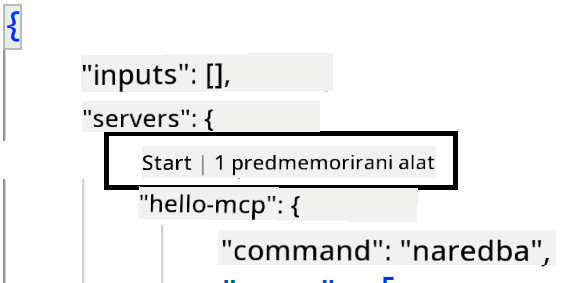
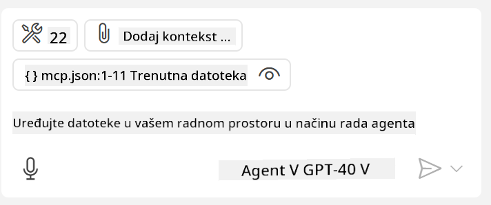

<!--
CO_OP_TRANSLATOR_METADATA:
{
  "original_hash": "c37fabfbc0dcbc9a4afb6d17e7d3be9f",
  "translation_date": "2025-05-17T11:17:14+00:00",
  "source_file": "03-GettingStarted/04-vscode/README.md",
  "language_code": "hr"
}
-->
Razgovarajmo više o korištenju vizualnog sučelja u sljedećim odjeljcima.

## Pristup

Evo kako trebamo pristupiti ovome na visokoj razini:

- Konfigurirajte datoteku za pronalaženje našeg MCP Servera.
- Pokrenite/Povežite se s navedenim serverom kako biste dobili popis njegovih mogućnosti.
- Koristite navedene mogućnosti kroz sučelje za razgovor GitHub Copilota.

Odlično, sada kada razumijemo tok, pokušajmo koristiti MCP Server kroz Visual Studio Code putem vježbe.

## Vježba: Korištenje servera

U ovoj vježbi ćemo konfigurirati Visual Studio Code da pronađe vaš MCP server kako bi ga se moglo koristiti kroz sučelje za razgovor GitHub Copilota.

### -0- Predkorak, omogućite otkrivanje MCP Servera

Možda ćete trebati omogućiti otkrivanje MCP Servera.

1. Idite na `File -> Preferences -> Settings` in Visual Studio Code.

1. Search for "MCP" and enable `chat.mcp.discovery.enabled` u datoteci settings.json.

### -1- Kreirajte konfiguracijsku datoteku

Počnite s kreiranjem konfiguracijske datoteke u korijenu vašeg projekta, trebat će vam datoteka nazvana MCP.json koju ćete staviti u mapu nazvanu .vscode. Trebala bi izgledati ovako:

```text
.vscode
|-- mcp.json
```

Sljedeće, pogledajmo kako možemo dodati unos servera.

### -2- Konfigurirajte server

Dodajte sljedeći sadržaj u *mcp.json*:

```json
{
    "inputs": [],
    "servers": {
       "hello-mcp": {
           "command": "cmd",
           "args": [
               "/c", "node", "<absolute path>\\build\\index.js"
           ]
       }
    }
}
```

Evo jednostavnog primjera kako pokrenuti server napisan u Node.js, za druge runtime-e navedite odgovarajuću naredbu za pokretanje servera koristeći `command` and `args`.

### -3- Pokrenite server

Sada kada ste dodali unos, pokrenimo server:

1. Pronađite svoj unos u *mcp.json* i provjerite jeste li pronašli ikonu "play":

    

1. Kliknite ikonu "play", trebali biste vidjeti da se broj dostupnih alata u GitHub Copilot sučelju povećava. Ako kliknete na navedenu ikonu alata, vidjet ćete popis registriranih alata. Možete označiti/odznačiti svaki alat ovisno o tome želite li da GitHub Copilot koristi njih kao kontekst:

  

1. Za pokretanje alata, upišite prompt koji znate da će odgovarati opisu jednog od vaših alata, na primjer prompt poput "dodaj 22 na 1":

  

  Trebali biste vidjeti odgovor koji kaže 23.

## Zadatak

Pokušajte dodati unos servera u vašu *mcp.json* datoteku i provjerite možete li pokrenuti/zaustaviti server. Provjerite možete li također komunicirati s alatima na vašem serveru putem sučelja za razgovor GitHub Copilota.

## Rješenje

[Rješenje](./solution/README.md)

## Ključne točke

Ključne točke iz ovog poglavlja su sljedeće:

- Visual Studio Code je izvrstan klijent koji vam omogućuje korištenje nekoliko MCP Servera i njihovih alata.
- Sučelje za razgovor GitHub Copilota je način na koji komunicirate sa serverima.
- Možete zatražiti od korisnika unose poput API ključeva koji se mogu prenijeti na MCP Server prilikom konfiguriranja unosa servera u *mcp.json* datoteci.

## Primjeri

- [Java Kalkulator](../samples/java/calculator/README.md)
- [.Net Kalkulator](../../../../03-GettingStarted/samples/csharp)
- [JavaScript Kalkulator](../samples/javascript/README.md)
- [TypeScript Kalkulator](../samples/typescript/README.md)
- [Python Kalkulator](../../../../03-GettingStarted/samples/python) 

## Dodatni resursi

- [Visual Studio dokumentacija](https://code.visualstudio.com/docs/copilot/chat/mcp-servers)

## Što je sljedeće

- Sljedeće: [Kreiranje SSE Servera](/03-GettingStarted/05-sse-server/README.md)

**Odricanje od odgovornosti**:  
Ovaj dokument je preveden korištenjem AI usluge prevođenja [Co-op Translator](https://github.com/Azure/co-op-translator). Iako težimo preciznosti, molimo vas da budete svjesni da automatski prijevodi mogu sadržavati pogreške ili netočnosti. Izvorni dokument na izvornom jeziku treba smatrati autoritativnim izvorom. Za kritične informacije preporučuje se profesionalni ljudski prijevod. Ne odgovaramo za bilo kakva nesporazuma ili pogrešna tumačenja koja proizlaze iz korištenja ovog prijevoda.