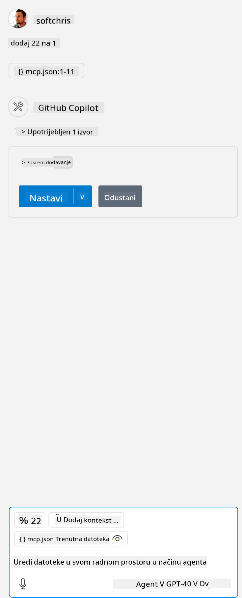

<!--
CO_OP_TRANSLATOR_METADATA:
{
  "original_hash": "96e08a8c1049dab757deb64cce4ea1e8",
  "translation_date": "2025-05-17T11:24:30+00:00",
  "source_file": "03-GettingStarted/04-vscode/solution/README.md",
  "language_code": "hr"
}
-->
# Pokretanje primjera

Ovdje pretpostavljamo da već imate radni kod poslužitelja. Molimo pronađite poslužitelj iz jednog od ranijih poglavlja.

## Postavljanje mcp.json

Ovdje je datoteka koju koristite kao referencu, [mcp.json](../../../../../03-GettingStarted/04-vscode/solution/mcp.json).

Promijenite unos poslužitelja prema potrebi kako biste ukazali na apsolutnu putanju do vašeg poslužitelja, uključujući potreban puni naredbeni redak za pokretanje.

U primjeru datoteke na koju se gore referira, unos poslužitelja izgleda ovako:

```json
"hello-mcp": {
    "command": "cmd",
    "args": [
        "/c", "node", "<absolute path>\\build\\index.js"
    ]
}
```

Ovo odgovara pokretanju naredbe poput ove: `cmd /c node <apsolutna putanja>\\build\index.js`. 

- Change this server entry to fit where your server file is located or to what's needed to startup your server depending on your chosen runtime and server location.

## Consume the features in the server

- Click the `play` icon, once you've added *mcp.json* to *./vscode* folder, 

    Observe the tooling icon change to increase the number of available tools. Tooling icon is located right above the chat field in GitHub Copilot.

## Run a tool

- Type a prompt in your chat window that matches the description of your tool. For example to trigger the tool `add` napišite nešto poput "dodaj 3 na 20".

Trebali biste vidjeti alat prikazan iznad tekstnog okvira za chat koji vam ukazuje da odaberete pokretanje alata kao na ovoj slici:



Odabir alata trebao bi proizvesti numerički rezultat koji kaže "23" ako je vaš upit bio kao što smo prethodno spomenuli.

**Izjava o odricanju odgovornosti**:  
Ovaj dokument je preveden korištenjem AI usluge prevođenja [Co-op Translator](https://github.com/Azure/co-op-translator). Iako nastojimo postići točnost, imajte na umu da automatizirani prijevodi mogu sadržavati pogreške ili netočnosti. Izvorni dokument na njegovom izvornom jeziku treba smatrati autoritativnim izvorom. Za kritične informacije preporučuje se profesionalni prijevod od strane čovjeka. Ne odgovaramo za nesporazume ili pogrešna tumačenja koja proizlaze iz korištenja ovog prijevoda.