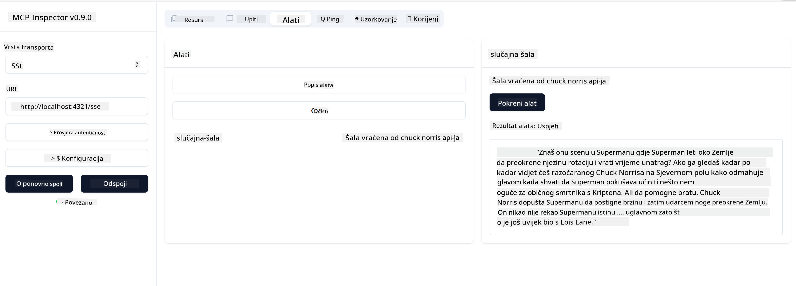

<!--
CO_OP_TRANSLATOR_METADATA:
{
  "original_hash": "0a8086dc4bf89448f83e7936db972c42",
  "translation_date": "2025-05-17T11:44:56+00:00",
  "source_file": "03-GettingStarted/05-sse-server/README.md",
  "language_code": "hr"
}
-->
# SSE Server

SSE (Server Sent Events) je standard za streaming od servera prema klijentu, omogućujući serverima da šalju ažuriranja u stvarnom vremenu klijentima putem HTTP-a. Ovo je posebno korisno za aplikacije koje zahtijevaju ažuriranja uživo, kao što su aplikacije za chat, obavijesti ili izvori podataka u stvarnom vremenu. Također, vaš server može koristiti više klijenata istovremeno jer se nalazi na serveru koji se može pokrenuti negdje u oblaku, na primjer.

## Pregled

Ova lekcija pokriva kako izgraditi i koristiti SSE servere.

## Ciljevi učenja

Na kraju ove lekcije, moći ćete:

- Izgraditi SSE server.
- Debugirati SSE server koristeći Inspector.
- Koristiti SSE server koristeći Visual Studio Code.

## SSE, kako radi

SSE je jedan od dva podržana tipa prijenosa. Već ste vidjeli prvi, stdio, koji se koristio u prethodnim lekcijama. Razlika je sljedeća:

- SSE zahtijeva da upravljate dvjema stvarima: povezivanjem i porukama.
- Budući da je ovo server koji može živjeti bilo gdje, trebate to odraziti u načinu rada s alatima kao što su Inspector i Visual Studio. To znači da umjesto da pokazujete kako pokrenuti server, pokazujete na krajnju točku gdje može uspostaviti vezu. Pogledajte primjer koda u nastavku:
Obučeni ste na podacima do listopada 2023.

Sada kada znamo malo više o SSE-u, idemo sljedeće izgraditi SSE server.

## Vježba: Kreiranje SSE servera

Da bismo kreirali naš server, moramo imati na umu dvije stvari:

- Moramo koristiti web server za izlaganje krajnjih točaka za povezivanje i poruke.
- Izgraditi naš server kao što to obično radimo s alatima, resursima i upitima kada smo koristili stdio.

### -1- Kreirajte instancu servera

Da bismo kreirali naš server, koristimo iste tipove kao kod stdio. Međutim, za prijenos moramo odabrati SSE.

Dodajmo potrebne rute sljedeće.

### -2- Dodajte rute

Dodajmo sljedeće rute koje će upravljati povezivanjem i dolaznim porukama:

Dodajmo sposobnosti serveru sljedeće.

### -3- Dodavanje sposobnosti servera

Sada kada smo definirali sve specifično za SSE, dodajmo sposobnosti serveru kao što su alati, upiti i resursi.

Vaš puni kod trebao bi izgledati ovako:

Odlično, imamo server koji koristi SSE, idemo ga isprobati sljedeće.

## Vježba: Debugiranje SSE servera s Inspectorom

Inspector je odličan alat koji smo vidjeli u prethodnoj lekciji [Kreiranje vašeg prvog servera](/03-GettingStarted/01-first-server/README.md). Pogledajmo možemo li koristiti Inspector čak i ovdje:

### -1- Pokretanje Inspectora

Da biste pokrenuli Inspector, prvo morate imati pokrenut SSE server, pa učinimo to sljedeće:

1. Pokrenite server

1. Pokrenite Inspector

    > ![NOTE]
    > Pokrenite ovo u zasebnom terminalskom prozoru od onoga u kojem je server pokrenut. Također imajte na umu da morate prilagoditi donju naredbu kako bi odgovarala URL-u gdje vaš server radi.

    ```sh
    npx @modelcontextprotocol/inspector --cli http://localhost:8000/sse --method tools/list
    ```

    Pokretanje Inspectora izgleda isto u svim runtime okruženjima. Primijetite kako umjesto da prosljeđujemo putanju do našeg servera i naredbu za pokretanje servera, umjesto toga prosljeđujemo URL gdje server radi i također specificiramo rutu `/sse`.

### -2- Isprobavanje alata

Povežite server odabirom SSE u padajućem izborniku i ispunite polje za URL gdje vaš server radi, na primjer http:localhost:4321/sse. Sada kliknite gumb "Connect". Kao i prije, odaberite za popis alata, odaberite alat i unesite vrijednosti za unos. Trebali biste vidjeti rezultat kao dolje:



Odlično, možete raditi s Inspectorom, pogledajmo kako možemo raditi s Visual Studio Code sljedeće.

## Zadatak

Pokušajte izgraditi vaš server s više sposobnosti. Pogledajte [ovu stranicu](https://api.chucknorris.io/) da, na primjer, dodate alat koji poziva API, vi odlučujete kako bi server trebao izgledati. Zabavite se :)

## Rješenje

[Rješenje](./solution/README.md) Evo mogućeg rješenja s radnim kodom.

## Ključni zaključci

Zaključci iz ovog poglavlja su sljedeći:

- SSE je drugi podržani prijenos uz stdio.
- Da biste podržali SSE, morate upravljati dolaznim vezama i porukama koristeći web okvir.
- Možete koristiti i Inspector i Visual Studio Code za korištenje SSE servera, baš kao i stdio servere. Primijetite kako se malo razlikuje između stdio i SSE. Za SSE, morate pokrenuti server zasebno i zatim pokrenuti vaš Inspector alat. Za Inspector alat, također postoje neke razlike u tome da morate specificirati URL.

## Primjeri

- [Java Kalkulator](../samples/java/calculator/README.md)
- [.Net Kalkulator](../../../../03-GettingStarted/samples/csharp)
- [JavaScript Kalkulator](../samples/javascript/README.md)
- [TypeScript Kalkulator](../samples/typescript/README.md)
- [Python Kalkulator](../../../../03-GettingStarted/samples/python)

## Dodatni resursi

- [SSE](https://developer.mozilla.org/en-US/docs/Web/API/Server-sent_events)

## Što je sljedeće

- Sljedeće: [Početak rada s AI Toolkit za VSCode](/03-GettingStarted/06-aitk/README.md)

**Odricanje odgovornosti**:  
Ovaj dokument je preveden pomoću AI usluge prevođenja [Co-op Translator](https://github.com/Azure/co-op-translator). Iako nastojimo postići točnost, molimo vas da budete svjesni da automatski prijevodi mogu sadržavati pogreške ili netočnosti. Izvorni dokument na izvornom jeziku treba smatrati autoritativnim izvorom. Za ključne informacije preporučuje se profesionalni ljudski prijevod. Ne odgovaramo za nesporazume ili pogrešna tumačenja koja mogu proizaći iz korištenja ovog prijevoda.