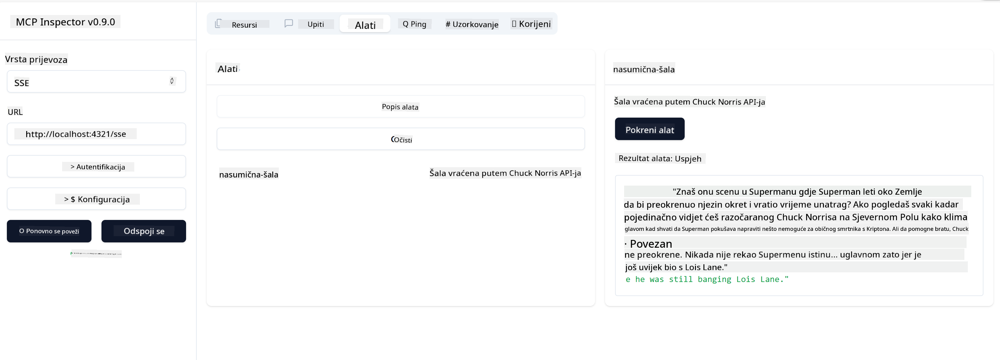

<!--
CO_OP_TRANSLATOR_METADATA:
{
  "original_hash": "64645691bf0985f1760b948123edf269",
  "translation_date": "2025-06-13T10:59:32+00:00",
  "source_file": "03-GettingStarted/05-sse-server/README.md",
  "language_code": "hr"
}
-->
Sad sada kada znamo nešto više o SSE-u, idemo dalje i napravimo SSE server.

## Vježba: Kreiranje SSE servera

Da bismo napravili naš server, trebamo imati na umu dvije stvari:

- Trebamo koristiti web server za izlaganje endpointa za vezu i poruke.
- Napraviti server kao i obično, koristeći alate, resurse i upite kao što smo radili sa stdio.

### -1- Kreiranje instance servera

Za kreiranje servera koristimo iste tipove kao i sa stdio. Međutim, za transport trebamo odabrati SSE.

Dodajmo sada potrebne rute.

### -2- Dodavanje ruta

Dodajmo rute koje upravljaju vezom i dolaznim porukama:

Dodajmo sada mogućnosti serveru.

### -3- Dodavanje mogućnosti serveru

Sada kada smo definirali sve što je specifično za SSE, dodajmo mogućnosti serveru poput alata, upita i resursa.

Vaš kompletan kod trebao bi izgledati ovako:

Super, imamo server koji koristi SSE, idemo ga sada isprobati.

## Vježba: Debugiranje SSE servera pomoću Inspectora

Inspector je sjajan alat koji smo vidjeli u prethodnoj lekciji [Kreiranje vašeg prvog servera](/03-GettingStarted/01-first-server/README.md). Pogledajmo možemo li ga koristiti i ovdje:

### -1- Pokretanje Inspectora

Da biste pokrenuli Inspectora, prvo morate imati pokrenut SSE server, pa to učinimo sada:

1. Pokrenite server

1. Pokrenite Inspectora

    > ![NOTE]
    > Pokrenite ovo u zasebnom terminal prozoru od onog u kojem je pokrenut server. Također, imajte na umu da trebate prilagoditi naredbu ispod URL-u na kojem vaš server radi.

    ```sh
    npx @modelcontextprotocol/inspector --cli http://localhost:8000/sse --method tools/list
    ```

    Pokretanje Inspectora izgleda isto u svim runtime okruženjima. Primijetite kako umjesto da prosljeđujemo putanju do servera i naredbu za njegovo pokretanje, prosljeđujemo URL na kojem server radi i dodatno specificiramo `/sse` rutu.

### -2- Isprobavanje alata

Povežite se sa serverom tako da u padajućem izborniku odaberete SSE i unesete URL na kojem vaš server radi, na primjer http:localhost:4321/sse. Zatim kliknite na gumb "Connect". Kao i prije, odaberite da prikažete alate, odaberite alat i unesite ulazne vrijednosti. Trebali biste vidjeti rezultat kao na slici ispod:



Odlično, možete raditi s Inspectorom, sada pogledajmo kako možemo raditi s Visual Studio Code.

## Zadatak

Pokušajte proširiti svoj server s dodatnim mogućnostima. Pogledajte [ovu stranicu](https://api.chucknorris.io/) da, na primjer, dodate alat koji poziva API. Vi odlučujete kako će vaš server izgledati. Zabavite se :)

## Rješenje

[Rješenje](./solution/README.md) Evo jednog mogućeg rješenja s radnim kodom.

## Ključni zaključci

Zaključci iz ovog poglavlja su sljedeći:

- SSE je drugi podržani transport pored stdio.
- Za podršku SSE-u, trebate upravljati dolaznim vezama i porukama koristeći web framework.
- Možete koristiti i Inspector i Visual Studio Code za rad sa SSE serverom, kao i sa stdio serverima. Primijetite kako postoji mala razlika između stdio i SSE. Za SSE morate posebno pokrenuti server, a zatim pokrenuti alat Inspector. Također, za Inspector postoji razlika u tome što trebate specificirati URL.

## Primjeri

- [Java Kalkulator](../samples/java/calculator/README.md)
- [.Net Kalkulator](../../../../03-GettingStarted/samples/csharp)
- [JavaScript Kalkulator](../samples/javascript/README.md)
- [TypeScript Kalkulator](../samples/typescript/README.md)
- [Python Kalkulator](../../../../03-GettingStarted/samples/python)

## Dodatni resursi

- [SSE](https://developer.mozilla.org/en-US/docs/Web/API/Server-sent_events)

## Što slijedi

- Sljedeće: [HTTP Streaming s MCP (Streamable HTTP)](/03-GettingStarted/06-http-streaming/README.md)

**Odricanje od odgovornosti**:  
Ovaj dokument preveden je pomoću AI prevoditeljskog servisa [Co-op Translator](https://github.com/Azure/co-op-translator). Iako težimo točnosti, imajte na umu da automatski prijevodi mogu sadržavati pogreške ili netočnosti. Izvorni dokument na izvornom jeziku treba se smatrati autoritativnim izvorom. Za kritične informacije preporučuje se profesionalni ljudski prijevod. Ne snosimo odgovornost za bilo kakve nesporazume ili pogrešna tumačenja koja proizlaze iz korištenja ovog prijevoda.